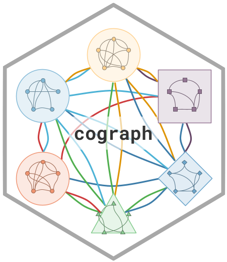

```{r, include = FALSE}
knitr::opts_chunk$set(
  collapse = TRUE,
  comment = "#>",
  fig.path = "man/figures/README-",
  out.width = "100%",
  eval = FALSE
)
```

# Sonnet 

<!-- badges: start -->
[](https://github.com/username/Sonnet/actions/workflows/R-CMD-check.yaml)
[](https://CRAN.R-project.org/package=Sonnet)
<!-- badges: end -->

**Sonnet** is a modern R package for network visualization. It renders publication-ready network plots from adjacency matrices, edge lists, or igraph objects using a pipe-friendly API with full control over nodes, edges, layouts, and themes.

Key features:

- **Base R and grid rendering** via `splot()` and `soplot()`
- **Pipe-friendly API**: `sonnet() |> sn_nodes() |> sn_edges() |> sn_theme()`
- **12+ node shapes** including pie charts and donut rings
- **7 built-in themes** and multiple color palettes
- **Confidence interval underlays**, edge label templates, weight scaling
- **Converters** for `tna` and `qgraph` objects

## Installation

```{r}
# Install from CRAN (when available)
install.packages("Sonnet")

# Or install the development version from GitHub
# install.packages("devtools")
devtools::install_github("username/Sonnet")
```

## Quick Start

```{r}
library(Sonnet)

# 10-node directed transition matrix (TNA-style)
set.seed(42)
states <- c("Explore", "Plan", "Monitor", "Evaluate", "Adapt",
            "Reflect", "Regulate", "Execute", "Collaborate", "Review")
mat <- matrix(runif(100, 0, 0.3), nrow = 10, dimnames = list(states, states))
diag(mat) <- 0
mat <- mat / rowSums(mat)  # row-normalize

# Basic plot
splot(mat)

# Pipe-chain style
sonnet(mat, layout = "spring") |>
  sn_nodes(size = 0.07, fill = "steelblue", shape = "circle") |>
  sn_edges(width = "weight", color = "weight") |>
  sn_theme("minimal") |>
  sn_render()
```

## Input Formats

Sonnet accepts three input types:

```{r}
# 1. Adjacency matrix
adj <- matrix(c(0,1,1, 1,0,1, 1,1,0), nrow = 3)
splot(adj)

# 2. Edge list (data.frame with from, to, and optional weight)
edges <- data.frame(
  from = c("A", "A", "B"),
  to   = c("B", "C", "C"),
  weight = c(0.8, 0.5, 0.3)
)
splot(edges)

# 3. igraph object
library(igraph)
g <- make_ring(10)
splot(g)
```

## splot() vs soplot()

`splot()` uses base R graphics; `soplot()` uses grid graphics. Both accept the same parameters.

```{r}
# Base R (recommended for knitting and file output)
splot(mat, layout = "circle", theme = "classic")

# Grid-based (useful for sn_ggplot())
soplot(mat, layout = "circle", theme = "classic")
```

## Layouts

```{r}
# Built-in layouts
splot(mat, layout = "circle")
splot(mat, layout = "spring")

# Group-based layout
groups <- rep(1:3, length.out = 10)
sonnet(mat) |> sn_layout("groups", groups = groups) |> sn_render()

# igraph layout codes
splot(mat, layout = "kk")    # Kamada-Kawai
splot(mat, layout = "fr")    # Fruchterman-Reingold
splot(mat, layout = "mds")   # Multidimensional scaling

# Custom coordinates
coords <- matrix(runif(20), ncol = 2)
sonnet(mat) |> sn_layout(coords) |> sn_render()
```

## Node Shapes

All available shapes:

```{r}
# Shapes: circle, square, triangle, diamond, pentagon, hexagon,
#         ellipse, heart, star, cross, rectangle

# One shape per node
shapes <- c("circle", "square", "triangle", "diamond", "pentagon",
            "hexagon", "ellipse", "heart", "star", "cross")
splot(mat, node_shape = shapes, node_fill = palette_rainbow(10), layout = "circle")
```

## Node Aesthetics

```{r}
splot(mat,
  node_size = seq(0.04, 0.08, length.out = 10),
  node_fill = palette_pastel(10),
  node_border_color = "gray30",
  node_border_width = 2,
  node_alpha = 0.85,
  label_size = 9,
  label_color = "black",
  label_position = "center"
)
```

## Edge Aesthetics

```{r}
# Width, color, and style
splot(mat,
  positive_color = "#2E7D32",
  negative_color = "#C62828",
  edge_style = "solid",
  curvature = 0.2,
  arrow_size = 0.015
)

# Confidence interval underlays
splot(mat,
  edge_ci = runif(sum(mat > 0), 0.05, 0.2),
  edge_ci_alpha = 0.15,
  edge_ci_scale = 2
)

# Edge labels with template system
splot(mat,
  edge_label_style = "estimate",
  edge_label_digits = 2,
  edge_label_size = 0.6,
  edge_label_bg = "white"
)

# Custom label template
splot(mat,
  edge_label_template = "{est}\n[{low}, {up}]",
  edge_label_p = runif(sum(mat > 0), 0, 0.1),
  edge_label_stars = TRUE
)
```

## Pie Chart Nodes

```{r}
set.seed(1)
# Each node gets a vector of pie segment values
pie_vals <- lapply(1:10, function(i) runif(4))
pie_cols <- c("#E41A1C", "#377EB8", "#4DAF4A", "#FF7F00")

splot(mat,
  node_shape = "pie",
  pie_values = pie_vals,
  pie_colors = pie_cols,
  layout = "circle"
)

# Per-node color palettes
pie_cols_multi <- list(
  c("#E63946", "#F1FAEE", "#A8DADC"),
  c("#264653", "#2A9D8F", "#E9C46A"),
  c("#F72585", "#7209B7", "#3A0CA3"),
  c("#003049", "#D62828", "#F77F00"),
  c("#606C38", "#283618", "#DDA15E"),
  c("#0077B6", "#00B4D8", "#90E0EF"),
  c("#9B2226", "#AE2012", "#BB3E03"),
  c("#023047", "#219EBC", "#8ECAE6"),
  c("#5F0F40", "#9A031E", "#FB8B24"),
  c("#2D00F7", "#6A00F4", "#8900F2")
)
splot(mat,
  node_shape = "pie",
  pie_values = lapply(1:10, function(i) runif(3)),
  pie_colors = pie_cols_multi,
  node_size = 6,
  layout = "circle"
)
```

## Donut Nodes

```{r}
# Simple donut: fill proportion per node (0 to 1)
fills <- runif(10, 0.3, 0.95)
splot(mat,
  node_shape = "donut",
  donut_fill = fills,
  donut_color = "steelblue",
  layout = "circle"
)

# Segmented donuts with multiple colors
donut_vals <- lapply(1:10, function(i) runif(3))
donut_cols <- list(c("#E63946", "#457B9D", "#2A9D8F"))
splot(mat,
  donut_values = donut_vals,
  donut_colors = donut_cols,
  donut_inner_ratio = 0.6,
  node_size = 6
)

# Per-node donut color palettes
donut_cols_multi <- list(
  c("#003049", "#D62828", "#F77F00", "#FCBF49"),
  c("#606C38", "#283618", "#DDA15E", "#BC6C25"),
  c("#0077B6", "#00B4D8", "#90E0EF", "#CAF0F8"),
  c("#9B2226", "#AE2012", "#BB3E03", "#CA6702"),
  c("#5F0F40", "#9A031E", "#FB8B24", "#E36414"),
  c("#023047", "#219EBC", "#8ECAE6", "#FFB703"),
  c("#264653", "#2A9D8F", "#E9C46A", "#F4A261"),
  c("#F72585", "#B5179E", "#7209B7", "#560BAD"),
  c("#10002B", "#240046", "#3C096C", "#5A189A"),
  c("#D8F3DC", "#B7E4C7", "#95D5B2", "#74C69D")
)
splot(mat,
  donut_values = lapply(1:10, function(i) runif(4)),
  donut_colors = donut_cols_multi,
  donut_inner_ratio = 0.55,
  node_size = 6
)

# Polygon donut shapes
splot(mat,
  node_shape = "donut",
  donut_fill = fills,
  donut_shape = c("circle", "hexagon", "square", "diamond", "triangle",
                  "pentagon", "circle", "hexagon", "square", "diamond"),
  donut_color = palette_viridis(10)
)

# Show value in center
splot(mat,
  node_shape = "donut",
  donut_fill = fills,
  donut_show_value = TRUE,
  donut_value_digits = 0,
  donut_value_suffix = "%"
)

# Donut + Pie combo: outer donut ring with inner pie segments
splot(mat,
  node_shape = "donut",
  donut_fill = fills,
  donut_color = "steelblue",
  pie_values = lapply(1:10, function(i) runif(3)),
  pie_colors = c("#E41A1C", "#377EB8", "#4DAF4A")
)

# Double donut: two concentric rings
splot(mat,
  node_shape = "donut",
  donut_fill = fills,
  donut_color = "steelblue",
  donut2_values = runif(10, 0.2, 0.8),
  donut2_colors = "coral"
)
```

## Weight Handling

```{r}
# Round weights to 1 digit
splot(mat, weight_digits = 1)

# Filter edges below threshold
splot(mat, threshold = 0.1)

# Set maximum for scaling
splot(mat, maximum = 1.0)

# Disable two-tier cutoff
splot(mat, cut = 0)

# Logarithmic edge scaling
splot(mat, edge_scale_mode = "log")
```

## Themes

Seven built-in themes:

```{r}
splot(mat, theme = "classic")
splot(mat, theme = "dark")
splot(mat, theme = "colorblind")
splot(mat, theme = "gray")
splot(mat, theme = "minimal")
splot(mat, theme = "viridis")
splot(mat, theme = "nature")
```

## Color Palettes

```{r}
splot(mat, node_fill = palette_rainbow(10))
splot(mat, node_fill = palette_colorblind(10))
splot(mat, node_fill = palette_pastel(10))
splot(mat, node_fill = palette_viridis(10))
splot(mat, node_fill = palette_blues(10))
splot(mat, node_fill = palette_reds(10))
splot(mat, node_fill = palette_diverging(10))
```

## Converters: from_tna() and from_qgraph()

```{r}
# Convert a tna object (requires tna package)
library(tna)
tna_obj <- tna(my_data)
from_tna(tna_obj)

# Convert a qgraph object (requires qgraph package)
library(qgraph)
q <- qgraph(mat)
from_qgraph(q)

# Override parameters during conversion
from_tna(tna_obj, theme = "dark", layout = "circle")
```

## ggplot2 Integration

```{r}
library(ggplot2)

p <- sonnet(mat) |>
  sn_nodes(fill = "steelblue") |>
  sn_theme("minimal") |>
  sn_ggplot()

p + labs(title = "My Network") +
  theme(plot.title = element_text(hjust = 0.5))
```

## Saving Plots

```{r}
net <- sonnet(mat) |>
  sn_nodes(fill = palette_pastel(10)) |>
  sn_theme("minimal")

sn_save(net, "network.pdf", width = 8, height = 8)
sn_save(net, "network.png", width = 8, height = 8, dpi = 300)
sn_save(net, "network.svg", width = 8, height = 8)
```

## Function Reference

| Function | Purpose |
|----------|---------|
| `sonnet()` | Create network from matrix, edge list, or igraph |
| `splot()` | Render with base R graphics |
| `soplot()` | Render with grid graphics |
| `sn_nodes()` | Set node aesthetics |
| `sn_edges()` | Set edge aesthetics |
| `sn_layout()` | Apply layout algorithm |
| `sn_theme()` | Apply visual theme |
| `sn_palette()` | Apply color palette |
| `sn_render()` | Render to current device |
| `sn_ggplot()` | Convert to ggplot2 object |
| `sn_save()` | Save to file |
| `from_tna()` | Convert tna object |
| `from_qgraph()` | Convert qgraph object |

## License

MIT License. See [LICENSE.md](LICENSE.md) for details.
