# cograph 

<!-- badges: start -->

[](https://www.repostatus.org/#active)
[](https://github.com/sonsoleslp/cograph/actions/workflows/R-CMD-check.yaml)
[](https://CRAN.R-project.org/package=cograph)
[](https://app.codecov.io/gh/sonsoleslp/cograph)
[](https://opensource.org/licenses/MIT)

<!-- badges: end -->

**cograph** is a modern R package for network visualization. It renders
publication-ready network plots from adjacency matrices, edge lists,
igraph, statnet network, qgraph, or tna objects using a pipe-friendly
API with full control over nodes, edges, layouts, and themes.

Key features:

- **Base R and grid rendering** via `splot()` and `soplot()`
- **Pipe-friendly API**:
  `cograph() |> sn_nodes() |> sn_edges() |> sn_theme()`
- **12+ node shapes** including pie charts and donut rings
- **7 built-in themes** and multiple color palettes
- **Confidence interval underlays**, edge label templates, weight
  scaling
- **Converters** for `tna` and `qgraph` objects

## Installation

``` r
# Install from CRAN (when available)
install.packages("cograph")

# Or install the development version from GitHub
# install.packages("devtools")
#devtools::install_github("sonsoleslp/cograph")
```

## Quick Start

``` r
library(cograph)
#> cograph: Modern Network Visualization for R
#> Version: 1.5.2
#> Type ?cograph for help

# 10-node directed transition matrix (TNA-style)
set.seed(42)
states <- c("Explore", "Plan", "Monitor", "Evaluate", "Adapt",
            "Reflect", "Regulate", "Execute", "Collaborate", "Review")
mat <- matrix(runif(100, 0, 0.3), nrow = 10, dimnames = list(states, states))
diag(mat) <- 0
mat <- mat / rowSums(mat)  # row-normalize

# Basic plot
splot(mat)
```


``` r

# Pipe-chain style
cograph(mat, layout = "spring") |>
  sn_nodes(size = 0.07, fill = "steelblue", shape = "circle") |>
  sn_edges(width = "weight", color = "weight") |>
  sn_theme("minimal") |>
  sn_render()
```

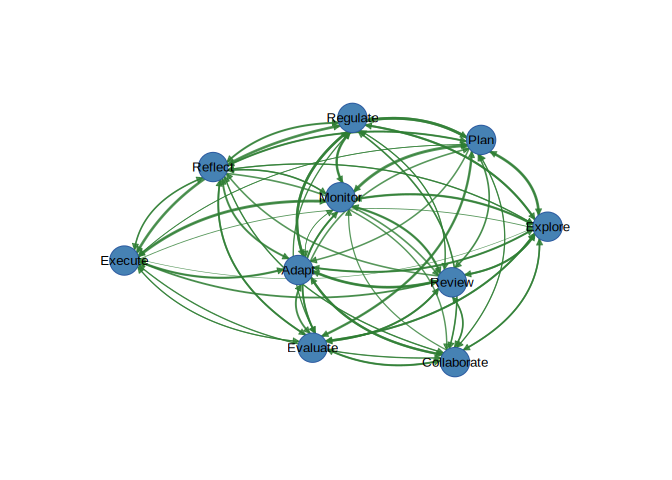

## Input Formats

cograph accepts six input types:

``` r
# 1. Adjacency matrix
adj <- matrix(c(0,1,1, 1,0,1, 1,1,0), nrow = 3)
splot(adj)
```

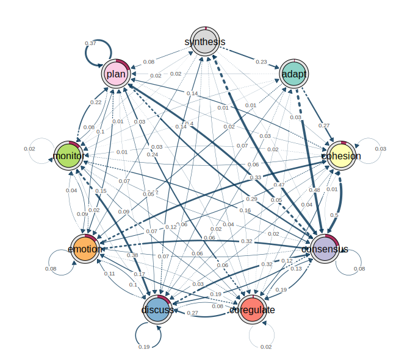

``` r

# 2. Edge list (data.frame with from, to, and optional weight)
edges <- data.frame(
  from = c("A", "A", "B"),
  to   = c("B", "C", "C"),
  weight = c(0.8, 0.5, 0.3)
)
splot(edges)
```


``` r

# 3. igraph object
library(igraph)
#> 
#> Attaching package: 'igraph'
#> The following object is masked from 'package:cograph':
#> 
#>     is_directed
#> The following objects are masked from 'package:stats':
#> 
#>     decompose, spectrum
#> The following object is masked from 'package:base':
#> 
#>     union
g <- make_ring(10)
splot(g)
```

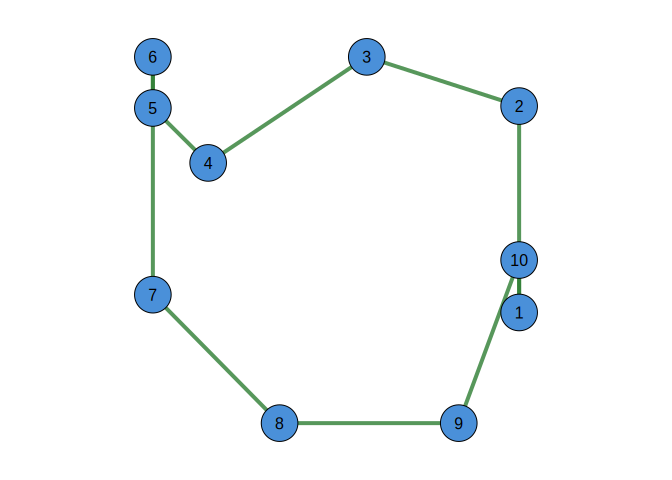

``` r

# 4. statnet network object
library(network)
#> 
#> 'network' 1.19.0 (2024-12-08), part of the Statnet Project
#> * 'news(package="network")' for changes since last version
#> * 'citation("network")' for citation information
#> * 'https://statnet.org' for help, support, and other information
#> 
#> Attaching package: 'network'
#> The following objects are masked from 'package:igraph':
#> 
#>     %c%, %s%, add.edges, add.vertices, delete.edges, delete.vertices,
#>     get.edge.attribute, get.edges, get.vertex.attribute, is.bipartite,
#>     is.directed, list.edge.attributes, list.vertex.attributes,
#>     set.edge.attribute, set.vertex.attribute
net <- network.initialize(5, directed = FALSE)
net[1,2] <- net[2,3] <- net[3,4] <- net[4,5] <- net[1,5] <- 1
splot(net)
```


``` r

# 5. qgraph object
library(qgraph)
q <- qgraph(adj)
```


``` r
splot(q)
```

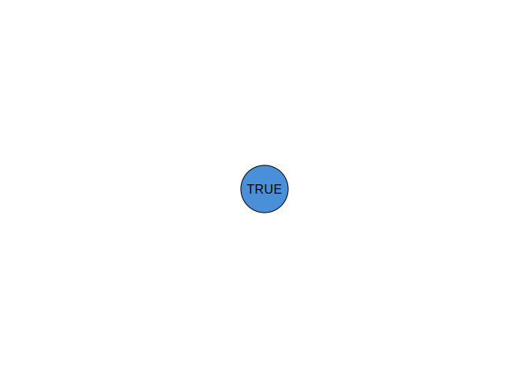

``` r

# 6. tna object (transition network analysis)
library(tna)
#> 'tna' package version 1.1.0
#> ------------------------------------------------------
#>   Tikka, S., López-Pernas, S., and Saqr, M. (2025). 
#>   tna: An R Package for Transition Network Analysis.
#>   Applied Psychological Measurement.
#>   https://doi.org/10.1177/01466216251348840
#> ------------------------------------------------------
#> Please type 'citation("tna")' for more citation information.
#> See the package website at https://sonsoles.me/tna/
#> 
#> Attaching package: 'tna'
#> The following objects are masked from 'package:igraph':
#> 
#>     cliques, communities, compare
tna_obj <- tna(group_regulation)
splot(tna_obj)
```


## splot() vs soplot()

`splot()` uses base R graphics; `soplot()` uses grid graphics. Both
accept the same parameters.

``` r
# Base R (recommended for knitting and file output)
splot(mat, layout = "circle", theme = "classic")
```


``` r

# Grid-based (useful for sn_ggplot())
soplot(mat, layout = "circle", theme = "classic")
```

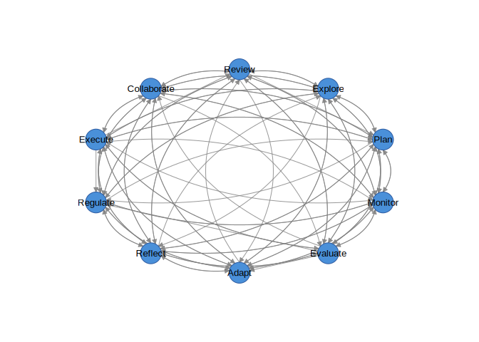

## Layouts

``` r
# Built-in layouts
splot(mat, layout = "circle")
```

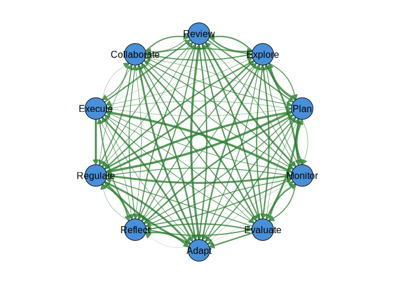

``` r
splot(mat, layout = "spring")
```


``` r

# Group-based layout
groups <- rep(1:3, length.out = 10)
cograph(mat) |> sn_layout("groups", groups = groups) |> sn_render()
```


``` r

# igraph layout codes
splot(mat, layout = "kk")    # Kamada-Kawai
```

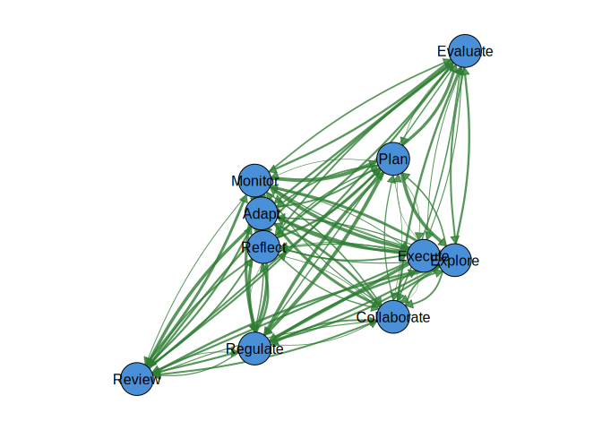

``` r
splot(mat, layout = "fr")    # Fruchterman-Reingold
```


``` r
splot(mat, layout = "mds")   # Multidimensional scaling
```


``` r

# Custom coordinates
coords <- matrix(runif(20), ncol = 2)
cograph(mat) |> sn_layout(coords) |> sn_render()
```

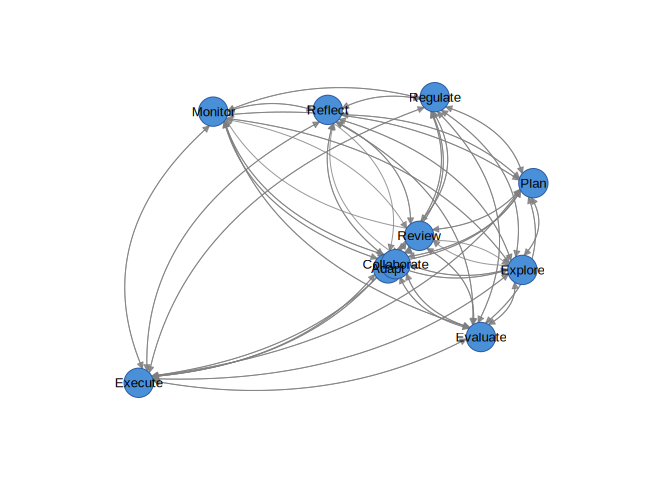

## Node Shapes

All available shapes:

``` r
# Shapes: circle, square, triangle, diamond, pentagon, hexagon,
#         ellipse, heart, star, cross, rectangle

# One shape per node
shapes <- c("circle", "square", "triangle", "diamond", "pentagon",
            "hexagon", "ellipse", "heart", "star", "cross")
splot(mat, node_shape = shapes, node_fill = palette_rainbow(10), layout = "circle")
```

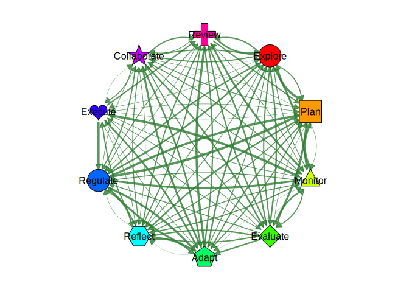

## Node Aesthetics

``` r
splot(mat,
  node_size = seq(0.04, 0.08, length.out = 10),
  node_fill = palette_pastel(10),
  node_border_color = "gray30",
  node_border_width = 2,
  node_alpha = 0.85,
  label_size = 9,
  label_color = "black",
  label_position = "center"
)
```

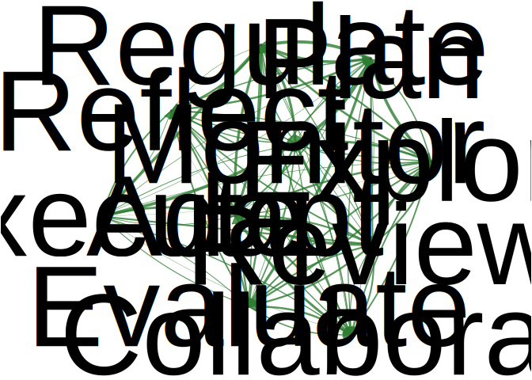

## Edge Aesthetics

``` r
# Width, color, and style
splot(mat,
  positive_color = "#2E7D32",
  negative_color = "#C62828",
  edge_style = "solid",
  curvature = 0.2,
  arrow_size = 0.015
)
#> Warning: 'positive_color' is deprecated, use 'edge_positive_color' instead.
#> Warning: 'negative_color' is deprecated, use 'edge_negative_color' instead.
```

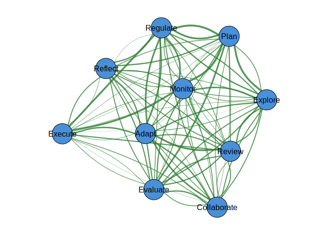

## Confidence Intervals and P-Values

cograph supports statistical edge visualization with CI underlays and
significance notation.

``` r
# Confidence interval underlays (uncertainty bands)
splot(mat,
  edge_ci = runif(sum(mat > 0), 0.05, 0.2),
  edge_ci_alpha = 0.15,
  edge_ci_scale = 2.5,
  edge_ci_style = 1  # 1=solid, 2=dashed, 3=dotted
)
```


``` r

# P-values with significance stars (*** p<0.001, ** p<0.01, * p<0.05)
splot(mat,
  edge_labels = TRUE,
  edge_label_p = runif(sum(mat > 0), 0, 0.1),
  edge_label_stars = TRUE,
  edge_label_size = 0.5
)
```

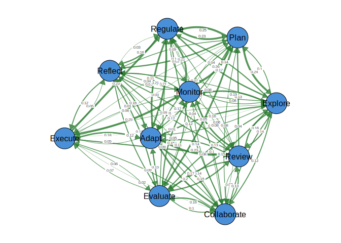

``` r

# Custom template with CI bounds
splot(mat,
  edge_label_template = "{est}{stars}\n[{low}, {up}]",
  edge_ci_lower = runif(sum(mat > 0), 0.1, 0.3),
  edge_ci_upper = runif(sum(mat > 0), 0.4, 0.6),
  edge_label_p = runif(sum(mat > 0), 0, 0.1),
  edge_label_stars = TRUE,
  edge_label_digits = 2,
  edge_label_size = 0.45
)
```


``` r

# Publication-ready with CI underlays and labels
splot(mat,
  edge_ci = runif(sum(mat > 0), 0.05, 0.2),
  edge_ci_alpha = 0.12,
  edge_label_template = "{est}{stars}",
  edge_label_p = runif(sum(mat > 0), 0, 0.1),
  edge_label_stars = TRUE,
  edge_label_size = 0.5,
  theme = "minimal"
)
```

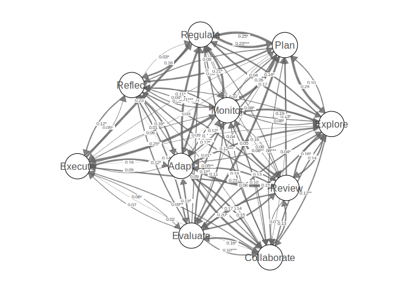

Template placeholders: `{est}`, `{low}`, `{up}`, `{range}`, `{p}`,
`{stars}`

## Pie Chart Nodes

``` r
set.seed(1)
# Each node gets a vector of pie segment values
pie_vals <- lapply(1:10, function(i) runif(4))
pie_cols <- c("#E41A1C", "#377EB8", "#4DAF4A", "#FF7F00")

splot(mat,
  node_shape = "pie",
  pie_values = pie_vals,
  pie_colors = pie_cols,
  layout = "circle"
)
```

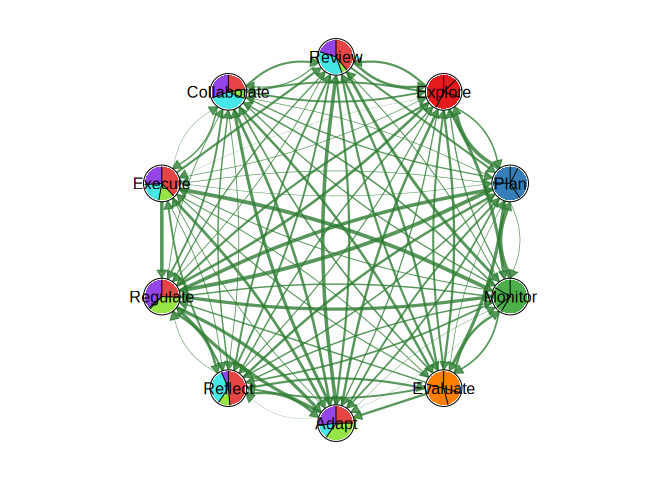

``` r

# Per-node color palettes
pie_cols_multi <- list(
  c("#E63946", "#F1FAEE", "#A8DADC"),
  c("#264653", "#2A9D8F", "#E9C46A"),
  c("#F72585", "#7209B7", "#3A0CA3"),
  c("#003049", "#D62828", "#F77F00"),
  c("#606C38", "#283618", "#DDA15E"),
  c("#0077B6", "#00B4D8", "#90E0EF"),
  c("#9B2226", "#AE2012", "#BB3E03"),
  c("#023047", "#219EBC", "#8ECAE6"),
  c("#5F0F40", "#9A031E", "#FB8B24"),
  c("#2D00F7", "#6A00F4", "#8900F2")
)
splot(mat,
  node_shape = "pie",
  pie_values = lapply(1:10, function(i) runif(3)),
  pie_colors = pie_cols_multi,
  node_size = 6,
  layout = "circle"
)
```

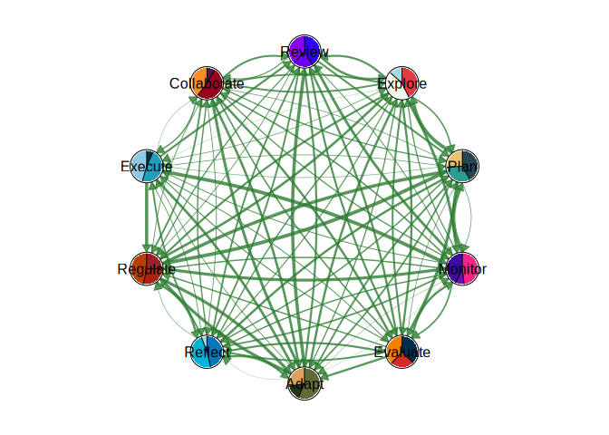

## Donut Nodes

``` r
# Simple donut: fill proportion per node (0 to 1)
fills <- runif(10, 0.3, 0.95)
splot(mat,
  node_shape = "donut",
  donut_fill = fills,
  donut_color = "steelblue",
  layout = "circle"
)
```

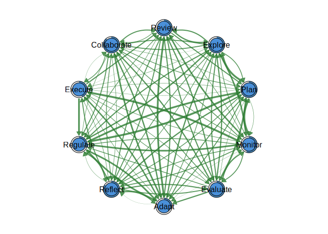

``` r

# Segmented donuts with multiple colors
donut_vals <- lapply(1:10, function(i) runif(3))
donut_cols <- list(c("#E63946", "#457B9D", "#2A9D8F"))
splot(mat,
  donut_values = donut_vals,
  donut_colors = donut_cols,
  donut_inner_ratio = 0.6,
  node_size = 6
)
```


``` r

# Per-node donut color palettes
donut_cols_multi <- list(
  c("#003049", "#D62828", "#F77F00", "#FCBF49"),
  c("#606C38", "#283618", "#DDA15E", "#BC6C25"),
  c("#0077B6", "#00B4D8", "#90E0EF", "#CAF0F8"),
  c("#9B2226", "#AE2012", "#BB3E03", "#CA6702"),
  c("#5F0F40", "#9A031E", "#FB8B24", "#E36414"),
  c("#023047", "#219EBC", "#8ECAE6", "#FFB703"),
  c("#264653", "#2A9D8F", "#E9C46A", "#F4A261"),
  c("#F72585", "#B5179E", "#7209B7", "#560BAD"),
  c("#10002B", "#240046", "#3C096C", "#5A189A"),
  c("#D8F3DC", "#B7E4C7", "#95D5B2", "#74C69D")
)
splot(mat,
  donut_values = lapply(1:10, function(i) runif(4)),
  donut_colors = donut_cols_multi,
  donut_inner_ratio = 0.55,
  node_size = 6
)
```

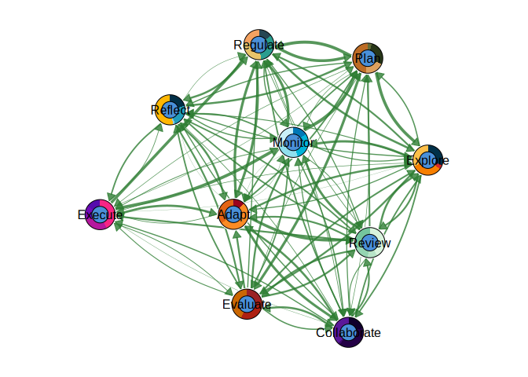

``` r

# Polygon donut shapes
splot(mat,
  node_shape = "donut",
  donut_fill = fills,
  donut_shape = c("circle", "hexagon", "square", "diamond", "triangle",
                  "pentagon", "circle", "hexagon", "square", "diamond"),
  donut_color = palette_viridis(10)
)
```


``` r

# Show value in center
splot(mat,
  node_shape = "donut",
  donut_fill = fills,
  donut_show_value = TRUE,
  donut_value_digits = 0,
  donut_value_suffix = "%"
)
```


``` r

# Donut + Pie combo: outer donut ring with inner pie segments
splot(mat,
  node_shape = "donut",
  donut_fill = fills,
  donut_color = "steelblue",
  pie_values = lapply(1:10, function(i) runif(3)),
  pie_colors = c("#E41A1C", "#377EB8", "#4DAF4A")
)
```


``` r

# Double donut: two concentric rings
splot(mat,
  node_shape = "donut",
  donut_fill = fills,
  donut_color = "steelblue",
  donut2_values = runif(10, 0.2, 0.8),
  donut2_colors = "coral"
)
```

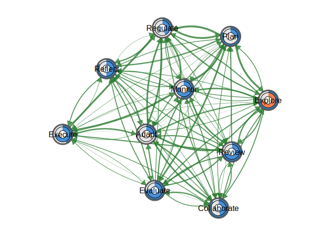

## Weight Handling

``` r
# Round weights to 1 digit
splot(mat, weight_digits = 1)
```

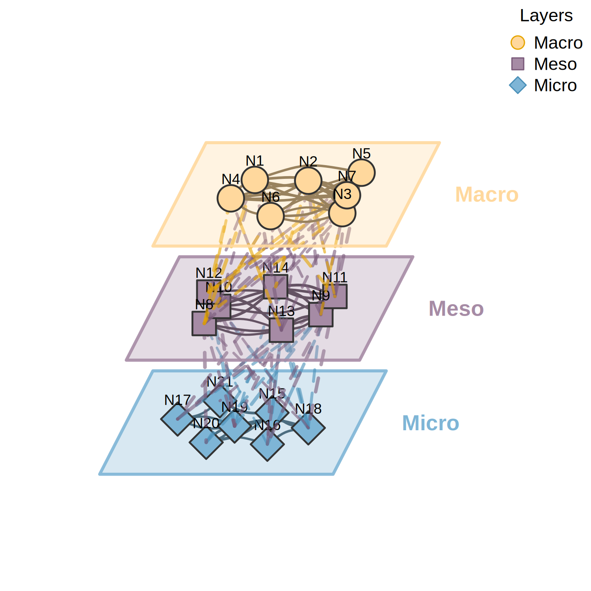

``` r

# Filter edges below threshold
splot(mat, threshold = 0.1)
```


``` r

# Set maximum for scaling
splot(mat, maximum = 1.0)
```


``` r

# Disable two-tier cutoff
splot(mat, cut = 0)
#> Warning: 'cut' is deprecated, use 'edge_cutoff' instead.
```


``` r

# Logarithmic edge scaling
splot(mat, edge_scale_mode = "log")
```


## Themes

Seven built-in themes:

``` r
splot(mat, theme = "classic")
```

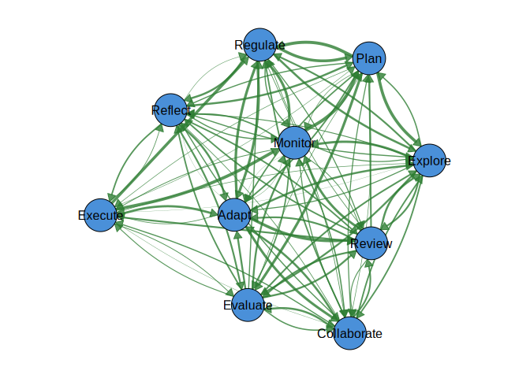

``` r
splot(mat, theme = "dark")
```

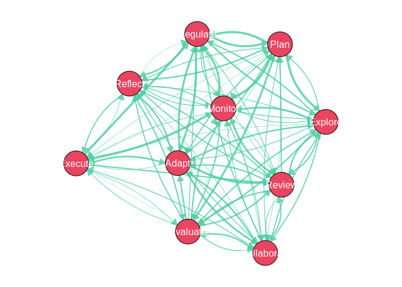

``` r
splot(mat, theme = "colorblind")
```


``` r
splot(mat, theme = "gray")
```


``` r
splot(mat, theme = "minimal")
```

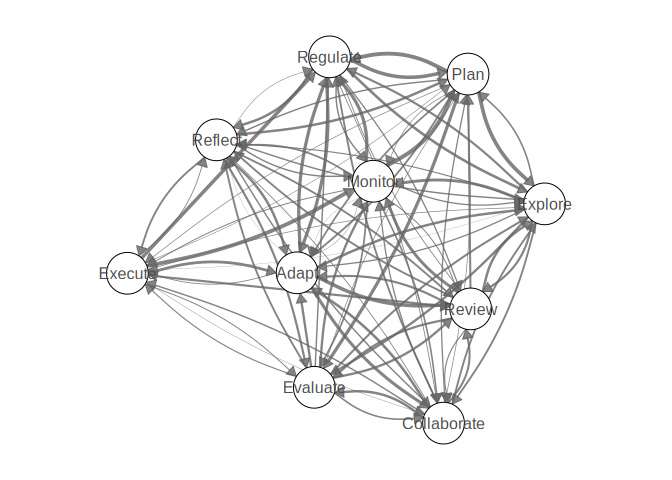

``` r
splot(mat, theme = "viridis")
```

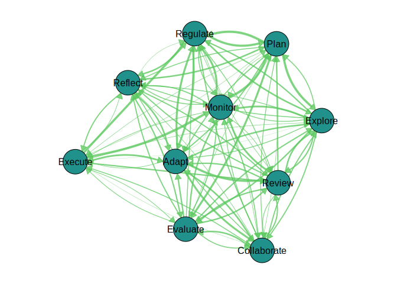

``` r
splot(mat, theme = "nature")
```


## Color Palettes

``` r
splot(mat, node_fill = palette_rainbow(10))
```


``` r
splot(mat, node_fill = palette_colorblind(10))
```

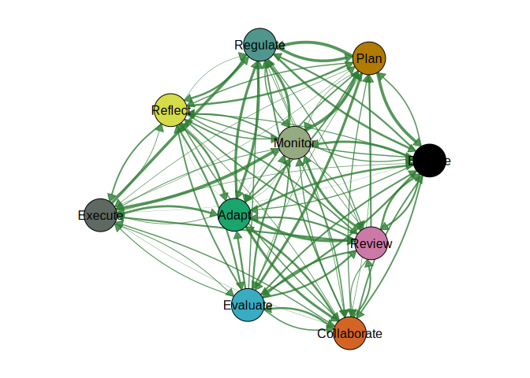

``` r
splot(mat, node_fill = palette_pastel(10))
```

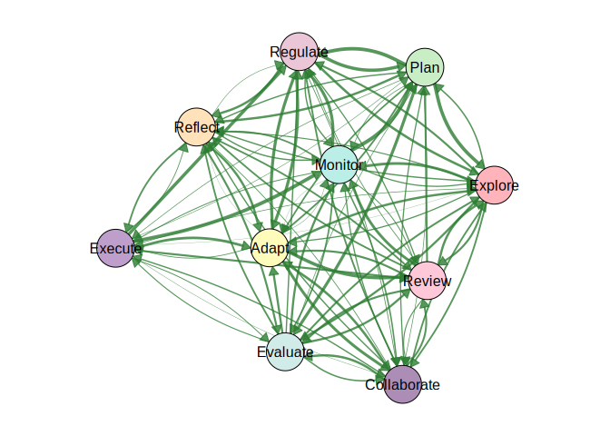

``` r
splot(mat, node_fill = palette_viridis(10))
```


``` r
splot(mat, node_fill = palette_blues(10))
```


``` r
splot(mat, node_fill = palette_reds(10))
```


``` r
splot(mat, node_fill = palette_diverging(10))
```


## Converters: from_tna() and from_qgraph()

``` r
# Convert a tna object (requires tna package)
library(tna)
tna_obj <- tna(group_regulation)
from_tna(tna_obj)
```

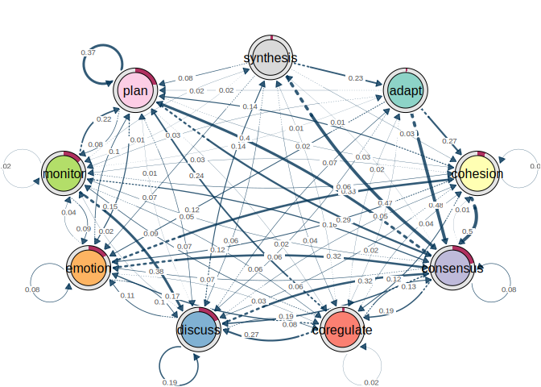

``` r

# Override parameters during conversion
from_tna(tna_obj, theme = "dark", layout = "circle")
```


## ggplot2 Integration

``` r
library(ggplot2)
#> 
#> Attaching package: 'ggplot2'
#> The following object is masked from 'package:cograph':
#> 
#>     get_theme

p <- cograph(mat) |>
  sn_nodes(fill = "steelblue") |>
  sn_theme("minimal") |>
  sn_ggplot()

p + labs(title = "My Network") +
  theme(plot.title = element_text(hjust = 0.5))
```

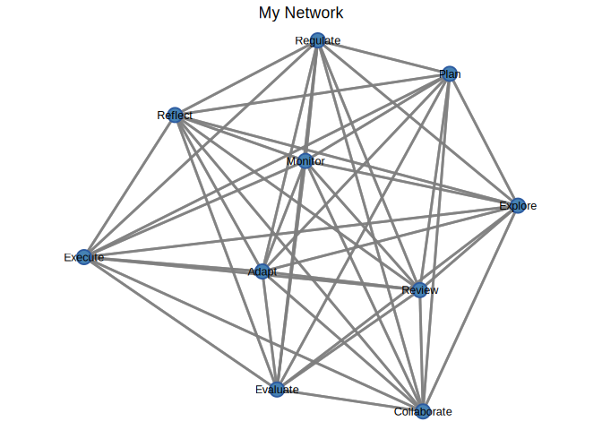

## Saving Plots

``` r
net <- cograph(mat) |>
  sn_nodes(fill = palette_pastel(10)) |>
  sn_theme("minimal")

sn_save(net, "network.pdf", width = 8, height = 8)
sn_save(net, "network.png", width = 8, height = 8, dpi = 300)
sn_save(net, "network.svg", width = 8, height = 8)
```

## Function Reference

| Function | Purpose |
|----|----|
| `cograph()` | Create network from matrix, edge list, igraph, network, qgraph, or tna |
| `splot()` | Render with base R graphics |
| `soplot()` | Render with grid graphics |
| `sn_nodes()` | Set node aesthetics |
| `sn_edges()` | Set edge aesthetics |
| `sn_layout()` | Apply layout algorithm |
| `sn_theme()` | Apply visual theme |
| `sn_palette()` | Apply color palette |
| `sn_render()` | Render to current device |
| `sn_ggplot()` | Convert to ggplot2 object |
| `sn_save()` | Save to file |
| `from_tna()` | Convert tna object |
| `from_qgraph()` | Convert qgraph object |

## License

MIT License. See [LICENSE](LICENSE) for details.
