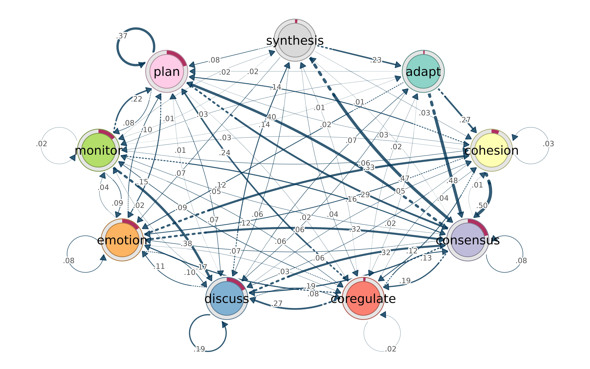
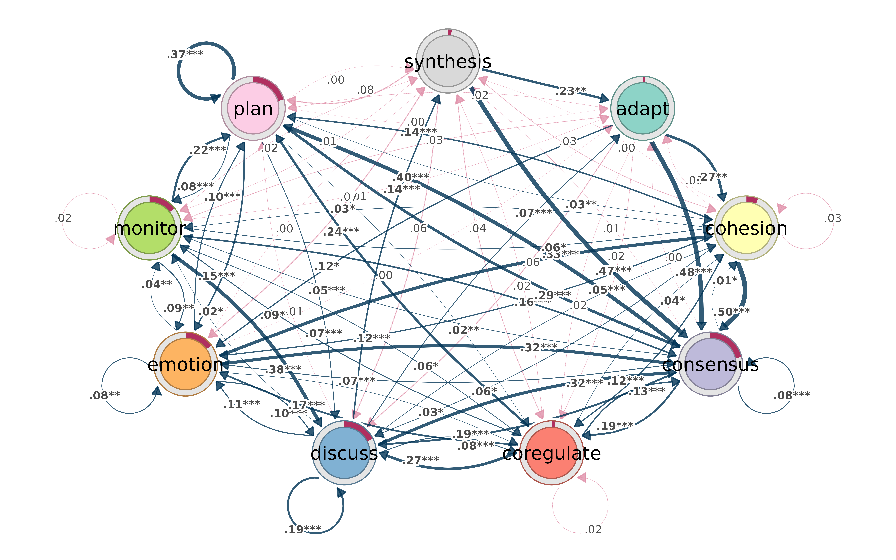
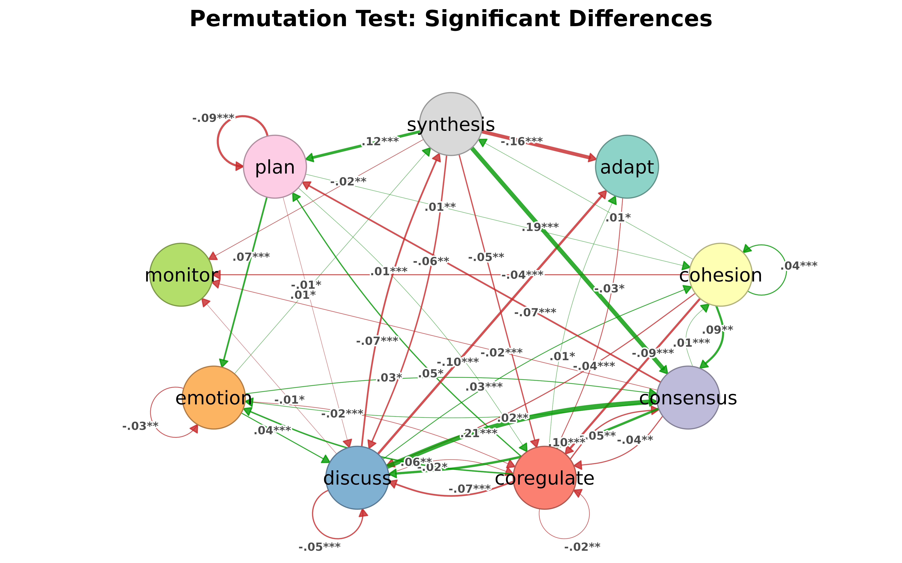

# Why cograph?

``` r
library(tna)
library(cograph)
```

## Do we need another network package?

R already has igraph for computation and qgraph for psychometric
networks. tidygraph tries to unify things with a dplyr grammar. So why
write another one?

The short answer: none of these packages let you go from a raw matrix to
a filtered, annotated, publication-ready figure without switching
between ecosystems, reformatting objects, or writing boilerplate.
cograph tries to close that gap.

This document walks through the specific things cograph does
differently, with working examples.

## Filtering and selecting — like data frames

In igraph, subsetting a network means calling `induced_subgraph()`,
`delete_edges()`, or indexing into `V(g)` and `E(g)`. In tidygraph, you
need `activate(nodes) |> filter(...)`. Both approaches require you to
think about the object structure.

cograph lets you filter nodes and edges with expressions that look like
[`subset()`](https://rdrr.io/r/base/subset.html):

``` r
mat <- matrix(c(
  0.0, 0.5, 0.8, 0.1, 0.0,
  0.3, 0.0, 0.2, 0.6, 0.4,
  0.7, 0.1, 0.0, 0.3, 0.5,
  0.0, 0.4, 0.2, 0.0, 0.9,
  0.1, 0.3, 0.6, 0.8, 0.0
), 5, 5, byrow = TRUE)
rownames(mat) <- colnames(mat) <- c("Read", "Write", "Plan", "Code", "Test")
net <- as_cograph(mat)
```

Keep only edges above a threshold:

``` r
strong <- filter_edges(net, weight > 0.5)
get_edges(strong)
#>   from to weight
#> 1    3  1    0.7
#> 2    1  3    0.8
#> 3    5  3    0.6
#> 4    2  4    0.6
#> 5    5  4    0.8
#> 6    4  5    0.9
```

Keep nodes that have high degree *and* high PageRank — the centrality
measures are computed on the fly:

``` r
hubs <- filter_nodes(net, degree >= 3 & pagerank > 0.15)
get_nodes(hubs)
#>   id label  name  x  y
#> 1  1  Read  Read NA NA
#> 2  2 Write Write NA NA
#> 3  3  Plan  Plan NA NA
#> 4  4  Code  Code NA NA
#> 5  5  Test  Test NA NA
```

### Structural selections

[`select_nodes()`](https://sonsoles.me/cograph/reference/select_nodes.md)
goes further. It knows about components, neighborhoods, articulation
points, and k-cores — and it computes them lazily (only what your
expression actually references):

``` r
# Top 3 nodes by betweenness
top3 <- select_top(net, n = 3, by = "betweenness")
get_nodes(top3)
#>   id label  name  x  y
#> 1  1 Write Write NA NA
#> 2  2  Plan  Plan NA NA
#> 3  3  Code  Code NA NA
```

``` r
# Ego network: everything within 1 hop of "Code"
ego <- select_neighbors(net, of = "Code", order = 1)
get_nodes(ego)
#>   id label  name  x  y
#> 1  1  Read  Read NA NA
#> 2  2 Write Write NA NA
#> 3  3  Plan  Plan NA NA
#> 4  4  Code  Code NA NA
#> 5  5  Test  Test NA NA
```

For edges, you can select by structure too:

``` r
# Edges involving "Code"
code_edges <- select_edges_involving(net, nodes = "Code")
get_edges(code_edges)
#>   from to weight
#> 1    4  2    0.4
#> 2    4  3    0.2
#> 3    1  4    0.1
#> 4    2  4    0.6
#> 5    3  4    0.3
#> 6    5  4    0.8
#> 7    4  5    0.9
```

``` r
# Top 5 edges by weight
top5 <- select_top_edges(net, n = 5)
get_edges(top5)
#>   from to weight
#> 1    2  1    0.7
#> 2    1  2    0.8
#> 3    4  2    0.6
#> 4    4  3    0.8
#> 5    3  4    0.9
```

``` r
# Edges between two node sets
between <- select_edges_between(net,
  set1 = c("Read", "Write"),
  set2 = c("Code", "Test")
)
get_edges(between)
#>   from to weight
#> 1    4  1    0.1
#> 2    3  2    0.4
#> 3    4  2    0.3
#> 4    1  3    0.1
#> 5    2  3    0.6
#> 6    2  4    0.4
```

### Format in, same format out

If you pass a matrix, you can get a matrix back:

``` r
filter_edges(mat, weight > 0.5, keep_format = TRUE)
#>       Read Write Plan Code Test
#> Read   0.0     0  0.8  0.0  0.0
#> Write  0.0     0  0.0  0.6  0.0
#> Plan   0.7     0  0.0  0.0  0.0
#> Code   0.0     0  0.0  0.0  0.9
#> Test   0.0     0  0.6  0.8  0.0
```

Same for igraph objects. No lock-in.

## Centrality — one call, tidy table

igraph requires a separate function for each centrality measure, and
each returns a different format. `page_rank(g)` gives you a list with
`$vector`. `betweenness(g)` gives a named numeric. Building a comparison
table takes 10+ lines.

In cograph, one call with no arguments returns all 34 measures as a tidy
data frame:

``` r
centrality(net, digits = 3)
#>    node degree_all strength_all closeness_all eccentricity_all coreness_all
#> 1  Read          6          2.5          1.25              0.3            6
#> 2 Write          8          2.8          1.00              0.3            6
#> 3  Plan          8          3.4          1.00              0.4            6
#> 4  Code          7          3.3          1.25              0.3            6
#> 5  Test          7          3.6          1.00              0.4            6
#>   harmonic_all diffusion_all leverage_all kreach_all alpha_all power_all
#> 1       26.667            36       -0.110          4    -0.835    -0.885
#> 2       20.000            36        0.069          4    -1.195    -1.046
#> 3       20.833            36        0.069          4    -1.772    -1.046
#> 4       23.333            36       -0.014          4    -2.225    -0.966
#> 5       20.833            36       -0.014          4    -2.366    -1.046
#>   radiality_all lin_all decay_all residual_closeness_all dangalchev_all
#> 1          2.05      20     4.491                  4.491          4.491
#> 2          2.00      16     4.370                  4.370          4.370
#> 3          2.00      16     4.374                  4.374          4.374
#> 4          2.05      20     4.486                  4.486          4.486
#> 5          2.00      16     4.374                  4.374          4.374
#>   generalized_closeness_all harary_all average_distance_all barycenter_all
#> 1                     4.491    222.222                0.133           1.25
#> 2                     4.370    133.333                0.167           1.00
#> 3                     4.374    142.361                0.167           1.00
#> 4                     4.486    161.111                0.133           1.25
#> 5                     4.374    142.361                0.167           1.00
#>   wiener_all lobby_all entropy_all semilocal_all clusterrank_all bottleneck_all
#> 1        0.8         6           2           184          20.800              2
#> 2        1.0         7           2           224          13.714              4
#> 3        1.0         7           2           224          13.714              4
#> 4        0.8         7           2           208          16.857              3
#> 5        1.0         7           2           208          16.857              3
#>   centroid_all mnc_all dmnc_all lac_all closeness_vitality_all integration_all
#> 1            0       4    0.189   4.000                    0.8               6
#> 2           -1       4    0.189   2.500                    2.0               6
#> 3           -1       4    0.189   2.500                    1.8               6
#> 4           -1       4    0.568   3.143                    1.4               6
#> 5           -2       4    0.568   3.143                    2.0               6
#>   expected_all gilschmidt_all participation_all within_module_z_all gateway_all
#> 1           30              1                NA                  NA          NA
#> 2           28              1                NA                  NA          NA
#> 3           28              1                NA                  NA          NA
#> 4           29              1                NA                  NA          NA
#> 5           29              1                NA                  NA          NA
#>   gravity_all collective_influence_all local_hindex_all hindex_strength_all
#> 1         180                        0                6                   3
#> 2         168                        0                6                   3
#> 3         168                        0                6                   3
#> 4         174                        0                6                   3
#> 5         174                        0                6                   3
#>   onion_all reaching_local_all betweenness eigenvector pagerank authority   hub
#> 1         1              0.625         3.0       0.582    0.151     0.540 0.736
#> 2         2              0.462         3.5       0.674    0.172     0.666 0.800
#> 3         2              0.613         5.0       0.882    0.216     0.956 0.725
#> 4         2              0.600         4.0       0.966    0.222     1.000 0.763
#> 5         2              0.588         0.0       1.000    0.240     0.872 1.000
#>   constraint transitivity subgraph laplacian load current_flow_closeness
#> 1      0.761        0.400  212.537        88 12.0                  0.765
#> 2      0.773        0.214  329.433       128 12.5                  0.861
#> 3      0.658        0.214  329.433       128 14.0                  0.917
#> 4      0.761        0.286  274.892       102 13.0                  0.898
#> 5      0.711        0.286  274.892       114  9.0                  0.960
#>   current_flow_betweenness voterank percolation stress flow_betweenness
#> 1                    0.221      0.4       0.250      0              5.0
#> 2                    0.270      1.0       0.292      2              5.9
#> 3                    0.312      0.8       0.417      2              7.3
#> 4                    0.201      0.6       0.333      1              5.4
#> 5                    0.313      0.2       0.000      1              6.2
#>   communicability communicability_betweenness random_walk
#> 1          31.171                       0.357       0.055
#> 2          39.790                       0.583       0.066
#> 3          39.790                       0.582       0.066
#> 4          32.960                       0.532       0.064
#> 5          39.790                       0.466       0.059
#>   topological_coefficient bridging local_bridging effective_size diversity
#> 1                   1.667    0.636          0.035              3     0.868
#> 2                   1.375    0.379          0.014              5     0.952
#> 3                   1.375    0.541          0.014              5     0.916
#> 4                   1.536    0.600          0.021              4     0.903
#> 5                   1.536    0.000          0.021              4     0.927
#>   cross_clique markov salsa leaderrank trophic_level second_order infection
#> 1           16  0.238  0.75      0.869            NA        0.500   219.533
#> 2           16  0.362  1.00      1.078            NA        0.129   184.781
#> 3           16  0.362  1.00      1.078            NA        0.129   184.781
#> 4           16  0.339  1.00      1.042            NA        0.125   203.821
#> 5           16  0.279  0.75      0.934            NA        0.545   203.821
#>   nonbacktracking spanning_tree  katz hubbell information pairwisedis
#> 1           0.846         1.973 1.132   4.280       0.945         0.4
#> 2           0.948         2.382 1.154   4.582       1.072         0.4
#> 3           0.948         2.273 1.211   4.743       1.143         0.4
#> 4           0.836         1.961 1.214   4.740       1.093         0.4
#> 5           1.000         2.443 1.216   5.220       1.152         0.4
#>   prestige_domain prestige_domain_proximity brokerage_coordinator
#> 1               4                       0.8                    NA
#> 2               4                       1.0                    NA
#> 3               4                       1.0                    NA
#> 4               4                       1.0                    NA
#> 5               4                       0.8                    NA
#>   brokerage_itinerant brokerage_representative brokerage_gatekeeper
#> 1                  NA                       NA                   NA
#> 2                  NA                       NA                   NA
#> 3                  NA                       NA                   NA
#> 4                  NA                       NA                   NA
#> 5                  NA                       NA                   NA
#>   brokerage_liaison
#> 1                NA
#> 2                NA
#> 3                NA
#> 4                NA
#> 5                NA
```

That includes degree, strength, betweenness, closeness, PageRank,
eigenvector, but also less common ones like load, current-flow
betweenness, voterank, percolation, diffusion, and leverage — all
computed natively, without extra packages.

If you only need a subset:

``` r
centrality(net, measures = c("degree", "betweenness", "pagerank"), digits = 3)
#>    node degree_all betweenness pagerank
#> 1  Read          6         3.0    0.151
#> 2 Write          8         3.5    0.172
#> 3  Plan          8         5.0    0.216
#> 4  Code          7         4.0    0.222
#> 5  Test          7         0.0    0.240
```

Need just one measure as a named vector? Use the wrapper:

``` r
centrality_pagerank(net)
#>      Read     Write      Plan      Code      Test 
#> 0.1507079 0.1715631 0.2157373 0.2223834 0.2396084
```

``` r
centrality_betweenness(net)
#>  Read Write  Plan  Code  Test 
#>   3.0   3.5   5.0   4.0   0.0
```

You can normalize, sort, and round in the same call:

``` r
centrality(net, measures = c("degree", "betweenness", "pagerank"),
           normalized = TRUE, sort_by = "pagerank", digits = 3)
#>    node degree_all betweenness pagerank
#> 1  Test      0.875         0.0    1.000
#> 2  Code      0.875         0.8    0.928
#> 3  Plan      1.000         1.0    0.900
#> 4 Write      1.000         0.7    0.716
#> 5  Read      0.750         0.6    0.629
```

### Edge-level centrality

``` r
edge_centrality(net, sort_by = "betweenness", digits = 3)
#>     from    to weight betweenness overlap shared_neighbors triangles
#> 1   Code  Plan    0.2         8.0       1                3         3
#> 2   Read  Code    0.1         7.0       1                3         3
#> 3   Plan Write    0.1         6.5       1                3         3
#> 4  Write  Read    0.3         4.0       1                3         3
#> 5   Test  Read    0.1         3.0       1                3         3
#> 6  Write  Test    0.4         2.5       1                3         3
#> 7   Plan  Test    0.5         1.5       1                3         3
#> 8   Test Write    0.3         1.0       1                3         3
#> 9  Write  Plan    0.2         1.0       1                3         3
#> 10  Plan  Code    0.3         1.0       1                3         3
#> 11  Plan  Read    0.7         0.0       1                3         3
#> 12  Read Write    0.5         0.0       1                3         3
#> 13  Code Write    0.4         0.0       1                3         3
#> 14  Read  Plan    0.8         0.0       1                3         3
#> 15  Test  Plan    0.6         0.0       1                3         3
#> 16 Write  Code    0.6         0.0       1                3         3
#> 17  Test  Code    0.8         0.0       1                3         3
#> 18  Code  Test    0.9         0.0       1                3         3
#>    reciprocated reverse_weight weight_ratio
#> 1          TRUE            0.3        1.500
#> 2         FALSE             NA           NA
#> 3          TRUE            0.2        2.000
#> 4          TRUE            0.5        1.667
#> 5         FALSE             NA           NA
#> 6          TRUE            0.3        0.750
#> 7          TRUE            0.6        1.200
#> 8          TRUE            0.4        1.333
#> 9          TRUE            0.1        0.500
#> 10         TRUE            0.2        0.667
#> 11         TRUE            0.8        1.143
#> 12         TRUE            0.3        0.600
#> 13         TRUE            0.6        1.500
#> 14         TRUE            0.7        0.875
#> 15         TRUE            0.5        0.833
#> 16         TRUE            0.4        0.667
#> 17         TRUE            0.9        1.125
#> 18         TRUE            0.8        0.889
```

### Network-level summary

One-row data frame with density, diameter, transitivity, centralization,
reciprocity, and more:

``` r
network_summary(net, digits = 3)
#>   node_count edge_count density component_count diameter mean_distance min_cut
#> 1          5         18     0.9               1      0.8          0.35       3
#>   centralization_degree centralization_in_degree centralization_out_degree
#> 1                 0.125                      0.1                       0.1
#>   centralization_betweenness centralization_closeness centralization_eigen
#> 1                      0.028                        0                0.097
#>   transitivity reciprocity assortativity_degree hub_score authority_score
#> 1        1.009         0.8                -0.25        NA              NA
```

Add `detailed = TRUE` for mean/sd of node-level measures, or
`extended = TRUE` for girth, radius, global efficiency, etc.

## Community detection — one call

igraph has `cluster_louvain()`, `cluster_walktrap()`, etc. — different
function per algorithm, inconsistent parameter names. cograph wraps all
of them behind one function with a default:

``` r
# Undirected network for community detection
sym <- (mat + t(mat)) / 2
diag(sym) <- 0
cograph::communities(sym)
#> Community structure (louvain)
#>   Nodes: 5  | Communities: 2  | Modularity: 0.0985 
#>   Sizes: 2, 3 
#> 
#>   node community
#>   Read         1
#>  Write         2
#>   Plan         1
#>   Code         2
#>   Test         2
```

Pick a different algorithm by name, or use two-letter shorthands:

``` r
cograph::communities(sym, method = "walktrap")
#> Community structure (walktrap)
#>   Nodes: 5  | Communities: 2  | Modularity: 0.0985 
#>   Sizes: 2, 3 
#> 
#>   node community
#>   Read         1
#>  Write         2
#>   Plan         1
#>   Code         2
#>   Test         2
com_fg(sym)   # fast greedy
#> Community structure (fast_greedy)
#>   Nodes: 5  | Communities: 2  | Modularity: 0.0985 
#>   Sizes: 3, 2 
#> 
#>   node community
#>   Read         2
#>  Write         1
#>   Plan         2
#>   Code         1
#>   Test         1
com_im(mat)   # infomap (works on directed too)
#> Community structure (infomap)
#>   Nodes: 5  | Communities: 1  | Modularity: 0 
#>   Sizes: 5 
#> 
#>   node community
#>   Read         1
#>  Write         1
#>   Plan         1
#>   Code         1
#>   Test         1
```

If you just want a node-to-community data frame:

``` r
detect_communities(sym, method = "walktrap")
#> Community structure (walktrap)
#>   Nodes: 5  | Communities: 2  | Modularity: 0.0985 
#>   Sizes: 2, 3 
#> 
#>   node community
#>   Read         1
#>  Write         2
#>   Plan         1
#>   Code         2
#>   Test         2
```

### Quality and significance

How good is the partition?

``` r
comm <- com_wt(mat)
det <- detect_communities(mat, method = "walktrap")
cluster_list <- split(det$node, det$community)
cqual(mat, cluster_list)
#> Cluster Quality Metrics
#> =======================
#> 
#> Global metrics:
#>   Modularity: 0 
#>   Coverage:   1 
#>   Clusters:   1 
#> 
#> Per-cluster metrics:
#>  cluster cluster_name n_nodes internal_edges cut_edges internal_density
#>        1            1       5            7.8         0             0.39
#>  avg_internal_degree expansion cut_ratio conductance
#>                 3.12         0        NA           0
```

Is the modularity significantly higher than chance? Permutation test
against a null model:

``` r
csig(mat, comm, n_random = 200, seed = 1)
#> Cluster Significance Test
#> =========================
#> 
#>   Null model:           configuration (n = 200 )
#>   Observed modularity:  0 
#>   Null mean:            0.1486 
#>   Null SD:              0.0781 
#>   Z-score:              -1.9 
#>   P-value:              0.97139 
#> 
#>   Conclusion: No significant community structure (p >= 0.05)
```

### Compare two solutions

``` r
comm2 <- com_fg(mat)
compare_communities(comm, comm2, method = "nmi")
#> [1] 0
```

### Consensus clustering

Run a stochastic algorithm many times and threshold the co-occurrence
matrix:

``` r
com_consensus(mat, method = "infomap", n_runs = 50, seed = 1)
#> Community structure (consensus_infomap)
#>   Nodes: 5  | Communities: 1  | Modularity: 0 
#>   Sizes: 5 
#> 
#>   node community
#>   Read         1
#>  Write         1
#>   Plan         1
#>   Code         1
#>   Test         1
```

## Format interoperability

cograph accepts matrices, edge lists, igraph, statnet, qgraph, and tna
objects natively. And it converts back:

``` r
net <- as_cograph(mat)

# To igraph
g <- to_igraph(net)
class(g)
#> [1] "igraph"

# To matrix
m <- to_matrix(net)
m[1:3, 1:3]
#>       Read Write Plan
#> Read   0.0   0.5  0.8
#> Write  0.3   0.0  0.2
#> Plan   0.7   0.1  0.0

# To edge list
head(to_df(net))
#>    from    to weight
#> 1 Write  Read    0.3
#> 2  Plan  Read    0.7
#> 3  Test  Read    0.1
#> 4  Read Write    0.5
#> 5  Plan Write    0.1
#> 6  Code Write    0.4
```

No format lock-in. Use cograph for what it’s good at, convert back when
you need something else.

## Robustness, motifs, backbone

A few more things that would otherwise require separate packages:

### Robustness analysis

How does the network hold up when you remove nodes by betweenness
(targeted attack) vs. random failure?

``` r
rob <- robustness(mat, measure = "betweenness", strategy = "sequential", seed = 1)
rob_rand <- robustness(mat, measure = "random", n_iter = 50, seed = 1)

# Area under curve — higher means more robust
robustness_auc(rob)
#> [1] 0.5
robustness_auc(rob_rand)
#> [1] 0.5
```

### Disparity filter (backbone extraction)

Keep only edges that carry a disproportionate share of a node’s weight:

``` r
backbone <- disparity_filter(mat, level = 0.5)
backbone
#>       Read Write Plan Code Test
#> Read     0     1    1    0    0
#> Write    0     0    0    1    1
#> Plan     1     0    0    0    1
#> Code     0     1    0    0    1
#> Test     0     1    1    1    0
```

### Motif census

Count triad types with significance testing against a configuration
model:

``` r
motif_census(mat, n_random = 100)
#> Network Motif Analysis
#> Size: 3-node motifs (directed) | Null: configuration (n=100)
#> 
#>  motif count null_mean   null_sd    z_score      p_value significant
#>    003     0      0.00 0.0000000  0.0000000 1.000000e+00       FALSE
#>    012     0      0.00 0.0000000  0.0000000 1.000000e+00       FALSE
#>    102     0      0.16 0.3684529 -0.4342481 6.641083e-01       FALSE
#>   021D     0      0.00 0.0000000  0.0000000 1.000000e+00       FALSE
#>   021U     0      0.77 0.8973024 -0.8581277 3.908220e-01       FALSE
#>   021C     0      1.26 1.0112499 -1.2459829 2.127707e-01       FALSE
#>   111D     0      0.13 0.3666667 -0.3545455 7.229301e-01       FALSE
#>   111U     0      0.35 0.5751592 -0.6085272 5.428379e-01       FALSE
#>   030T     0      0.38 0.6159496 -0.6169336 5.372785e-01       FALSE
#>   030C     0      1.14 0.8647999 -1.3182241 1.874286e-01       FALSE
#>    201     0      0.84 1.1434486 -0.7346198 4.625711e-01       FALSE
#>   120D     0      0.64 0.7722458 -0.8287516 4.072450e-01       FALSE
#>   120U     1      1.58 1.2405603 -0.4675307 6.401203e-01       FALSE
#>   120C     0      0.29 0.5373899 -0.5396454 5.894416e-01       FALSE
#>    210     4      1.39 1.2940813  2.0168748 4.370858e-02        TRUE
#>    300     5      0.15 0.3859921 12.5650241 3.287749e-36        TRUE
#> 
#> Over-represented: 2 | Under-represented: 0
```

## Working with probabilistic networks

cograph was built with transition networks in mind — matrices where rows
sum to 1 and edges are probabilities, not just weights. This matters in
a few places.

### Smart weight inversion

Path-based centrality measures (betweenness, closeness, harmonic) need
distances, not probabilities. For transition networks, a
high-probability edge should mean *short* distance. cograph handles this
automatically:

- For tna objects: weights are inverted (distance = 1/probability)
- For other networks: weights are used as-is (standard igraph
  convention)

No manual toggle needed.

### First-class tna support

If you use the [tna](https://cran.r-project.org/package=tna) package for
Transition Network Analysis, cograph understands its objects directly:

``` r
model <- tna(group_regulation)
splot(model)
```



Bootstrap results render automatically — significant transitions as
solid edges, non-significant as dashed:

``` r
boot <- bootstrap(model, iter = 1000)
splot(boot)
```



Permutation test results get color-coded by group effect:

``` r
model1 <- tna(group_regulation[1:1000,])
model2 <- tna(group_regulation[1001:2000,])

perm <- permutation_test(model1, model2, iter = 1000)
splot(perm)
```



Group comparisons with
[`plot_compare()`](https://sonsoles.me/cograph/reference/plot_compare.md)
show element-wise probability differences, with donuts on nodes for
initial state shifts.

### qgraph compatibility

Researchers coming from qgraph can use familiar parameter names —
`vsize`, `asize`, `edge.color`, etc. — they are translated
automatically. When both the cograph name and the qgraph alias are
present, the cograph name wins.

### Nestimate integration

cograph also plots [Nestimate](https://mohsaqr.r-universe.dev/Nestimate)
objects (bootstrap forests, permutation results, glasso networks)
without importing the package — dispatch is by class name only.

## Summary

cograph is not trying to replace igraph’s graph algorithms or
tidygraph’s data manipulation. It fills a different gap: going from data
to a filtered, annotated, publication-ready network figure with minimal
code, while staying interoperable with everything else in the R network
ecosystem.

The main ideas:

- **Filter and select** with data-frame-like expressions, not
  object-specific APIs
- **Centrality** as a tidy data frame, not a list of separate calls
- **Community detection** behind one function with shorthands, quality
  metrics, and significance tests
- **Statistical annotation** (CIs, p-values, stars) directly on the
  figure
- **No format lock-in** — matrix/igraph/statnet/tna in and out
- **Probabilistic networks** handled correctly out of the box
