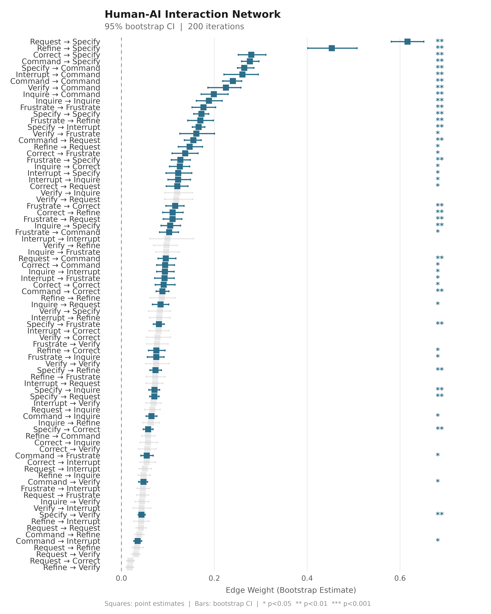
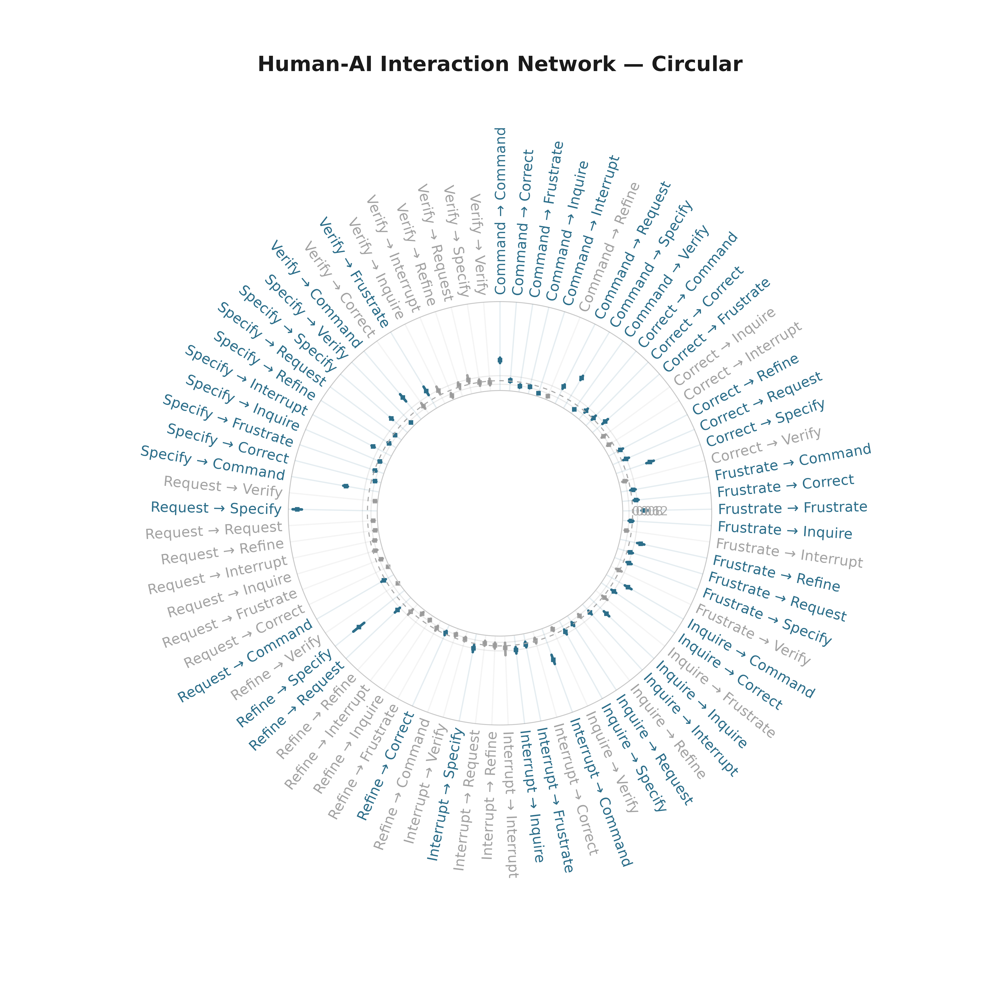
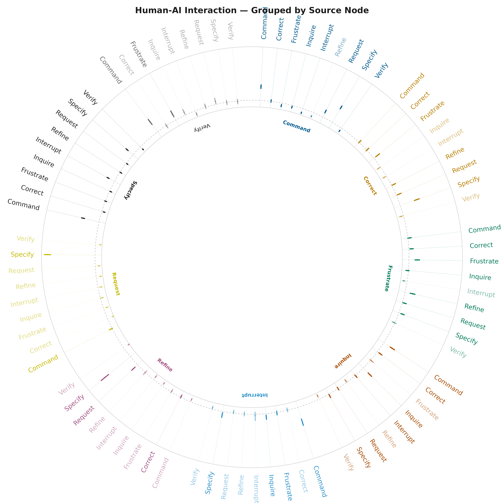
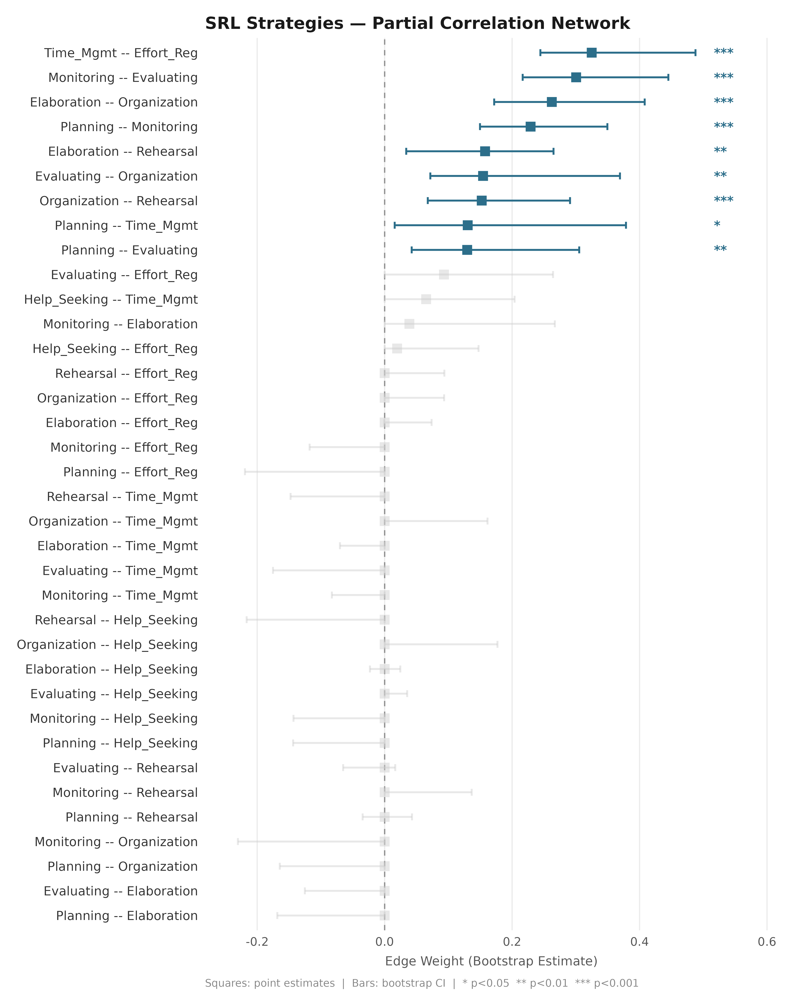
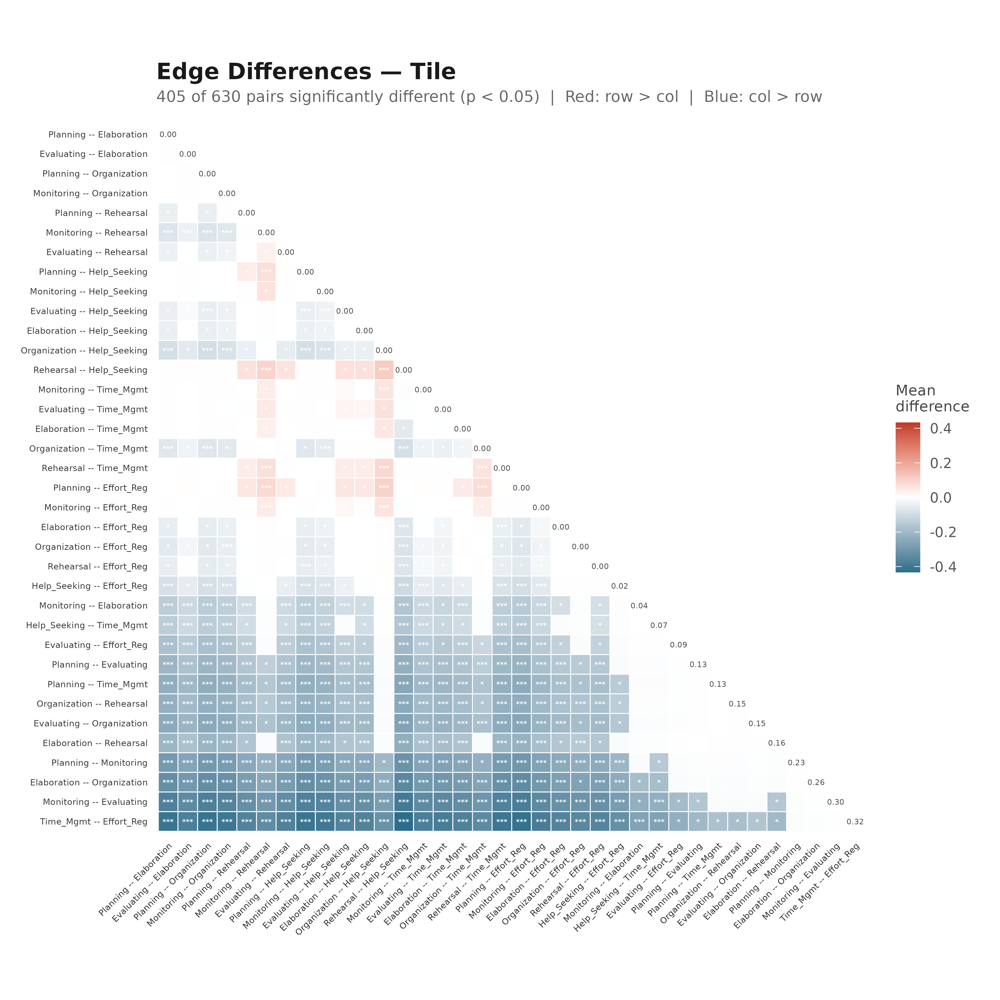
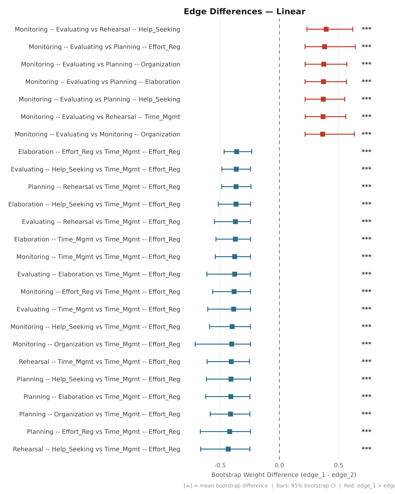
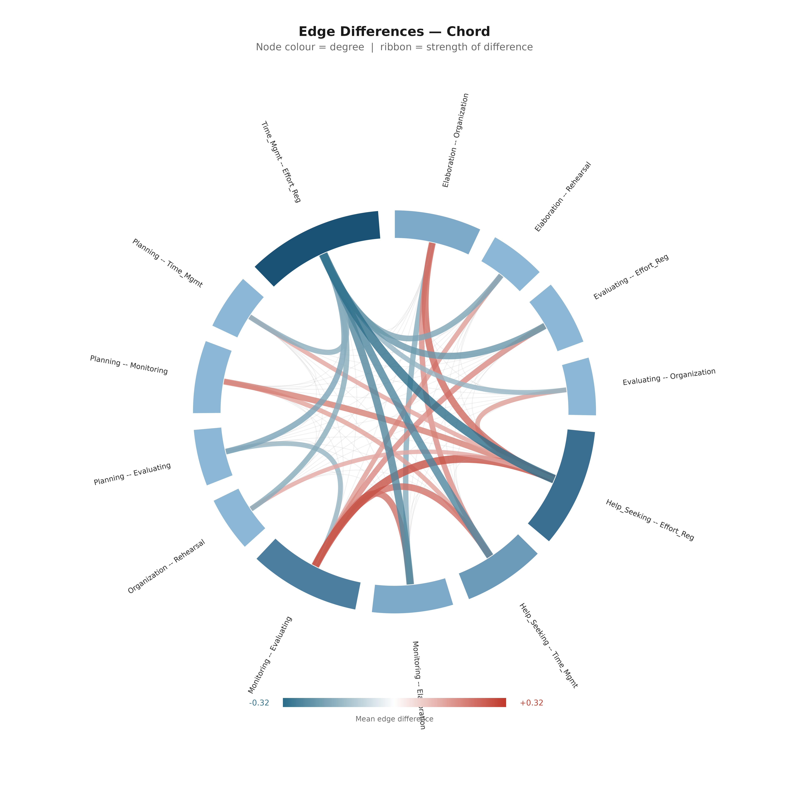
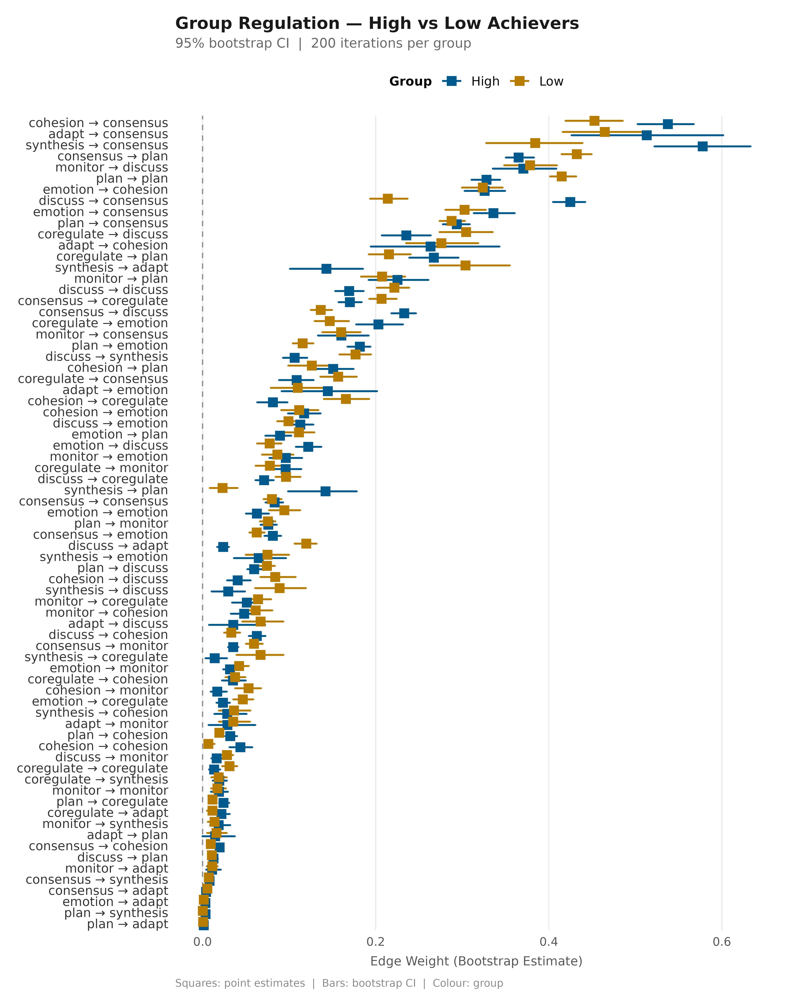

# Bootstrap Forest Plots

## Overview

[`plot_bootstrap_forest()`](https://sonsoles.me/cograph/reference/plot_bootstrap_forest.md)
visualises bootstrapped edge weights and confidence intervals for any
network estimated with `bootstrap_network()` or `boot_glasso()`. Three
layouts are available:

| Layout       | Best for                                  |
|--------------|-------------------------------------------|
| `"linear"`   | Many edges, precise comparison            |
| `"circular"` | Medium networks, publication figures      |
| `"grouped"`  | Source-node grouping, colour by community |

[`plot_edge_diff_forest()`](https://sonsoles.me/cograph/reference/plot_edge_diff_forest.md)
visualises **pairwise edge weight differences** from a `boot_glasso`
object. Four layouts: `"linear"`, `"circular"`, `"chord"`, `"tile"`.

------------------------------------------------------------------------

## 1. TNA Network (relative transitions)

``` r
net_tna  <- build_network(human_wide, method = "relative")
boot_tna <- bootstrap_network(net_tna, iter = 200, seed = 42)
```

### Linear

``` r
plot_bootstrap_forest(boot_tna,
  title    = "Human-AI Interaction Network",
  subtitle = "95% bootstrap CI  |  200 iterations")
```



### Circular

``` r
plot_bootstrap_forest(boot_tna, layout = "circular",
  title = "Human-AI Interaction Network — Circular")
```



### Grouped Radial

``` r
plot_bootstrap_forest(boot_tna, layout = "grouped",
  title = "Human-AI Interaction — Grouped by Source Node")
```



------------------------------------------------------------------------

## 2. Glasso Network (partial correlations)

``` r
net_srl  <- build_network(srl_strategies, method = "glasso")
boot_srl <- boot_glasso(net_srl, iter = 200, seed = 42)
```

### Linear

``` r
plot_bootstrap_forest(boot_srl,
  title = "SRL Strategies — Partial Correlation Network")
```



------------------------------------------------------------------------

## 3. Edge Difference Plots (glasso)

Compare whether pairs of edges have significantly different weights.

### Tile Heatmap

``` r
plot_edge_diff_forest(boot_srl, layout = "tile",
  title = "Edge Differences — Tile")
```



### Linear Forest

``` r
plot_edge_diff_forest(boot_srl, layout = "linear", n_top = 25,
  title = "Edge Differences — Linear")
```



### Chord Diagram

``` r
plot_edge_diff_forest(boot_srl,
  layout       = "chord",
  nonzero_only = TRUE,
  show_nonsig  = TRUE,
  title        = "Edge Differences — Chord",
  subtitle     = "Node colour = degree  |  ribbon = strength of difference")
```



------------------------------------------------------------------------

## 4. Grouped Networks

Compare bootstrap CIs across groups in one plot.

``` r
nets_grp  <- build_network(group_regulation_long,
  method = "relative", actor = "Actor",
  action = "Action",  time  = "Time",
  group  = "Achiever")
boots_grp <- bootstrap_network(nets_grp, iter = 200, seed = 42)
```

``` r
plot_bootstrap_forest(boots_grp,
  title    = "Group Regulation — High vs Low Achievers",
  subtitle = "95% bootstrap CI  |  200 iterations per group")
```


