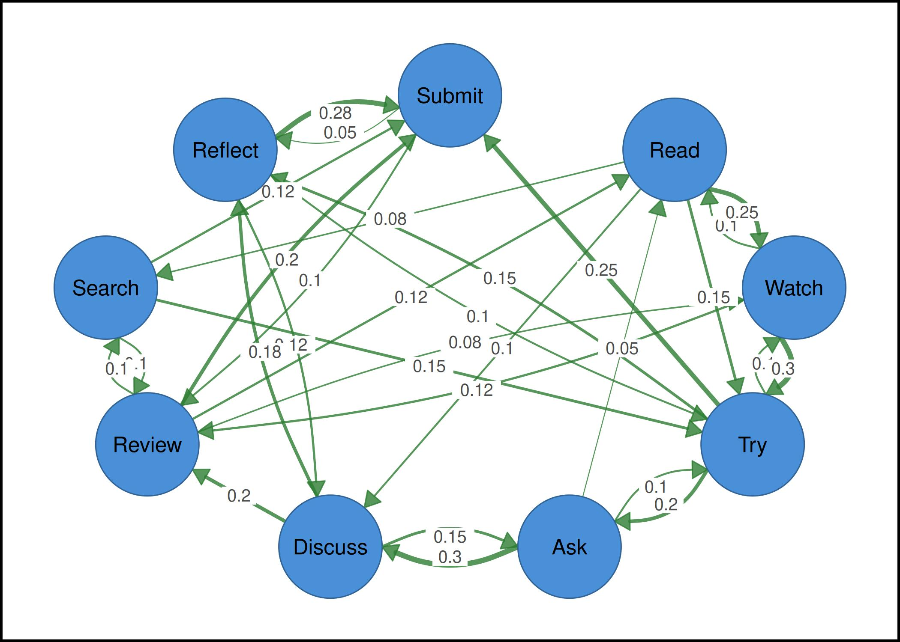
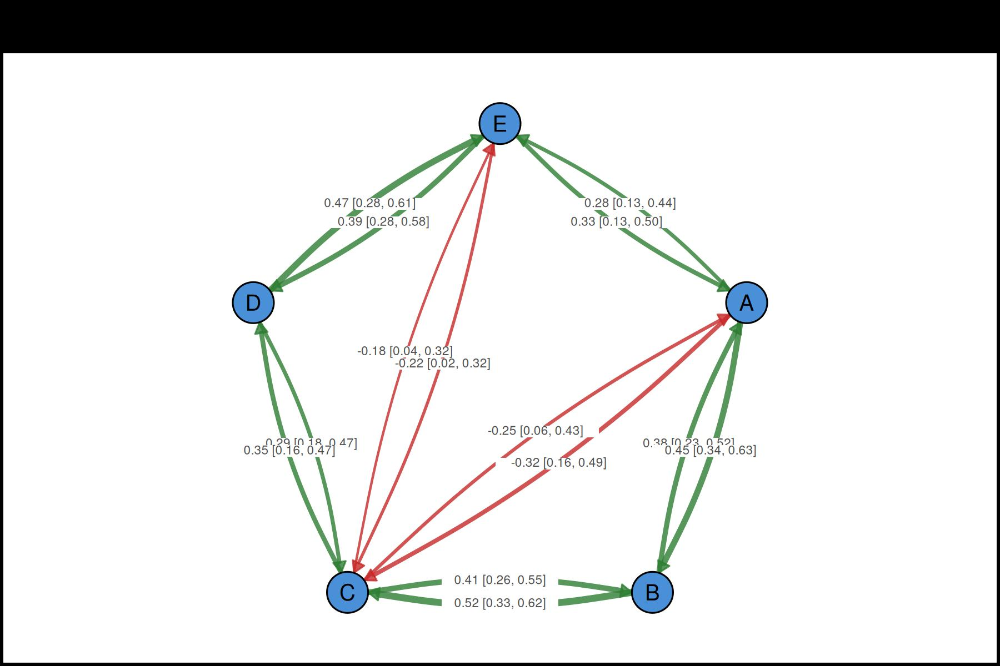
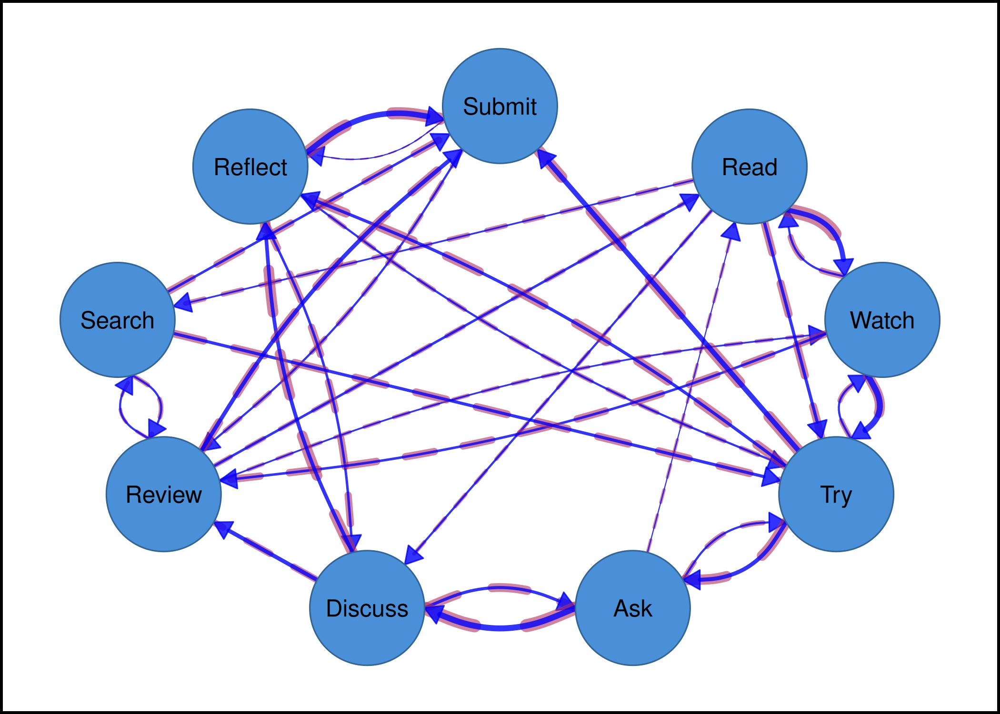
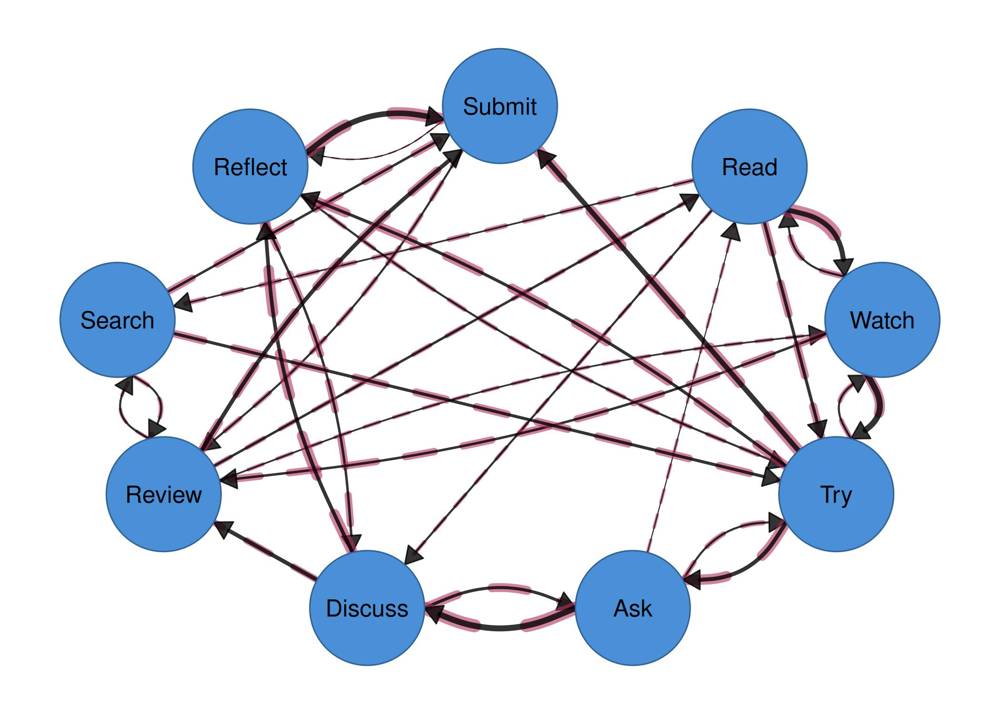
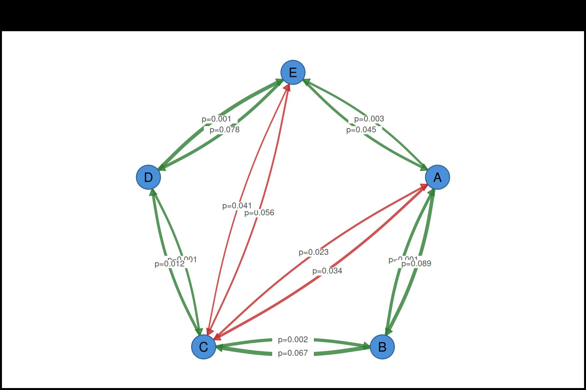
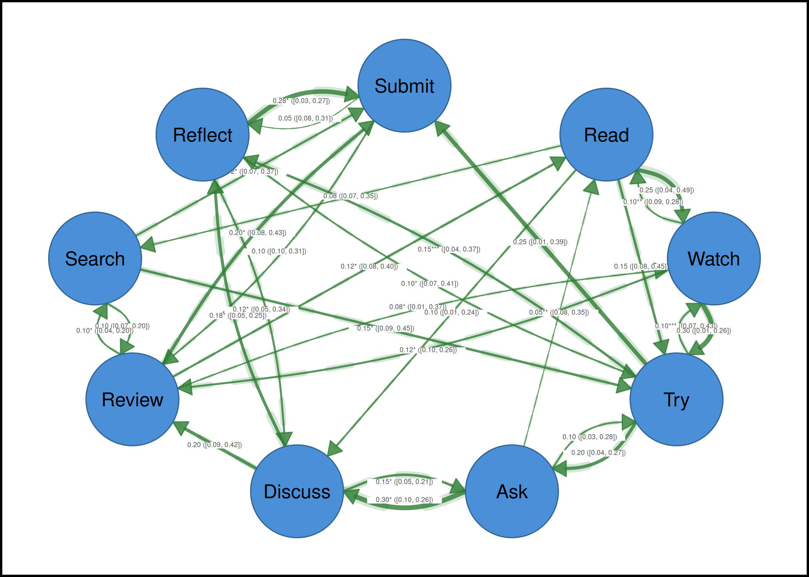
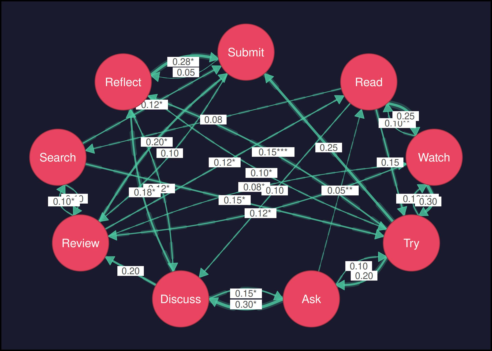
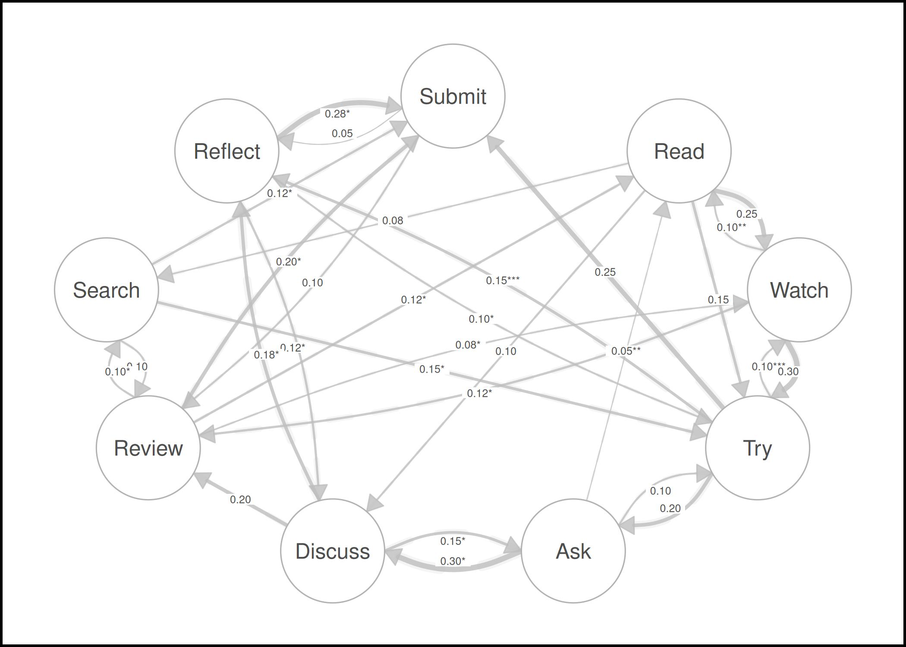

# Confidence Interval and p-value Demo

This vignette demonstrates how to visualize statistical uncertainty on
network edges using confidence interval underlays, p-value significance
stars, and label templates.

``` r
library(cograph)
```

## Create a weighted matrix with simulated statistics

We use a 9-state transition matrix and generate matching CI bounds and
p-values for each edge.

``` r
states <- c("Read", "Watch", "Try", "Ask", "Discuss",
            "Review", "Search", "Reflect", "Submit")

mat <- matrix(c(
  0.00, 0.25, 0.15, 0.00, 0.10, 0.00, 0.08, 0.00, 0.00,
  0.10, 0.00, 0.30, 0.00, 0.00, 0.12, 0.00, 0.00, 0.00,
  0.00, 0.10, 0.00, 0.20, 0.00, 0.00, 0.00, 0.15, 0.25,
  0.05, 0.00, 0.10, 0.00, 0.30, 0.00, 0.00, 0.00, 0.00,
  0.00, 0.00, 0.00, 0.15, 0.00, 0.20, 0.00, 0.18, 0.00,
  0.12, 0.08, 0.00, 0.00, 0.00, 0.00, 0.10, 0.00, 0.20,
  0.00, 0.00, 0.15, 0.00, 0.00, 0.10, 0.00, 0.00, 0.12,
  0.00, 0.00, 0.10, 0.00, 0.12, 0.00, 0.00, 0.00, 0.28,
  0.00, 0.00, 0.00, 0.00, 0.00, 0.10, 0.00, 0.05, 0.00
), nrow = 9, byrow = TRUE, dimnames = list(states, states))

# Count actual edges after parsing (non-zero entries)
net <- cograph(mat)
ne <- nrow(get_edges(net))

# Simulate statistical data for each edge
set.seed(42)
ci_widths <- runif(ne, 0.1, 0.4)
ci_lower  <- runif(ne, 0.01, 0.10)
ci_upper  <- runif(ne, 0.20, 0.50)
p_values  <- round(runif(ne, 0.0001, 0.08), 4)
```

## Example 1: Edge labels with weights

``` r
splot(mat, node_size = 9, edge_labels = TRUE)
```



## Example 2: Significance stars

Stars are shown using `edge_label_template` with the
[stars](https://r-spatial.github.io/stars/) placeholder together with
`edge_label_p` and `edge_label_stars = TRUE`.

``` r
splot(mat, node_size = 9,
      edge_label_template = "{est}{stars}",
      edge_label_p = p_values,
      edge_label_stars = TRUE)
```



## Example 3: CI underlays

CI width is shown as a translucent band behind each edge. Wider bands
indicate more uncertainty.

``` r
splot(mat, node_size = 9,
      edge_color = "blue",
      edge_ci = ci_widths,
      edge_ci_scale = 5,
      edge_ci_alpha = 0.6,
      edge_ci_color = "maroon")
```



``` r

splot(mat, node_size = 9,
      edge_color = "black",
      edge_ci = ci_widths,
      edge_ci_scale = 5,
      edge_ci_alpha = 0.6,
      edge_ci_color = "maroon")
```



## Example 4: CI range labels

Use `{low}` and `{up}` placeholders to show confidence interval bounds
on edges.

``` r
splot(mat, node_size = 9,
      edge_label_template = "{est} [{low}, {up}]",
      edge_ci_lower = ci_lower,
      edge_ci_upper = ci_upper,
      edge_label_size = 0.4)
```



## Example 5: Full statistical labels with CI underlays

Combine estimate, stars, CI range, and CI underlays in one plot.

``` r
splot(mat, node_size = 9,
      edge_label_template = "{est}{stars}\n({range})",
      edge_ci_lower = ci_lower,
      edge_ci_upper = ci_upper,
      edge_label_p = p_values,
      edge_label_stars = TRUE,
      edge_label_size = 0.35,
      edge_ci = ci_widths,
      edge_ci_scale = 5,
      edge_ci_alpha = 0.2)
```



## Example 6: With dark theme

``` r
splot(mat, node_size = 9,
      edge_label_template = "{est}{stars}",
      edge_label_p = p_values,
      edge_label_stars = TRUE,
      edge_ci = ci_widths,
      edge_ci_scale = 5,
      edge_ci_alpha = 0.25,
      theme = "dark")
```



## Example 7: Print-ready in black and white

``` r
splot(mat, node_size = 9,
      edge_color = "grey",
      edge_label_template = "{est}{stars}",
      edge_label_p = p_values,
      edge_label_stars = TRUE,
      edge_label_size = 0.5,
      edge_ci = ci_widths,
      edge_ci_scale = 4,
      edge_ci_alpha = 0.15,
      theme = "minimal")
```


