# Network Comparison and Visualization

## Overview

This vignette demonstrates network comparison and visualization
functions:

- [`plot_compare()`](http://sonsoles.me/cograph/reference/plot_compare.md) -
  Plotting difference networks (x - y)
- [`plot_permutation()`](http://sonsoles.me/cograph/reference/plot_permutation.md) -
  Plotting statistical comparison between networks computed through
  permutation testing
- [`plot_heatmap()`](http://sonsoles.me/cograph/reference/plot_heatmap.md) -
  Adjacency matrix heatmaps
- Advanced node shapes with donut + pie combinations

------------------------------------------------------------------------

## 1. Basic Network Comparison

### 1.1 Simple Difference Plot

``` r
# Create two networks
m1 <- matrix(runif(64, 0, 0.4), 8, 8)
m2 <- matrix(runif(64, 0, 0.4), 8, 8)
rownames(m1) <- colnames(m1) <- LETTERS[1:8]
rownames(m2) <- colnames(m2) <- LETTERS[1:8]

plot_compare(m1, m2,
             layout = "oval",
             node_size = 8,
             title = "Network Difference (m1 - m2)")
```

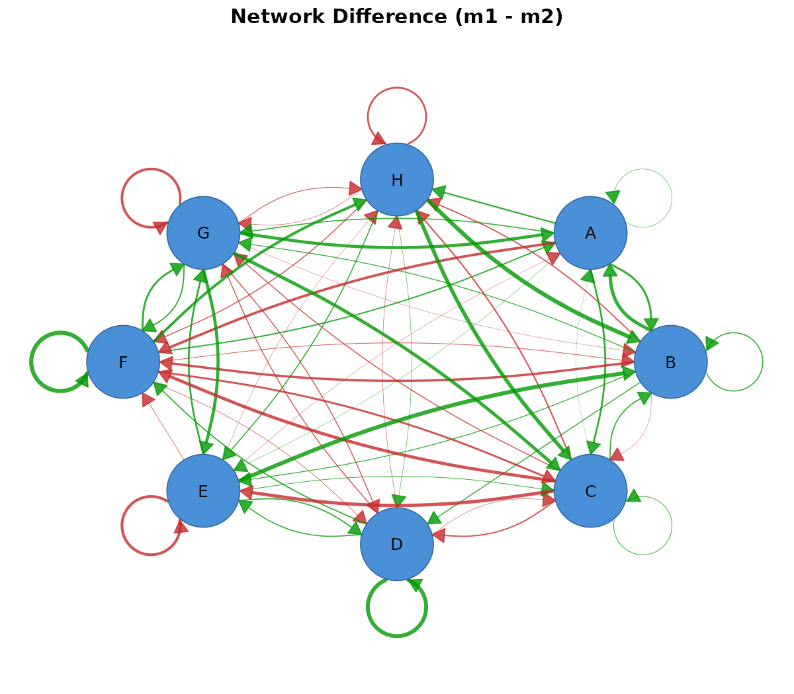

### 1.2 With Initial Probability Differences

``` r
inits1 <- c(0.20, 0.18, 0.15, 0.12, 0.10, 0.10, 0.08, 0.07)
inits2 <- c(0.10, 0.22, 0.18, 0.15, 0.12, 0.08, 0.08, 0.07)

plot_compare(m1, m2,
             inits_x = inits1,
             inits_y = inits2,
             layout = "oval",
             node_size = 8,
             title = "With Initial Probability Donuts")
```

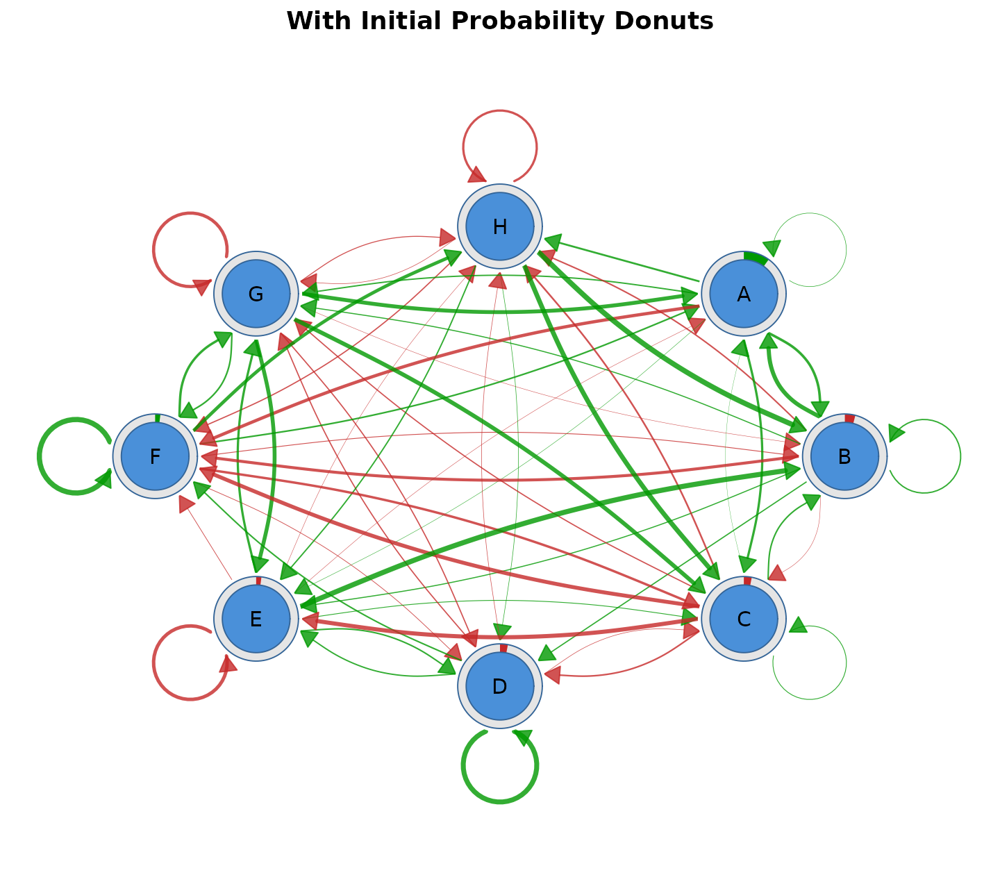

### 1.3 TNA Model Comparison

``` r
model_x <- tna(group_regulation[1:200, ])
model_y <- tna(group_regulation[201:400, ])

plot_compare(model_x, model_y,
             layout = "oval",
             node_size = 8,
             title = "TNA Model Comparison")
```

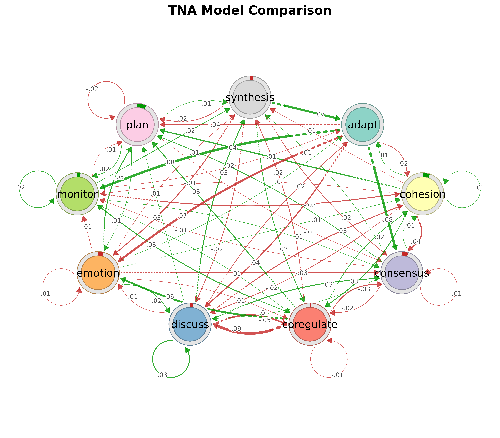 \## 1.4
TNA Permutation testing

``` r
permutation_results <- permutation_test(model_x, model_y)
plot_permutation(permutation_results,
             layout = "oval",
             node_size = 8,
             title = "TNA Permutation test results")
```

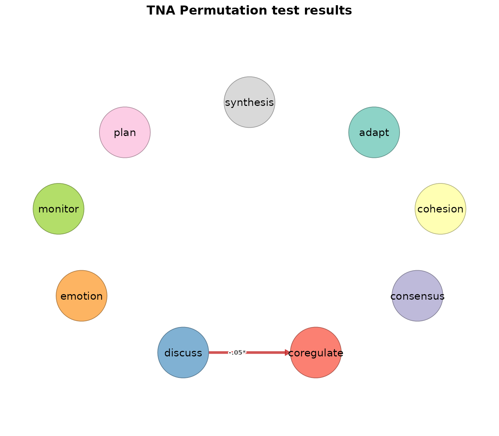
\## 1.5 Group TNA (All Pairs)

``` r
group_model <- group_model(group_regulation, group = c(rep("H",1000),rep("L",1000)))
plot_compare(group_model, node_size = 7)
```

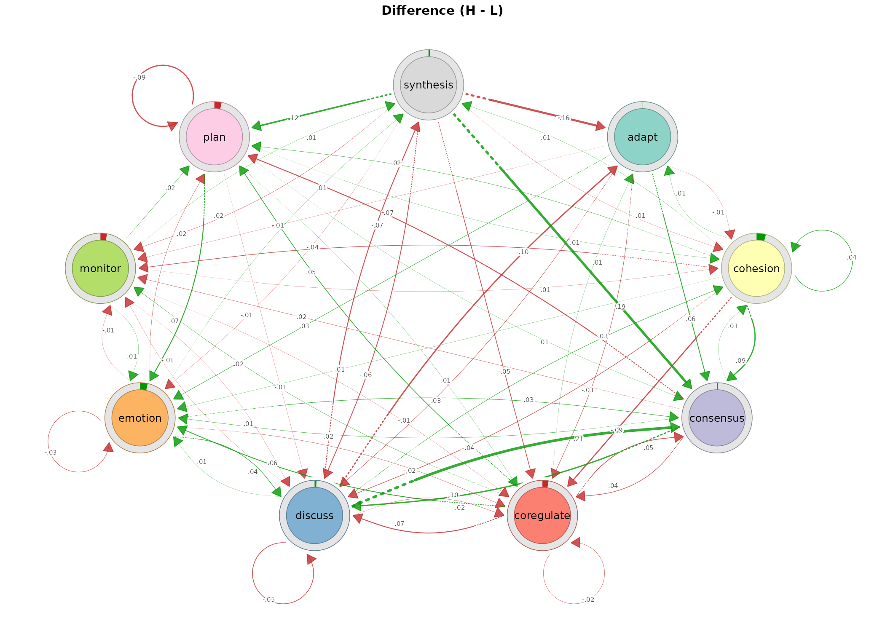

------------------------------------------------------------------------

## 2. Edge Styling

Different edge styles for directed networks.

### 2.1 Edge Curve and Direction

``` r
mat <- matrix(c(
  0.0, 0.6, 0.3, 0.0, 0.2,
  0.4, 0.0, 0.5, 0.3, 0.0,
  0.0, 0.2, 0.0, 0.6, 0.4,
  0.5, 0.0, 0.3, 0.0, 0.5,
  0.3, 0.4, 0.0, 0.2, 0.0
), 5, 5, byrow = TRUE)
rownames(mat) <- colnames(mat) <- c("A", "B", "C", "D", "E")

par(mfrow = c(1, 2), mar = c(2, 2, 3, 1))

splot(mat, layout = "oval", node_size = 8, directed = TRUE,
      title = "Straight Edges")

splot(mat, layout = "oval", node_size = 8, directed = TRUE,
      curvature = 0.25, title = "Curved Edges")
```


``` r
par(mfrow = c(1, 1))
```

### 2.2 Arrow Size Variations

``` r
par(mfrow = c(1, 2), mar = c(2, 2, 3, 1))

splot(mat, layout = "oval", node_size = 8, directed = TRUE,
      arrow_size = 0.6, title = "Small Arrows")

splot(mat, layout = "oval", node_size = 8, directed = TRUE,
      arrow_size = 1.5, title = "Large Arrows")
```

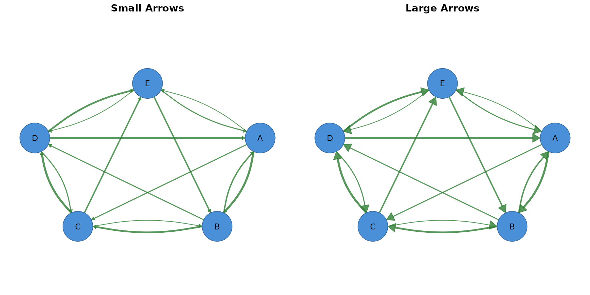

``` r
par(mfrow = c(1, 1))
```

### 2.3 Edge Width

``` r
splot(mat,
      layout = "oval",
      node_size = 8,
      directed = TRUE,
      edge_width = 2,
      curvature = 0.2,
      title = "Thicker Edges with Curve")
```

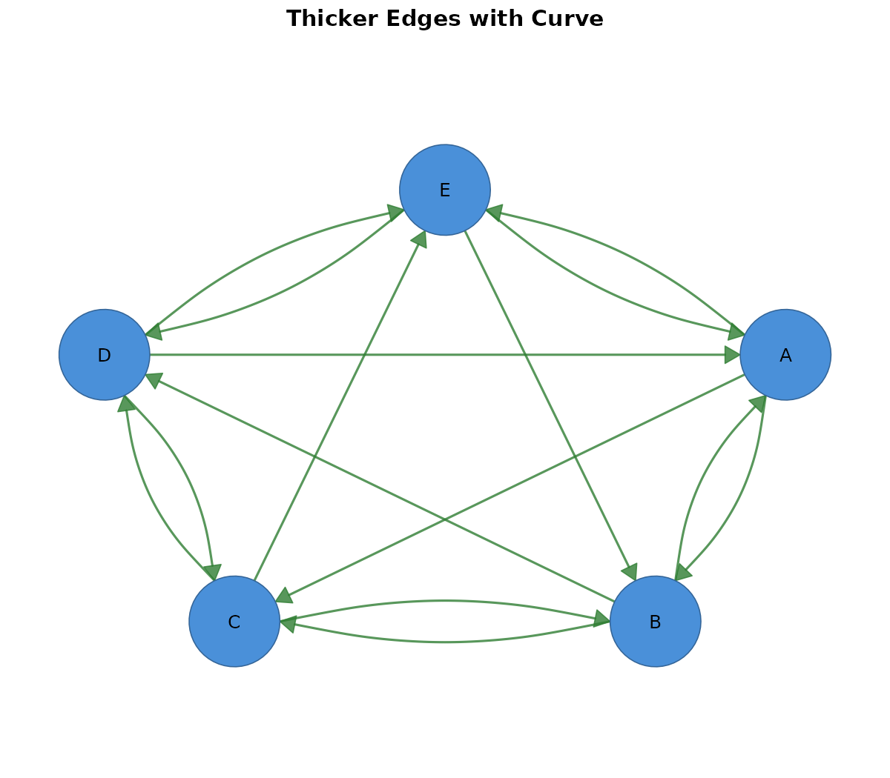

------------------------------------------------------------------------

## 3. Polygon Shapes with Donut + Pie

Combine different node shapes with donut fills and pie charts.

### 3.1 Mixed Shapes with Donut Fill

``` r
mat10 <- matrix(runif(100, 0, 0.3), 10, 10)
diag(mat10) <- 0
rownames(mat10) <- colnames(mat10) <- LETTERS[1:10]

splot(mat10,
      layout = "oval",
      node_size = 8,
      node_shape = c("circle", "hexagon", "square", "diamond", "triangle",
                     "pentagon", "circle", "hexagon", "square", "diamond"),
      donut_fill = runif(10, 0.3, 1),
      donut_color = "steelblue",
      title = "Mixed Shapes with Donut Fill")
```

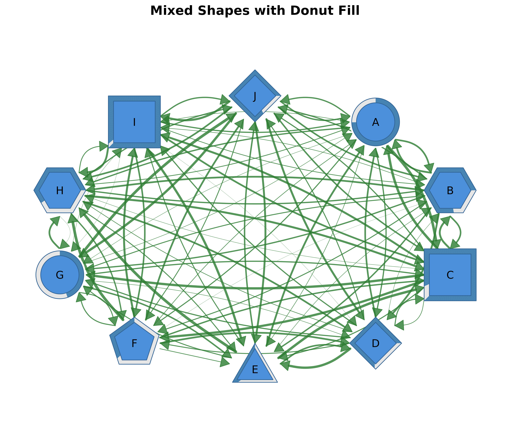

### 3.2 Shapes with Pie Charts

``` r
splot(mat10,
      layout = "oval",
      node_size = 8,
      node_shape = c("hexagon", "square", "diamond", "pentagon", "triangle",
                     "hexagon", "square", "diamond", "pentagon", "triangle"),
      pie_values = lapply(1:10, function(i) c(0.5, 0.3, 0.2)),
      pie_colors = c("#E8E8E8", "#A0A0A0", "#505050"),
      title = "Polygon Shapes with Pie Charts")
```

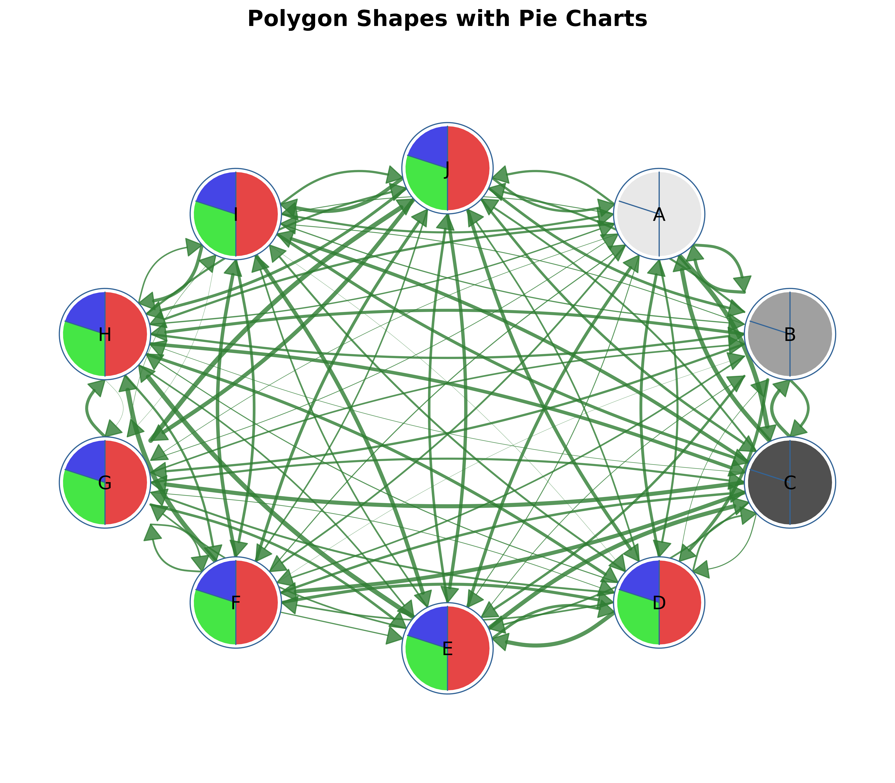

### 3.3 Donut + Pie Combined

``` r
splot(mat10,
      layout = "oval",
      node_size = 8,
      node_shape = c("circle", "hexagon", "square", "diamond", "triangle",
                     "pentagon", "circle", "hexagon", "square", "diamond"),
      donut_fill = runif(10, 0.4, 0.9),
      donut_color = "gray40",
      pie_values = lapply(1:10, function(i) runif(3)),
      pie_colors = c("#D4D4D4", "#909090", "#4A4A4A"),
      title = "Mixed Shapes: Donut Ring + Pie Center")
```

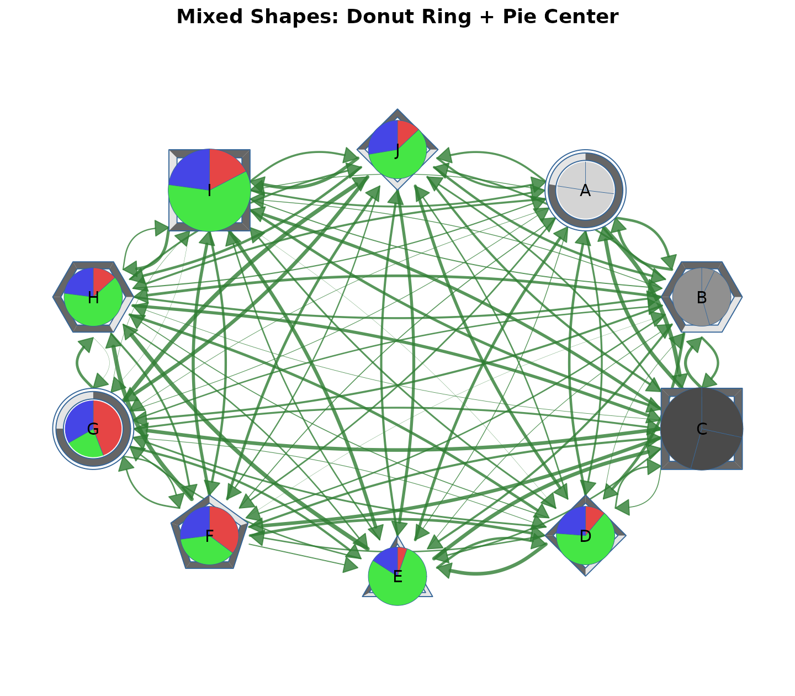

------------------------------------------------------------------------

## 4. Heatmaps

### 4.1 Single Network

``` r
plot_heatmap(m1, title = "Network Heatmap", colors = "viridis")
```

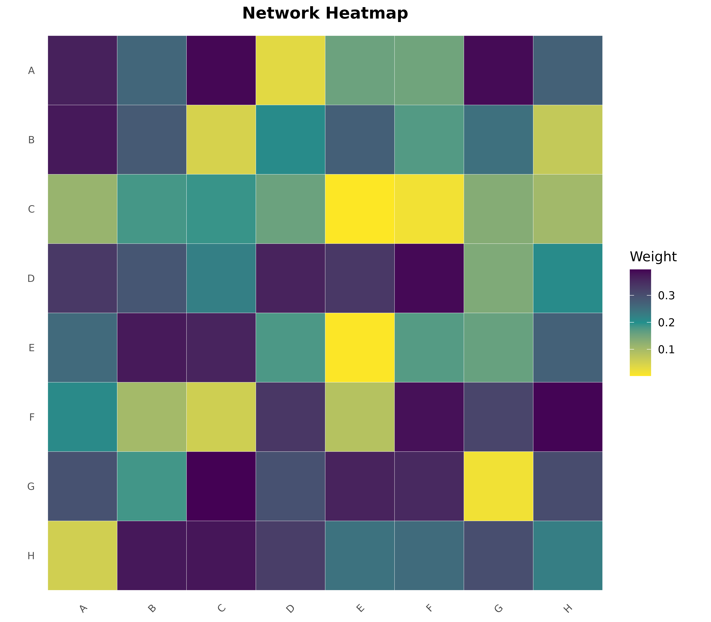

### 4.2 Comparison Heatmaps

``` r
plot_heatmap(m1, title = "Network 1", colors = "blues")
```

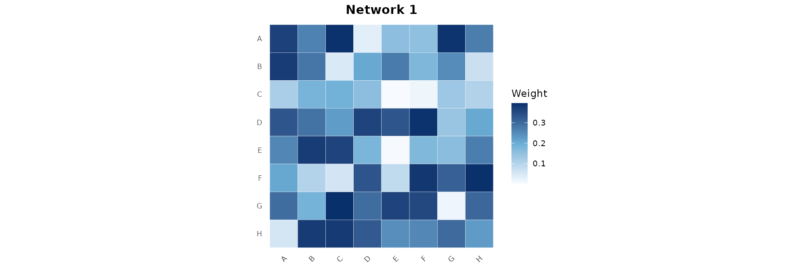

``` r
plot_heatmap(m2, title = "Network 2", colors = "blues")
```


``` r
plot_comparison_heatmap(m1, m2, type = "difference")
```


### 4.3 Group TNA Supra-Adjacency

``` r
plot_heatmap(group_model,
             colors = "viridis",
             title = "Supra-Adjacency Matrix")
```

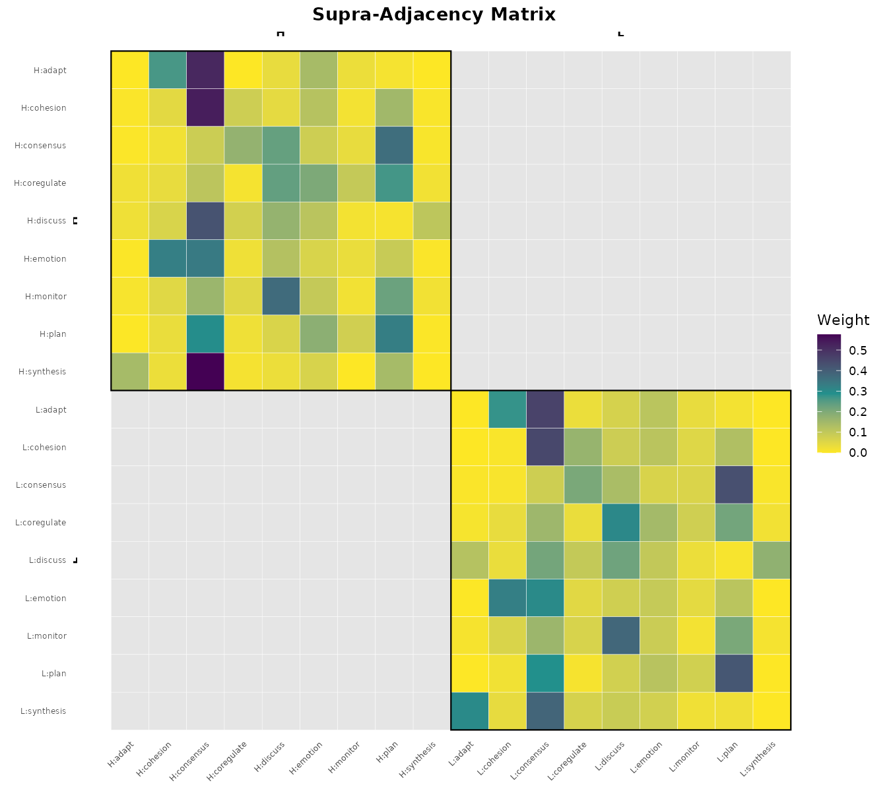

------------------------------------------------------------------------

## 5. Sophisticated Example: Network with Confidence Intervals

A complete example showing transition probabilities with confidence
intervals. Donut fill shows estimate precision (1 - CI width), pie shows
initial probability.

``` r
# Simulated transition matrix with confidence intervals
states <- c("Bored", "Confused", "Engaged", "Frustrated", "Flow")
n <- length(states)

# Point estimates (transition probabilities)
estimates <- matrix(c(
  0.00, 0.25, 0.15, 0.35, 0.05,
  0.20, 0.00, 0.30, 0.25, 0.10,
  0.10, 0.15, 0.00, 0.10, 0.45,
  0.30, 0.20, 0.15, 0.00, 0.05,
  0.05, 0.10, 0.40, 0.05, 0.00
), n, n, byrow = TRUE)
rownames(estimates) <- colnames(estimates) <- states

# Initial state probabilities with CI
init_estimates <- c(0.15, 0.20, 0.35, 0.18, 0.12)
init_ci_width <- c(0.06, 0.08, 0.04, 0.07, 0.10)

# Precision = 1 - normalized CI width (higher = more precise)
precision <- 1 - (init_ci_width / max(init_ci_width))

# Plot: donut fill shows precision, pie shows state distribution
splot(estimates,
      layout = "oval",
      node_size = 9,
      directed = TRUE,

      # Node styling - minimal colors
      node_shape = "hexagon",
      node_fill = "white",
      node_border_color = "gray30",

      # Donut shows precision (1 - CI width)
      donut_fill = precision,
      donut_color = "gray50",
      donut_bg_color = "gray90",

      # Pie shows initial state probability breakdown
      pie_values = lapply(1:n, function(i) {
        c(init_estimates[i], 1 - init_estimates[i])
      }),
      pie_colors = c("gray30", "gray95"),

      # Edge styling
      edge_positive_color = "gray40",
      curvature = 0.15,

      # Labels
      label_size = 0.9,

      title = "Transition Network with Confidence Intervals\n(Donut = Precision, Pie = Initial Probability)")
```

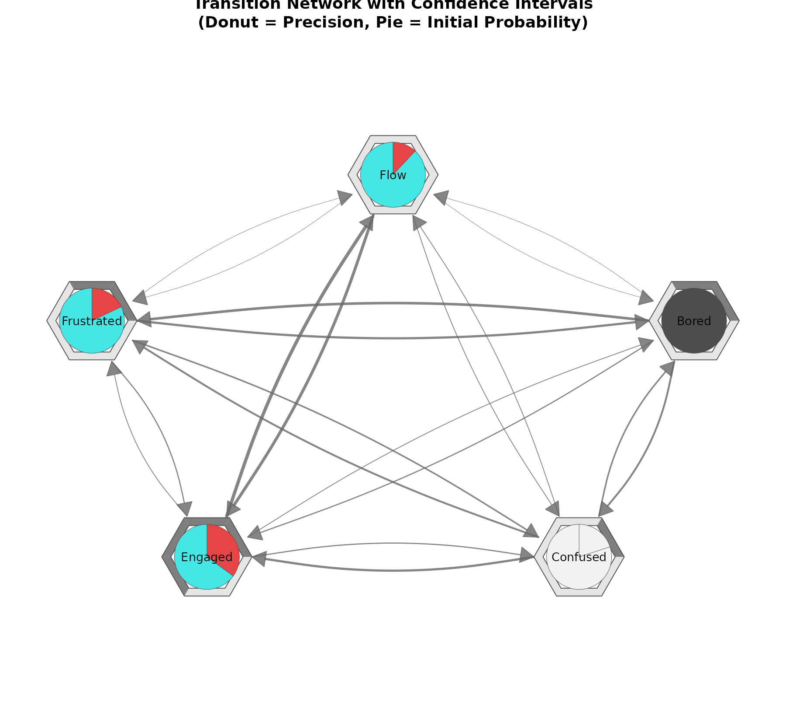

### 5.1 CI Legend Explanation

``` r
par(mfrow = c(1, 3), mar = c(3, 3, 3, 4))

# High precision node
splot(matrix(0, 1, 1),
      layout = matrix(c(0, 0), 1, 2),
      node_size = 12,
      node_shape = "hexagon",
      donut_fill = 0.95,
      donut_color = "gray50",
      pie_values = list(c(0.35, 0.65)),
      pie_colors = c("gray30", "gray95"),
      labels = "",
      mar = rep(2,4),
      title = "High Precision\n(Narrow CI)")

# Medium precision node
splot(matrix(0, 1, 1),
      layout = matrix(c(0, 0), 1, 2),
      node_size = 12,
      node_shape = "hexagon",
      donut_fill = 0.50,
      donut_color = "gray50",
      pie_values = list(c(0.20, 0.80)),
      pie_colors = c("gray30", "gray95"),
      labels = "",
      mar = rep(2,4),
      title = "Medium Precision\n(Moderate CI)")

# Low precision node
splot(matrix(0, 1, 1),
      layout = matrix(c(0, 0), 1, 2),
      node_size = 12,
      node_shape = "hexagon",
      donut_fill = 0.15,
      donut_color = "gray50",
      pie_values = list(c(0.12, 0.88)),
      pie_colors = c("gray30", "gray95"),
      labels = "",
      mar = rep(2,4),
      title = "Low Precision\n(Wide CI)")
```

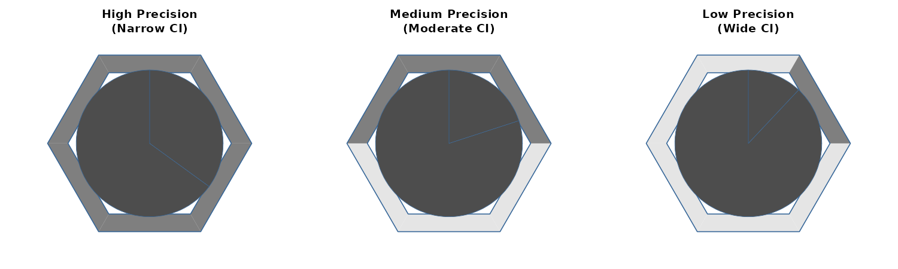
