# Function Reference

## Quick Start

``` r
# Create example networks
set.seed(42)

# From adjacency matrix
adj_matrix <- matrix(
  c(0, 0.8, 0.5, 0.2, 0,
    0.8, 0, 0.6, 0, 0.3,
    0.5, 0.6, 0, 0.7, 0.4,
    0.2, 0, 0.7, 0, 0.9,
    0, 0.3, 0.4, 0.9, 0),
  nrow = 5, byrow = TRUE,
  dimnames = list(LETTERS[1:5], LETTERS[1:5])
)

# Plot from adjacency matrix
splot(adj_matrix, title = "From Matrix")
```

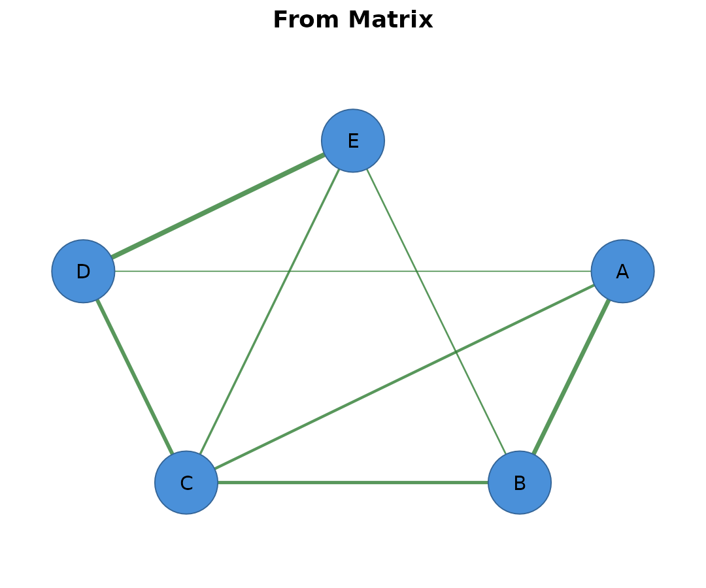

``` r
# With customization
splot(adj_matrix,
      layout = "spring",
      node_fill = "steelblue",
      edge_color = "gray50",
      title = "Customized Network")
```

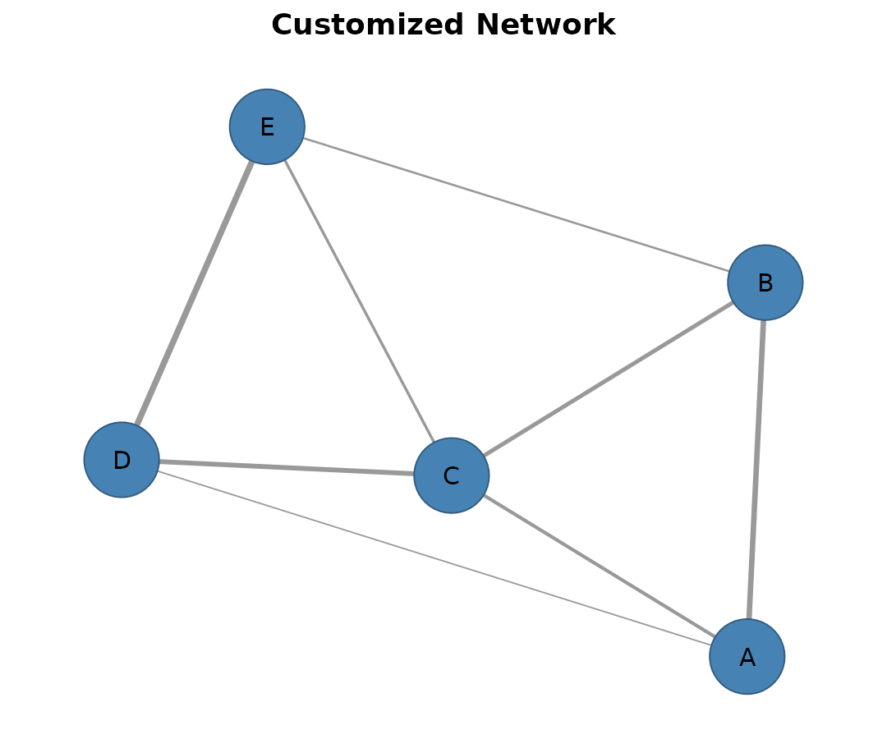

``` r
g <- igraph::graph_from_adjacency_matrix(adj_matrix, mode = "undirected", weighted = TRUE)
splot(g, title = "From igraph")
```


``` r
# From TNA model (requires tna package)
library(tna)

# Build TNA model
tna_model <- tna(group_regulation)

# Plot directly from TNA model
splot(tna_model, title = "From TNA Model")
```


------------------------------------------------------------------------

## Plotting Functions

### Network Plots

The core plotting functions for network visualization.

| Function                                                     | Description                                  |
|--------------------------------------------------------------|----------------------------------------------|
| [`splot()`](http://sonsoles.me/cograph/reference/splot.md)   | Main plotting function using base R graphics |
| [`soplot()`](http://sonsoles.me/cograph/reference/soplot.md) | Grid/ggplot2-style network plotting          |

``` r
# Create a sample network
net <- as_cograph(adj_matrix)

# Basic splot
splot(net, title = "Basic splot()")
```

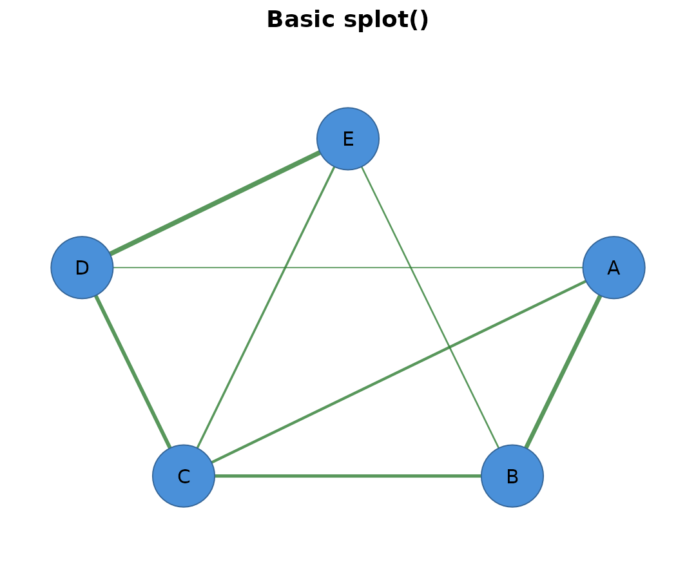

``` r

# With layout and styling
splot(net, layout = "circle", node_fill = "coral", title = "Circle Layout")
```

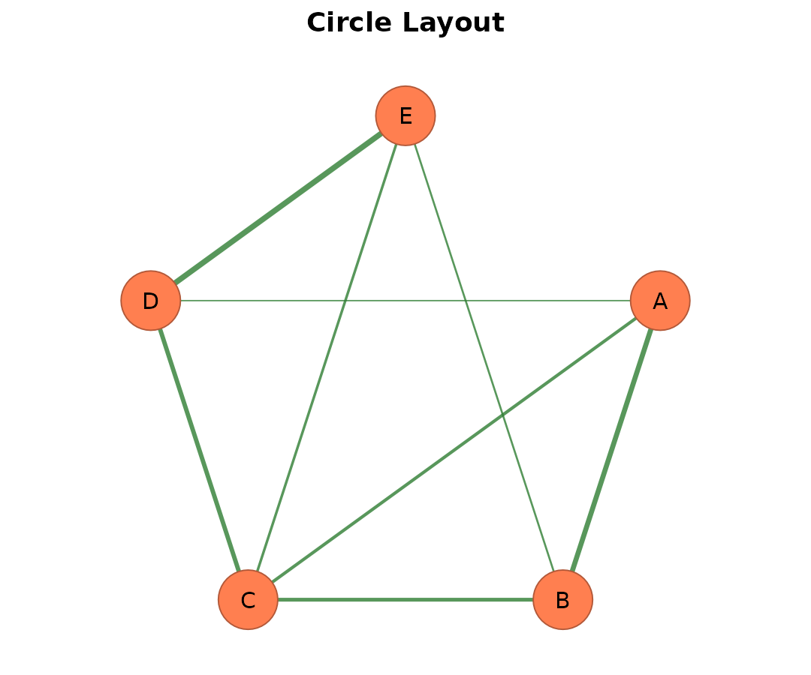

### Specialized Network Plots

For multi-group, bipartite, and multilevel network structures.

| Function                                                           | Description                                            |
|--------------------------------------------------------------------|--------------------------------------------------------|
| [`plot_htna()`](http://sonsoles.me/cograph/reference/plot_htna.md) | Heterogeneous/bipartite networks (two distinct groups) |
| [`plot_mtna()`](http://sonsoles.me/cograph/reference/plot_mtna.md) | Multi-cluster networks (3+ groups)                     |
| [`plot_mlna()`](http://sonsoles.me/cograph/reference/plot_mlna.md) | Multilevel 3D perspective view                         |
| [`plot_mcml()`](http://sonsoles.me/cograph/reference/plot_mcml.md) | Multi-cluster multilevel (combines mtna + mlna)        |

``` r
# Create a larger network for demonstration
set.seed(123)
large_adj <- matrix(runif(100), 10, 10)
diag(large_adj) <- 0
large_adj <- (large_adj + t(large_adj)) / 2
rownames(large_adj) <- colnames(large_adj) <- paste0("N", 1:10)

# Heterogeneous network (two groups)
plot_htna(large_adj, groups = list(
  GroupA = paste0("N", 1:5),
  GroupB = paste0("N", 6:10)
))

# Multi-cluster network
plot_mtna(large_adj, clusters = list(
  Cluster1 = paste0("N", 1:3),
  Cluster2 = paste0("N", 4:6),
  Cluster3 = paste0("N", 7:10)
))
```

### Comparison & Heatmaps

Visualize network differences and weight matrices.

| Function                                                                 | Description                                      |
|--------------------------------------------------------------------------|--------------------------------------------------|
| [`plot_compare()`](http://sonsoles.me/cograph/reference/plot_compare.md) | Difference network (x - y) with pos/neg coloring |
| [`plot_heatmap()`](http://sonsoles.me/cograph/reference/plot_heatmap.md) | Weight matrix heatmap                            |

``` r
# Create two networks for comparison
set.seed(42)
net1 <- matrix(runif(25), 5, 5)
diag(net1) <- 0
net1 <- (net1 + t(net1)) / 2
rownames(net1) <- colnames(net1) <- LETTERS[1:5]

net2 <- matrix(runif(25), 5, 5)
diag(net2) <- 0
net2 <- (net2 + t(net2)) / 2
rownames(net2) <- colnames(net2) <- LETTERS[1:5]

# Network comparison (use cograph:: to avoid tna namespace conflict)
# Green edges: net1 > net2 (positive difference)
# Red edges: net1 < net2 (negative difference)
cograph::plot_compare(net1, net2, title = "Network Comparison (net1 - net2)")
```

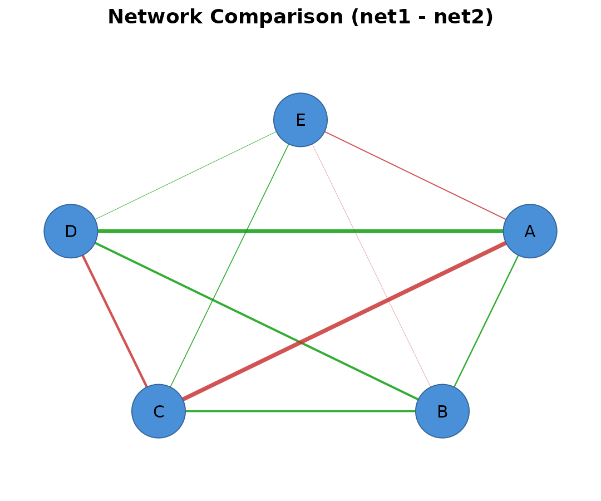

``` r

# Basic heatmap
plot_heatmap(net1, title = "Network Heatmap")
```

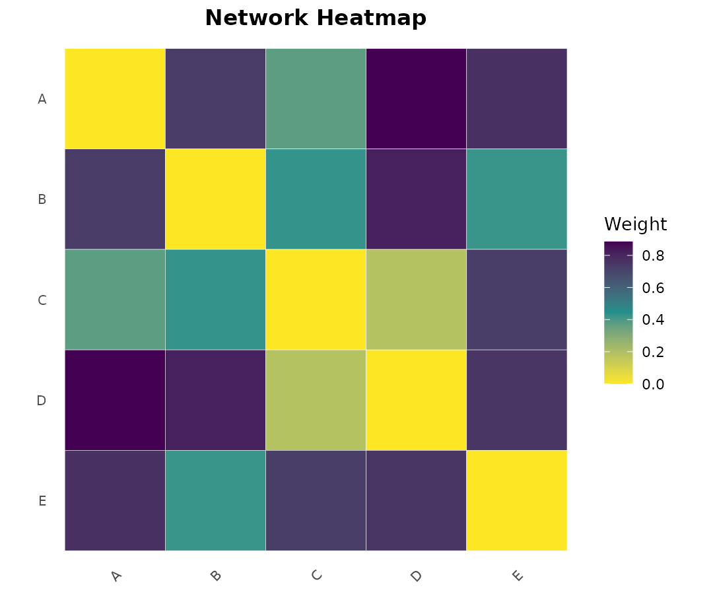

------------------------------------------------------------------------

## Network Creation & Conversion

### Import

| Function                                                                                                                                    | Description                           |
|---------------------------------------------------------------------------------------------------------------------------------------------|---------------------------------------|
| [`as_cograph()`](http://sonsoles.me/cograph/reference/as_cograph.md) / [`to_cograph()`](http://sonsoles.me/cograph/reference/as_cograph.md) | Convert any format to cograph_network |
| [`cograph()`](http://sonsoles.me/cograph/reference/cograph.md)                                                                              | Create a cograph_network object       |

Supported input formats: - Adjacency matrices - Edge lists (data.frame
with from/to columns) - igraph objects - TNA models (tna, group_tna)

``` r
# From matrix
mat <- matrix(c(0, 1, 0, 1, 0, 1, 0, 1, 0), 3, 3,
              dimnames = list(c("X", "Y", "Z"), c("X", "Y", "Z")))
net_from_mat <- as_cograph(mat)
print(net_from_mat)
#> Cograph network: 3 nodes, 2 edges ( undirected )
#> Source: matrix 
#>   Nodes (3): X, Y, Z
#>   Edges: 2 / 3 (density: 66.7%)
#>   Weights: [1.000, 1.000]  |  mean: 1.000
#>   Strongest edges:
#>     X -- Y  1.000
#>     Y -- Z  1.000
#> Layout: none

# From edge list
edges <- data.frame(
  from = c("A", "A", "B", "C"),
  to = c("B", "C", "C", "D"),
  weight = c(0.5, 0.8, 0.3, 0.9)
)
net_from_edges <- as_cograph(edges)
splot(net_from_edges, title = "From Edge List")
```

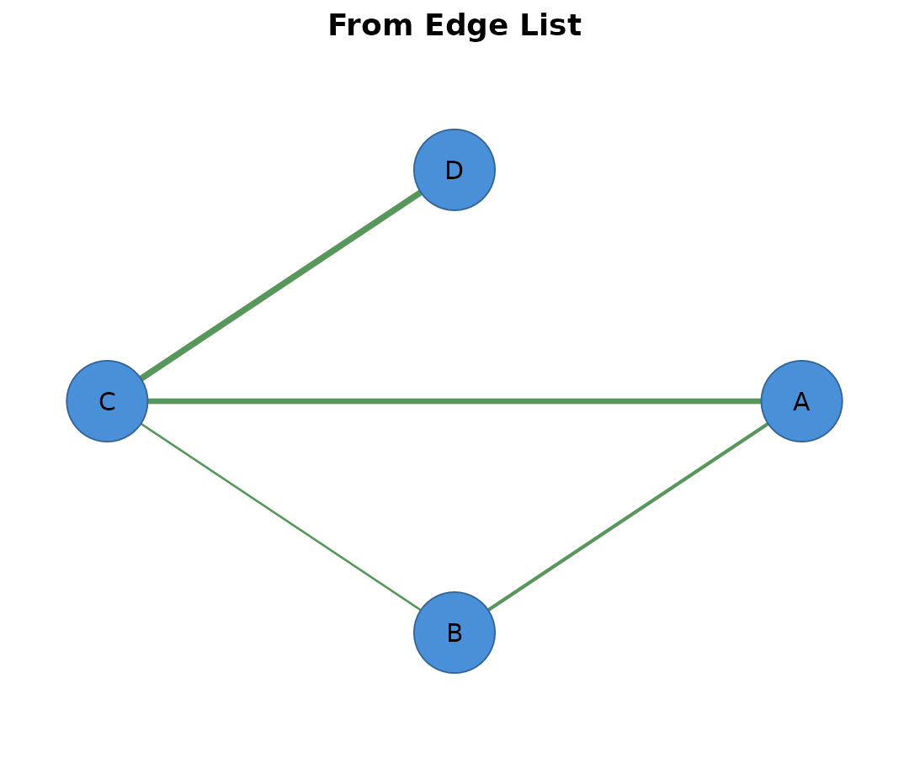

``` r
# From igraph
g <- igraph::make_ring(5)
igraph::V(g)$name <- LETTERS[1:5]
net_from_igraph <- as_cograph(g)
splot(net_from_igraph, title = "From igraph Ring")
```

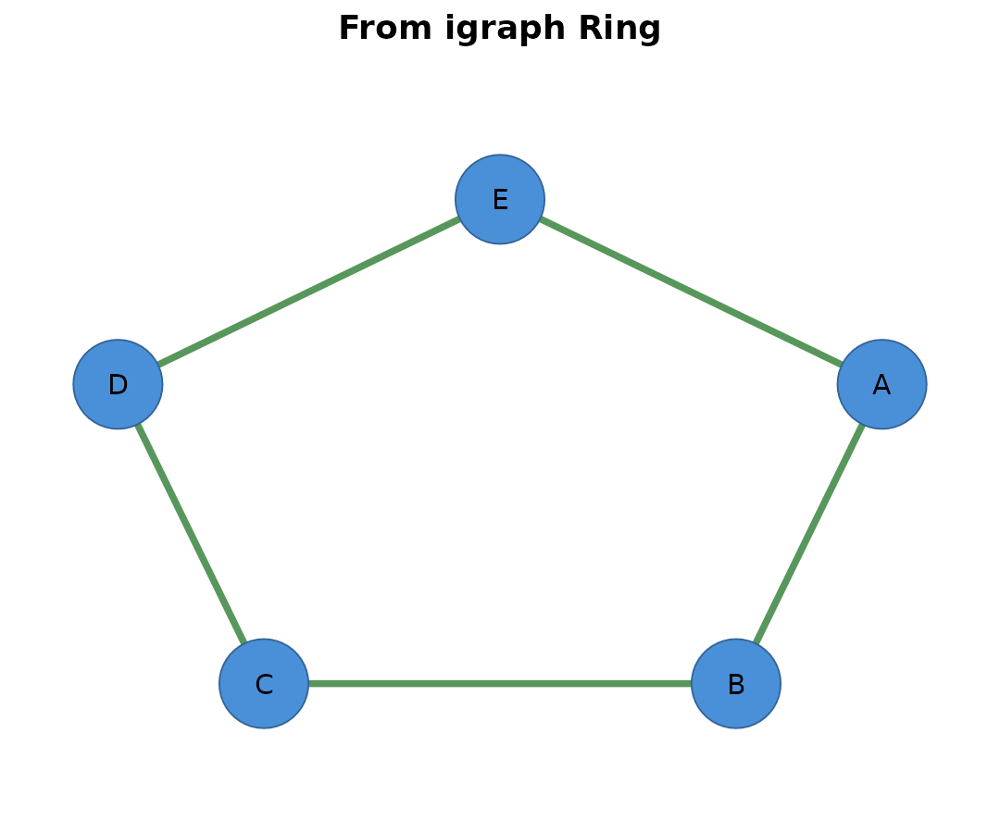

### Export

| Function                                                                                                                                        | Output       | Description                |
|-------------------------------------------------------------------------------------------------------------------------------------------------|--------------|----------------------------|
| [`to_igraph()`](http://sonsoles.me/cograph/reference/to_igraph.md)                                                                              | `igraph`     | Export to igraph object    |
| [`to_data_frame()`](http://sonsoles.me/cograph/reference/to_data_frame.md) / [`to_df()`](http://sonsoles.me/cograph/reference/to_data_frame.md) | `data.frame` | Export to edge list        |
| [`to_matrix()`](http://sonsoles.me/cograph/reference/to_matrix.md)                                                                              | `matrix`     | Export to adjacency matrix |

``` r
# Create a network
net <- as_cograph(adj_matrix)

# Convert to igraph for analysis
if (requireNamespace("igraph", quietly = TRUE)) {
  g <- to_igraph(net)
  cat("Betweenness centrality:\n")
  print(round(igraph::betweenness(g), 2))
}
#> Betweenness centrality:
#>   A   B   C   D   E 
#> 1.5 0.0 1.0 0.0 0.0

# Export to edge list
df <- to_df(net)
head(df)
#>   from to weight
#> 1    A  B    0.8
#> 2    A  C    0.5
#> 3    B  C    0.6
#> 4    A  D    0.2
#> 5    C  D    0.7
#> 6    B  E    0.3

# Export to matrix
adj <- to_matrix(net)
print(adj)
#>     A   B   C   D   E
#> A 0.0 0.8 0.5 0.2 0.0
#> B 0.8 0.0 0.6 0.0 0.3
#> C 0.5 0.6 0.0 0.7 0.4
#> D 0.2 0.0 0.7 0.0 0.9
#> E 0.0 0.3 0.4 0.9 0.0
```

------------------------------------------------------------------------

## Network Utilities

### Community Detection

| Function                                                                               | Description                                 |
|----------------------------------------------------------------------------------------|---------------------------------------------|
| [`communities()`](http://sonsoles.me/cograph/reference/communities.md)                 | Detect communities using various algorithms |
| [`community_louvain()`](http://sonsoles.me/cograph/reference/community_louvain.md)     | Louvain algorithm                           |
| [`community_walktrap()`](http://sonsoles.me/cograph/reference/community_walktrap.md)   | Walktrap algorithm                          |
| [`compare_communities()`](http://sonsoles.me/cograph/reference/compare_communities.md) | Compare two community structures            |

``` r
# Use Zachary's karate club example from igraph
g <- igraph::make_graph("Zachary")

# Detect communities with different methods
comm_louvain <- community_louvain(g)
comm_walktrap <- community_walktrap(g)

cat("Louvain communities:", length(unique(igraph::membership(comm_louvain))), "\n")
#> Louvain communities: 4
cat("Walktrap communities:", length(unique(igraph::membership(comm_walktrap))), "\n")
#> Walktrap communities: 5

# Compare community structures
nmi <- compare_communities(comm_louvain, comm_walktrap, "nmi")
cat("NMI between methods:", round(nmi, 3), "\n")
#> NMI between methods: 0.762

# Plot with community coloring
mat <- igraph::as_adjacency_matrix(g, sparse = FALSE)
splot(mat,
      node_fill = igraph::membership(comm_louvain),
      title = "Zachary Karate Club - Louvain Communities")
```

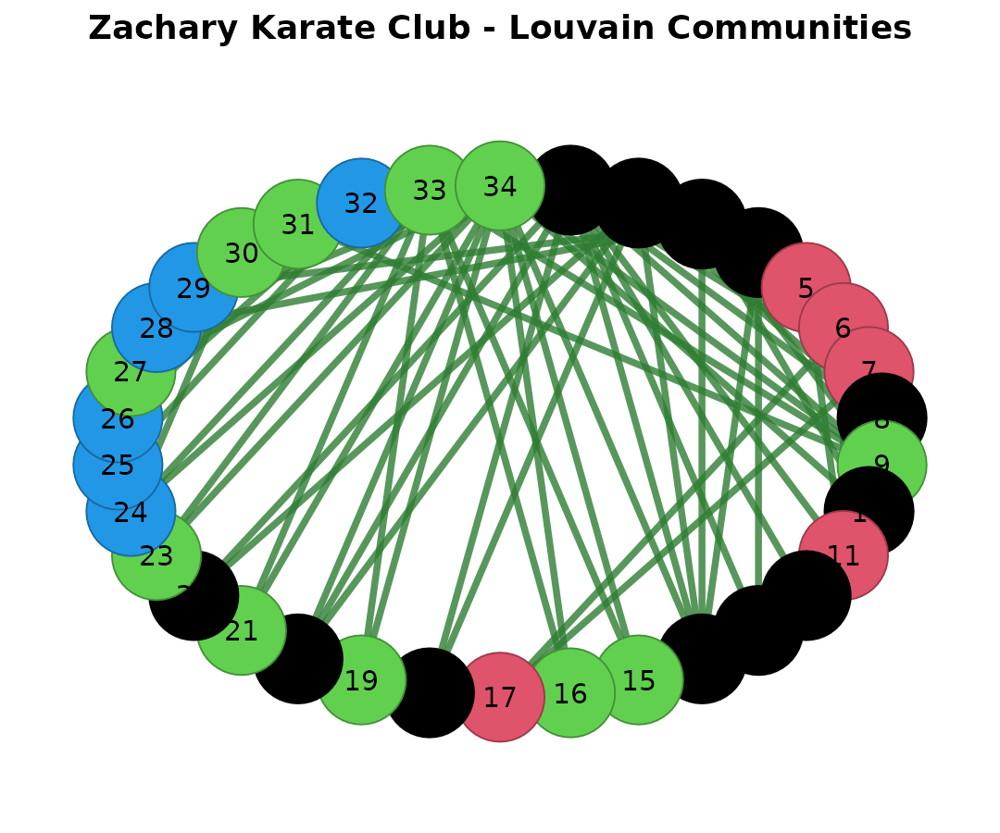

### Edge Filtering

| Function                                                                 | Description                       |
|--------------------------------------------------------------------------|-----------------------------------|
| [`filter_edges()`](http://sonsoles.me/cograph/reference/filter_edges.md) | Filter edges by weight expression |

``` r
# Create weighted network
set.seed(42)
weighted_mat <- matrix(runif(36), 6, 6)
diag(weighted_mat) <- 0
weighted_mat <- (weighted_mat + t(weighted_mat)) / 2
rownames(weighted_mat) <- colnames(weighted_mat) <- LETTERS[1:6]
weighted_net <- as_cograph(weighted_mat)

# Keep only strong edges (weight > 0.5)
strong_net <- filter_edges(weighted_net, weight > 0.5)

# Compare
par(mfrow = c(1, 2))
splot(weighted_net, title = "Original Network")
splot(strong_net, title = "Strong Edges Only (> 0.5)")
```

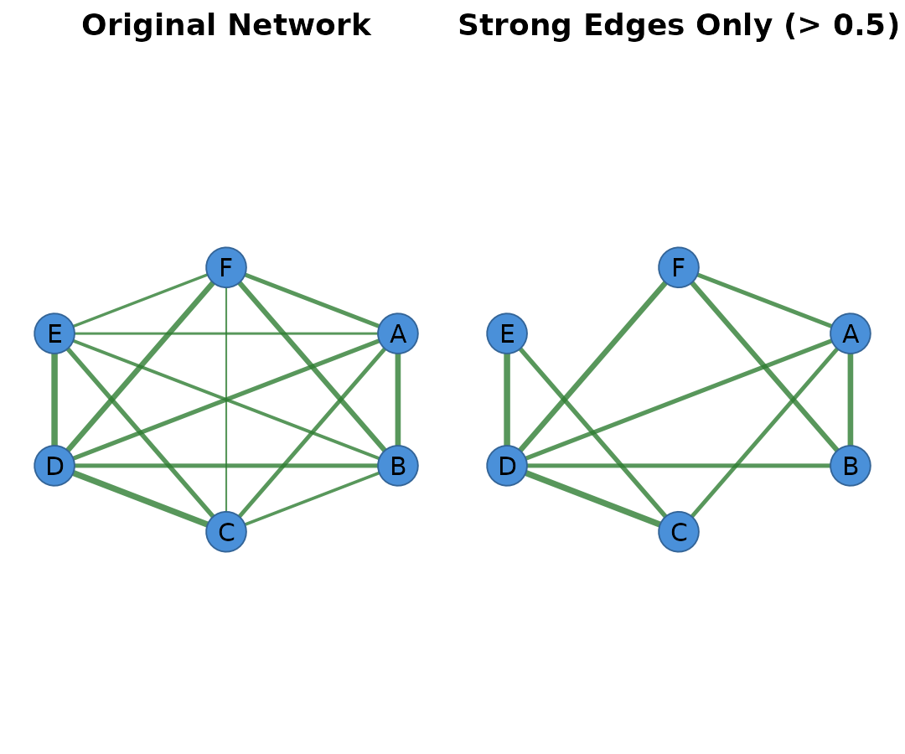

``` r
par(mfrow = c(1, 1))
```

------------------------------------------------------------------------

## Piping Workflow

Transform networks using pipe-friendly functions.

| Function                                                           | Description            |
|--------------------------------------------------------------------|------------------------|
| [`cograph()`](http://sonsoles.me/cograph/reference/cograph.md)     | Create network object  |
| [`sn_layout()`](http://sonsoles.me/cograph/reference/sn_layout.md) | Apply layout algorithm |
| [`sn_theme()`](http://sonsoles.me/cograph/reference/sn_theme.md)   | Apply visual theme     |
| [`sn_nodes()`](http://sonsoles.me/cograph/reference/sn_nodes.md)   | Set node aesthetics    |
| [`sn_edges()`](http://sonsoles.me/cograph/reference/sn_edges.md)   | Set edge aesthetics    |
| [`sn_render()`](http://sonsoles.me/cograph/reference/soplot.md)    | Render to plot         |

``` r
# Pipe-based workflow
cograph(adj_matrix) |>
  sn_layout("spring", seed = 42) |>
  sn_nodes(fill = "steelblue", size = 0.1) |>
  sn_edges(color = "gray40") |>
  sn_render(title = "Piped Network")
```

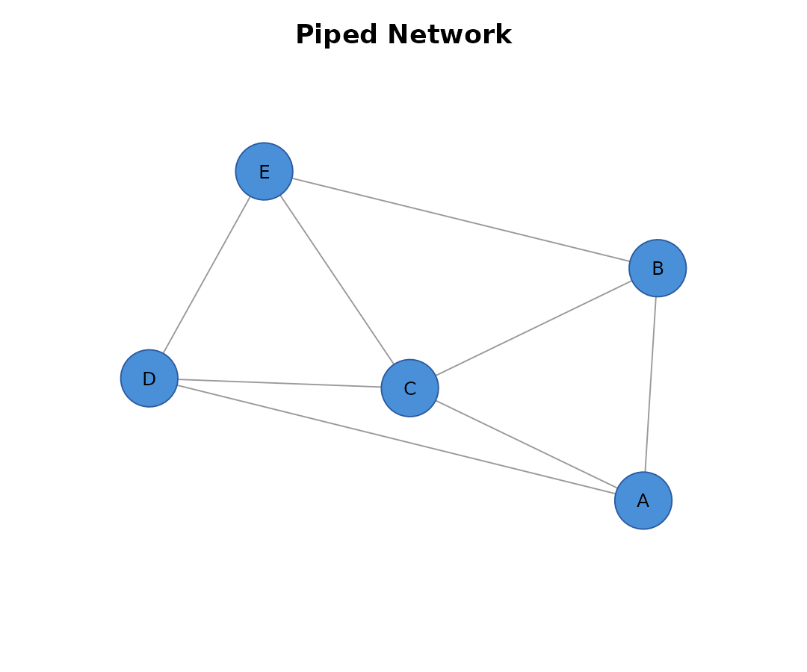

------------------------------------------------------------------------

## TNA Integration

Functions for working with Transition Network Analysis models from the
`tna` package.

| Function                                                                     | Description                                           |
|------------------------------------------------------------------------------|-------------------------------------------------------|
| [`as_cograph()`](http://sonsoles.me/cograph/reference/as_cograph.md)         | Convert TNA model to cograph (use with tna/group_tna) |
| [`is_tna_network()`](http://sonsoles.me/cograph/reference/is_tna_network.md) | Check if network is from TNA                          |
| `get_tna_model()`                                                            | Retrieve original TNA model                           |
| [`plot_tna()`](http://sonsoles.me/cograph/reference/plot_tna.md)             | Plot TNA model directly                               |

``` r
# TNA integration requires the tna package
library(tna)

# Create a TNA model from sequence data
# Example: Student learning state transitions
sequences <- data.frame(
  id = rep(1:10, each = 20),
  time = rep(1:20, 10),

  state = sample(c("Explore", "Engage", "Reflect", "Apply"), 200, replace = TRUE)
)
model <- tna(sequences, id_var = "id", time_var = "time", state_var = "state")

# Convert TNA model to cograph
net <- as_cograph(model)

# Check if it's a TNA network
is_tna_network(net)
#> [1] TRUE

# Retrieve original model
original <- get_tna_model(net)
original$weights
original$inits

# Plot TNA model directly
plot_tna(model)

# Or plot the converted network
splot(net, title = "Learning State Transitions")
```

### TNA with Group Comparisons

``` r
# Group TNA for comparing different populations
group_model <- group_tna(
  sequences,
  id_var = "id",
  time_var = "time",
  state_var = "state",
  group_var = "condition"
)

# Convert group TNA
net_group <- as_cograph(group_model)

# Plot comparison
plot_compare(
  group_model$groups$Control,
  group_model$groups$Treatment,
  title = "Control vs Treatment Transitions"
)
```

------------------------------------------------------------------------

## Multilayer Networks

### Supra-Adjacency

| Function                                                                                                                                              | Description                  |
|-------------------------------------------------------------------------------------------------------------------------------------------------------|------------------------------|
| [`supra_adjacency()`](http://sonsoles.me/cograph/reference/supra_adjacency.md) / [`supra()`](http://sonsoles.me/cograph/reference/supra_adjacency.md) | Build supra-adjacency matrix |
| [`supra_layer()`](http://sonsoles.me/cograph/reference/supra_layer.md)                                                                                | Extract single layer         |

``` r
# Create two layers
layer1 <- matrix(c(0, 1, 1, 1, 0, 0, 1, 0, 0), 3, 3,
                 dimnames = list(c("A", "B", "C"), c("A", "B", "C")))
layer2 <- matrix(c(0, 0, 1, 0, 0, 1, 1, 1, 0), 3, 3,
                 dimnames = list(c("A", "B", "C"), c("A", "B", "C")))

layers <- list(Social = layer1, Work = layer2)

# Build supra-adjacency matrix
supra <- supra_adjacency(layers, interlayer = 0.3)
cat("Supra-adjacency dimensions:", dim(supra), "\n")
#> Supra-adjacency dimensions: 6 6

# Extract layer 1 (Social)
social_layer <- supra_layer(supra, 1)
print(social_layer)
#>   A B C
#> A 0 1 1
#> B 1 0 0
#> C 1 0 0
```

### Aggregation & Comparison

| Function                                                                                                                                                | Description                   |
|---------------------------------------------------------------------------------------------------------------------------------------------------------|-------------------------------|
| [`aggregate_layers()`](http://sonsoles.me/cograph/reference/aggregate_layers.md) / [`lagg()`](http://sonsoles.me/cograph/reference/aggregate_layers.md) | Aggregate across layers       |
| [`layer_similarity()`](http://sonsoles.me/cograph/reference/layer_similarity.md) / [`lsim()`](http://sonsoles.me/cograph/reference/layer_similarity.md) | Similarity between two layers |

``` r
# Aggregate layers
agg_mean <- aggregate_layers(layers, method = "mean")
agg_sum <- aggregate_layers(layers, method = "sum")

cat("Mean aggregation:\n")
#> Mean aggregation:
print(agg_mean)
#>     A   B   C
#> A 0.0 0.5 1.0
#> B 0.5 0.0 0.5
#> C 1.0 0.5 0.0

# Layer similarity
sim <- layer_similarity(layer1, layer2, method = "cosine")
cat("\nCosine similarity between layers:", round(sim, 3), "\n")
#> 
#> Cosine similarity between layers: 0.5
```

------------------------------------------------------------------------

## Customization Reference

### Themes

Use themes with `splot(net, theme = "dark")` or via piping with
[`sn_theme()`](http://sonsoles.me/cograph/reference/sn_theme.md).

| Theme     | Description                            |
|-----------|----------------------------------------|
| `classic` | White background, blue nodes (default) |
| `dark`    | Dark background, light elements        |
| `minimal` | Subtle, minimal styling                |

``` r
# Compare themes
par(mfrow = c(1, 3))
splot(adj_matrix, theme = "classic", title = "Classic")
splot(adj_matrix, theme = "dark", title = "Dark")
splot(adj_matrix, theme = "minimal", title = "Minimal")
```

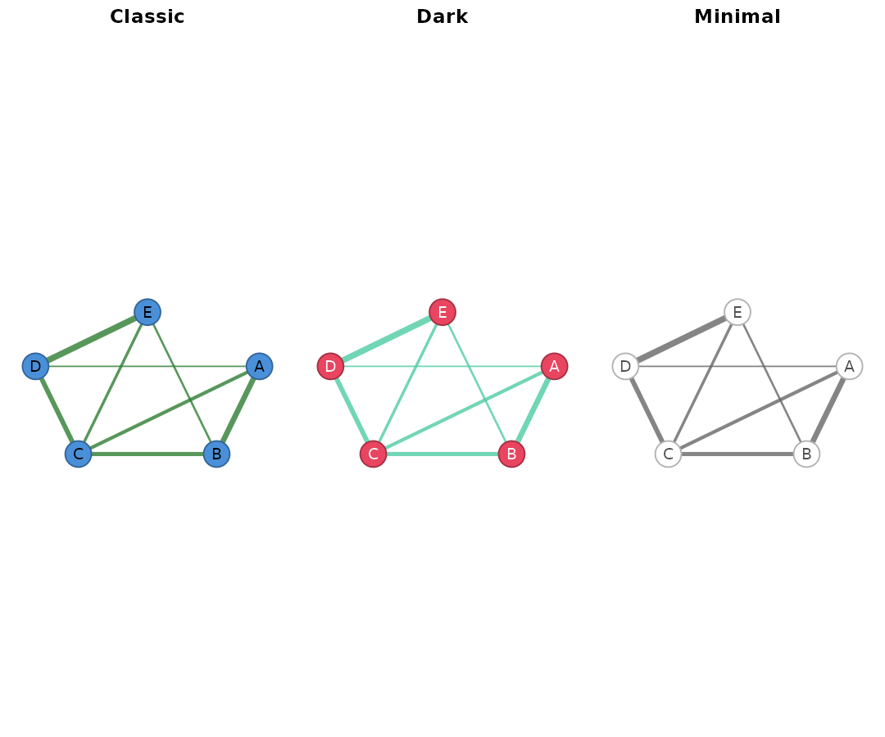

``` r
par(mfrow = c(1, 1))
```

### Shapes

Built-in shapes: `circle`, `square`, `triangle`, `diamond`, `pentagon`,
`hexagon`, `star`

``` r
# Different node shapes
par(mfrow = c(1, 3))
splot(adj_matrix, node_shape = "circle", title = "Circle")
splot(adj_matrix, node_shape = "square", title = "Square")
splot(adj_matrix, node_shape = "diamond", title = "Diamond")
```

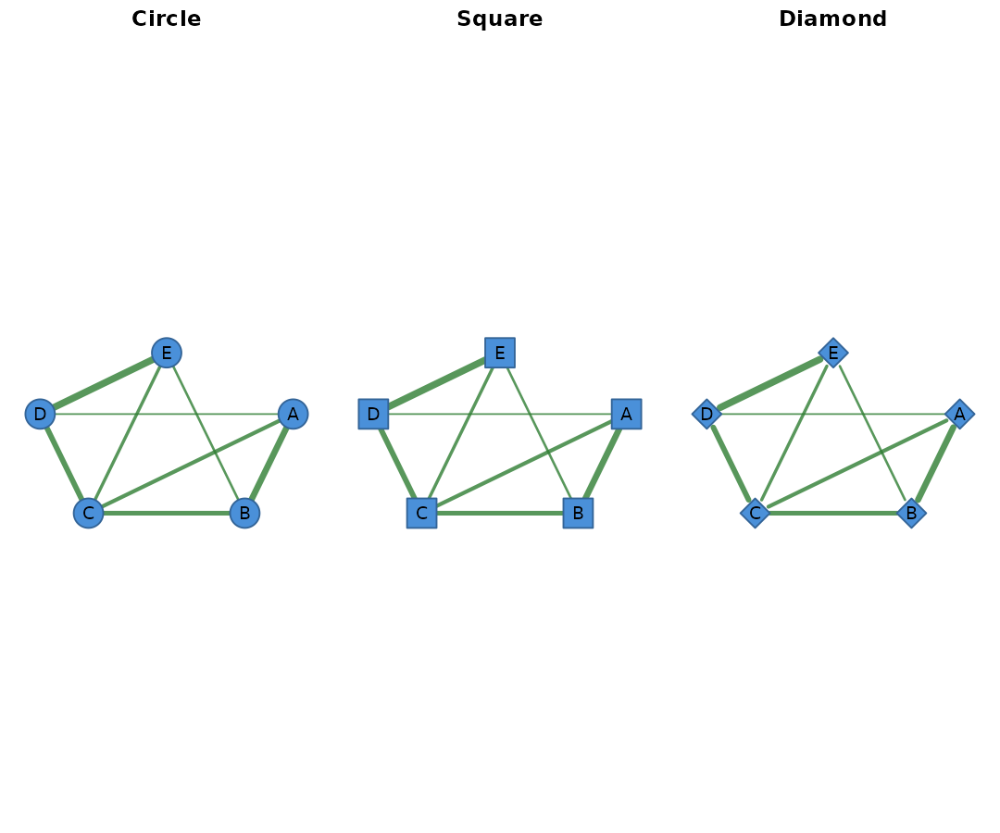

``` r
par(mfrow = c(1, 1))
```

------------------------------------------------------------------------

## Quick Reference

| Category              | Key Functions                                                                                                                                                                                                                                                                                                                             |
|-----------------------|-------------------------------------------------------------------------------------------------------------------------------------------------------------------------------------------------------------------------------------------------------------------------------------------------------------------------------------------|
| **Plotting**          | [`splot()`](http://sonsoles.me/cograph/reference/splot.md), [`soplot()`](http://sonsoles.me/cograph/reference/soplot.md), [`plot_tna()`](http://sonsoles.me/cograph/reference/plot_tna.md)                                                                                                                                                |
| **Specialized Plots** | [`plot_htna()`](http://sonsoles.me/cograph/reference/plot_htna.md), [`plot_mtna()`](http://sonsoles.me/cograph/reference/plot_mtna.md), [`plot_mlna()`](http://sonsoles.me/cograph/reference/plot_mlna.md), [`plot_mcml()`](http://sonsoles.me/cograph/reference/plot_mcml.md)                                                            |
| **Comparison**        | [`plot_compare()`](http://sonsoles.me/cograph/reference/plot_compare.md), [`plot_heatmap()`](http://sonsoles.me/cograph/reference/plot_heatmap.md)                                                                                                                                                                                        |
| **Import**            | [`as_cograph()`](http://sonsoles.me/cograph/reference/as_cograph.md), [`to_cograph()`](http://sonsoles.me/cograph/reference/as_cograph.md), [`cograph()`](http://sonsoles.me/cograph/reference/cograph.md)                                                                                                                                |
| **Export**            | [`to_igraph()`](http://sonsoles.me/cograph/reference/to_igraph.md), [`to_df()`](http://sonsoles.me/cograph/reference/to_data_frame.md), [`to_matrix()`](http://sonsoles.me/cograph/reference/to_matrix.md)                                                                                                                                |
| **Communities**       | [`communities()`](http://sonsoles.me/cograph/reference/communities.md), [`community_louvain()`](http://sonsoles.me/cograph/reference/community_louvain.md), [`compare_communities()`](http://sonsoles.me/cograph/reference/compare_communities.md)                                                                                        |
| **Utilities**         | [`filter_edges()`](http://sonsoles.me/cograph/reference/filter_edges.md), [`n_nodes()`](http://sonsoles.me/cograph/reference/n_nodes.md), [`n_edges()`](http://sonsoles.me/cograph/reference/n_edges.md)                                                                                                                                  |
| **Piping**            | [`sn_layout()`](http://sonsoles.me/cograph/reference/sn_layout.md), [`sn_theme()`](http://sonsoles.me/cograph/reference/sn_theme.md), [`sn_nodes()`](http://sonsoles.me/cograph/reference/sn_nodes.md), [`sn_edges()`](http://sonsoles.me/cograph/reference/sn_edges.md), [`sn_render()`](http://sonsoles.me/cograph/reference/soplot.md) |
| **TNA**               | [`plot_tna()`](http://sonsoles.me/cograph/reference/plot_tna.md), [`is_tna_network()`](http://sonsoles.me/cograph/reference/is_tna_network.md), `get_tna_model()`                                                                                                                                                                         |
| **Multilayer**        | [`supra_adjacency()`](http://sonsoles.me/cograph/reference/supra_adjacency.md), [`aggregate_layers()`](http://sonsoles.me/cograph/reference/aggregate_layers.md), [`layer_similarity()`](http://sonsoles.me/cograph/reference/layer_similarity.md)                                                                                        |
