# Input Formats

## Overview

cograph accepts network data in all common formats used in R. Pass any
supported object directly to
[`splot()`](http://sonsoles.me/cograph/reference/splot.md) and it will
be automatically parsed.

## Supported Formats

### 1. Adjacency/Weight Matrices

A square numeric matrix where `M[i,j]` represents the edge weight from
node `i` to node `j`.

**Sources:**

- [`cor()`](https://rdrr.io/r/stats/cor.html),
  [`cov()`](https://rdrr.io/r/stats/cor.html) — correlation and
  covariance matrices
- [`qgraph::getWmat()`](https://rdrr.io/pkg/qgraph/man/getWmat.html) —
  extract weights from qgraph objects
- `bootnet::estimateNetwork()` — network estimation output
- `psychonetrics` — structural equation modeling networks
- `markovchain` — transition probability matrices
- `as.matrix(dist())` — distance/dissimilarity matrices

**Auto-detection:**

- Symmetric matrices are treated as undirected (upper triangle only)
- Asymmetric matrices are treated as directed (all entries)
- Node labels extracted from
  [`rownames()`](https://rdrr.io/r/base/colnames.html)/[`colnames()`](https://rdrr.io/r/base/colnames.html)

**Usage:**

``` r
# Create a weighted adjacency matrix
adj_matrix <- matrix(
  c(0, 0.8, 0.5, 0.2,
    0.8, 0, 0.6, 0,
    0.5, 0.6, 0, 0.7,
    0.2, 0, 0.7, 0),
  nrow = 4, byrow = TRUE,
  dimnames = list(c("A", "B", "C", "D"), c("A", "B", "C", "D"))
)

# Plot directly from matrix
splot(adj_matrix, title = "From Adjacency Matrix")
```

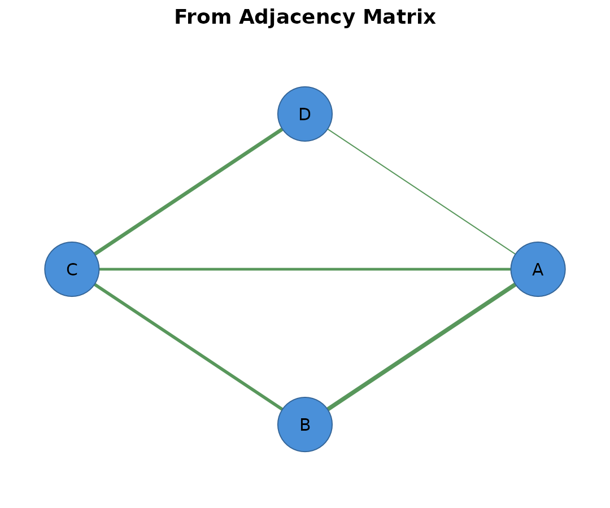

``` r

# Create a directed (asymmetric) matrix
directed_matrix <- matrix(
  c(0, 0.9, 0, 0,
    0.2, 0, 0.7, 0,
    0.5, 0, 0, 0.8,
    0, 0.3, 0.4, 0),
  nrow = 4, byrow = TRUE,
  dimnames = list(c("A", "B", "C", "D"), c("A", "B", "C", "D"))
)

# Directed networks detected automatically
splot(directed_matrix, title = "Directed Network (auto-detected)")
```

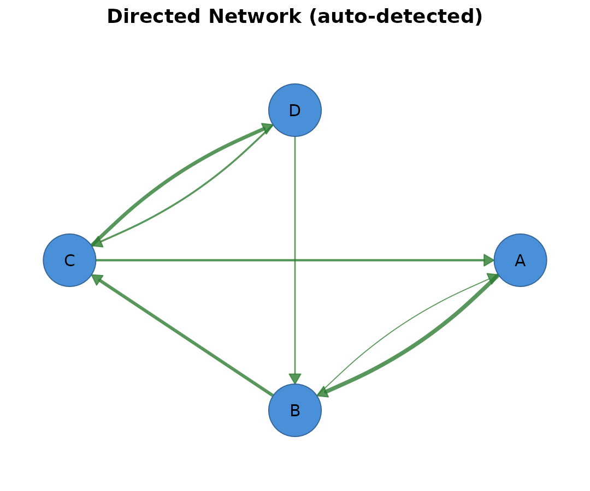

### 2. Edge List Data Frames

A data frame where each row is an edge with source, target, and optional
weight columns.

**Sources:**

- Database exports (SQL joins on relationship tables)
- CSV files from SNAP, Pajek, KONECT repositories
- `igraph::as_data_frame(g, what = "edges")`
- API responses from social platforms
- Parsed log files

**Column detection (case-insensitive):**

| Purpose | Recognized names                            |
|---------|---------------------------------------------|
| Source  | `from`, `source`, `src`, `v1`, `node1`, `i` |
| Target  | `to`, `target`, `tgt`, `v2`, `node2`, `j`   |
| Weight  | `weight`, `w`, `value`, `strength`          |

Falls back to columns 1 and 2 if no match.

**Usage:**

``` r
# Create an edge list data frame
edges <- data.frame(
  from = c("Alice", "Alice", "Bob", "Bob", "Carol", "Dave"),
  to = c("Bob", "Carol", "Carol", "Dave", "Dave", "Alice"),
  weight = c(0.9, 0.5, 0.7, 0.3, 0.8, 0.4)
)

print(edges)
#>    from    to weight
#> 1 Alice   Bob    0.9
#> 2 Alice Carol    0.5
#> 3   Bob Carol    0.7
#> 4   Bob  Dave    0.3
#> 5 Carol  Dave    0.8
#> 6  Dave Alice    0.4

# Plot from edge list
splot(edges, title = "From Edge List")
```

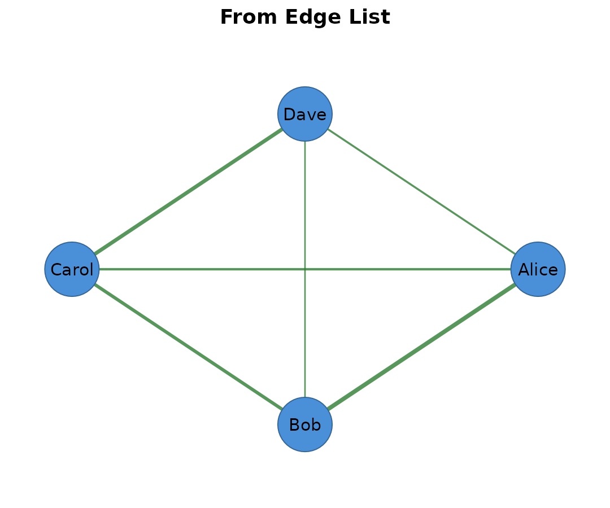

``` r

# Alternative column names work too
edges_alt <- data.frame(
  source = c("X", "X", "Y", "Z"),
  target = c("Y", "Z", "Z", "X"),
  value = c(1, 0.5, 0.8, 0.3)
)
splot(edges_alt, title = "Alternative Column Names")
```

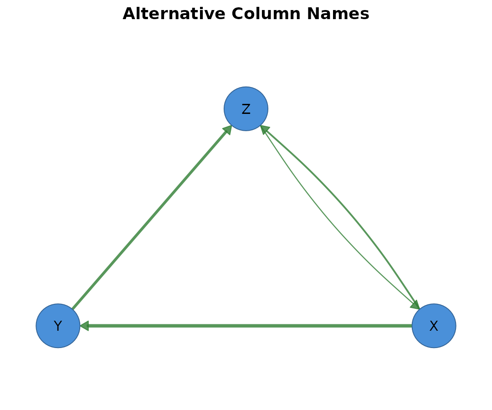

### 3. igraph Objects

Objects of class `igraph` from the igraph package.

**Sources:**

- `graph_from_data_frame()`, `graph_from_adjacency_matrix()`
- `make_graph("Zachary")`, `make_ring()`, `sample_pa()`, etc.
- `read_graph()` — import from GraphML, GML, Pajek, edge lists
- `intergraph::asIgraph()` — convert from network objects

**Preserved:**

- Vertex attributes: `V(g)$name`, `V(g)$color`, etc.
- Edge attributes: `E(g)$weight`, `E(g)$type`, etc.
- Directedness from `is_directed(g)`

**Usage:**

``` r
# Create igraph objects
g_ring <- igraph::make_ring(6)
igraph::V(g_ring)$name <- LETTERS[1:6]

splot(g_ring, title = "igraph Ring Graph")
```

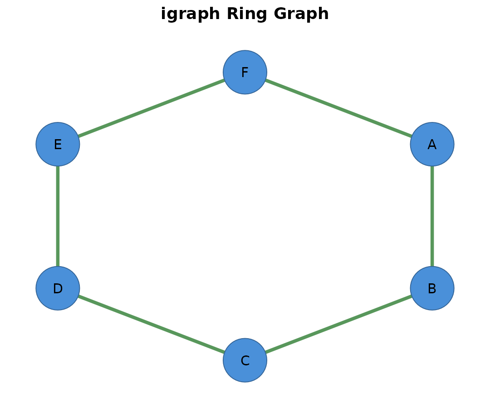

``` r

# Famous graph with vertex names
g_zachary <- igraph::make_graph("Zachary")
splot(g_zachary, title = "Zachary Karate Club")
```

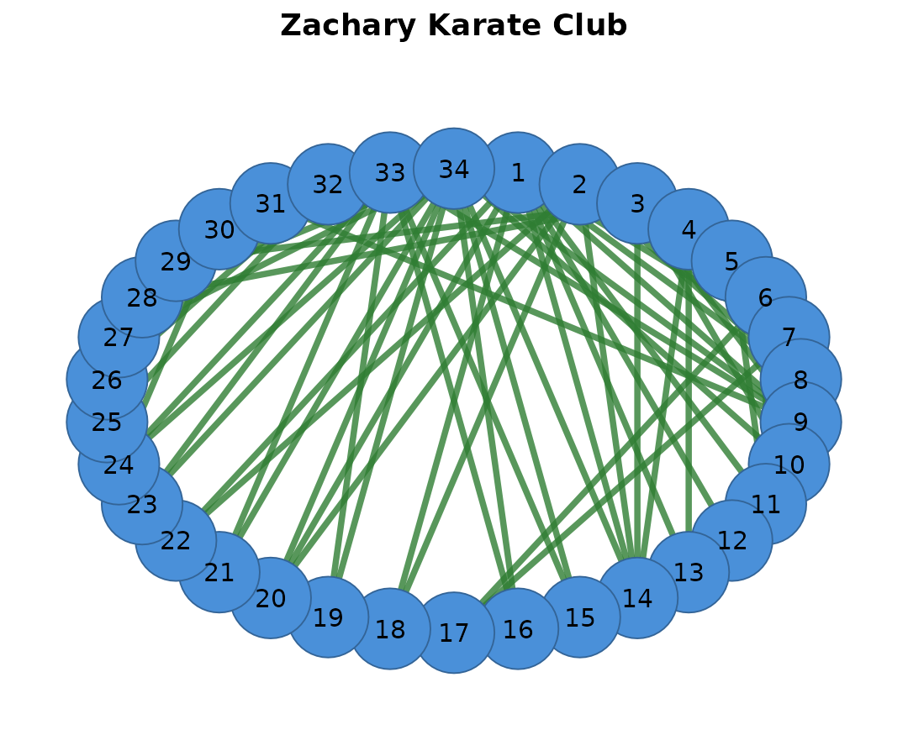

``` r

# Weighted graph
g_weighted <- igraph::graph_from_adjacency_matrix(
  adj_matrix,
  mode = "undirected",
  weighted = TRUE
)
splot(g_weighted, title = "Weighted igraph")
```

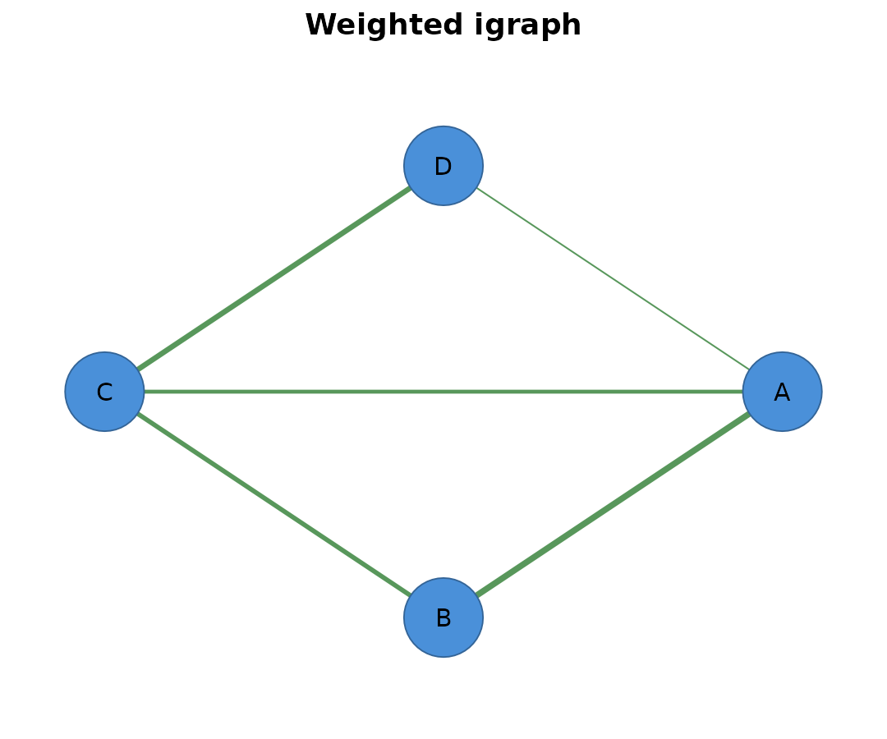

### 4. network Objects (statnet)

Objects of class `network` from the network/statnet ecosystem.

**Sources:**

- [`network::network()`](https://rdrr.io/pkg/network/man/network.html) —
  create from matrix or edge list
- `ergm` package — exponential random graph models
- `sna` package — social network analysis
- `intergraph::asNetwork()` — convert from igraph
- Import from Pajek, UCINET formats

**Preserved:**

- Vertex attributes via `%v%` operator
- Edge attributes via `%e%` operator
- Directedness from `is.directed()`

**Usage:**

``` r
# Create a network object
net_obj <- network::network(adj_matrix, directed = FALSE)

splot(net_obj, title = "From statnet network")
```

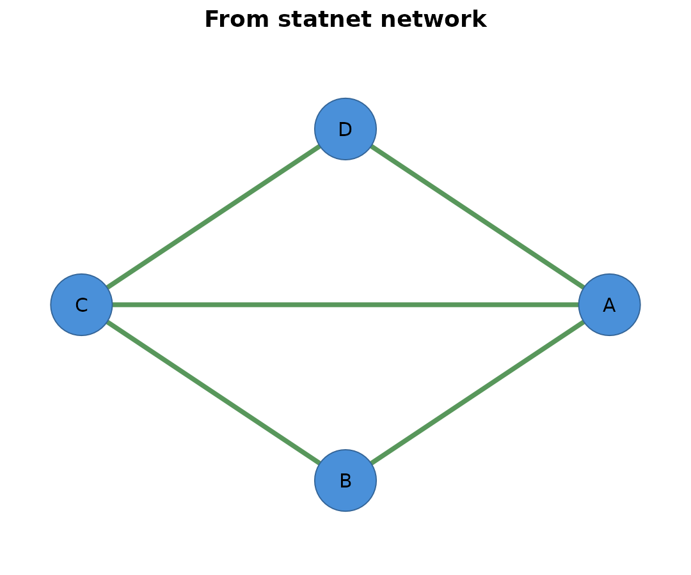

### 5. qgraph Objects

Objects created by the qgraph package.

**Sources:**

- `qgraph::qgraph(..., DoNotPlot = TRUE)`
- `bootnet::estimateNetwork()` results
- `psychonetrics` model outputs

**Preserved:**

- Layout coordinates from `q$layout`
- Edge weights from `q$Edgelist`
- Node labels from `q$graphAttributes$Nodes`

**Usage:**

``` r
# Create a qgraph object (without plotting)
q <- qgraph::qgraph(adj_matrix, DoNotPlot = TRUE)

# Plot with cograph (preserves layout)
splot(q, title = "From qgraph Object")
```

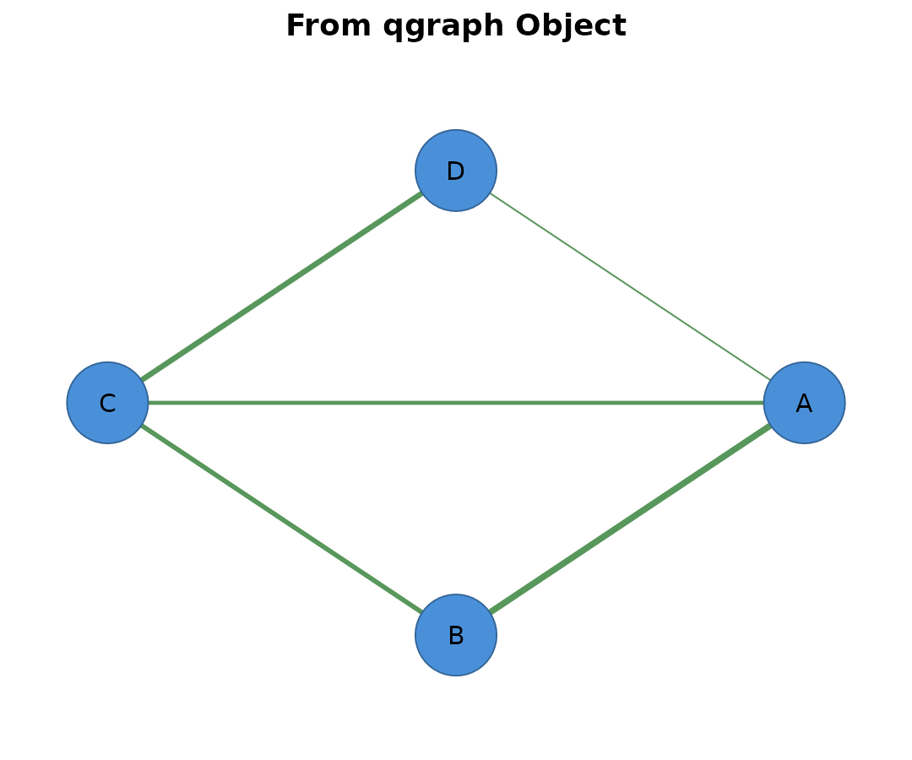

### 6. TNA Objects

Objects of class `tna` from the tna package (Transition Network
Analysis).

**Sources:**

- [`tna::tna()`](http://sonsoles.me/tna/reference/build_model.md) —
  build from sequence data
- [`tna::group_tna()`](http://sonsoles.me/tna/reference/group_model.md)
  — grouped transition analysis
- Learning analytics, process mining, behavioral sequences

**Extracted:**

- Transition matrix from `$weights`
- State labels from `$labels`
- Initial probabilities from `$inits`

**Usage:**

``` r
library(tna)

# Build TNA model from included dataset
tna_model <- tna(group_regulation)

# Plot TNA model directly
splot(tna_model, title = "From TNA Model")
```

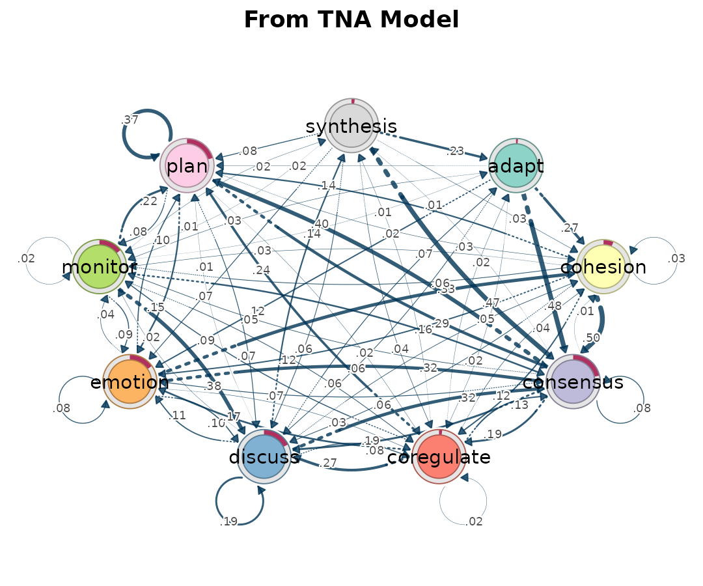

``` r

# With donut nodes showing initial probabilities
splot(tna_model,
      node_shape = "donut",
      donut_fill = tna_model$inits,
      title = "TNA with Initial Probabilities")
```

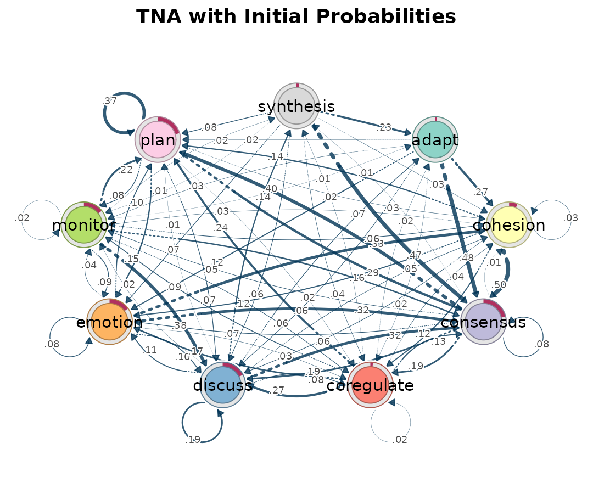

## Weight Preprocessing

| Parameter           | Effect                                            |
|---------------------|---------------------------------------------------|
| `weight_digits = 2` | Round weights; edges rounding to zero are removed |
| `threshold = 0.3`   | Remove edges with \|weight\| \< threshold         |
| `minimum = 0.3`     | Alias for threshold (qgraph compatibility)        |
| `maximum = 1.0`     | Set reference maximum for edge width scaling      |
| `edge_scale_mode`   | `"linear"`, `"sqrt"`, `"log"`, or `"rank"`        |

``` r
# Create a network with varying weights
weights_matrix <- matrix(
  c(0, 0.1, 0.5, 0.9,
    0.1, 0, 0.2, 0.7,
    0.5, 0.2, 0, 0.3,
    0.9, 0.7, 0.3, 0),
  nrow = 4, byrow = TRUE,
  dimnames = list(LETTERS[1:4], LETTERS[1:4])
)

# Apply threshold to remove weak edges
splot(weights_matrix, threshold = 0.4, title = "Threshold = 0.4 (weak edges removed)")
```

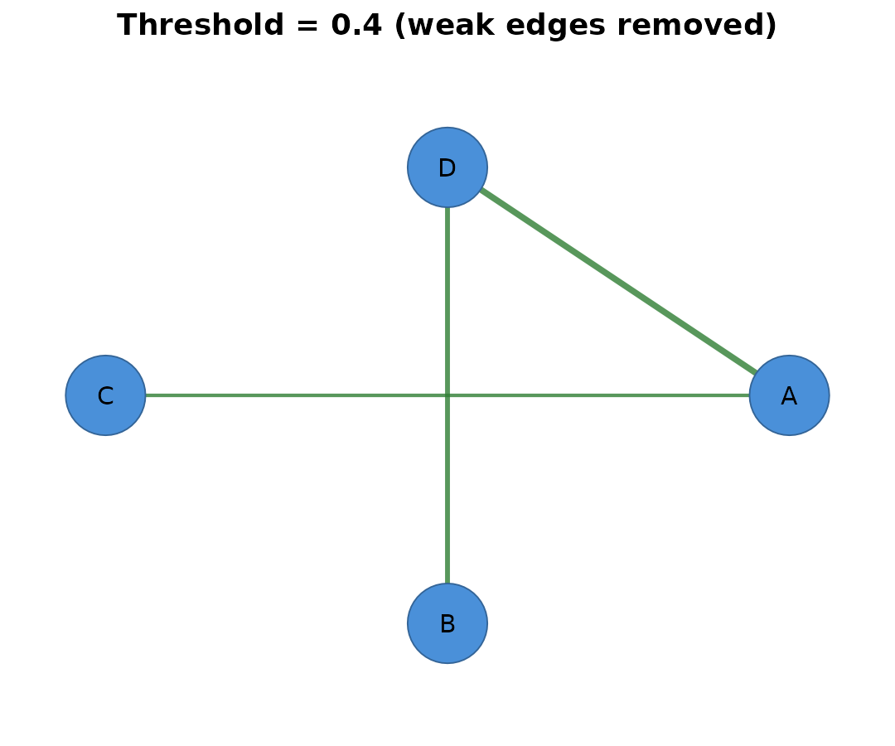

## Special Cases

| Feature          | Behavior                                              |
|------------------|-------------------------------------------------------|
| Negative weights | Colored differently (green/red by default)            |
| Self-loops       | Rendered as loops; control angle with `loop_rotation` |
| Reciprocal edges | Curved apart automatically in directed networks       |
| Duplicate edges  | Error by default; use `edge_duplicates` to aggregate  |

``` r
# Network with negative weights (e.g., correlation matrix)
cor_matrix <- matrix(
  c(1, 0.8, -0.5, 0.3,
    0.8, 1, 0.2, -0.7,
    -0.5, 0.2, 1, 0.4,
    0.3, -0.7, 0.4, 1),
  nrow = 4, byrow = TRUE,
  dimnames = list(LETTERS[1:4], LETTERS[1:4])
)
diag(cor_matrix) <- 0

splot(cor_matrix, title = "Negative Weights (red = negative)")
```

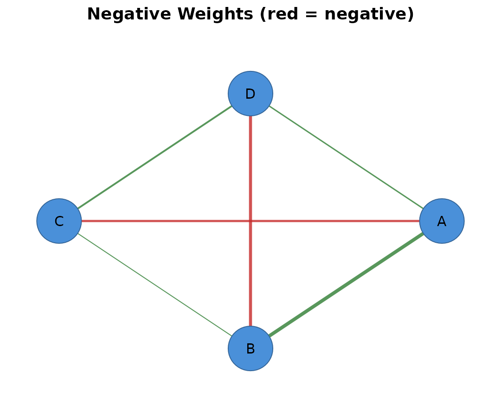

## Conversion Functions

cograph provides functions to convert between formats. All conversion
functions accept any supported input type.

### as_cograph() / to_cograph() — Import to cograph

Convert any format to a `cograph_network` object.

**Accepted inputs:**

- `matrix` — Adjacency/weight matrix
- `data.frame` — Edge list with from/to/weight columns
- `igraph` — igraph object
- `network` — statnet network object
- `qgraph` — qgraph object
- `tna` — TNA model object
- `group_tna` — Grouped TNA model object

``` r
# From matrix
net <- as_cograph(adj_matrix)
print(net)
#> Cograph network: 4 nodes, 5 edges ( undirected )
#> Source: matrix 
#>   Nodes (4): A, B, C, D
#>   Edges: 5 / 6 (density: 83.3%)
#>   Weights: [0.200, 0.800]  |  mean: 0.560
#>   Strongest edges:
#>     A -- B  0.800
#>     C -- D  0.700
#>     B -- C  0.600
#>     A -- C  0.500
#>     A -- D  0.200
#> Layout: none

# From edge list
net_edges <- as_cograph(edges)
print(net_edges)
#> Cograph network: 4 nodes, 6 edges ( undirected )
#> Source: edgelist 
#> Data: data.frame (6 x 3) 
#>   Nodes (4): Alice, Bob, Carol, Dave
#> Weights: 0.3 to 0.9 
#> Layout: none

# Override auto-detected directedness
net_directed <- as_cograph(adj_matrix, directed = TRUE)
cat("Directed:", attr(net_directed, "directed"), "\n")
#> Directed:
```

``` r
# From igraph
g <- igraph::make_ring(5)
igraph::V(g)$name <- LETTERS[1:5]
net_from_igraph <- as_cograph(g)
print(net_from_igraph)
#> Cograph network: 5 nodes, 5 edges ( undirected )
#> Source: igraph 
#>   Nodes (5): A, B, C, D, E
#> Weights: 1 (all equal)
#> Layout: none
```

The function is idempotent — passing a `cograph_network` returns it
unchanged.

### to_igraph() — Export to igraph

Convert any format to an igraph object:

``` r
# From matrix
g <- to_igraph(adj_matrix)
cat("Vertices:", igraph::vcount(g), "\n")
#> Vertices: 4
cat("Edges:", igraph::ecount(g), "\n")
#> Edges: 5

# From cograph_network
net <- as_cograph(adj_matrix)
g2 <- to_igraph(net)

# Check attributes preserved
cat("Vertex names:", paste(igraph::V(g2)$name, collapse = ", "), "\n")
#> Vertex names: A, B, C, D
```

### to_data_frame() / to_df() — Export to Edge List

Convert any format to an edge list data frame:

``` r
# From matrix
df <- to_df(adj_matrix)
print(df)
#>   from to weight
#> 1    A  B    0.8
#> 2    A  C    0.5
#> 3    A  D    0.2
#> 4    B  C    0.6
#> 5    C  D    0.7

# From cograph_network
net <- as_cograph(adj_matrix)
df2 <- to_df(net)
print(df2)
#>   from to weight
#> 1    A  B    0.8
#> 2    A  C    0.5
#> 3    B  C    0.6
#> 4    A  D    0.2
#> 5    C  D    0.7
```

Output columns: `from`, `to`, `weight`

### to_matrix() — Export to Adjacency Matrix

Convert any format to an adjacency matrix:

``` r
# From cograph_network
net <- as_cograph(edges)
mat <- to_matrix(net)
print(mat)
#>       Alice Bob Carol Dave
#> Alice   0.0 0.9   0.5  0.4
#> Bob     0.9 0.0   0.7  0.3
#> Carol   0.5 0.7   0.0  0.8
#> Dave    0.4 0.3   0.8  0.0
```

``` r
# From igraph (with weights)
g <- igraph::graph_from_adjacency_matrix(
  matrix(c(0, 1, 0, 1, 1, 0, 1, 0, 0, 1, 0, 1, 1, 0, 1, 0), 4, 4,
         dimnames = list(c("W", "X", "Y", "Z"), c("W", "X", "Y", "Z"))),
  mode = "undirected",
  weighted = TRUE
)
mat <- to_matrix(g)
print(mat)
#>   W X Y Z
#> W 0 1 0 1
#> X 1 0 1 0
#> Y 0 1 0 1
#> Z 1 0 1 0
```

Returns a square numeric matrix with row/column names preserved.

### to_network() — Export to statnet network

Convert any format to a statnet network object:

``` r
# Convert matrix to statnet network
statnet_net <- to_network(adj_matrix)
print(statnet_net)
#>  Network attributes:
#>   vertices = 4 
#>   directed = FALSE 
#>   hyper = FALSE 
#>   loops = FALSE 
#>   multiple = FALSE 
#>   bipartite = FALSE 
#>   total edges= 5 
#>     missing edges= 0 
#>     non-missing edges= 5 
#> 
#>  Vertex attribute names: 
#>     vertex.names 
#> 
#>  Edge attribute names: 
#>     weight
```

Requires the `network` package. Preserves edge weights and vertex names.

## Conversion Summary

| Function                                                                                                                                    | Output            | Use Case                                      |
|---------------------------------------------------------------------------------------------------------------------------------------------|-------------------|-----------------------------------------------|
| [`as_cograph()`](http://sonsoles.me/cograph/reference/as_cograph.md) / [`to_cograph()`](http://sonsoles.me/cograph/reference/as_cograph.md) | `cograph_network` | Import for visualization with splot           |
| [`to_igraph()`](http://sonsoles.me/cograph/reference/to_igraph.md)                                                                          | `igraph`          | Use igraph’s analysis functions               |
| [`to_df()`](http://sonsoles.me/cograph/reference/to_data_frame.md)                                                                          | `data.frame`      | Export to CSV, database, or other tools       |
| [`to_matrix()`](http://sonsoles.me/cograph/reference/to_matrix.md)                                                                          | `matrix`          | Export to adjacency matrix for other packages |
| [`to_network()`](http://sonsoles.me/cograph/reference/to_network.md)                                                                        | `network`         | Use with statnet/ergm ecosystem               |

## Format Summary

| Input     | Class        | Directed                                                               | Weights       | Labels       |
|-----------|--------------|------------------------------------------------------------------------|---------------|--------------|
| Matrix    | `matrix`     | Symmetry check                                                         | Cell values   | dimnames     |
| Edge list | `data.frame` | Reciprocal check                                                       | weight column | Unique nodes |
| igraph    | `igraph`     | [`is_directed()`](http://sonsoles.me/cograph/reference/is_directed.md) | weight attr   | name attr    |
| network   | `network`    | `is.directed()`                                                        | weight attr   | vertex.names |
| qgraph    | `qgraph`     | Edgelist                                                               | Edgelist      | Node names   |
| tna       | `tna`        | Always TRUE                                                            | `$weights`    | `$labels`    |
