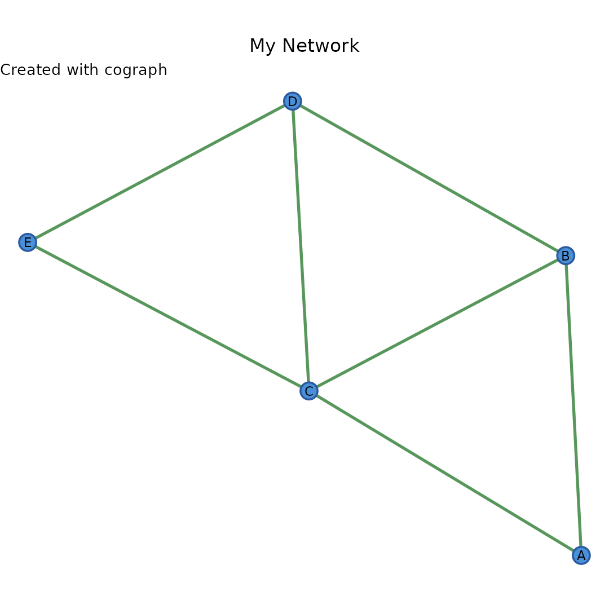
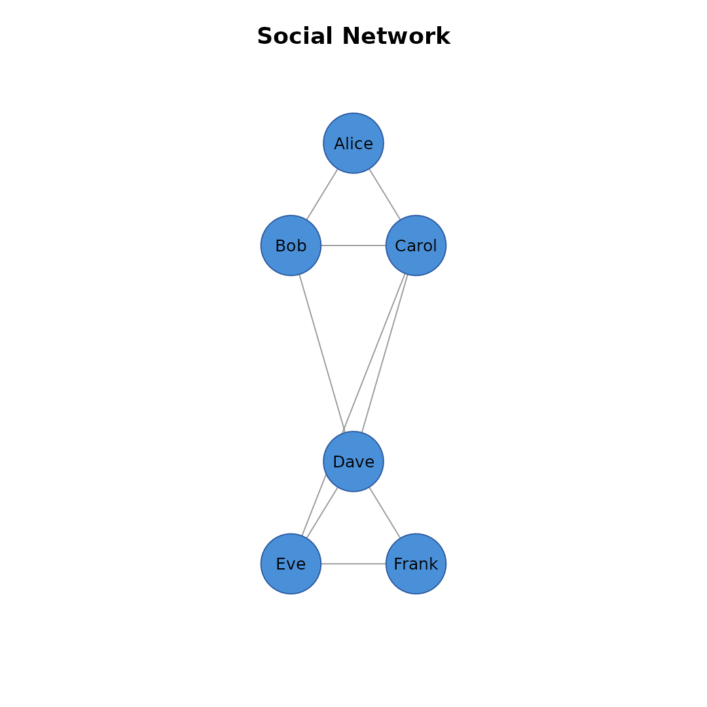

# Introduction to cograph

## Overview

cograph is a modern R package for network visualization. It provides a
clean, pipe-friendly API for creating publication-quality network plots.

``` r
library(cograph)
```

## Creating a Network

cograph accepts several input formats:

### From an Adjacency Matrix

``` r
# Create a simple adjacency matrix
adj <- matrix(c(
  0, 1, 1, 0, 0,
  1, 0, 1, 1, 0,
  1, 1, 0, 1, 1,
  0, 1, 1, 0, 1,
  0, 0, 1, 1, 0
), nrow = 5, byrow = TRUE)

# Add labels
rownames(adj) <- colnames(adj) <- c("A", "B", "C", "D", "E")

# Create and render
cograph(adj)
#> Cograph network: 5 nodes, 7 edges ( undirected )
#> Source: matrix 
#>   Nodes (5): A, B, C, D, E
#>   Edges: 7 / 10 (density: 70.0%)
#>   Weights: [1.000, 1.000]  |  mean: 1.000
#>   Strongest edges:
#>     A -- B  1.000
#>     A -- C  1.000
#>     B -- C  1.000
#>     B -- D  1.000
#>     C -- D  1.000
#> Layout: none
```

### From an Edge List

``` r
edges <- data.frame(
  from = c("Alice", "Alice", "Bob", "Carol"),
  to = c("Bob", "Carol", "Carol", "Dave"),
  weight = c(1, 2, 1, 3)
)

cograph(edges)
#> Cograph network: 4 nodes, 4 edges ( undirected )
#> Source: edgelist 
#> Data: data.frame (4 x 3) 
#>   Nodes (4): Alice, Bob, Carol, Dave
#> Weights: 1 to 3 
#> Layout: none
```

## Layouts

cograph provides several layout algorithms:

### Circular Layout

``` r
cograph(adj, layout = "circle")
#> Cograph network: 5 nodes, 7 edges ( undirected )
#> Source: matrix 
#>   Nodes (5): A, B, C, D, E
#>   Edges: 7 / 10 (density: 70.0%)
#>   Weights: [1.000, 1.000]  |  mean: 1.000
#>   Strongest edges:
#>     A -- B  1.000
#>     A -- C  1.000
#>     B -- C  1.000
#>     B -- D  1.000
#>     C -- D  1.000
#> Layout: set
```

### Force-Directed (Spring) Layout

``` r
cograph(adj, layout = "spring", seed = 42)
#> Cograph network: 5 nodes, 7 edges ( undirected )
#> Source: matrix 
#>   Nodes (5): A, B, C, D, E
#>   Edges: 7 / 10 (density: 70.0%)
#>   Weights: [1.000, 1.000]  |  mean: 1.000
#>   Strongest edges:
#>     A -- B  1.000
#>     A -- C  1.000
#>     B -- C  1.000
#>     B -- D  1.000
#>     C -- D  1.000
#> Layout: set
```

### Group-Based Layout

``` r
groups <- c(1, 1, 2, 2, 2)
cograph(adj) |>
  sn_layout("groups", groups = groups)
#> Cograph network: 5 nodes, 7 edges ( undirected )
#> Source: matrix 
#>   Nodes (5): A, B, C, D, E
#>   Edges: 7 / 10 (density: 70.0%)
#>   Weights: [1.000, 1.000]  |  mean: 1.000
#>   Strongest edges:
#>     A -- B  1.000
#>     A -- C  1.000
#>     B -- C  1.000
#>     B -- D  1.000
#>     C -- D  1.000
#> Layout: set
```

## Customizing Nodes

``` r
cograph(adj) |>
  sn_nodes(
    size = 0.08,
    shape = "circle",
    fill = "steelblue",
    border_color = "navy",
    border_width = 2
  )
#> Cograph network: 5 nodes, 7 edges ( undirected )
#> Source: matrix 
#>   Nodes (5): A, B, C, D, E
#>   Edges: 7 / 10 (density: 70.0%)
#>   Weights: [1.000, 1.000]  |  mean: 1.000
#>   Strongest edges:
#>     A -- B  1.000
#>     A -- C  1.000
#>     B -- C  1.000
#>     B -- D  1.000
#>     C -- D  1.000
#> Layout: set
```

### Per-Node Styles

``` r
cograph(adj) |>
  sn_nodes(
    size = c(0.05, 0.06, 0.08, 0.06, 0.05),
    fill = c("red", "orange", "yellow", "green", "blue")
  )
#> Cograph network: 5 nodes, 7 edges ( undirected )
#> Source: matrix 
#>   Nodes (5): A, B, C, D, E
#>   Edges: 7 / 10 (density: 70.0%)
#>   Weights: [1.000, 1.000]  |  mean: 1.000
#>   Strongest edges:
#>     A -- B  1.000
#>     A -- C  1.000
#>     B -- C  1.000
#>     B -- D  1.000
#>     C -- D  1.000
#> Layout: set
```

### Node Shapes

Available shapes: `circle`, `square`, `triangle`, `diamond`, `pentagon`,
`hexagon`, `ellipse`, `star`, `heart`, `pie`, `cross`.

``` r
cograph(adj) |>
  sn_nodes(
    shape = c("circle", "square", "triangle", "diamond", "star")
  )
#> Cograph network: 5 nodes, 7 edges ( undirected )
#> Source: matrix 
#>   Nodes (5): A, B, C, D, E
#>   Edges: 7 / 10 (density: 70.0%)
#>   Weights: [1.000, 1.000]  |  mean: 1.000
#>   Strongest edges:
#>     A -- B  1.000
#>     A -- C  1.000
#>     B -- C  1.000
#>     B -- D  1.000
#>     C -- D  1.000
#> Layout: set
```

## Customizing Edges

### Basic Edge Styling

``` r
cograph(adj) |>
  sn_edges(
    width = 2,
    color = "gray40",
    alpha = 0.7
  )
#> Cograph network: 5 nodes, 7 edges ( undirected )
#> Source: matrix 
#>   Nodes (5): A, B, C, D, E
#>   Edges: 7 / 10 (density: 70.0%)
#>   Weights: [1.000, 1.000]  |  mean: 1.000
#>   Strongest edges:
#>     A -- B  1.000
#>     A -- C  1.000
#>     B -- C  1.000
#>     B -- D  1.000
#>     C -- D  1.000
#> Layout: set
```

### Weighted Edges

For weighted networks, edge width and color can be mapped to weights:

``` r
# Create weighted adjacency matrix
weighted <- matrix(c(
  0, 0.8, -0.5, 0, 0,
  0.8, 0, 0.3, -0.7, 0,
  -0.5, 0.3, 0, 0.6, -0.4,
  0, -0.7, 0.6, 0, 0.9,
  0, 0, -0.4, 0.9, 0
), nrow = 5, byrow = TRUE)

cograph(weighted) |>
  sn_edges(
    width = "weight",
    color = "weight",
    positive_color = "darkgreen",
    negative_color = "darkred"
  )
#> Warning: 'positive_color' is deprecated, use 'edge_positive_color' instead.
#> Warning: 'negative_color' is deprecated, use 'edge_negative_color' instead.
#> Cograph network: 5 nodes, 7 edges ( undirected )
#> Source: matrix 
#>   Nodes (5): 1, 2, 3, 4, 5
#>   Edges: 7 / 10 (density: 70.0%)
#>   Weights: [-0.700, 0.900]  |  +4 / -3 edges
#>   Strongest edges:
#>     4 -- 5  0.900
#>     1 -- 2  0.800
#>     2 -- 4  -0.700
#>     3 -- 4  0.600
#>     1 -- 3  -0.500
#> Layout: set
```

### Directed Networks

``` r
# Create directed network
dir_adj <- matrix(c(
  0, 1, 1, 0, 0,
  0, 0, 1, 1, 0,
  0, 0, 0, 1, 1,
  0, 0, 0, 0, 1,
  0, 0, 0, 0, 0
), nrow = 5, byrow = TRUE)

cograph(dir_adj, directed = TRUE) |>
  sn_edges(
    curvature = 0.1,
    arrow_size = 0.015
  )
#> Cograph network: 5 nodes, 7 edges ( directed )
#> Source: matrix 
#>   Nodes (5): 1, 2, 3, 4, 5
#>   Edges: 7 / 20 (density: 35.0%)
#>   Weights: [1.000, 1.000]  |  mean: 1.000
#>   Strongest edges:
#>     1 -> 2  1.000
#>     1 -> 3  1.000
#>     2 -> 3  1.000
#>     2 -> 4  1.000
#>     3 -> 4  1.000
#> Layout: set
```

## Themes

cograph includes several built-in themes:

### Classic Theme (Default)

``` r
cograph(adj) |> sn_theme("classic")
#> Cograph network: 5 nodes, 7 edges ( undirected )
#> Source: matrix 
#>   Nodes (5): A, B, C, D, E
#>   Edges: 7 / 10 (density: 70.0%)
#>   Weights: [1.000, 1.000]  |  mean: 1.000
#>   Strongest edges:
#>     A -- B  1.000
#>     A -- C  1.000
#>     B -- C  1.000
#>     B -- D  1.000
#>     C -- D  1.000
#> Layout: set
```

### Dark Theme

``` r
cograph(adj) |> sn_theme("dark")
#> Cograph network: 5 nodes, 7 edges ( undirected )
#> Source: matrix 
#>   Nodes (5): A, B, C, D, E
#>   Edges: 7 / 10 (density: 70.0%)
#>   Weights: [1.000, 1.000]  |  mean: 1.000
#>   Strongest edges:
#>     A -- B  1.000
#>     A -- C  1.000
#>     B -- C  1.000
#>     B -- D  1.000
#>     C -- D  1.000
#> Layout: set
```

### Minimal Theme

``` r
cograph(adj) |> sn_theme("minimal")
#> Cograph network: 5 nodes, 7 edges ( undirected )
#> Source: matrix 
#>   Nodes (5): A, B, C, D, E
#>   Edges: 7 / 10 (density: 70.0%)
#>   Weights: [1.000, 1.000]  |  mean: 1.000
#>   Strongest edges:
#>     A -- B  1.000
#>     A -- C  1.000
#>     B -- C  1.000
#>     B -- D  1.000
#>     C -- D  1.000
#> Layout: set
```

### Colorblind-Friendly Theme

``` r
cograph(adj) |> sn_theme("colorblind")
#> Cograph network: 5 nodes, 7 edges ( undirected )
#> Source: matrix 
#>   Nodes (5): A, B, C, D, E
#>   Edges: 7 / 10 (density: 70.0%)
#>   Weights: [1.000, 1.000]  |  mean: 1.000
#>   Strongest edges:
#>     A -- B  1.000
#>     A -- C  1.000
#>     B -- C  1.000
#>     B -- D  1.000
#>     C -- D  1.000
#> Layout: set
```

## ggplot2 Conversion

Convert your network to a ggplot2 object for additional customization:

``` r
library(ggplot2)
#> 
#> Attaching package: 'ggplot2'
#> The following object is masked from 'package:cograph':
#> 
#>     get_theme

p <- cograph(adj) |>
  sn_nodes(fill = "coral") |>
  sn_ggplot()

p +
  labs(
    title = "My Network",
    subtitle = "Created with cograph"
  ) +
  theme(plot.title = element_text(hjust = 0.5))
```



## Complete Example

``` r
# Social network example
social <- matrix(c(
  0, 1, 1, 0, 0, 0,
  1, 0, 1, 1, 0, 0,
  1, 1, 0, 1, 1, 0,
  0, 1, 1, 0, 1, 1,
  0, 0, 1, 1, 0, 1,
  0, 0, 0, 1, 1, 0
), nrow = 6, byrow = TRUE)

rownames(social) <- colnames(social) <-
  c("Alice", "Bob", "Carol", "Dave", "Eve", "Frank")

groups <- c("Team A", "Team A", "Team A", "Team B", "Team B", "Team B")

social |>
  cograph() |>
  sn_layout("groups", groups = groups) |>
  sn_nodes(
    size = 0.06,
    fill = ifelse(groups == "Team A", "#E69F00", "#56B4E9"),
    border_width = 2
  ) |>
  sn_edges(width = 1.5, alpha = 0.6) |>
  sn_theme("minimal") |>
  sn_render(title = "Social Network")
```



## Saving Plots

``` r
net <- cograph(adj) |>
  sn_nodes(fill = "steelblue") |>
  sn_theme("minimal")

# Save as PDF
sn_save(net, "network.pdf", width = 8, height = 8)

# Save as PNG
sn_save(net, "network.png", width = 8, height = 8, dpi = 300)

# Save as SVG
sn_save(net, "network.svg", width = 8, height = 8)
```

## Next Steps

- Explore different layouts with
  [`list_layouts()`](http://sonsoles.me/cograph/reference/list_layouts.md)
- Try different shapes with
  [`list_shapes()`](http://sonsoles.me/cograph/reference/list_shapes.md)
- See available themes with
  [`list_themes()`](http://sonsoles.me/cograph/reference/list_themes.md)
- Check out the ggplot2 vignette for advanced customization
