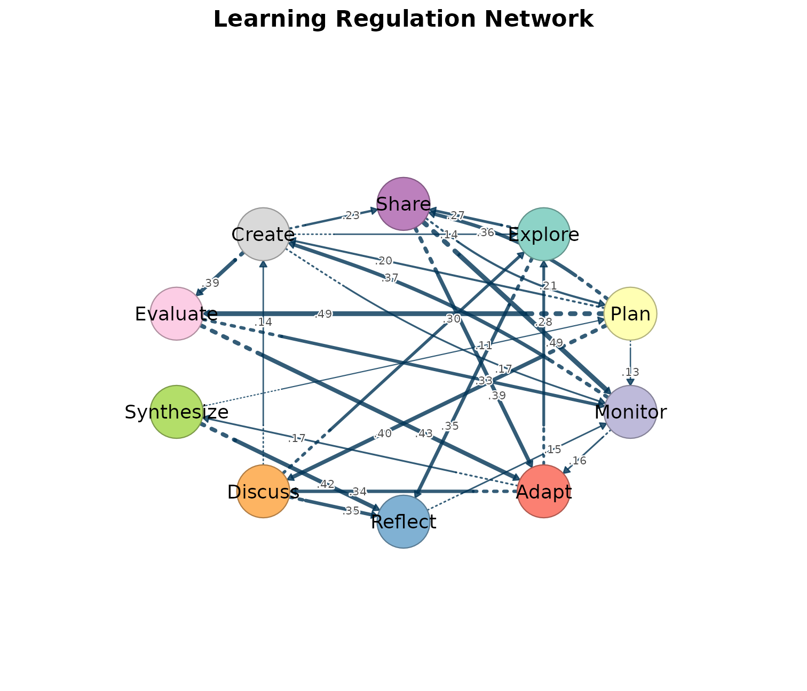
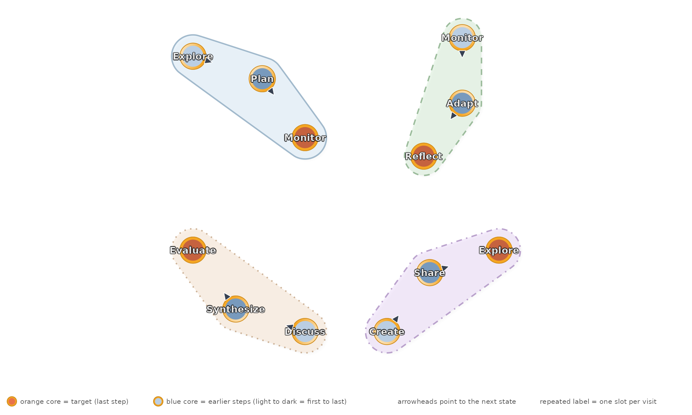

# Introduction to cograph

``` r

library(cograph)
```

## Why cograph

R has several network packages — igraph for graph algorithms, qgraph for
psychometric networks, tidygraph for dplyr-style manipulation. Each does
one thing well but forces you into its own data format and API. Going
from a raw matrix to a filtered, annotated, publication-ready figure
typically means loading three packages, converting between formats, and
writing boilerplate code to stitch the results together.

cograph was designed to eliminate that friction. Every function —
plotting, centrality, community detection, filtering — accepts any major
network format directly: matrices, edge lists, igraph, statnet, qgraph,
and tna objects. No manual conversion. Centrality returns a tidy data
frame, not a list of separate calls. Community detection is one function
with 11 algorithms behind it. Statistical annotations (confidence
intervals, p-values, significance stars) render directly on the figure.
And when you need igraph or statnet for something cograph does not do,
[`to_igraph()`](https://sonsoles.me/cograph/reference/to_igraph.md) and
[`to_network()`](https://sonsoles.me/cograph/reference/to_network.md)
convert back without data loss.

Beyond standard network analysis, cograph visualizes higher-order
sequential pathways as simplicial blob diagrams, renders bootstrap
stability results with forest plots (linear, circular, and grouped
layouts), and performs motif analysis that identifies specific named
node triples — not just abstract type counts.

The result is a single package that covers the full workflow from data
import to publication-ready output, while remaining interoperable with
the rest of the R network ecosystem.

``` r

set.seed(42)
n <- 10
states <- c("Explore", "Plan", "Monitor", "Adapt", "Reflect",
            "Discuss", "Synthesize", "Evaluate", "Create", "Share")
mat <- matrix(0, n, n, dimnames = list(states, states))
# Sparse: ~30% of edges populated
edges <- sample(which(row(mat) != col(mat)), 30)
mat[edges] <- round(runif(30, 0.05, 0.5), 2)
```

## Plotting

[`splot()`](https://sonsoles.me/cograph/reference/splot.md) is the main
plotting function. One call, publication-ready output.

``` r

splot(mat, tna_styling = TRUE, minimum = 0.1,
  title = "Learning Regulation Network")
```



Key parameters: `layout`, `minimum`, `node_fill`, `node_size`,
`edge_labels`, `curvature`, `scale_nodes_by`, `theme`, `tna_styling`.

``` r

splot(mat, layout = "spring")
splot(mat, minimum = 0.1, edge_labels = TRUE)
splot(mat, scale_nodes_by = "betweenness")
splot(mat, theme = "dark")
splot(mat, tna_styling = TRUE)
```

Layouts: `"oval"`, `"spring"`, `"circle"`, `"grid"`, `"mds"`, `"star"`,
`"bipartite"`, `"groups"`, or a custom coordinate matrix.

Themes: `"default"`, `"dark"`, `"minimal"`, `"gray"`, `"nature"`,
`"colorblind"`, `"viridis"`.

Node shapes: `"circle"`, `"square"`, `"triangle"`, `"diamond"`,
`"pentagon"`, `"hexagon"`, `"star"`, `"heart"`, `"ellipse"`, `"cross"`,
`"rectangle"`, `"pie"`, `"donut"`, or custom SVG via
[`register_svg_shape()`](https://sonsoles.me/cograph/reference/register_svg_shape.md).

## Specialized plots

| Function | Purpose |
|----|----|
| [`splot()`](https://sonsoles.me/cograph/reference/splot.md) | Network graph (base R) |
| [`soplot()`](https://sonsoles.me/cograph/reference/soplot.md) | Grid/ggplot2 network |
| [`plot_tna()`](https://sonsoles.me/cograph/reference/plot_tna.md) / [`tplot()`](https://sonsoles.me/cograph/reference/plot_tna.md) | TNA-style wrappers with qgraph-compatible parameters |
| [`plot_chord()`](https://sonsoles.me/cograph/reference/plot_chord.md) | Chord diagram (directed/undirected ribbons) |
| [`plot_heatmap()`](https://sonsoles.me/cograph/reference/plot_heatmap.md) | Adjacency heatmap with clustering |
| [`plot_ml_heatmap()`](https://sonsoles.me/cograph/reference/plot_ml_heatmap.md) | Multi-layer comparison heatmap |
| [`plot_transitions()`](https://sonsoles.me/cograph/reference/plot_transitions.md) / [`plot_alluvial()`](https://sonsoles.me/cograph/reference/plot_alluvial.md) | Alluvial / Sankey flow diagrams |
| [`plot_trajectories()`](https://sonsoles.me/cograph/reference/plot_trajectories.md) | Individual trajectory tracking |
| [`plot_compare()`](https://sonsoles.me/cograph/reference/plot_compare.md) | Difference network between two matrices |
| [`plot_comparison_heatmap()`](https://sonsoles.me/cograph/reference/plot_comparison_heatmap.md) | Side-by-side heatmap comparison |
| [`plot_mixed_network()`](https://sonsoles.me/cograph/reference/plot_mixed_network.md) | Directed + undirected edges combined |
| [`plot_bootstrap_forest()`](https://sonsoles.me/cograph/reference/plot_bootstrap_forest.md) | Bootstrap CI forest plots (linear, circular, grouped) |
| [`plot_edge_diff_forest()`](https://sonsoles.me/cograph/reference/plot_edge_diff_forest.md) | Edge difference plots (linear, circular, chord, tile) |
| [`plot_simplicial()`](https://sonsoles.me/cograph/reference/plot_simplicial.md) | Higher-order pathway blob overlays |
| [`overlay_communities()`](https://sonsoles.me/cograph/reference/overlay_communities.md) | Community blob overlays on network |
| [`plot_mcml()`](https://sonsoles.me/cograph/reference/plot_mcml.md) | Two-layer hierarchical cluster visualization |
| [`plot_mtna()`](https://sonsoles.me/cograph/reference/plot_mtna.md) | Flat multi-cluster layout |
| [`plot_mlna()`](https://sonsoles.me/cograph/reference/plot_mlna.md) | Stacked multilayer 3D perspective |
| [`plot_htna()`](https://sonsoles.me/cograph/reference/plot_htna.md) | Multi-group heterogeneous TNA layout |
| [`plot_robustness()`](https://sonsoles.me/cograph/reference/plot_robustness.md) | Robustness degradation curves |
| [`plot_permutation()`](https://sonsoles.me/cograph/reference/plot_permutation.md) / [`plot_group_permutation()`](https://sonsoles.me/cograph/reference/plot_group_permutation.md) | Permutation test results |

``` r

plot_simplicial(mat,
  c("Explore Plan -> Monitor",
    "Monitor Adapt -> Reflect",
    "Discuss Synthesize -> Evaluate",
    "Create Share -> Explore"),
  dismantled = TRUE, ncol = 2,
  title = "Higher-Order Pathways")
```



## Input formats

Every function accepts six formats directly.

| Format    | Example                                               |
|-----------|-------------------------------------------------------|
| Matrix    | `splot(mat)`                                          |
| Edge list | `splot(data.frame(from = "A", to = "B", weight = 1))` |
| igraph    | `splot(igraph::make_ring(5))`                         |
| statnet   | `splot(network::network(mat))`                        |
| qgraph    | `from_qgraph(q)`                                      |
| tna       | `splot(tna::tna(data))`                               |

Conversion utilities:

| Function                        | Output                             |
|---------------------------------|------------------------------------|
| `as_cograph(x)`                 | cograph_network object             |
| `to_igraph(x)`                  | igraph object                      |
| `to_matrix(x)`                  | Adjacency matrix                   |
| `to_data_frame(x)` / `to_df(x)` | Edge list data frame               |
| `to_network(x)`                 | statnet network object             |
| `from_qgraph(q)`                | Extract qgraph styles into cograph |

## Filtering and selection

Filter edges and nodes with expressions. Centrality measures are
lazy-computed inside
[`filter_nodes()`](https://sonsoles.me/cograph/reference/filter_nodes.md).

``` r

strong <- filter_edges(mat, weight > 0.3)
get_edges(strong)
#>    from to weight
#> 1     8  3   0.33
#> 2    10  3   0.49
#> 3     8  4   0.43
#> 4    10  4   0.39
#> 5     1  5   0.35
#> 6     6  5   0.35
#> 7     7  5   0.42
#> 8     2  6   0.40
#> 9     4  6   0.34
#> 10    2  8   0.49
#> 11    9  8   0.39
#> 12    3  9   0.37
#> 13    2 10   0.36
```

``` r

top3 <- select_nodes(mat, top = 3, by = "betweenness")
get_labels(top3)
#> [1] "Plan"    "Monitor" "Adapt"
```

| Function | Purpose |
|----|----|
| `filter_edges(x, ...)` | Filter by weight, from, to |
| `filter_nodes(x, ...)` | Filter by degree, centrality, label |
| `select_nodes(x, ...)` | Top-N by centrality, by name, neighbors |
| `select_edges(x, ...)` | Top-N, involving, between, bridges, mutual |
| `select_neighbors(x, of)` | Ego-network extraction (multi-hop) |
| `select_component(x)` | Largest or named component |
| `select_top(x, n, by)` | Top-N nodes by any centrality |
| `select_bridges(x)` | Bridge edges only |
| `select_top_edges(x, n)` | Top-N edges by weight |
| `select_edges_involving(x, nodes)` | Edges touching specific nodes |
| `select_edges_between(x, s1, s2)` | Edges between two node sets |
| `subset_nodes(x, ...)` / `subset_edges(x, ...)` | Base R-style subsetting |
| `simplify(x)` | Remove multi-edges and self-loops |

Getters and setters:

| Function                            | Purpose            |
|-------------------------------------|--------------------|
| `get_nodes(x)` / `set_nodes(x, df)` | Node data frame    |
| `get_edges(x)` / `set_edges(x, df)` | Edge data frame    |
| `get_labels(x)`                     | Node label vector  |
| `n_nodes(x)` / `n_edges(x)`         | Counts             |
| `is_directed(x)`                    | Directedness       |
| `set_groups(x)` / `get_groups(x)`   | Group assignments  |
| `set_layout(x, layout)`             | Layout coordinates |
| `summarize_network(x)`              | Network summary    |

## Centrality

[`centrality()`](https://sonsoles.me/cograph/reference/centrality.md)
computes a broad set of node centrality measures and returns a data
frame.

``` r

centrality(mat, measures = c("degree", "betweenness", "pagerank"))
#>          node degree_all betweenness   pagerank
#> 1     Explore          6         5.0 0.11846147
#> 2        Plan          7        15.5 0.03640953
#> 3     Monitor          8        18.0 0.18376724
#> 4       Adapt          6        15.0 0.12356096
#> 5     Reflect          6        10.0 0.12513119
#> 6     Discuss          5         0.5 0.06803638
#> 7  Synthesize          4         6.5 0.03760071
#> 8    Evaluate          5         3.0 0.07386400
#> 9      Create          7        13.0 0.13821279
#> 10      Share          6         9.0 0.09495573
```

Individual functions return named vectors:

``` r

centrality_degree(mat)
#>    Explore       Plan    Monitor      Adapt    Reflect    Discuss Synthesize 
#>          6          7          8          6          6          5          4 
#>   Evaluate     Create      Share 
#>          5          7          6
centrality_pagerank(mat)
#>    Explore       Plan    Monitor      Adapt    Reflect    Discuss Synthesize 
#> 0.11846147 0.03640953 0.18376724 0.12356096 0.12513119 0.06803638 0.03760071 
#>   Evaluate     Create      Share 
#> 0.07386400 0.13821279 0.09495573
```

Selected measures:

| Category | Functions |
|----|----|
| Degree | [`centrality_degree()`](https://sonsoles.me/cograph/reference/centrality_degree.md), [`centrality_strength()`](https://sonsoles.me/cograph/reference/centrality_strength.md), [`centrality_indegree()`](https://sonsoles.me/cograph/reference/centrality_degree.md), [`centrality_outdegree()`](https://sonsoles.me/cograph/reference/centrality_degree.md), [`centrality_instrength()`](https://sonsoles.me/cograph/reference/centrality_strength.md), [`centrality_outstrength()`](https://sonsoles.me/cograph/reference/centrality_strength.md) |
| Path | [`centrality_betweenness()`](https://sonsoles.me/cograph/reference/centrality_betweenness.md), [`centrality_closeness()`](https://sonsoles.me/cograph/reference/centrality_closeness.md), [`centrality_harmonic()`](https://sonsoles.me/cograph/reference/centrality_harmonic.md), [`centrality_eccentricity()`](https://sonsoles.me/cograph/reference/centrality_eccentricity.md) (each with in/out variants) |
| Spectral | [`centrality_eigenvector()`](https://sonsoles.me/cograph/reference/centrality_eigenvector.md), [`centrality_pagerank()`](https://sonsoles.me/cograph/reference/centrality_pagerank.md), [`centrality_authority()`](https://sonsoles.me/cograph/reference/centrality_authority.md), [`centrality_hub()`](https://sonsoles.me/cograph/reference/centrality_authority.md), [`centrality_alpha()`](https://sonsoles.me/cograph/reference/centrality_alpha.md), [`centrality_power()`](https://sonsoles.me/cograph/reference/centrality_power.md), [`centrality_subgraph()`](https://sonsoles.me/cograph/reference/centrality_subgraph.md) |
| Structural | [`centrality_coreness()`](https://sonsoles.me/cograph/reference/centrality_coreness.md), [`centrality_constraint()`](https://sonsoles.me/cograph/reference/centrality_constraint.md), [`centrality_transitivity()`](https://sonsoles.me/cograph/reference/centrality_transitivity.md), [`centrality_laplacian()`](https://sonsoles.me/cograph/reference/centrality_laplacian.md) |
| Flow | [`centrality_current_flow_closeness()`](https://sonsoles.me/cograph/reference/centrality_current_flow_closeness.md), [`centrality_current_flow_betweenness()`](https://sonsoles.me/cograph/reference/centrality_current_flow_betweenness.md), [`centrality_load()`](https://sonsoles.me/cograph/reference/centrality_load.md) |
| Spreading | [`centrality_diffusion()`](https://sonsoles.me/cograph/reference/centrality_diffusion.md), [`centrality_leverage()`](https://sonsoles.me/cograph/reference/centrality_leverage.md), [`centrality_kreach()`](https://sonsoles.me/cograph/reference/centrality_kreach.md), [`centrality_voterank()`](https://sonsoles.me/cograph/reference/centrality_voterank.md), [`centrality_percolation()`](https://sonsoles.me/cograph/reference/centrality_percolation.md) |

Edge centrality:
[`edge_centrality()`](https://sonsoles.me/cograph/reference/edge_centrality.md),
[`edge_betweenness()`](https://sonsoles.me/cograph/reference/edge_centrality.md).

## Network properties

[`network_summary()`](https://sonsoles.me/cograph/reference/network_summary.md)
computes up to 37 network-level metrics.

``` r

network_summary(mat)
#>   node_count edge_count density component_count diameter mean_distance min_cut
#> 1         10         30   0.333               1     0.97         0.435       1
#>   centralization_degree centralization_in_degree centralization_out_degree
#> 1                 0.123                    0.333                     0.222
#>   centralization_betweenness centralization_closeness centralization_eigen
#> 1                      0.149                    0.238                0.479
#>   transitivity reciprocity assortativity_degree hub_score authority_score
#> 1        0.423       0.111               -0.116        NA              NA
```

| Function | Purpose |
|----|----|
| [`network_summary()`](https://sonsoles.me/cograph/reference/network_summary.md) | 37 metrics (density, diameter, clustering, etc.) |
| [`network_small_world()`](https://sonsoles.me/cograph/reference/network_small_world.md) | Small-world coefficient |
| [`network_rich_club()`](https://sonsoles.me/cograph/reference/network_rich_club.md) | Rich-club coefficient |
| [`network_global_efficiency()`](https://sonsoles.me/cograph/reference/network_global_efficiency.md) | Global efficiency |
| [`network_local_efficiency()`](https://sonsoles.me/cograph/reference/network_local_efficiency.md) | Local efficiency |
| [`degree_distribution()`](https://sonsoles.me/cograph/reference/degree_distribution.md) | Degree histogram |
| [`network_girth()`](https://sonsoles.me/cograph/reference/network_girth.md) | Shortest cycle |
| [`network_radius()`](https://sonsoles.me/cograph/reference/network_radius.md) | Minimum eccentricity |
| [`network_bridges()`](https://sonsoles.me/cograph/reference/network_bridges.md) | Bridge edges |
| [`network_cut_vertices()`](https://sonsoles.me/cograph/reference/network_cut_vertices.md) | Articulation points |
| [`network_vertex_connectivity()`](https://sonsoles.me/cograph/reference/network_vertex_connectivity.md) | Minimum vertices to disconnect |
| [`network_clique_size()`](https://sonsoles.me/cograph/reference/network_clique_size.md) | Largest complete subgraph |

## Community detection

11 algorithms with a consistent interface.

``` r

comms <- communities(mat, method = "walktrap")
comms
#> Community structure (walktrap)
#>   Nodes: 10  | Communities: 2  | Modularity: 0.1976 
#>   Sizes: 5, 5 
#> 
#>        node community
#>     Explore         1
#>        Plan         2
#>     Monitor         2
#>       Adapt         1
#>     Reflect         1
#>     Discuss         1
#>  Synthesize         1
#>    Evaluate         2
#>      Create         2
#>       Share         2
community_sizes(comms)
#> [1] 5 5
```

| Function | Algorithm | Alias |
|----|----|----|
| [`community_louvain()`](https://sonsoles.me/cograph/reference/community_louvain.md) | Louvain modularity | [`com_lv()`](https://sonsoles.me/cograph/reference/community_louvain.md) |
| [`community_leiden()`](https://sonsoles.me/cograph/reference/community_leiden.md) | Leiden (improved Louvain) | [`com_ld()`](https://sonsoles.me/cograph/reference/community_leiden.md) |
| [`community_fast_greedy()`](https://sonsoles.me/cograph/reference/community_fast_greedy.md) | Fast greedy | [`com_fg()`](https://sonsoles.me/cograph/reference/community_fast_greedy.md) |
| [`community_walktrap()`](https://sonsoles.me/cograph/reference/community_walktrap.md) | Random walk | [`com_wt()`](https://sonsoles.me/cograph/reference/community_walktrap.md) |
| [`community_infomap()`](https://sonsoles.me/cograph/reference/community_infomap.md) | Information flow | [`com_im()`](https://sonsoles.me/cograph/reference/community_infomap.md) |
| [`community_label_propagation()`](https://sonsoles.me/cograph/reference/community_label_propagation.md) | Label propagation | [`com_lp()`](https://sonsoles.me/cograph/reference/community_label_propagation.md) |
| [`community_edge_betweenness()`](https://sonsoles.me/cograph/reference/community_edge_betweenness.md) | Edge betweenness | [`com_eb()`](https://sonsoles.me/cograph/reference/community_edge_betweenness.md) |
| [`community_leading_eigenvector()`](https://sonsoles.me/cograph/reference/community_leading_eigenvector.md) | Leading eigenvector | [`com_le()`](https://sonsoles.me/cograph/reference/community_leading_eigenvector.md) |
| [`community_spinglass()`](https://sonsoles.me/cograph/reference/community_spinglass.md) | Spin glass | [`com_sg()`](https://sonsoles.me/cograph/reference/community_spinglass.md) |
| [`community_optimal()`](https://sonsoles.me/cograph/reference/community_optimal.md) | Exact optimization | [`com_op()`](https://sonsoles.me/cograph/reference/community_optimal.md) |
| [`community_fluid()`](https://sonsoles.me/cograph/reference/community_fluid.md) | Fluid communities | [`com_fl()`](https://sonsoles.me/cograph/reference/community_fluid.md) |

Additional community functions:

| Function | Purpose |
|----|----|
| [`community_consensus()`](https://sonsoles.me/cograph/reference/community_consensus.md) | Run algorithm N times, keep stable assignments |
| [`compare_communities()`](https://sonsoles.me/cograph/reference/compare_communities.md) | Compare partitions (NMI, VI, Rand, adjusted Rand) |
| `modularity()` | Modularity score |
| [`community_sizes()`](https://sonsoles.me/cograph/reference/community_sizes.md) | Size of each community |
| [`color_communities()`](https://sonsoles.me/cograph/reference/color_communities.md) | Color vector from community membership |
| [`cluster_quality()`](https://sonsoles.me/cograph/reference/cluster_quality.md) | Quality metrics (silhouette, Dunn index) |
| [`cluster_significance()`](https://sonsoles.me/cograph/reference/cluster_significance.md) | Permutation-based significance testing |
| [`detect_communities()`](https://sonsoles.me/cograph/reference/detect_communities.md) | Alternative interface (returns data frame) |

## Motifs

Motif analysis identifies recurring 3-node patterns using the MAN
classification (16 directed triad types).

``` r

mot <- motifs(mat, significance = FALSE)
mot
#> Motif Census 
#> Level: aggregate | States: 10 | Pattern: triangle 
#> 
#> Type distribution:
#> 030T 120C 030C 120D 120U 
#>   11    3    2    2    1 
#> 
#> Top 5 results:
#>  type count
#>  030T    11
#>  120C     3
#>  030C     2
#>  120D     2
#>  120U     1
```

| Function | Purpose |
|----|----|
| [`motifs()`](https://sonsoles.me/cograph/reference/motifs.md) | MAN type census with significance testing |
| [`subgraphs()`](https://sonsoles.me/cograph/reference/subgraphs.md) | Named node triples forming each pattern |
| [`motif_census()`](https://sonsoles.me/cograph/reference/motif_census.md) | Low-level triad census |
| [`extract_motifs()`](https://sonsoles.me/cograph/reference/extract_motifs.md) | Per-individual motif extraction |
| [`extract_triads()`](https://sonsoles.me/cograph/reference/extract_triads.md) | Extract specific triad types |
| [`triad_census()`](https://sonsoles.me/cograph/reference/triad_census.md) | Raw 16-type triad count |
| [`get_edge_list()`](https://sonsoles.me/cograph/reference/get_edge_list.md) | Edge list from tna for motif input |

Plot types: `plot(mot, type = "types")`, `"significance"`, `"triads"`,
`"patterns"`.

## Robustness

Simulate network degradation under targeted and random removal.

``` r

robustness(mat, type = "vertex", measure = "betweenness", n_iter = 100)
plot_robustness(x = mat, measures = c("betweenness", "degree", "random"))
```

| Function | Purpose |
|----|----|
| [`robustness()`](https://sonsoles.me/cograph/reference/robustness.md) | Simulate removal attacks (vertex or edge) |
| [`plot_robustness()`](https://sonsoles.me/cograph/reference/plot_robustness.md) | Plot robustness curves for multiple strategies |
| [`robustness_summary()`](https://sonsoles.me/cograph/reference/robustness_summary.md) | AUC and summary statistics |
| [`robustness_auc()`](https://sonsoles.me/cograph/reference/robustness_auc.md) | Area under the robustness curve |

## Disparity filter

Backbone extraction using the disparity filter (Serrano et al. 2009).

``` r

disparity_filter(mat)
splot.tna_disparity(disparity_filter(mat))
```

## Multi-cluster visualization

``` r

clusters <- list(
  Cognitive  = c("Explore", "Plan", "Monitor", "Adapt", "Reflect"),
  Social     = c("Discuss", "Synthesize", "Share"),
  Evaluative = c("Evaluate", "Create")
)
plot_mcml(mat, clusters, mode = "tna")
plot_mtna(mat, clusters)
```

| Function | Architecture |
|----|----|
| [`plot_mcml()`](https://sonsoles.me/cograph/reference/plot_mcml.md) | Two-layer: detail nodes + summary pies |
| [`plot_mtna()`](https://sonsoles.me/cograph/reference/plot_mtna.md) | Flat cluster layout |
| [`plot_mlna()`](https://sonsoles.me/cograph/reference/plot_mlna.md) | Stacked 3D multilayer |
| [`plot_htna()`](https://sonsoles.me/cograph/reference/plot_htna.md) | Multi-group heterogeneous TNA |
| [`cluster_summary()`](https://sonsoles.me/cograph/reference/cluster_summary.md) / [`build_mcml()`](https://sonsoles.me/cograph/reference/build_mcml.md) | Pre-compute cluster aggregation |
| [`as_tna()`](https://sonsoles.me/cograph/reference/as_tna.md) / [`as_mcml()`](https://sonsoles.me/cograph/reference/as_mcml.md) | Convert cluster summaries to tna objects |
| [`cluster_network()`](https://sonsoles.me/cograph/reference/summarize_network.md) | Extract cluster-level network |

## Multilayer networks

Construct and analyze supra-adjacency matrices for multilayer/multiplex
networks.

| Function | Purpose |
|----|----|
| [`mlna()`](https://sonsoles.me/cograph/reference/plot_mlna.md) / [`supra_adjacency()`](https://sonsoles.me/cograph/reference/supra_adjacency.md) | Build supra-adjacency matrix |
| [`supra_layer()`](https://sonsoles.me/cograph/reference/supra_layer.md) / [`supra_interlayer()`](https://sonsoles.me/cograph/reference/supra_interlayer.md) | Extract individual layers |
| [`aggregate_layers()`](https://sonsoles.me/cograph/reference/aggregate_layers.md) / [`aggregate_weights()`](https://sonsoles.me/cograph/reference/aggregate_weights.md) | Combine layers |
| [`plot_mlna()`](https://sonsoles.me/cograph/reference/plot_mlna.md) | 3D perspective visualization |
| [`plot_ml_heatmap()`](https://sonsoles.me/cograph/reference/plot_ml_heatmap.md) | Multi-layer heatmap comparison |

## Higher-order networks

Detect sequential dependencies beyond first-order Markov models.
Requires the **Nestimate** package.

| Function | Purpose |
|----|----|
| `build_hon()` | Higher-Order Network construction |
| `build_hypa()` | Path anomaly detection (hypergeometric null) |
| `build_mogen()` | Multi-order model selection (AIC/BIC) |
| `path_counts()` | k-step path frequencies |
| [`plot_simplicial()`](https://sonsoles.me/cograph/reference/plot_simplicial.md) | Visualize pathways as blob overlays |
| `build_simplicial()` | Simplicial complex from cliques |
| `persistent_homology()` | Topological persistence across thresholds |
| `q_analysis()` | Multi-level structural connectivity |
| `verify_simplicial()` | Cross-validate via Euler-Poincare theorem |

## TNA integration

Direct support for all tna package objects:

| Object                  | What splot() does                     |
|-------------------------|---------------------------------------|
| `tna`                   | Network with donut rings, TNA styling |
| `group_tna`             | Multi-panel grid per group            |
| `tna_bootstrap`         | Stability-styled edges                |
| `tna_permutation`       | Colored difference network            |
| `group_tna_permutation` | Multi-panel permutation results       |
| `tna_disparity`         | Backbone filter visualization         |

## Palettes

| Function                | Colors          |
|-------------------------|-----------------|
| `palette_viridis(n)`    | Viridis scale   |
| `palette_pastel(n)`     | Soft pastel     |
| `palette_blues(n)`      | Blue gradient   |
| `palette_reds(n)`       | Red gradient    |
| `palette_diverging(n)`  | Blue-white-red  |
| `palette_colorblind(n)` | Colorblind-safe |
| `palette_rainbow(n)`    | Rainbow         |

## Pipe API

The `sn_*` functions provide a chainable builder for the grid/ggplot2
rendering path.

``` r

mat |>
  cograph() |>
  sn_layout("spring") |>
  sn_theme("minimal") |>
  sn_nodes(size = 8, fill = "steelblue") |>
  sn_edges(curvature = 0.2) |>
  sn_render(title = "My Network")

mat |> cograph() |> sn_save("network.pdf")
p <- mat |> cograph() |> sn_ggplot()
```

| Function | Purpose |
|----|----|
| [`cograph()`](https://sonsoles.me/cograph/reference/cograph.md) / [`as_cograph()`](https://sonsoles.me/cograph/reference/as_cograph.md) | Create network object |
| [`sn_nodes()`](https://sonsoles.me/cograph/reference/sn_nodes.md) | Node aesthetics |
| [`sn_edges()`](https://sonsoles.me/cograph/reference/sn_edges.md) | Edge aesthetics |
| [`sn_layout()`](https://sonsoles.me/cograph/reference/sn_layout.md) | Layout algorithm |
| [`sn_theme()`](https://sonsoles.me/cograph/reference/sn_theme.md) | Visual theme |
| [`sn_palette()`](https://sonsoles.me/cograph/reference/sn_palette.md) | Color palette |
| [`sn_render()`](https://sonsoles.me/cograph/reference/soplot.md) | Render to screen |
| [`sn_save()`](https://sonsoles.me/cograph/reference/sn_save.md) / [`sn_save_ggplot()`](https://sonsoles.me/cograph/reference/sn_save_ggplot.md) | Save to file |
| [`sn_ggplot()`](https://sonsoles.me/cograph/reference/sn_ggplot.md) | Convert to ggplot2 object |
| [`register_theme()`](https://sonsoles.me/cograph/reference/register_theme.md) / [`register_layout()`](https://sonsoles.me/cograph/reference/register_layout.md) / [`register_shape()`](https://sonsoles.me/cograph/reference/register_shape.md) | Register custom themes, layouts, shapes |

## Further reading

**Package resources:**

- [cograph function reference](https://saqr.me/cograph/) — complete list
  of all functions with examples
- [cograph pkgdown site](https://sonsoles.me/cograph/) — full
  documentation and articles

**Blog posts:**

- [cograph: Complex Network Analysis and
  Visualization](https://saqr.me/blog/2026/cograph-network-visualization/)
  — overview of the package design and capabilities
- [Human–AI Interaction: A TNA with
  cograph](https://saqr.me/blog/2026/human-ai-interaction-cograph/) —
  worked example analyzing 13,002 turns of human–AI coding collaboration

**References:**

- Saqr, M., López-Pernas, S., Conde, M. A., & Hernández-García, A.
  (2024). Social Network Analysis: A Primer, a Guide and a Tutorial
  in R. In *Learning Analytics Methods and Tutorials*. Springer.
  <https://doi.org/10.1007/978-3-031-54464-4_15>

- Hernández-García, Á., Cuenca-Enrique, C., Traxler, A., López-Pernas,
  S., Conde-González, M. Á., & Saqr, M. (2024). Community detection in
  learning networks using R. In *Learning Analytics Methods and
  Tutorials* (pp. 519–540). Springer.
  <https://doi.org/10.1007/978-3-031-54464-4_16>

- Saqr, M., López-Pernas, S., Törmänen, T., Kaliisa, R., Misiejuk, K., &
  Tikka, S. (2025). Transition Network Analysis: A Novel Framework for
  Modeling, Visualizing, and Identifying the Temporal Patterns of
  Learners and Learning Processes. In *Proceedings of the 15th LAK
  Conference* (pp. 351–361). ACM.
  <https://doi.org/10.1145/3706468.3706513>

- Tikka, S., López-Pernas, S., & Saqr, M. (2025). tna: An R Package for
  Transition Network Analysis. *Applied Psychological Measurement*.
  <https://doi.org/10.1177/01466216251348840>
