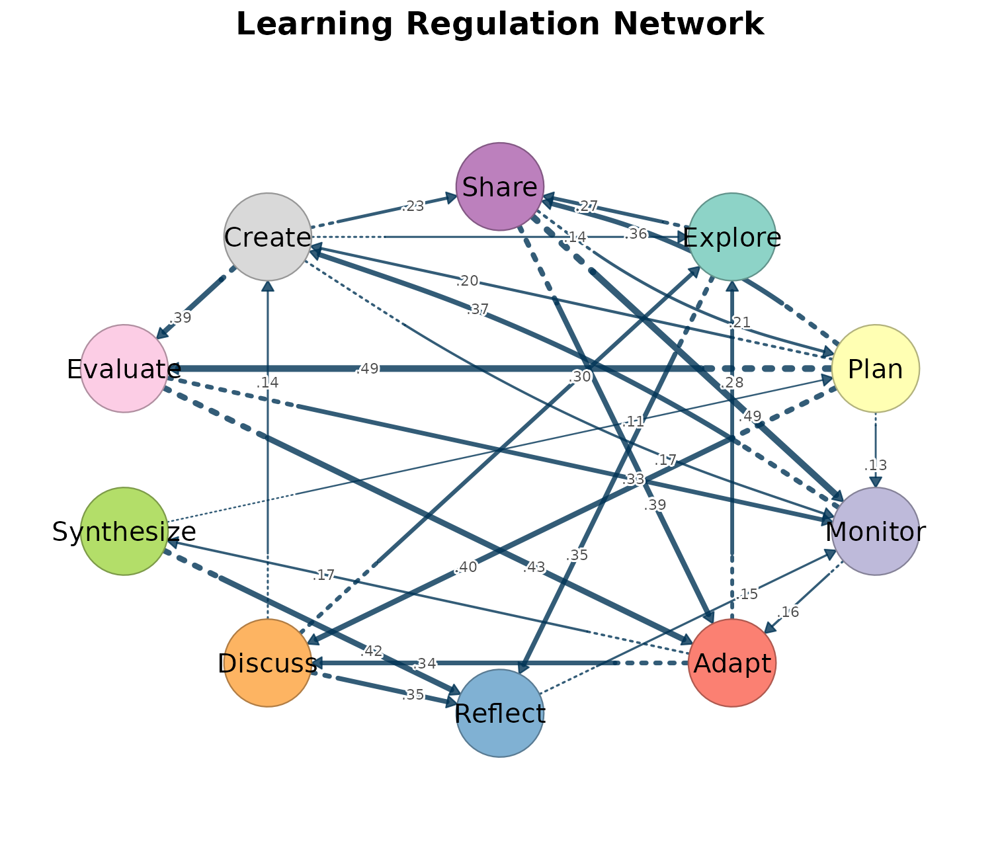
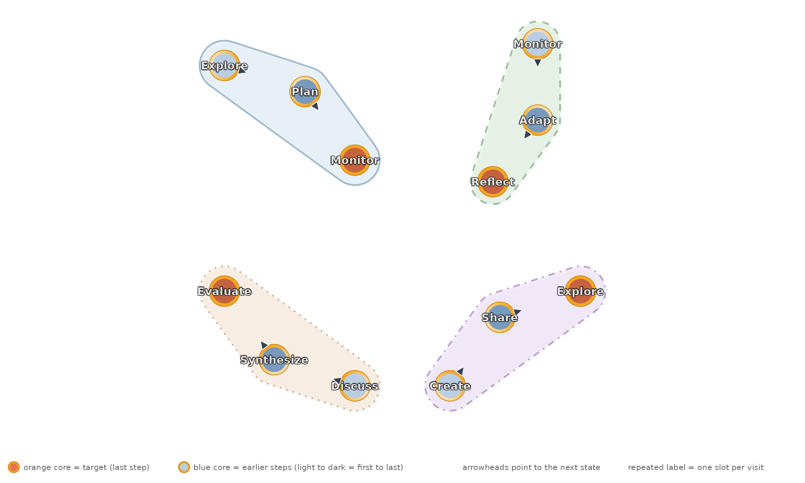

# Introduction to cograph

``` r

library(cograph)
```

## Why cograph

R offers several network packages, each with its own data format and
interface, among them igraph for graph algorithms, qgraph for
psychometric networks, statnet for statistical network models and
tidygraph for data manipulation. An analysis that uses more than one of
them begins by converting the network between their formats.

cograph is designed as a modern R package that offers a comprehensive
set of analysis options for social and complex networks, one that is
tidy and simple to work with, and above all feature-rich and beautiful.
cograph accepts the formats of all of these packages without conversion
and returns its own results as tidy data frames. cograph visualizes
networks with specialized styling for transition and psychological
networks, and plots the results of bootstrap, permutation and stability
analyses directly. cograph offers a family of wrangling verbs for
selecting, filtering, thresholding and editing networks, a large
collection of node centrality measures across all major families, and a
wide array of network-level statistics from density and diameter to
efficiency and clique size. For community structure, cograph provides a
range of detection algorithms together with consensus, comparison and
significance testing of partitions, and for local structure, cograph
provides motif analysis that identifies the nodes forming each pattern.
cograph also supports robustness and vulnerability analysis, backbone
extraction with the disparity filter, hierarchical plots for
multi-cluster networks, multilayer networks and higher-order pathways.
cograph’s figures carry statistical annotations such as confidence
intervals, p-values and significance stars.

The examples below use `regulation_net`, a synthetic weighted transition
network among ten learning states such as Explore, Plan and Reflect,
included in the package.

## Plotting

cograph offers tools for visualizing networks through
[`splot()`](https://sonsoles.me/cograph/reference/splot.md) and a set of
specialized plots.
[`splot()`](https://sonsoles.me/cograph/reference/splot.md) plots any
supported network input with base R graphics and has arguments for
controlling the layout, the nodes and their pie and donut decorations,
the edges with their curvature, arrows and labels, the legends and the
theme. It has specialized styling for transition networks
(`tna_styling`) and psychological networks (`psych_styling`), and it
plots the result objects of tna and Nestimate directly, including
bootstrap, permutation and stability results, multilevel VAR models and
group comparisons. Heterogeneous transition networks are plotted with
[`plot_htna()`](https://sonsoles.me/cograph/reference/plot_htna.md).

``` r

splot(regulation_net, tna_styling = TRUE, minimum = 0.1,
  title = "Learning Regulation Network")
```



``` r

splot(regulation_net, layout = "spring")
splot(regulation_net, minimum = 0.1, edge_labels = TRUE)
splot(regulation_net, scale_nodes_by = "betweenness")
splot(regulation_net, theme = "dark")
splot(regulation_net, tna_styling = TRUE)
```

## Specialized plots

cograph offers a wide array of network plots across visualization
domains. These include transitions, flows and individual trajectories
over time, network evolution in temporal small multiples and
three-dimensional prisms, weight matrices as heatmaps and chord
diagrams, centrality profiles with their distributions, comparisons and
stability, edge-weight and degree distributions, motifs, comparisons
between networks, bootstrap confidence intervals and permutation tests,
mixed directed and undirected networks, multi-cluster, multi-group and
multilayer structure, community overlays, higher-order pathways and
robustness curves.

| Function | Purpose |
|----|----|
| [`splot()`](https://sonsoles.me/cograph/reference/splot.md) | Network graph (base R) |
| [`plot_tna()`](https://sonsoles.me/cograph/reference/plot_tna.md) / [`tplot()`](https://sonsoles.me/cograph/reference/plot_tna.md) | TNA-style wrappers with qgraph-compatible parameters |
| [`plot_chord()`](https://sonsoles.me/cograph/reference/plot_chord.md) | Chord diagram (directed/undirected ribbons) |
| [`plot_heatmap()`](https://sonsoles.me/cograph/reference/plot_heatmap.md) | Adjacency heatmap with clustering |
| [`plot_ml_heatmap()`](https://sonsoles.me/cograph/reference/plot_ml_heatmap.md) | Multi-layer comparison heatmap |
| [`plot_transitions()`](https://sonsoles.me/cograph/reference/plot_transitions.md) / [`plot_alluvial()`](https://sonsoles.me/cograph/reference/plot_alluvial.md) | Alluvial / Sankey flow diagrams |
| [`plot_trajectories()`](https://sonsoles.me/cograph/reference/plot_trajectories.md) | Individual trajectory tracking |
| [`plot_difference()`](https://sonsoles.me/cograph/reference/plot_difference.md) | Difference network between two matrices |
| [`plot_comparison_heatmap()`](https://sonsoles.me/cograph/reference/plot_comparison_heatmap.md) | Side-by-side heatmap comparison |
| [`plot_mixed_network()`](https://sonsoles.me/cograph/reference/plot_mixed_network.md) | Directed + undirected edges combined |
| [`plot_bootstrap_forest()`](https://sonsoles.me/cograph/reference/plot_bootstrap_forest.md) | Bootstrap CI forest plots (linear, circular, grouped) |
| [`plot_edge_diff_forest()`](https://sonsoles.me/cograph/reference/plot_edge_diff_forest.md) | Edge difference plots (linear, circular, chord, tile) |
| [`plot_simplicial()`](https://sonsoles.me/cograph/reference/plot_simplicial.md) | Higher-order pathway blob overlays |
| [`overlay_communities()`](https://sonsoles.me/cograph/reference/overlay_communities.md) | Community blob overlays on network |
| [`plot_mcml()`](https://sonsoles.me/cograph/reference/plot_mcml.md) | Two-layer hierarchical cluster visualization |
| [`plot_mtna()`](https://sonsoles.me/cograph/reference/plot_mtna.md) | Flat multi-cluster layout |
| [`plot_mlna()`](https://sonsoles.me/cograph/reference/plot_mlna.md) | Stacked multilayer 3D perspective |
| [`plot_htna()`](https://sonsoles.me/cograph/reference/plot_htna.md) | Multi-group heterogeneous TNA layout |
| [`plot_robustness()`](https://sonsoles.me/cograph/reference/plot_robustness.md) | Robustness degradation curves |
| [`plot_permutation()`](https://sonsoles.me/cograph/reference/plot_permutation.md) / [`plot_group_permutation()`](https://sonsoles.me/cograph/reference/plot_group_permutation.md) | Permutation test results |
| [`plot_centrality()`](https://sonsoles.me/cograph/reference/plot_centrality.md) / [`plot_centrality_distribution()`](https://sonsoles.me/cograph/reference/plot_centrality_distribution.md) | Centrality profiles and their distributions |
| [`plot_centrality_heatmap()`](https://sonsoles.me/cograph/reference/plot_centrality_heatmap.md) / [`plot_centrality_compare()`](https://sonsoles.me/cograph/reference/plot_centrality_compare.md) | Centrality across nodes and groups |
| [`plot_net_stability()`](https://sonsoles.me/cograph/reference/plot_net_stability.md) | Centrality stability results |
| [`plot_edge_weights()`](https://sonsoles.me/cograph/reference/plot_edge_weights.md) / [`plot_degree_correlation()`](https://sonsoles.me/cograph/reference/plot_degree_correlation.md) | Edge-weight distribution and degree-degree correlation |
| [`plot_motifs()`](https://sonsoles.me/cograph/reference/plot_motifs.md) | Motif and subgraph results |
| [`plot_network_evolution()`](https://sonsoles.me/cograph/reference/plot_network_evolution.md) | Network evolution in small multiples |
| [`plot_temporal()`](https://sonsoles.me/cograph/reference/plot_temporal.md) | Temporal network as a three-dimensional prism |

``` r

plot_simplicial(regulation_net,
  c("Explore Plan -> Monitor",
    "Monitor Adapt -> Reflect",
    "Discuss Synthesize -> Evaluate",
    "Create Share -> Explore"),
  dismantled = TRUE, ncol = 2,
  title = "Higher-Order Pathways")
```



## Input formats

cograph accepts adjacency matrices, edge lists, and igraph, statnet,
qgraph and tna objects without conversion. Its conversion functions
export a network to igraph, statnet, matrix and edge-list formats for
exchange with other packages, and
[`from_qgraph()`](https://sonsoles.me/cograph/reference/from_qgraph.md)
imports the styling of a qgraph plot.

| Format    | Example                                               |
|-----------|-------------------------------------------------------|
| Matrix    | `splot(regulation_net)`                               |
| Edge list | `splot(data.frame(from = "A", to = "B", weight = 1))` |
| igraph    | `splot(igraph::make_ring(5))`                         |
| statnet   | `splot(network::network(regulation_net))`             |
| qgraph    | `from_qgraph(q)`                                      |
| tna       | `splot(tna::tna(data))`                               |

| Function                        | Output                             |
|---------------------------------|------------------------------------|
| `as_cograph(x)`                 | cograph_network object             |
| `to_igraph(x)`                  | igraph object                      |
| `to_matrix(x)`                  | Adjacency matrix                   |
| `to_data_frame(x)` / `to_df(x)` | Edge list data frame               |
| `to_network(x)`                 | statnet network object             |
| `from_qgraph(q)`                | Extract qgraph styles into cograph |

## Wrangling

cograph offers a family of wrangling verbs for selecting and filtering
nodes and edges, thresholding and transforming weights, and
restructuring and editing a network. Every verb accepts any supported
input, takes its options as named arguments and returns a network, so
verbs chain with the native pipe.
[`as.data.frame()`](https://rdrr.io/r/base/as.data.frame.html) returns
the edges as a tidy data frame, and `as.data.frame(what = "nodes")`
returns the nodes.

``` r

strong <- filter_edges(regulation_net, weight > 0.3)
as.data.frame(strong)
#>          from       to weight
#> 1    Evaluate  Monitor   0.33
#> 2       Share  Monitor   0.49
#> 3    Evaluate    Adapt   0.43
#> 4       Share    Adapt   0.39
#> 5     Explore  Reflect   0.35
#> 6     Discuss  Reflect   0.35
#> 7  Synthesize  Reflect   0.42
#> 8        Plan  Discuss   0.40
#> 9       Adapt  Discuss   0.34
#> 10       Plan Evaluate   0.49
#> 11     Create Evaluate   0.39
#> 12    Monitor   Create   0.37
#> 13       Plan    Share   0.36
```

[`select_nodes()`](https://sonsoles.me/cograph/reference/select_nodes.md)
selects nodes by name or index, the top nodes by any centrality measure,
the neighbours of given nodes up to a chosen order, or the nodes of a
connected component.
[`select_edges()`](https://sonsoles.me/cograph/reference/select_edges.md)
selects the strongest edges, the edges involving or joining given sets
of nodes, bridges and mutual ties. Centrality measures named in a
selection are computed when the verb runs.

``` r

top3 <- select_nodes(regulation_net, top = 3, by = "betweenness")
get_labels(top3)
#> [1] "Plan"    "Monitor" "Adapt"
```

[`filter_nodes()`](https://sonsoles.me/cograph/reference/filter_nodes.md)
keeps the nodes that satisfy logical expressions over node attributes,
any centrality measure, and structural properties such as component
membership, k-core, isolation and cut vertices.
[`filter_edges()`](https://sonsoles.me/cograph/reference/filter_edges.md)
keeps the edges that satisfy expressions over edge columns, such as
`weight > mean(weight)`. Filters combine with the other verbs into
pipelines that prepare a network for analysis in a single, reproducible
expression. The pipeline below keeps the ties with weights of at least
0.3, removes the nodes left without ties, and adds each node’s degree
and a hub indicator to the node table.

``` r

regulation_net |>
  threshold_edges(minimum = 0.3) |>
  remove_isolates() |>
  mutate_nodes(deg = degree, hub = degree >= 3) |>
  as.data.frame(what = "nodes")
#>    id      label       name  x  y deg   hub
#> 1   1    Explore    Explore NA NA   2 FALSE
#> 2   2       Plan       Plan NA NA   3  TRUE
#> 3   3    Monitor    Monitor NA NA   3  TRUE
#> 4   4      Adapt      Adapt NA NA   3  TRUE
#> 5   5    Reflect    Reflect NA NA   3  TRUE
#> 6   6    Discuss    Discuss NA NA   4  TRUE
#> 7   7 Synthesize Synthesize NA NA   1 FALSE
#> 8   8   Evaluate   Evaluate NA NA   4  TRUE
#> 9   9     Create     Create NA NA   2 FALSE
#> 10 10      Share      Share NA NA   3  TRUE
```

### Selecting

cograph provides functions for extracting ego networks of several
orders, connected components, k-cores, bridges and the edges between two
sets of nodes.

| Function | Purpose |
|----|----|
| `filter_edges(x, ...)` | Filter by weight, endpoints, any edge column |
| `filter_nodes(x, ...)` | Filter by degree, centrality, label |
| `select_nodes(x, ...)` | Top-N by centrality, by name, neighbors, component |
| `select_edges(x, ...)` | Top-N, involving, between, bridges, mutual |
| `select_neighbors(x, of)` | Ego-network extraction (multi-hop) |
| `select_component(x)` | Largest or named component |
| `select_top(x, n, by)` | Top-N nodes by any centrality |
| `select_k_core(x, k)` | The k-core |
| `split_components(x)` | One network per component |
| `select_bridges(x)` | Bridge edges only |
| `select_top_edges(x, n)` | Top-N edges by weight |
| `select_edges_involving(x, nodes)` | Edges touching specific nodes |
| `select_edges_between(x, s1, s2)` | Edges between two node sets |
| `subset_nodes(x, ...)` / `subset_edges(x, ...)` | Aliases of the filters |

### Weights

cograph provides functions for thresholding edges by weight, count,
proportion or density, binarizing weights, and symmetrizing a directed
network by maximum, minimum, mean, sum or mutuality. Further functions
normalize weights by row, column, maximum, sum or range, and convert
similarities into distances for path-based measures.

| Function | Purpose |
|----|----|
| `threshold_edges(x, ...)` | Keep edges by weight, count, proportion, density |
| `binarize(x)` | Replace weights with 0/1 |
| `symmetrize(x, method)` | Combine opposite arcs into one edge |
| `normalize_weights(x, method)` | Rescale by row, column, max, sum, min-max |
| `invert_weights(x, method)` | Similarities to distances |

### Structure and editing

cograph provides functions for converting between directed and
undirected networks, reversing arcs, contracting groups of nodes into
single nodes with aggregated weights, extracting minimum or maximum
spanning trees and forming the complement of a network. Nodes and edges
can be added or removed, their attributes computed, and two networks
combined by union, intersection or difference.

| Function | Purpose |
|----|----|
| `to_undirected(x)` / `to_directed(x)` | Change directedness |
| `reverse_edges(x)` | Reverse every arc |
| `remove_isolates(x)` | Drop nodes with no edges |
| `contract_nodes(x, groups)` | Collapse groups into single nodes |
| `spanning_tree(x)` | Minimum or maximum spanning tree |
| `complement_network(x)` | Join the non-adjacent pairs |
| `reorder_nodes(x, order)` / `rename_nodes(x, from, to)` | Node order and labels |
| [`add_nodes()`](https://sonsoles.me/cograph/reference/add_nodes.md) / [`remove_nodes()`](https://sonsoles.me/cograph/reference/remove_nodes.md) / [`add_edges()`](https://sonsoles.me/cograph/reference/add_edges.md) / [`remove_edges()`](https://sonsoles.me/cograph/reference/remove_edges.md) | Editing |
| `mutate_nodes(x, ...)` / `mutate_edges(x, ...)` | Compute and store attributes |
| `bind_networks(x, y, method)` | Union, intersection, difference |
| `simplify(x)` | Remove multi-edges and self-loops |

The node and edge tables, labels, size, direction, group assignments and
layout of a network object can be read and set with accessor functions.

| Function | Purpose |
|----|----|
| `as.data.frame(x)` | Tidy edge table (`what = "nodes"` for nodes) |
| `get_nodes(x)` / `set_nodes(x, df)` | Node data frame |
| `get_edges(x)` / `set_edges(x, df)` | Edge data frame |
| `get_labels(x)` | Node label vector |
| `n_nodes(x)` / `n_edges(x)` | Counts |
| `is_directed(x)` | Directedness |
| `set_groups(x)` / `get_groups(x)` | Group assignments |
| `set_layout(x, layout)` | Layout coordinates |

## Centrality

cograph offers 191 node centrality measures through
[`centrality()`](https://sonsoles.me/cograph/reference/centrality.md),
which returns a tidy data frame with a column for each measure, and
through individual functions that return a single measure. The measures
span degree and strength, distance and closeness, shortest-path
brokerage, spectral and walk-based influence, neighbourhood cohesion,
directed prestige and community-based roles. Measures that are also
implemented elsewhere are tested against igraph, sna, centiserve,
brainGraph, influenceR, netrankr and NetworkX. The examples in this
section use the built-in `student_interactions` edge list, which
[`centrality()`](https://sonsoles.me/cograph/reference/centrality.md)
accepts directly.

``` r

data(student_interactions)
centrality(student_interactions)
#>    node degree_all strength_all closeness_all betweenness  eigenvector
#> 1    Ac         33          129    0.01754386   26.342857 1.000000e+00
#> 2    Ad         20           36    0.01754386   42.541520 1.096110e-01
#> 3    Fi         24           51    0.01666667   35.721634 1.789565e-01
#> 4    Ik         14           24    0.01666667   25.844874 1.551369e-02
#> 5    Vx         26           43    0.01960784   90.717124 7.238902e-02
#> 6    Rt         20           37    0.01785714   63.135739 1.159931e-01
#> 7    Km         11           16    0.01639344   18.175108 2.804725e-02
#> 8    Gj         19           31    0.01818182  114.599049 3.265786e-02
#> 9    Bd         12           18    0.01612903   21.769264 9.607736e-03
#> 10   Ce         10           13    0.01612903   16.648629 4.473504e-03
#> 11   Oq         14           20    0.01754386   34.151726 2.293068e-02
#> 12   Ya         13           19    0.01612903   18.216122 1.758656e-02
#> 13   Mo         12           17    0.01587302   38.264502 1.003629e-01
#> 14   Hj         12           19    0.01754386   85.816522 2.013125e-02
#> 15   Tv         10           13    0.01666667   25.916306 1.320877e-02
#> 16   Eg         10           12    0.01639344   22.335171 5.783916e-03
#> 17   Pr         11           18    0.01666667   23.974060 7.602231e-02
#> 18   Qs         15           19    0.01785714   76.910851 1.511764e-02
#> 19   Xz         14           18    0.01639344   22.280159 8.533484e-03
#> 20   Np          8            8    0.01666667   12.044048 1.549052e-02
#> 21   Dg         13           13    0.01886792   29.240901 6.260099e-03
#> 22   Hk         16           25    0.01818182   72.176441 1.201845e-01
#> 23   Wy         11           16    0.01639344   34.014358 1.054705e-03
#> 24   Jl         15           18    0.01818182   67.359085 5.009801e-02
#> 25   Fh         21           55    0.01818182   78.588877 2.817489e-01
#> 26   Zb          7            8    0.01538462    9.583333 5.429715e-05
#> 27   Eh          7           13    0.01428571   34.325000 1.163185e-03
#> 28   Be         14           16    0.01851852  105.250898 2.203252e-03
#> 29   Df          8           10    0.01562500   11.026190 4.800876e-06
#> 30   Cf         12           15    0.01724138  119.109163 1.243207e-02
#> 31   Su          6            9    0.01369863   33.154401 1.028472e-04
#> 32   Ln          7            8    0.01408451    5.749708 1.376854e-02
#> 33   Gi          3            4    0.01351351    0.000000 0.000000e+00
#> 34   Uw          4            7    0.01250000    0.000000 0.000000e+00
#>       pagerank
#> 1  0.285861728
#> 2  0.052985644
#> 3  0.077591140
#> 4  0.024836857
#> 5  0.057364714
#> 6  0.042552472
#> 7  0.016655998
#> 8  0.025444498
#> 9  0.014321668
#> 10 0.010679742
#> 11 0.016087378
#> 12 0.016588876
#> 13 0.031180263
#> 14 0.019051413
#> 15 0.012644206
#> 16 0.010425091
#> 17 0.022794289
#> 18 0.019784870
#> 19 0.013229134
#> 20 0.008466679
#> 21 0.010345027
#> 22 0.040383192
#> 23 0.009067435
#> 24 0.020529375
#> 25 0.070538086
#> 26 0.005635780
#> 27 0.010080122
#> 28 0.009378924
#> 29 0.004957518
#> 30 0.017877547
#> 31 0.005136500
#> 32 0.007628879
#> 33 0.005483193
#> 34 0.004411765
```

By default,
[`centrality()`](https://sonsoles.me/cograph/reference/centrality.md)
returns six classical measures: degree, strength, closeness,
betweenness, eigenvector centrality and PageRank. Any other measure is
chosen by name with `measures`, and `type = "all"` returns every measure
of ordinary computational cost.

``` r

centrality_degree(student_interactions)
#> Ac Ad Fi Ik Vx Rt Km Gj Bd Ce Oq Ya Mo Hj Tv Eg Pr Qs Xz Np Dg Hk Wy Jl Fh Zb 
#> 33 20 24 14 26 20 11 19 12 10 14 13 12 12 10 10 11 15 14  8 13 16 11 15 21  7 
#> Eh Be Df Cf Su Ln Gi Uw 
#>  7 14  8 12  6  7  3  4
centrality_pagerank(student_interactions)
#>          Ac          Ad          Fi          Ik          Vx          Rt 
#> 0.285861728 0.052985644 0.077591140 0.024836857 0.057364714 0.042552472 
#>          Km          Gj          Bd          Ce          Oq          Ya 
#> 0.016655998 0.025444498 0.014321668 0.010679742 0.016087378 0.016588876 
#>          Mo          Hj          Tv          Eg          Pr          Qs 
#> 0.031180263 0.019051413 0.012644206 0.010425091 0.022794289 0.019784870 
#>          Xz          Np          Dg          Hk          Wy          Jl 
#> 0.013229134 0.008466679 0.010345027 0.040383192 0.009067435 0.020529375 
#>          Fh          Zb          Eh          Be          Df          Cf 
#> 0.070538086 0.005635780 0.010080122 0.009378924 0.004957518 0.017877547 
#>          Su          Ln          Gi          Uw 
#> 0.005136500 0.007628879 0.005483193 0.004411765
```

The measures fall into seven families: degree, strength and local
connectivity; distance and closeness; shortest-path brokerage and flow;
spectral, walk and influence; neighbourhood structure and cohesion;
community and group-based roles; and directed prestige and hierarchy.
Recent measures from these families include Trust-PageRank, randomized
shortest-path betweenness, the Lhc index and the BG-index, and any of
them can be requested alongside the classical ones. Community-based
measures also require a partition, supplied with `membership`. The
centrality catalogue documents every measure with its definition,
interpretation and an example.

``` r

centrality(student_interactions,
           measures = c("collective_influence", "harmonic", "rsp_betweenness",
                        "trust_pagerank", "lhc", "beta_measure"),
           sort_by = "trust_pagerank", digits = 3)
#>    node collective_influence_all harmonic_all rsp_betweenness trust_pagerank
#> 1    Ac                     2048       21.333       15055.406          0.088
#> 2    Vx                     2950       24.000        3387.848          0.074
#> 3    Rt                     2603       21.500        3724.557          0.052
#> 4    Ad                     3154       21.667        4614.339          0.045
#> 5    Fi                     3772       20.500        5264.067          0.044
#> 6    Fh                     3540       22.000        5578.933          0.043
#> 7    Gj                     3168       22.000        1648.887          0.040
#> 8    Hk                     3090       22.000        3731.066          0.035
#> 9    Jl                     2954       22.333        1450.774          0.035
#> 10   Dg                     2340       23.000         455.822          0.034
#> 11   Ik                     2522       20.167        1538.618          0.033
#> 12   Be                     2860       22.500         337.701          0.033
#> 13   Oq                     2691       21.667        1022.913          0.032
#> 14   Hj                     2354       21.333        1246.753          0.030
#> 15   Qs                     3192       21.833        1237.349          0.030
#> 16   Cf                     2585       20.833        1088.757          0.029
#> 17   Ya                     2652       20.167        1060.565          0.026
#> 18   Mo                     2475       19.333        2926.244          0.026
#> 19   Xz                     3172       20.333         515.158          0.024
#> 20   Pr                     2450       19.833        1998.787          0.023
#> 21   Bd                     2728       19.500         778.216          0.022
#> 22   Eg                     2277       20.000         433.358          0.022
#> 23   Km                     2350       19.667        1129.461          0.021
#> 24   Ce                     2484       19.500         416.241          0.021
#> 25   Tv                     2376       19.833         760.272          0.021
#> 26   Wy                     2890       20.000         203.339          0.021
#> 27   Np                     1827       20.167         419.853          0.017
#> 28   Df                     1953       18.833          37.163          0.017
#> 29   Zb                     1836       18.333          66.797          0.012
#> 30   Eh                     1896       16.833         292.769          0.012
#> 31   Ln                     1890       17.333         339.688          0.012
#> 32   Su                     1630       16.333          86.133          0.011
#> 33   Gi                      642       15.833          40.747          0.007
#> 34   Uw                      705       14.833          33.000          0.007
#>         lhc beta_measure
#> 1  5498.268        0.830
#> 2  4901.961        0.894
#> 3  4109.675        0.918
#> 4  3743.248        0.709
#> 5  3734.960        0.793
#> 6  3693.777        1.809
#> 7  3526.831        1.324
#> 8  3256.110        0.831
#> 9  3229.885        1.559
#> 10 3186.124        1.020
#> 11 3140.255        0.524
#> 12 2967.967        2.311
#> 13 3110.130        0.987
#> 14 2910.090        0.513
#> 15 3021.652        1.310
#> 16 2745.034        1.084
#> 17 2706.990        0.625
#> 18 2684.175        0.782
#> 19 2552.081        0.774
#> 20 2470.132        0.979
#> 21 2396.457        0.702
#> 22 2372.132        0.818
#> 23 2300.650        0.412
#> 24 2351.081        0.678
#> 25 2330.983        1.121
#> 26 2100.728        0.935
#> 27 2021.546        0.615
#> 28 1909.727        0.789
#> 29 1394.676        1.027
#> 30 1358.228        1.181
#> 31 1437.061        0.588
#> 32 1338.202        1.515
#> 33  608.184        0.262
#> 34  705.928        1.783
```

## Network properties

cograph offers network-level statistics through
[`network_summary()`](https://sonsoles.me/cograph/reference/network_summary.md),
which returns density, diameter, mean distance, centralization,
reciprocity, transitivity and degree assortativity in a data frame with
one row for the network, and up to 35 statistics with `detailed = TRUE`
and `extended = TRUE`. Individual functions compute small-worldness,
global and local efficiency, the rich-club coefficient, girth, radius,
bridges, cut vertices, vertex connectivity and clique size.

``` r

network_summary(regulation_net)
#>   node_count edge_count density component_count diameter mean_distance min_cut
#> 1         10         30   0.333               1     0.97         0.435       1
#>   centralization_degree centralization_in_degree centralization_out_degree
#> 1                 0.123                    0.333                     0.222
#>   centralization_betweenness centralization_closeness centralization_eigen
#> 1                      0.149                    0.238                0.479
#>   transitivity reciprocity assortativity_degree
#> 1        0.423       0.111               -0.116
```

| Function | Purpose |
|----|----|
| [`network_summary()`](https://sonsoles.me/cograph/reference/network_summary.md) | Up to 35 statistics (density, diameter, clustering, etc.) |
| [`network_small_world()`](https://sonsoles.me/cograph/reference/network_small_world.md) | Small-world coefficient |
| [`network_rich_club()`](https://sonsoles.me/cograph/reference/network_rich_club.md) | Rich-club coefficient |
| [`network_global_efficiency()`](https://sonsoles.me/cograph/reference/network_global_efficiency.md) | Global efficiency |
| [`network_local_efficiency()`](https://sonsoles.me/cograph/reference/network_local_efficiency.md) | Local efficiency |
| [`degree_distribution()`](https://sonsoles.me/cograph/reference/degree_distribution.md) | Degree histogram |
| [`network_girth()`](https://sonsoles.me/cograph/reference/network_girth.md) | Shortest cycle |
| [`network_radius()`](https://sonsoles.me/cograph/reference/network_radius.md) | Minimum eccentricity |
| [`network_bridges()`](https://sonsoles.me/cograph/reference/network_bridges.md) | Bridge edges |
| [`network_cut_vertices()`](https://sonsoles.me/cograph/reference/network_cut_vertices.md) | Articulation points |
| [`network_vertex_connectivity()`](https://sonsoles.me/cograph/reference/network_vertex_connectivity.md) | Minimum vertices to disconnect |
| [`network_clique_size()`](https://sonsoles.me/cograph/reference/network_clique_size.md) | Largest complete subgraph |

## Community detection

cograph offers tools for studying community structure through detection,
consensus, comparison, quality assessment and significance testing of
partitions.
[`communities()`](https://sonsoles.me/cograph/reference/communities.md)
runs eleven community detection algorithms, including Louvain, Leiden,
Infomap, walktrap and spinglass, through one call and returns the
partition with its modularity, and each algorithm also has its own
function with a short alias.
[`community_consensus()`](https://sonsoles.me/cograph/reference/community_consensus.md)
runs an algorithm repeatedly and returns the consensus partition across
runs.
[`compare_communities()`](https://sonsoles.me/cograph/reference/compare_communities.md)
compares two partitions by variation of information, normalized mutual
information, split-join distance or the Rand and adjusted Rand indices,
[`cluster_quality()`](https://sonsoles.me/cograph/reference/cluster_quality.md)
scores a partition, and
[`cluster_significance()`](https://sonsoles.me/cograph/reference/cluster_significance.md)
tests its modularity against random networks that preserve the degree
sequence or the number of edges.

``` r

comms <- communities(regulation_net, method = "walktrap")
comms
#> Community structure (walktrap)
#>   Nodes: 10  | Communities: 2  | Modularity: 0.1976 
#>   Sizes: 5, 5 
#> 
#>        node community
#>     Explore         1
#>        Plan         2
#>     Monitor         2
#>       Adapt         1
#>     Reflect         1
#>     Discuss         1
#>  Synthesize         1
#>    Evaluate         2
#>      Create         2
#>       Share         2
community_sizes(comms)
#> [1] 5 5
```

| Function | Algorithm | Alias |
|----|----|----|
| [`community_louvain()`](https://sonsoles.me/cograph/reference/community_louvain.md) | Louvain modularity | [`com_lv()`](https://sonsoles.me/cograph/reference/community_louvain.md) |
| [`community_leiden()`](https://sonsoles.me/cograph/reference/community_leiden.md) | Leiden (improved Louvain) | [`com_ld()`](https://sonsoles.me/cograph/reference/community_leiden.md) |
| [`community_fast_greedy()`](https://sonsoles.me/cograph/reference/community_fast_greedy.md) | Fast greedy | [`com_fg()`](https://sonsoles.me/cograph/reference/community_fast_greedy.md) |
| [`community_walktrap()`](https://sonsoles.me/cograph/reference/community_walktrap.md) | Random walk | [`com_wt()`](https://sonsoles.me/cograph/reference/community_walktrap.md) |
| [`community_infomap()`](https://sonsoles.me/cograph/reference/community_infomap.md) | Information flow | [`com_im()`](https://sonsoles.me/cograph/reference/community_infomap.md) |
| [`community_label_propagation()`](https://sonsoles.me/cograph/reference/community_label_propagation.md) | Label propagation | [`com_lp()`](https://sonsoles.me/cograph/reference/community_label_propagation.md) |
| [`community_edge_betweenness()`](https://sonsoles.me/cograph/reference/community_edge_betweenness.md) | Edge betweenness | [`com_eb()`](https://sonsoles.me/cograph/reference/community_edge_betweenness.md) |
| [`community_leading_eigenvector()`](https://sonsoles.me/cograph/reference/community_leading_eigenvector.md) | Leading eigenvector | [`com_le()`](https://sonsoles.me/cograph/reference/community_leading_eigenvector.md) |
| [`community_spinglass()`](https://sonsoles.me/cograph/reference/community_spinglass.md) | Spin glass | [`com_sg()`](https://sonsoles.me/cograph/reference/community_spinglass.md) |
| [`community_optimal()`](https://sonsoles.me/cograph/reference/community_optimal.md) | Exact optimization | [`com_op()`](https://sonsoles.me/cograph/reference/community_optimal.md) |
| [`community_fluid()`](https://sonsoles.me/cograph/reference/community_fluid.md) | Fluid communities | [`com_fl()`](https://sonsoles.me/cograph/reference/community_fluid.md) |

| Function | Purpose |
|----|----|
| [`community_consensus()`](https://sonsoles.me/cograph/reference/community_consensus.md) | Run algorithm N times, keep stable assignments |
| [`compare_communities()`](https://sonsoles.me/cograph/reference/compare_communities.md) | Compare partitions (NMI, VI, Rand, adjusted Rand) |
| [`community_sizes()`](https://sonsoles.me/cograph/reference/community_sizes.md) | Size of each community |
| [`color_communities()`](https://sonsoles.me/cograph/reference/color_communities.md) | Color vector from community membership |
| [`cluster_quality()`](https://sonsoles.me/cograph/reference/cluster_quality.md) | Quality metrics (silhouette, Dunn index) |
| [`cluster_significance()`](https://sonsoles.me/cograph/reference/cluster_significance.md) | Permutation-based significance testing |
| [`detect_communities()`](https://sonsoles.me/cograph/reference/detect_communities.md) | Alternative interface (returns data frame) |

## Motifs

cograph offers motif analysis for directed networks based on the 16
triads of the MAN classification.
[`motifs()`](https://sonsoles.me/cograph/reference/motifs.md) counts
each triad type and tests its frequency with a permutation test, across
the whole network, per actor, or within rolling and tumbling windows.
[`subgraphs()`](https://sonsoles.me/cograph/reference/subgraphs.md)
identifies the nodes behind each motif and reports which node triples
form each pattern, in how many sessions or actors they occur, and
whether they occur more often than expected.
[`plot()`](https://rdrr.io/r/graphics/plot.default.html) visualizes the
counts, their significance, the triads and the patterns.

``` r

mot <- motifs(regulation_net, significance = FALSE)
mot
#> Motif Census 
#> Level: aggregate | States: 10 | Pattern: triangle 
#> 
#> Type distribution:
#> 030T 120C 030C 120D 120U 
#>   11    3    2    2    1 
#> 
#> Top 5 results:
#>  type count
#>  030T    11
#>  120C     3
#>  030C     2
#>  120D     2
#>  120U     1
```

| Function | Purpose |
|----|----|
| [`motifs()`](https://sonsoles.me/cograph/reference/motifs.md) | MAN type census with significance testing |
| [`subgraphs()`](https://sonsoles.me/cograph/reference/subgraphs.md) | Named node triples forming each pattern |
| [`motif_census()`](https://sonsoles.me/cograph/reference/motif_census.md) | Low-level triad census |
| [`extract_motifs()`](https://sonsoles.me/cograph/reference/extract_motifs.md) | Per-individual motif extraction |
| [`extract_triads()`](https://sonsoles.me/cograph/reference/extract_triads.md) | Extract specific triad types |
| [`triad_census()`](https://sonsoles.me/cograph/reference/triad_census.md) | Raw 16-type triad count |
| [`get_edge_list()`](https://sonsoles.me/cograph/reference/get_edge_list.md) | Edge list from tna for motif input |

## Robustness

cograph offers tools for studying network robustness and vulnerability
through simulated attacks and node-level efficiency loss.
[`robustness()`](https://sonsoles.me/cograph/reference/robustness.md)
simulates the sequential removal of nodes or edges, ordered by a
centrality measure or at random, and returns the size of the largest
component at each step. The ranking can be recomputed after every
removal or fixed at the start, and random removal is averaged over
repeated runs.
[`robustness_auc()`](https://sonsoles.me/cograph/reference/robustness_auc.md)
and
[`robustness_summary()`](https://sonsoles.me/cograph/reference/robustness_summary.md)
summarize each curve, including the area under it, and
[`plot_robustness()`](https://sonsoles.me/cograph/reference/plot_robustness.md)
visualizes several attack strategies together.
[`vulnerability()`](https://sonsoles.me/cograph/reference/vulnerability.md)
computes, for each node, the relative drop in global efficiency when
that node is removed.

``` r

robustness(regulation_net, type = "vertex", measure = "betweenness", n_iter = 100)
plot_robustness(x = regulation_net, measures = c("betweenness", "degree", "random"))
```

| Function | Purpose |
|----|----|
| [`robustness()`](https://sonsoles.me/cograph/reference/robustness.md) | Simulate removal attacks (vertex or edge) |
| [`plot_robustness()`](https://sonsoles.me/cograph/reference/plot_robustness.md) | Plot robustness curves for multiple strategies |
| [`robustness_summary()`](https://sonsoles.me/cograph/reference/robustness_summary.md) | AUC and summary statistics |
| [`robustness_auc()`](https://sonsoles.me/cograph/reference/robustness_auc.md) | Area under the robustness curve |
| [`vulnerability()`](https://sonsoles.me/cograph/reference/vulnerability.md) | Relative drop in global efficiency when each node is removed |

## Disparity filter

cograph offers backbone extraction for weighted networks through the
disparity filter (Serrano et al., 2009), which keeps the edges whose
weights are significantly larger than expected if each node’s strength
were spread uniformly over its ties.
[`disparity_filter()`](https://sonsoles.me/cograph/reference/disparity_filter.md)
applies the test at a chosen significance level. For a matrix it returns
a binary matrix of the significant edges, and for a network object it
returns a backbone that
[`splot()`](https://sonsoles.me/cograph/reference/splot.md) plots
directly.

``` r

backbone <- disparity_filter(as_cograph(regulation_net), level = 0.05)
splot(backbone)
```

## Multi-cluster visualization

cograph offers hierarchical plots for multi-cluster multi-level (MCML)
networks, whose nodes belong to known clusters.
[`plot_mcml()`](https://sonsoles.me/cograph/reference/plot_mcml.md)
shows the network as a two-layer hierarchy. The lower layer places every
node inside its cluster’s shell with the within- and between-cluster
edges, and the upper layer collapses each cluster into a single node
whose pie chart shows its share of the initial state distribution.
[`plot_mtna()`](https://sonsoles.me/cograph/reference/plot_mtna.md)
shows the clusters as shells in one plane, with individual edges within
clusters and summary edges between them.
[`csum()`](https://sonsoles.me/cograph/reference/csum.md) aggregates an
estimated weight matrix into cluster-level transitions, and
[`summarize_clusters()`](https://sonsoles.me/cograph/reference/summarize_clusters.md)
estimates the Markov chain over cluster states from the raw transition
data.

``` r

clusters <- list(
  Cognitive  = c("Explore", "Plan", "Monitor", "Adapt", "Reflect"),
  Social     = c("Discuss", "Synthesize", "Share"),
  Evaluative = c("Evaluate", "Create")
)
plot_mcml(regulation_net, clusters, mode = "tna")
plot_mtna(regulation_net, clusters)
```

| Function | Architecture |
|----|----|
| [`plot_mcml()`](https://sonsoles.me/cograph/reference/plot_mcml.md) | Two-layer: detail nodes + summary pies |
| [`plot_mtna()`](https://sonsoles.me/cograph/reference/plot_mtna.md) | Flat cluster layout |
| [`csum()`](https://sonsoles.me/cograph/reference/csum.md) | Aggregate an estimated weight matrix to cluster level |
| [`summarize_clusters()`](https://sonsoles.me/cograph/reference/summarize_clusters.md) | Estimate the cluster-level Markov chain from transition data |
| [`as_tna()`](https://sonsoles.me/cograph/reference/as_tna.md) / [`as_mcml()`](https://sonsoles.me/cograph/reference/as_mcml.md) | Convert cluster summaries to tna objects |
| [`summarize_network()`](https://sonsoles.me/cograph/reference/summarize_network.md) / [`cnet()`](https://sonsoles.me/cograph/reference/summarize_network.md) | Extract cluster-level network (matrix aggregation) |

## Multilayer networks

cograph offers tools for constructing, analysing and visualizing
multilayer and multiplex networks.
[`supra_adjacency()`](https://sonsoles.me/cograph/reference/supra_adjacency.md)
builds the supra-adjacency matrix, with the layers as its diagonal
blocks and the inter-layer coupling, diagonal, full or user-defined and
weighted by `omega`, off the diagonal.
[`supra_layer()`](https://sonsoles.me/cograph/reference/supra_layer.md)
and
[`supra_interlayer()`](https://sonsoles.me/cograph/reference/supra_interlayer.md)
extract its blocks.
[`aggregate_layers()`](https://sonsoles.me/cograph/reference/aggregate_layers.md)
combines layers by sum, mean, maximum, minimum, union or intersection,
and
[`layer_similarity()`](https://sonsoles.me/cograph/reference/layer_similarity.md)
compares two layers by Jaccard, overlap, Hamming, cosine or Pearson
similarity.
[`plot_mlna()`](https://sonsoles.me/cograph/reference/plot_mlna.md)
visualizes the layers stacked in a three-dimensional perspective with
dashed inter-layer edges, and
[`plot_ml_heatmap()`](https://sonsoles.me/cograph/reference/plot_ml_heatmap.md)
shows each layer as a heatmap on a tilted plane.

| Function | Purpose |
|----|----|
| [`supra_adjacency()`](https://sonsoles.me/cograph/reference/supra_adjacency.md) | Build the supra-adjacency matrix |
| [`supra_layer()`](https://sonsoles.me/cograph/reference/supra_layer.md) / [`supra_interlayer()`](https://sonsoles.me/cograph/reference/supra_interlayer.md) | Extract individual layers |
| [`aggregate_layers()`](https://sonsoles.me/cograph/reference/aggregate_layers.md) / [`aggregate_weights()`](https://sonsoles.me/cograph/reference/aggregate_weights.md) | Combine layers |
| [`layer_similarity()`](https://sonsoles.me/cograph/reference/layer_similarity.md) | Similarity between two layers |
| [`plot_mlna()`](https://sonsoles.me/cograph/reference/plot_mlna.md) / [`mlna()`](https://sonsoles.me/cograph/reference/plot_mlna.md) | Layers stacked in 3D perspective |
| [`plot_ml_heatmap()`](https://sonsoles.me/cograph/reference/plot_ml_heatmap.md) | Multi-layer heatmap comparison |

## Higher-order networks

cograph offers visualization of higher-order network models, which
capture sequential dependencies beyond a first-order Markov chain and
are estimated with the Nestimate package.
[`plot_simplicial()`](https://sonsoles.me/cograph/reference/plot_simplicial.md)
visualizes higher-order pathways as blobs over the network layout, from
pathway strings, higher-order network (HON) and HYPA objects, or
multi-order model transitions. Given a tna model or a Nestimate network
with sequence data, it builds the pathways itself, as a HON, as
anomalous paths under a hypergeometric null, or as association rules.

| Function | Purpose |
|----|----|
| [`Nestimate::build_hon()`](https://saqr.me/Nestimate/reference/build_hon.html) | Higher-Order Network construction |
| [`Nestimate::build_hypa()`](https://saqr.me/Nestimate/reference/build_hypa.html) | Path anomaly detection (hypergeometric null) |
| [`Nestimate::build_mogen()`](https://saqr.me/Nestimate/reference/build_mogen.html) | Multi-order model selection (AIC/BIC) |
| [`Nestimate::path_counts()`](https://saqr.me/Nestimate/reference/path_counts.html) | k-step path frequencies |
| [`plot_simplicial()`](https://sonsoles.me/cograph/reference/plot_simplicial.md) | Visualize pathways as blob overlays |
| [`Nestimate::build_simplicial()`](https://saqr.me/Nestimate/reference/build_simplicial.html) | Simplicial complex from cliques |
| [`Nestimate::persistent_homology()`](https://saqr.me/Nestimate/reference/persistent_homology.html) | Topological persistence across thresholds |
| [`Nestimate::q_analysis()`](https://saqr.me/Nestimate/reference/q_analysis.html) | Multi-level structural connectivity |
| [`Nestimate::verify_simplicial()`](https://saqr.me/Nestimate/reference/verify_simplicial.html) | Cross-validate via Euler-Poincare theorem |

## TNA integration

cograph offers visualization for Transition Network Analysis (TNA)
models estimated with the tna package.
[`splot()`](https://sonsoles.me/cograph/reference/splot.md) plots tna
models with donut rings filled by the initial probabilities, bootstrap
results with edges styled by stability, permutation tests as difference
networks, and communities and disparity backbones. Group models appear
as one panel per group, or as a single group selected with `i`.
[`plot_tna()`](https://sonsoles.me/cograph/reference/plot_tna.md) and
[`tplot()`](https://sonsoles.me/cograph/reference/plot_tna.md) accept
qgraph’s argument names, so plotting code written for qgraph carries
over, and
[`plot_htna()`](https://sonsoles.me/cograph/reference/plot_htna.md)
plots heterogeneous TNA models, whose nodes belong to groups of
different kinds, in circular, bipartite or polygonal layouts.

| Object                  | What splot() does                     |
|-------------------------|---------------------------------------|
| `tna`                   | Network with donut rings, TNA styling |
| `group_tna`             | Multi-panel grid per group            |
| `tna_bootstrap`         | Stability-styled edges                |
| `tna_permutation`       | Colored difference network            |
| `group_tna_permutation` | Multi-panel permutation results       |
| `tna_communities`       | Network coloured by community         |
| `tna_disparity`         | Backbone filter visualization         |

## Palettes

cograph offers colour palettes for sequential, diverging and categorical
encodings. They include viridis, blue and red gradients, a
blue-white-red diverging scale with a configurable midpoint, the
colour-blind-safe Okabe-Ito colours and a pastel set. Each palette
function returns `n` colours.

| Function                | Colors          |
|-------------------------|-----------------|
| `palette_viridis(n)`    | Viridis scale   |
| `palette_pastel(n)`     | Soft pastel     |
| `palette_blues(n)`      | Blue gradient   |
| `palette_reds(n)`       | Red gradient    |
| `palette_diverging(n)`  | Blue-white-red  |
| `palette_colorblind(n)` | Colorblind-safe |
| `palette_rainbow(n)`    | Rainbow         |

## Further reading

**Package resources:**

- [cograph function reference](https://saqr.me/cograph/), complete list
  of all functions with examples
- [cograph pkgdown site](https://sonsoles.me/cograph/), full
  documentation and articles

**Blog posts:**

- [cograph: Complex Network Analysis and
  Visualization](https://saqr.me/blog/2026/cograph-network-visualization/),
  overview of the package design and capabilities
- [Human–AI Interaction: A TNA with
  cograph](https://saqr.me/blog/2026/human-ai-interaction-cograph/),
  worked example analyzing 13,002 turns of human–AI coding collaboration

**References:**

- Serrano, M. Á., Boguñá, M., & Vespignani, A. (2009). Extracting the
  multiscale backbone of complex weighted networks. *Proceedings of the
  National Academy of Sciences*, 106(16), 6483–6488.
  <https://doi.org/10.1073/pnas.0808904106>

- Saqr, M., López-Pernas, S., Conde-González, M. Á., & Hernández-García,
  Á. (2024). Social Network Analysis: A Primer, a Guide and a Tutorial
  in R. In *Learning Analytics Methods and Tutorials* (pp. 491–518).
  Springer. <https://doi.org/10.1007/978-3-031-54464-4_15>

- Hernández-García, Á., Cuenca-Enrique, C., Traxler, A., López-Pernas,
  S., Conde-González, M. Á., & Saqr, M. (2024). Community detection in
  learning networks using R. In *Learning Analytics Methods and
  Tutorials* (pp. 519–540). Springer.
  <https://doi.org/10.1007/978-3-031-54464-4_16>

- Saqr, M., López-Pernas, S., Törmänen, T., Kaliisa, R., Misiejuk, K., &
  Tikka, S. (2025). Transition Network Analysis: A Novel Framework for
  Modeling, Visualizing, and Identifying the Temporal Patterns of
  Learners and Learning Processes. In *Proceedings of the 15th LAK
  Conference* (pp. 351–361). ACM.
  <https://doi.org/10.1145/3706468.3706513>

- Tikka, S., López-Pernas, S., & Saqr, M. (2025). tna: An R Package for
  Transition Network Analysis. *Applied Psychological Measurement*,
  49(6), 326–328. <https://doi.org/10.1177/01466216251348840>
