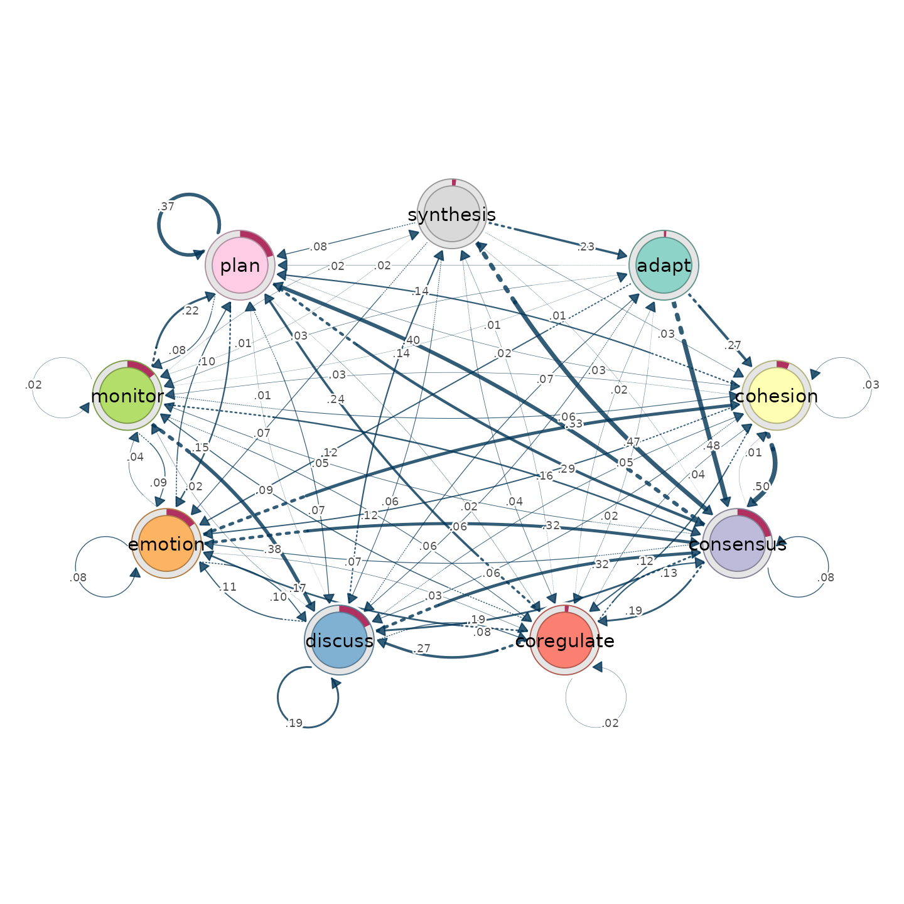
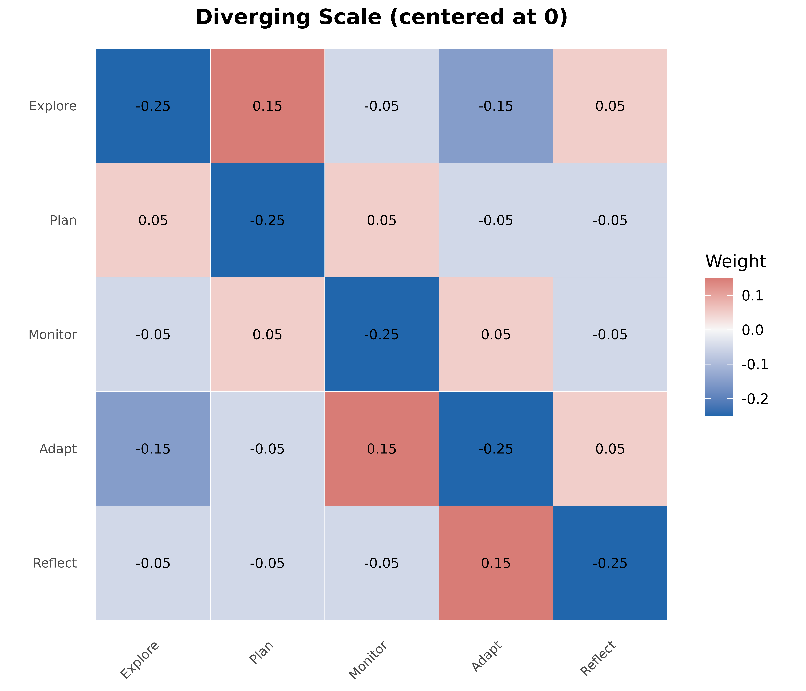
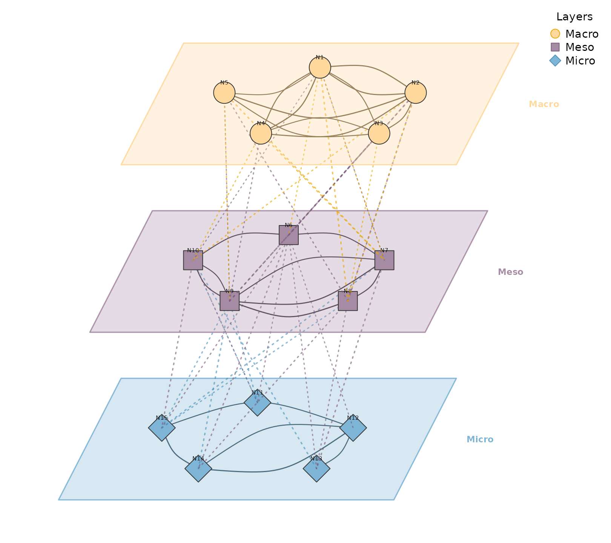
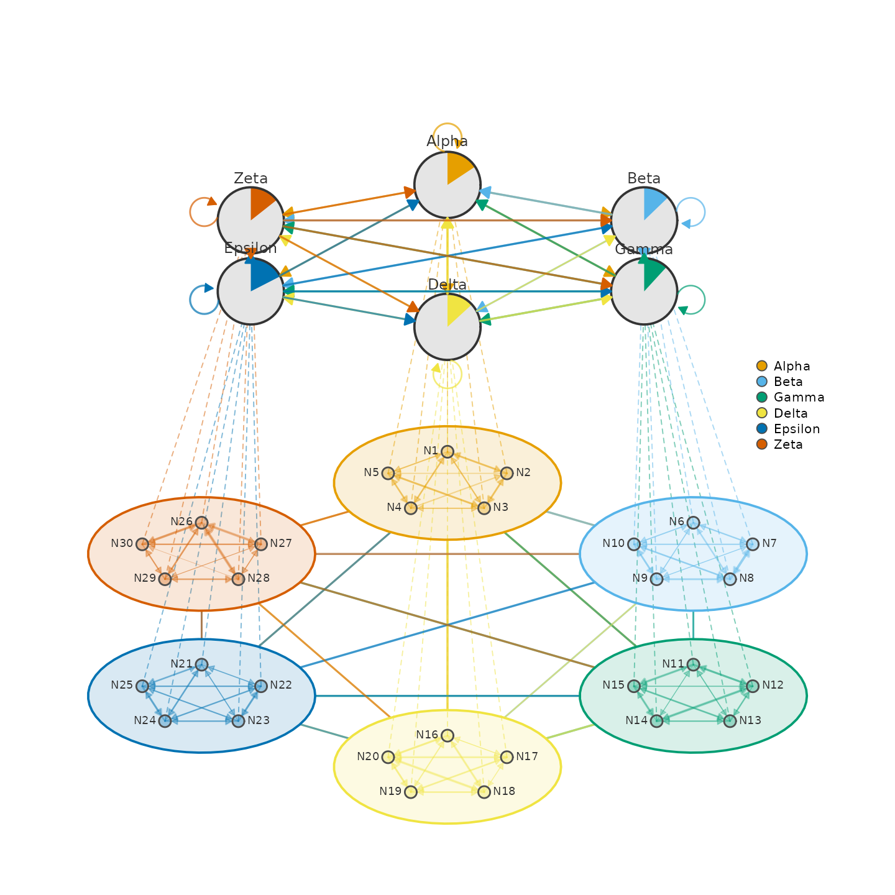

# Advanced examples

## Group Regulation Network

TNA model of group regulation processes.

``` r

model <- tna(group_regulation)
splot(model)
```



## Network with CI and P-values

Sophisticated edge labels showing confidence intervals and significance.

``` r

# 9 named nodes
nodes9 <- c("Explore", "Plan", "Execute", "Monitor",
            "Adapt", "Reflect", "Regulate", "Review", "Learn")

# Denser weight matrix
set.seed(99)
mat9 <- matrix(runif(81, 0, 0.5), 9, 9, dimnames = list(nodes9, nodes9))
diag(mat9) <- 0
# Keep ~60% of edges
mat9[mat9 < 0.2] <- 0

# Generate CI bounds and p-values
set.seed(42)
ci_lower <- mat9 * runif(81, 0.6, 0.8)
ci_upper <- mat9 * runif(81, 1.2, 1.4)
pvals <- matrix(NA, 9, 9)
pvals[mat9 > 0] <- runif(sum(mat9 > 0), 0.0001, 0.08)

splot(mat9,
  layout = "circle",
  node_size = 8,
  node_fill = "#4A90A4",
  node_border_color = "#2C5F6E",
  node_border_width = 2,
  label_size = 0.6,
  edge_color = "#666666",
  edge_width = 1.5,
  curvature = 0.15,
  edge_ci_lower = ci_lower,
  edge_ci_upper = ci_upper,
  edge_label_p = pvals,
  edge_label_stars = TRUE,
  edge_label_style = "full",
  edge_label_size = 0.65,
  edge_label_color = "#800020"
)
```


## Network with Significance Stars Only

Clean edge labels showing just weight and significance stars.

``` r

splot(mat9,
  layout = "circle",
  node_size = 8,
  node_fill = "#6B8E23",
  node_border_color = "#3D5214",
  node_border_width = 2,
  label_size = 0.6,
  edge_color = "#555555",
  edge_width = 1.5,
  curvature = 0.15,
  edge_label_p = pvals,
  edge_label_stars = TRUE,
  edge_label_template = "{est}{stars}",
  edge_label_size = 0.8,
  edge_label_color = "#800020"
)
```


## Double Donut Progress Rings

Nested progress rings showing two metrics per node.

``` r

# Create a simple network
mat10 <- matrix(runif(100, 0, 0.3), 10, 10)
diag(mat10) <- 0
colnames(mat10) <- rownames(mat10) <- LETTERS[1:10]

set.seed(6)
outer_fills <- runif(10, 0.4, 0.9)
inner_fills <- runif(10, 0.3, 0.8)

splot(mat10,
  layout = "circle",
  node_shape = "donut",
  donut_fill = outer_fills,
  donut_color = "steelblue",
  donut2_values = inner_fills,
  donut2_colors = "coral",
  node_size = 9,
  label_size = 0.6
)
```


## Donut with Pie Slices

Combining progress ring with categorical pie chart.

``` r

set.seed(5)
fills <- runif(10, 0.5, 0.9)
pie_vals <- lapply(1:10, function(i) runif(3))
pie_cols <- c("#E41A1C", "#377EB8", "#4DAF4A")

splot(mat10,
  layout = "circle",
  node_shape = "donut",
  donut_fill = fills,
  donut_color = "steelblue",
  pie_values = pie_vals,
  pie_colors = pie_cols,
  node_size = 9,
  label_size = 0.6
)
```


## Node Shapes Gallery

Selected node shapes with edge labels.

``` r

shapes <- c("circle", "square", "triangle", "diamond", "pentagon",
            "hexagon", "ellipse", "heart", "star", "cross")

splot(mat10,
  layout = "circle",
  node_shape = shapes,
  node_fill = palette_rainbow(10),
  node_size = 10,
  node_border_width = 2,
  label_size = 0.6,
  edge_labels = TRUE,
  edge_label_size = 0.4
)
```


## Diverging Scale Heatmap

For matrices with positive and negative values.

``` r

states <- c("Explore", "Plan", "Monitor", "Adapt", "Reflect")
mat <- matrix(
  c(0.0, 0.4, 0.2, 0.1, 0.3,
    0.3, 0.0, 0.3, 0.2, 0.2,
    0.2, 0.3, 0.0, 0.3, 0.2,
    0.1, 0.2, 0.4, 0.0, 0.3,
    0.2, 0.2, 0.2, 0.4, 0.0),
  nrow = 5, byrow = TRUE,
  dimnames = list(states, states)
)

# Create matrix with negative values
mat_div <- mat - 0.25

plot_heatmap(mat_div,
  colors = "diverging",
  midpoint = 0,
  title = "Diverging Scale (centered at 0)",
  show_values = TRUE,
  value_size = 3
)
```



## Multilayer Network

Stacked network layers with 3D perspective view.

``` r

set.seed(42)
nodes <- paste0("N", 1:15)
ml_mat <- matrix(runif(225, 0, 0.3), 15, 15)
diag(ml_mat) <- 0
colnames(ml_mat) <- rownames(ml_mat) <- nodes

layers <- list(
  Macro = paste0("N", 1:5),
  Meso = paste0("N", 6:10),
  Micro = paste0("N", 11:15)
)

plot_mlna(ml_mat, layers,
  layout = "circle",
  layer_spacing = 5,
  layer_width = 10,
  node_spacing = 0.9,
  node_size = 6,
  between_edges = TRUE,
  between_style = 3,
  curvature = 0.2,
  minimum = 0.2,
  scale = 2
)
```



## Multilayer Heatmap

3D perspective heatmaps with inter-layer connections.

``` r

set.seed(123)
nodes <- c("A", "B", "C", "D")
layers <- list(
  "Layer 1" = matrix(runif(16, 0, 0.5), 4, 4, dimnames = list(nodes, nodes)),
  "Layer 2" = matrix(runif(16, 0, 0.5), 4, 4, dimnames = list(nodes, nodes)),
  "Layer 3" = matrix(runif(16, 0, 0.5), 4, 4, dimnames = list(nodes, nodes))
)
for (i in seq_along(layers)) diag(layers[[i]]) <- 0

plot_ml_heatmap(layers,
  colors = "plasma",
  layer_spacing = 3,
  skew = 0.5,
  show_connections = TRUE,
  connection_color = "#2E7D32",
  title = "Custom Style"
)
```


## Multi-Cluster Multi-Layer Network

Two-layer visualization with detailed clusters below and summary network
above.

``` r

set.seed(42)
m <- matrix(runif(900, 0, 0.3), 30, 30)
diag(m) <- 0
colnames(m) <- rownames(m) <- paste0("N", 1:30)

clusters <- list(
  Alpha = paste0("N", 1:5),
  Beta = paste0("N", 6:10),
  Gamma = paste0("N", 11:15),
  Delta = paste0("N", 16:20),
  Epsilon = paste0("N", 21:25),
  Zeta = paste0("N", 26:30)
)

plot_mcml(m, clusters)
```



## Multi-Cluster Network

Clustered network with summary edges between clusters.

``` r

# Create network with 6 clusters
set.seed(42)
nodes <- paste0("N", 1:30)
m_clust <- matrix(runif(900, 0, 0.3), 30, 30)
diag(m_clust) <- 0
colnames(m_clust) <- rownames(m_clust) <- nodes

clusters6 <- list(
  Alpha = paste0("N", 1:5),
  Beta = paste0("N", 6:10),
  Gamma = paste0("N", 11:15),
  Delta = paste0("N", 16:20),
  Epsilon = paste0("N", 21:25),
  Zeta = paste0("N", 26:30)
)

# Circle layout with edge labels
clusters6_unnamed <- setNames(clusters6, NULL)
plot_mtna(m_clust, clusters6_unnamed,
  spacing = 4,
  shape_size = 1.3,
  node_spacing = 0.6,
  minimum = 0.2,
  legend = FALSE,
  edge.lwd = 0.2,
  edge.label.cex = 0.5
)
```


