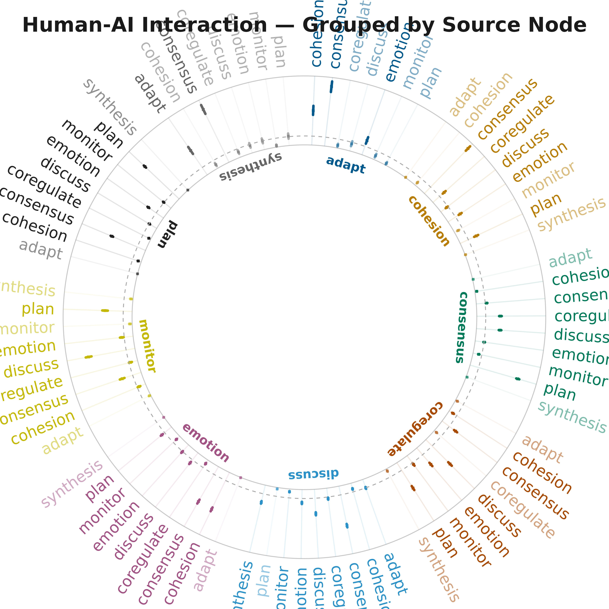

# Plotting TNA Models with splot

## 1. Single TNA Model — group_regulation

Build a TNA model from the `group_regulation` dataset (2000 sequences, 9
states).

``` r
data(group_regulation)
model <- tna(group_regulation)
```

### Basic Network Plot

``` r
splot(model,
      title = "Group Regulation TNA",
      minimum = 0.05)
```


## 2. Bootstrap Analysis

Run bootstrap resampling (1000 iterations) to assess edge significance
and confidence intervals.

``` r
set.seed(42)
boot <- bootstrap(model, iter = 1000)
```

``` r
sig_edges <- boot$summary[boot$summary$sig, ]
cat(sprintf("Significant edges: %d / %d\n", nrow(sig_edges), nrow(boot$summary)))
#> Significant edges: 51 / 78
head(sig_edges[order(sig_edges$p_value), ], 10)
#>          from        to     weight     p_value  sig   cr_lower   cr_upper
#> 5     discuss     adapt 0.07137434 0.000999001 TRUE 0.05353075 0.08921792
#> 9   synthesis     adapt 0.23466258 0.000999001 TRUE 0.17599693 0.29332822
#> 10      adapt  cohesion 0.27308448 0.000999001 TRUE 0.20481336 0.34135560
#> 14    discuss  cohesion 0.04758289 0.000999001 TRUE 0.03568717 0.05947861
#> 15    emotion  cohesion 0.32534367 0.000999001 TRUE 0.24400775 0.40667959
#> 17       plan  cohesion 0.02517460 0.000999001 TRUE 0.01888095 0.03146825
#> 19      adapt consensus 0.47740668 0.000999001 TRUE 0.35805501 0.59675835
#> 20   cohesion consensus 0.49793510 0.000999001 TRUE 0.37345133 0.62241888
#> 21  consensus consensus 0.08200348 0.000999001 TRUE 0.06150261 0.10250435
#> 22 coregulate consensus 0.13451777 0.000999001 TRUE 0.10088832 0.16814721
#>      ci_lower   ci_upper
#> 5  0.06380715 0.08001081
#> 9  0.20156075 0.26888806
#> 10 0.23990971 0.31203056
#> 14 0.04110513 0.05353159
#> 15 0.30902433 0.34318567
#> 17 0.02145591 0.02934643
#> 19 0.43274713 0.51731885
#> 20 0.47293205 0.52218913
#> 21 0.07575667 0.08881174
#> 22 0.11951905 0.14968376
```

### Bootstrap — Significant Edges Only

``` r
splot(boot,
      display = "significant",
      title = "Bootstrap — Significant Edges",
      show_stars = TRUE)
```


### Bootstrap — Full Network with Styling

Non-significant edges shown as dashed gray lines.

``` r
splot(boot,
      display = "styled",
      title = "Bootstrap — Styled (sig=solid, nonsig=dashed)",
      show_stars = TRUE,
      threshold  = 0.02)
```


### Bootstrap — Confidence Intervals

``` r
splot(boot,
      display = "ci",
      title = "Bootstrap — With Confidence Intervals",
      show_ci = TRUE,
      minimum = 0.05)
```


``` r
plot_bootstrap_forest(boot, layout = "grouped",
  title = "Human-AI Interaction — Grouped by Source Node")
```



## 3. Simulated Group TNA + Permutation Test

Generate two group TNA networks then compare with permutation testing.

``` r
set.seed(123)
group_models <- group_tna(group_regulation, 
                          group = c(rep("H", 1000), rep("L", 1000)))
```

### Plot Each Group

``` r
par(mfrow = c(1, 2))
splot(group_models[[1]], title = "Group 1", minimum = 0.05)
splot(group_models[[2]], title = "Group 2", minimum = 0.05)
```


### Difference Network

``` r
cograph::plot_compare(
  group_models[[1]], group_models[[2]],
  title = "Group 1 vs Group 2 — Difference Network")
```


### Permutation Test

``` r
set.seed(42)
perm <- tna::permutation_test(group_models[[1]], group_models[[2]], iter = 1000)
```

``` r
perm
#> # A tibble: 81 × 4
#>    edge_name           diff_true effect_size  p_value
#>    <chr>                   <dbl>       <dbl>    <dbl>
#>  1 adapt -> adapt       0           NaN      1       
#>  2 cohesion -> adapt    0.00533       2.03   0.0529  
#>  3 consensus -> adapt  -0.00132      -0.764  0.417   
#>  4 coregulate -> adapt  0.0112        1.99   0.0450  
#>  5 discuss -> adapt    -0.0962      -11.5    0.000999
#>  6 emotion -> adapt     0.00167       0.913  0.443   
#>  7 monitor -> adapt    -0.000192     -0.0351 0.946   
#>  8 plan -> adapt        0.000771      0.942  0.241   
#>  9 synthesis -> adapt  -0.158        -4.83   0.000999
#> 10 adapt -> cohesion   -0.0148       -0.381  0.699   
#> # ℹ 71 more rows
```

### Permutation Test — Network

``` r
cograph::plot_permutation(perm,
      title = "Permutation Test — Significant Differences",
      show_nonsig = TRUE)
```


