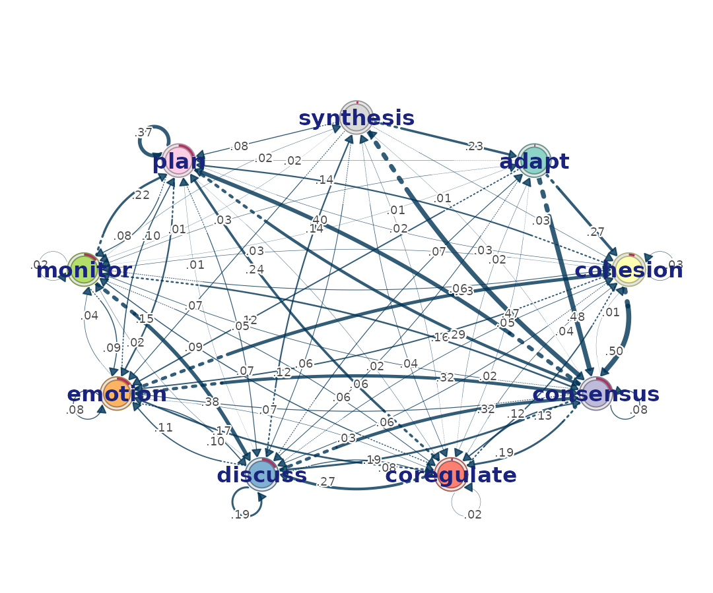
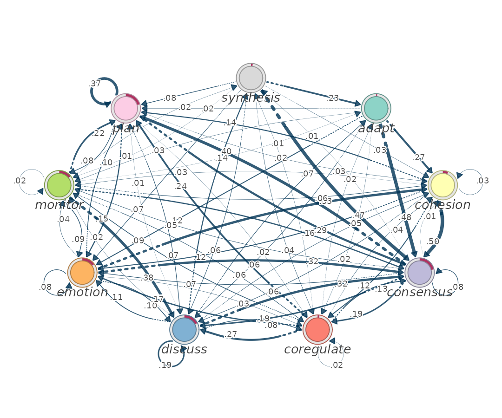
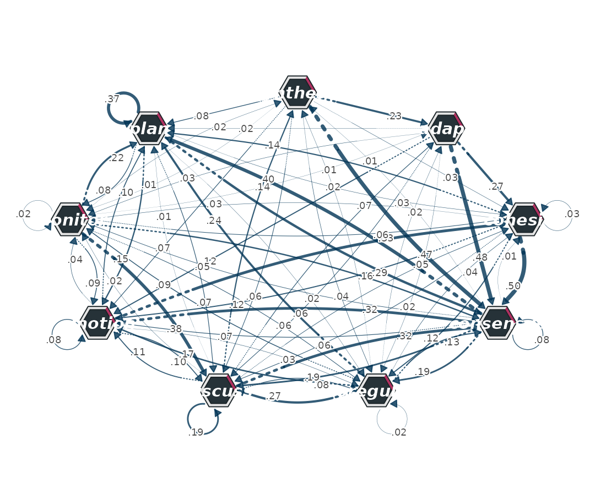
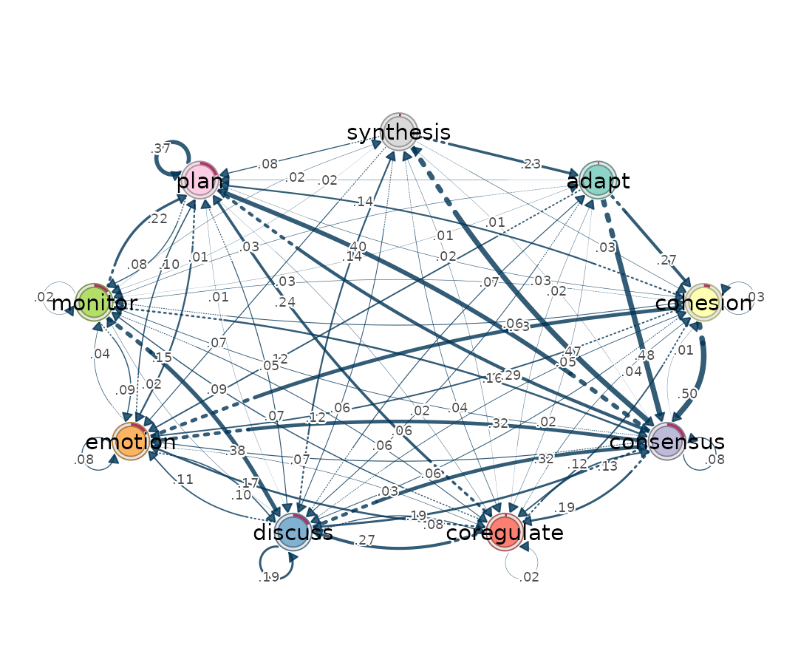
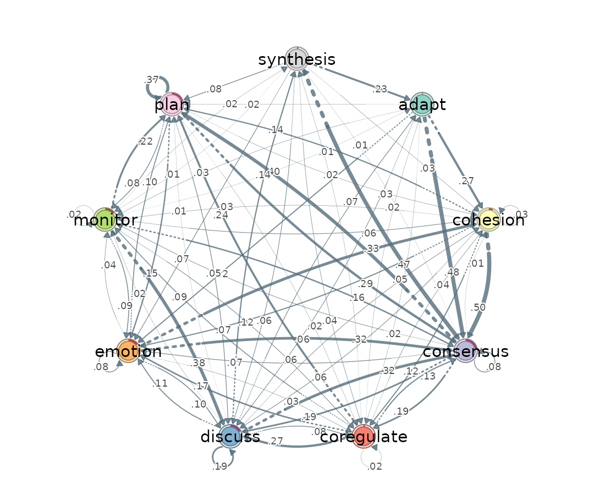
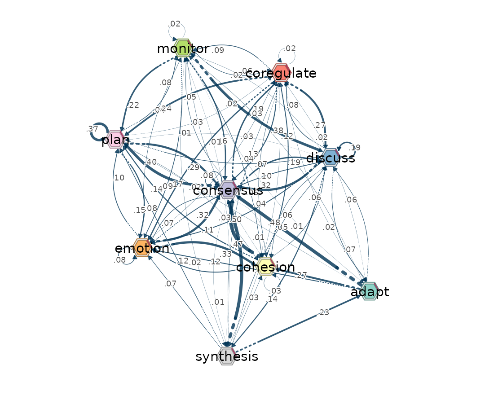
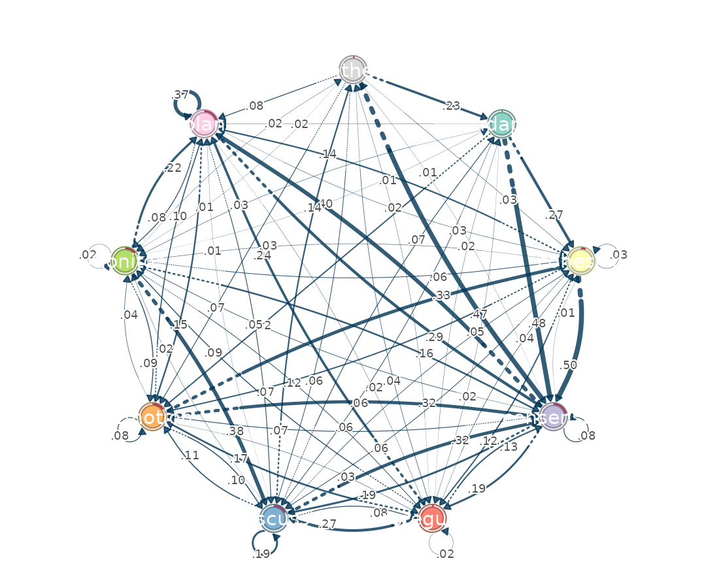
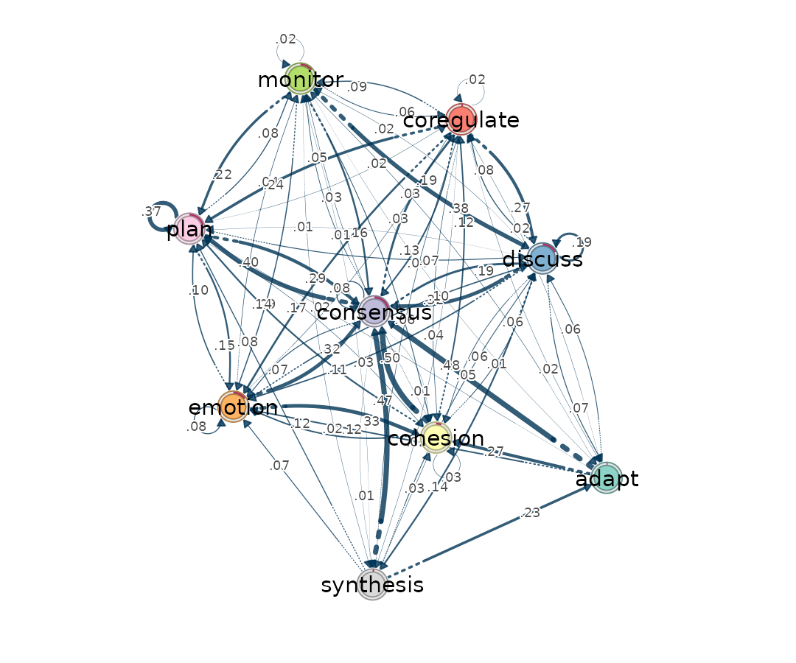

# Plotting TNA Models with splot

## Introduction

The `cograph` package provides network visualization for Transition
Network Analysis (TNA) models through
[`splot()`](http://sonsoles.me/cograph/reference/splot.md). This
vignette showcases node styling, shapes, fonts, and creative layouts.

## Loading Data

``` r
model <- tna(group_regulation)
weights <- model$weights
labels <- model$labels
n <- length(labels)
initial_probs <- model$initial_probs
```

## Basic Plot

``` r
splot(model)
```


Default TNA plot

## Node Shapes Gallery

Available shapes: `"circle"`, `"square"`, `"triangle"`, `"diamond"`,
`"pentagon"`, `"hexagon"`, `"ellipse"`, `"heart"`, `"star"`

``` r

# Hexagons - modern technical look
splot(model, node_shape = "hexagon", node_size = 5, node_fill = "#37474F")
```


Node shape gallery

``` r

# Diamonds - elegant emphasis
splot(model, node_shape = "diamond", node_size = 5, node_fill = "#6A1B9A")
```


Node shape gallery

``` r

# Stars - highlight key nodes
splot(model, node_shape = "star", node_size = 6, node_fill = "#FF6F00")
```


Node shape gallery

``` r

# Pentagons - distinctive grouping
splot(model, node_shape = "pentagon", node_size = 5, node_fill = "#00695C")
```


Node shape gallery

## Shape Groupings

Use shapes to encode node categories:

``` r
# Binary grouping (e.g., regulatory vs non-regulatory)
splot(model,
      node_shape = rep(c("circle", "square"), length.out = n),
      node_fill = rep(c("#1976D2", "#D32F2F"), length.out = n),
      node_size = 5)
```


Shape-based categorization

``` r

# Three-category grouping
splot(model,
      node_shape = rep(c("hexagon", "diamond", "triangle"), length.out = n),
      node_fill = rep(c("#2E7D32", "#F57C00", "#7B1FA2"), length.out = n),
      node_border_color = "white",
      node_border_width = 2,
      node_size = 5)
```


Shape-based categorization

``` r

# Four-category with varied shapes
splot(model,
      node_shape = rep(c("circle", "square", "pentagon", "star"), length.out = n),
      node_fill = rep(c("#0288D1", "#C2185B", "#689F38", "#FFA000"), length.out = n),
      node_size = 5)
```


Shape-based categorization

## Font Styling

``` r
# Bold labels with custom color
splot(model,
      node_size = 4,
      label_size = 1.1,
      label_fontface = "bold",
      label_color = "#1A237E")
```



Font customization

``` r

# Italic labels below nodes
splot(model,
      node_size = 5,
      label_position = "below",
      label_size = 0.9,
      label_fontface = "italic",
      label_color = "#424242")
```



Font customization

``` r

# Bold italic with colored nodes
splot(model,
      node_shape = "hexagon",
      node_fill = "#263238",
      node_size = 5,
      label_size = 1.0,
      label_fontface = "bold.italic",
      label_color = "white")
```



Font customization

## Layout Algorithms

### Circle Layout

Nodes arranged in a circle - ideal for cyclic processes:

``` r
splot(model, layout = "circle", node_size = 4)
```


Circle layout

### Spring Layout

Force-directed layout reveals natural clusters:

``` r
splot(model, layout = "spring", node_size = 4)
```


Spring (force-directed) layout

### Oval Layout

Default TNA layout - wider than circle:

``` r
splot(model, layout = "oval", node_size = 4)
```



Oval layout

## Custom Layouts

### Two-Row Layout

``` r
layout_2row <- cbind(
  x = rep(seq(-1, 1, length.out = ceiling(n/2)), 2)[1:n],
  y = rep(c(0.5, -0.5), each = ceiling(n/2))[1:n]
)
splot(model, layout = layout_2row, node_size = 4, layout_scale = 1.2)
```


Two-row horizontal layout

### Three-Row Layout

``` r
rows <- rep(1:3, length.out = n)
layout_3row <- cbind(
  x = sapply(1:n, function(i) {
    row_nodes <- which(rows == rows[i])
    pos <- which(row_nodes == i)
    seq(-1, 1, length.out = length(row_nodes))[pos]
  }),
  y = (2 - rows) * 0.7
)
splot(model, layout = layout_3row, node_size = 4, layout_scale = 1.3)
```


Three-row hierarchical layout

### Diamond Layout

``` r
angles <- seq(0, 2*pi, length.out = n + 1)[1:n] + pi/4
radii <- rep(c(0.6, 1), length.out = n)
layout_diamond <- cbind(
  x = radii * cos(angles),
  y = radii * sin(angles)
)
splot(model, layout = layout_diamond, node_size = 4, layout_scale = 1.1)
```


Diamond formation

### Spiral Layout

``` r
t <- seq(0, 2.5*pi, length.out = n)
layout_spiral <- cbind(
  x = t/max(t) * cos(t),
  y = t/max(t) * sin(t)
)
splot(model, layout = layout_spiral, node_size = 4, layout_scale = 1.2)
```


Spiral arrangement

### Grid Layout

``` r
ncol <- ceiling(sqrt(n))
nrow <- ceiling(n / ncol)
layout_grid <- cbind(
  x = ((1:n - 1) %% ncol) / max(1, ncol - 1) * 2 - 1,
  y = -((1:n - 1) %/% ncol) / max(1, nrow - 1) * 2 + 1
)
splot(model, layout = layout_grid, node_size = 4, layout_scale = 1.1)
```


Grid arrangement

### Radial Clusters

``` r
# Central node with outer ring
layout_radial <- rbind(
  c(0, 0),  # Central node
  cbind(
    cos(seq(0, 2*pi, length.out = n)),
    sin(seq(0, 2*pi, length.out = n))
  )[1:(n-1), ]
)
splot(model,
      layout = layout_radial,
      node_size = c(6, rep(4, n-1)),
      node_fill = c("#D32F2F", rep("#1976D2", n-1)),
      layout_scale = 1.1)
```


Radial cluster layout

### Arc Layout

``` r
angles <- seq(pi/6, 5*pi/6, length.out = n)
layout_arc <- cbind(
  x = cos(angles),
  y = sin(angles) - 0.3
)
splot(model, layout = layout_arc, node_size = 4, layout_scale = 1.3)
```


Arc arrangement

## Combining Elements

### Shapes + Layout + Fonts

``` r
splot(model,
      layout = "circle",
      node_shape = rep(c("hexagon", "diamond"), length.out = n),
      node_fill = rep(c("#1565C0", "#C62828"), length.out = n),
      node_border_color = "white",
      node_border_width = 2,
      node_size = 5,
      label_fontface = "bold",
      label_size = 0.9)
```


Combined styling: shapes, layout, fonts

### Hierarchical with Donuts

``` r
splot(model,
      layout = layout_3row,
      layout_scale = 1.3,
      donut_fill = initial_probs,
      donut_color = "#1976D2",
      donut_inner_ratio = 0.5,
      node_size = 5,
      label_position = "below",
      label_fontface = "bold")
```


Hierarchical layout with donut charts

### Radial with Categories

``` r
splot(model,
      layout = layout_radial,
      layout_scale = 1.2,
      node_shape = c("star", rep(c("circle", "square"), length.out = n-1)),
      node_fill = c("#FF5722", rep(c("#2196F3", "#4CAF50"), length.out = n-1)),
      node_size = c(7, rep(4, n-1)),
      label_fontface = "bold",
      edge_start_style = "dotted")
```


Radial layout with shape categories

## Edge Styling

``` r
# Dotted start segments show direction
splot(model,
      layout = "circle",
      node_size = 4,
      edge_start_style = "dotted",
      edge_start_length = 0.2,
      edge_color = "#546E7A")
```



Edge customization

``` r

# Arrows with custom styling
splot(model,
      layout = "spring",
      node_shape = "hexagon",
      node_size = 4,
      show_arrows = TRUE,
      arrow_size = 0.5,
      curvature = 0.3)
```



Edge customization

## Themes

``` r
# Dark theme for presentations
splot(model, theme = "dark", node_size = 4, layout = "circle")
```



Built-in themes

``` r

# Grayscale for print
splot(model, theme = "gray", node_size = 4, layout = "spring")
```



Built-in themes

## Publication Example

``` r
splot(model,
      # Layout
      layout = "circle",
      layout_scale = 1.2,

      # Nodes
      node_shape = "hexagon",
      node_size = 5,
      donut_fill = initial_probs,
      donut_color = "#1976D2",
      donut_inner_ratio = 0.55,
      donut_border_color = "white",

      # Labels
      label_size = 0.9,
      label_fontface = "bold",
      label_color = "gray20",

      # Edges
      edge_start_style = "dotted",
      edge_start_length = 0.15,
      edge_width_range = c(0.5, 4),
      curvature = 0.3,
      threshold = 0.05,

      # Title
      title = "Group Regulation Transitions")
```


Publication-ready visualization

## Summary

| Feature | Parameters                                                               |
|---------|--------------------------------------------------------------------------|
| Shapes  | `node_shape`: circle, square, triangle, diamond, pentagon, hexagon, star |
| Fonts   | `label_fontface`: plain, bold, italic, bold.italic                       |
| Layouts | `layout`: circle, spring, oval, or custom matrix                         |
| Donuts  | `donut_fill`, `donut_color`, `donut_inner_ratio`                         |
| Edges   | `edge_start_style`, `show_arrows`, `curvature`                           |

See [`?splot`](http://sonsoles.me/cograph/reference/splot.md) for the
complete parameter reference.
