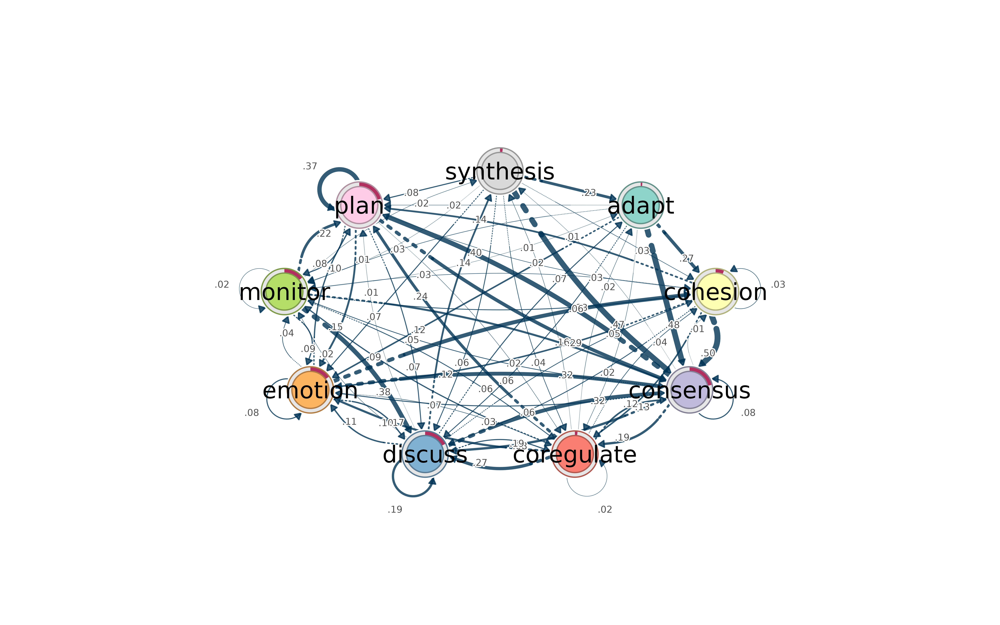
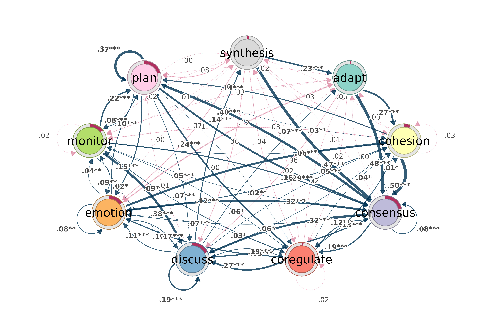
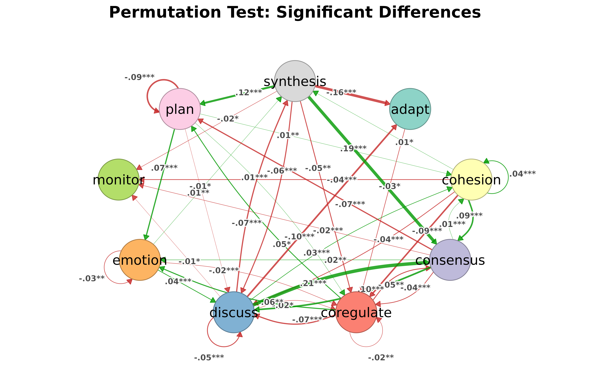

# Why cograph?

``` r

library(tna)
library(cograph)
```

## Do we need another network package?

R already has igraph for computation and qgraph for psychometric
networks. tidygraph tries to unify things with a dplyr grammar. So why
write another one?

The short answer: none of these packages let you go from a raw matrix to
a filtered, annotated, publication-ready figure without switching
between ecosystems, reformatting objects, or writing boilerplate.
cograph tries to close that gap.

This document walks through the specific things cograph does
differently, with working examples.

## Filtering and selecting — like data frames

In igraph, subsetting a network means calling `induced_subgraph()`,
`delete_edges()`, or indexing into `V(g)` and `E(g)`. In tidygraph, you
need `activate(nodes) |> filter(...)`. Both approaches require you to
think about the object structure.

cograph lets you filter nodes and edges with expressions that look like
[`subset()`](https://rdrr.io/r/base/subset.html):

``` r

mat <- matrix(c(
  0.0, 0.5, 0.8, 0.1, 0.0,
  0.3, 0.0, 0.2, 0.6, 0.4,
  0.7, 0.1, 0.0, 0.3, 0.5,
  0.0, 0.4, 0.2, 0.0, 0.9,
  0.1, 0.3, 0.6, 0.8, 0.0
), 5, 5, byrow = TRUE)
rownames(mat) <- colnames(mat) <- c("Read", "Write", "Plan", "Code", "Test")
net <- as_cograph(mat)
```

Keep only edges above a threshold:

``` r

strong <- filter_edges(net, weight > 0.5)
get_edges(strong)
#>   from to weight
#> 1    3  1    0.7
#> 2    1  3    0.8
#> 3    5  3    0.6
#> 4    2  4    0.6
#> 5    5  4    0.8
#> 6    4  5    0.9
```

Keep nodes that have high degree *and* high PageRank — the centrality
measures are computed on the fly:

``` r

hubs <- filter_nodes(net, degree >= 3 & pagerank > 0.15)
get_nodes(hubs)
#>   id label  name  x  y
#> 1  1  Read  Read NA NA
#> 2  2 Write Write NA NA
#> 3  3  Plan  Plan NA NA
#> 4  4  Code  Code NA NA
#> 5  5  Test  Test NA NA
```

### Structural selections

[`select_nodes()`](https://sonsoles.me/cograph/reference/select_nodes.md)
goes further. It knows about components, neighborhoods, articulation
points, and k-cores — and it computes them lazily (only what your
expression actually references):

``` r

# Top 3 nodes by betweenness
top3 <- select_top(net, n = 3, by = "betweenness")
get_nodes(top3)
#>   id label  name  x  y
#> 1  1 Write Write NA NA
#> 2  2  Plan  Plan NA NA
#> 3  3  Code  Code NA NA
```

``` r

# Ego network: everything within 1 hop of "Code"
ego <- select_neighbors(net, of = "Code", order = 1)
get_nodes(ego)
#>   id label  name  x  y
#> 1  1  Read  Read NA NA
#> 2  2 Write Write NA NA
#> 3  3  Plan  Plan NA NA
#> 4  4  Code  Code NA NA
#> 5  5  Test  Test NA NA
```

For edges, you can select by structure too:

``` r

# Edges involving "Code"
code_edges <- select_edges_involving(net, nodes = "Code")
get_edges(code_edges)
#>   from to weight
#> 1    4  2    0.4
#> 2    4  3    0.2
#> 3    1  4    0.1
#> 4    2  4    0.6
#> 5    3  4    0.3
#> 6    5  4    0.8
#> 7    4  5    0.9
```

``` r

# Top 5 edges by weight
top5 <- select_top_edges(net, n = 5)
get_edges(top5)
#>   from to weight
#> 1    2  1    0.7
#> 2    1  2    0.8
#> 3    4  2    0.6
#> 4    4  3    0.8
#> 5    3  4    0.9
```

``` r

# Edges between two node sets
between <- select_edges_between(net,
  set1 = c("Read", "Write"),
  set2 = c("Code", "Test")
)
get_edges(between)
#>   from to weight
#> 1    4  1    0.1
#> 2    3  2    0.4
#> 3    4  2    0.3
#> 4    1  3    0.1
#> 5    2  3    0.6
#> 6    2  4    0.4
```

### Format in, same format out

If you pass a matrix, you can get a matrix back:

``` r

filter_edges(mat, weight > 0.5, keep_format = TRUE)
#>       Read Write Plan Code Test
#> Read   0.0     0  0.8  0.0  0.0
#> Write  0.0     0  0.0  0.6  0.0
#> Plan   0.7     0  0.0  0.0  0.0
#> Code   0.0     0  0.0  0.0  0.9
#> Test   0.0     0  0.6  0.8  0.0
```

Same for igraph objects. No lock-in.

## Centrality — one call, tidy table

igraph requires a separate function for each centrality measure, and
each returns a different format. `page_rank(g)` gives you a list with
`$vector`. `betweenness(g)` gives a named numeric. Building a comparison
table takes 10+ lines.

In cograph, one call with the built-in edge-list data returns a tidy
centrality table:

``` r

data(student_interactions)
centrality(student_interactions)
#>    node degree_all strength_all closeness_all betweenness  eigenvector
#> 1    Ac         33          129    0.01754386   26.342857 1.000000e+00
#> 2    Ad         20           36    0.01754386   42.541520 1.096110e-01
#> 3    Fi         24           51    0.01666667   35.721634 1.789565e-01
#> 4    Ik         14           24    0.01666667   25.844874 1.551369e-02
#> 5    Vx         26           43    0.01960784   90.717124 7.238902e-02
#> 6    Rt         20           37    0.01785714   63.135739 1.159931e-01
#> 7    Km         11           16    0.01639344   18.175108 2.804725e-02
#> 8    Gj         19           31    0.01818182  114.599049 3.265786e-02
#> 9    Bd         12           18    0.01612903   21.769264 9.607736e-03
#> 10   Ce         10           13    0.01612903   16.648629 4.473504e-03
#> 11   Oq         14           20    0.01754386   34.151726 2.293068e-02
#> 12   Ya         13           19    0.01612903   18.216122 1.758656e-02
#> 13   Mo         12           17    0.01587302   38.264502 1.003629e-01
#> 14   Hj         12           19    0.01754386   85.816522 2.013125e-02
#> 15   Tv         10           13    0.01666667   25.916306 1.320877e-02
#> 16   Eg         10           12    0.01639344   22.335171 5.783916e-03
#> 17   Pr         11           18    0.01666667   23.974060 7.602231e-02
#> 18   Qs         15           19    0.01785714   76.910851 1.511764e-02
#> 19   Xz         14           18    0.01639344   22.280159 8.533484e-03
#> 20   Np          8            8    0.01666667   12.044048 1.549052e-02
#> 21   Dg         13           13    0.01886792   29.240901 6.260099e-03
#> 22   Hk         16           25    0.01818182   72.176441 1.201845e-01
#> 23   Wy         11           16    0.01639344   34.014358 1.054705e-03
#> 24   Jl         15           18    0.01818182   67.359085 5.009801e-02
#> 25   Fh         21           55    0.01818182   78.588877 2.817489e-01
#> 26   Zb          7            8    0.01538462    9.583333 5.429715e-05
#> 27   Eh          7           13    0.01428571   34.325000 1.163185e-03
#> 28   Be         14           16    0.01851852  105.250898 2.203252e-03
#> 29   Df          8           10    0.01562500   11.026190 4.800876e-06
#> 30   Cf         12           15    0.01724138  119.109163 1.243207e-02
#> 31   Su          6            9    0.01369863   33.154401 1.028472e-04
#> 32   Ln          7            8    0.01408451    5.749708 1.376854e-02
#> 33   Gi          3            4    0.01351351    0.000000 3.768001e-18
#> 34   Uw          4            7    0.01250000    0.000000 0.000000e+00
#>       pagerank
#> 1  0.285861728
#> 2  0.052985644
#> 3  0.077591140
#> 4  0.024836857
#> 5  0.057364714
#> 6  0.042552472
#> 7  0.016655998
#> 8  0.025444498
#> 9  0.014321668
#> 10 0.010679742
#> 11 0.016087378
#> 12 0.016588876
#> 13 0.031180263
#> 14 0.019051413
#> 15 0.012644206
#> 16 0.010425091
#> 17 0.022794289
#> 18 0.019784870
#> 19 0.013229134
#> 20 0.008466679
#> 21 0.010345027
#> 22 0.040383192
#> 23 0.009067435
#> 24 0.020529375
#> 25 0.070538086
#> 26 0.005635780
#> 27 0.010080122
#> 28 0.009378924
#> 29 0.004957518
#> 30 0.017877547
#> 31 0.005136500
#> 32 0.007628879
#> 33 0.005483193
#> 34 0.004411765
```

That includes degree, strength, closeness, betweenness, eigenvector
centrality, and PageRank. No igraph conversion, no transition-matrix
helper, no wrapper.

Less common measures are available through the same wrapper style:

``` r

centrality_harmonic(student_interactions)
#>       Ac       Ad       Fi       Ik       Vx       Rt       Km       Gj 
#> 21.33333 21.66667 20.50000 20.16667 24.00000 21.50000 19.66667 22.00000 
#>       Bd       Ce       Oq       Ya       Mo       Hj       Tv       Eg 
#> 19.50000 19.50000 21.66667 20.16667 19.33333 21.33333 19.83333 20.00000 
#>       Pr       Qs       Xz       Np       Dg       Hk       Wy       Jl 
#> 19.83333 21.83333 20.33333 20.16667 23.00000 22.00000 20.00000 22.33333 
#>       Fh       Zb       Eh       Be       Df       Cf       Su       Ln 
#> 22.00000 18.33333 16.83333 22.50000 18.83333 20.83333 16.33333 17.33333 
#>       Gi       Uw 
#> 15.83333 14.83333
```

Need just one measure as a named vector? Use the wrapper:

``` r

centrality_pagerank(student_interactions)
#>          Ac          Ad          Fi          Ik          Vx          Rt 
#> 0.285861728 0.052985644 0.077591140 0.024836857 0.057364714 0.042552472 
#>          Km          Gj          Bd          Ce          Oq          Ya 
#> 0.016655998 0.025444498 0.014321668 0.010679742 0.016087378 0.016588876 
#>          Mo          Hj          Tv          Eg          Pr          Qs 
#> 0.031180263 0.019051413 0.012644206 0.010425091 0.022794289 0.019784870 
#>          Xz          Np          Dg          Hk          Wy          Jl 
#> 0.013229134 0.008466679 0.010345027 0.040383192 0.009067435 0.020529375 
#>          Fh          Zb          Eh          Be          Df          Cf 
#> 0.070538086 0.005635780 0.010080122 0.009378924 0.004957518 0.017877547 
#>          Su          Ln          Gi          Uw 
#> 0.005136500 0.007628879 0.005483193 0.004411765
```

``` r

centrality_betweenness(student_interactions)
#>         Ac         Ad         Fi         Ik         Vx         Rt         Km 
#>  26.342857  42.541520  35.721634  25.844874  90.717124  63.135739  18.175108 
#>         Gj         Bd         Ce         Oq         Ya         Mo         Hj 
#> 114.599049  21.769264  16.648629  34.151726  18.216122  38.264502  85.816522 
#>         Tv         Eg         Pr         Qs         Xz         Np         Dg 
#>  25.916306  22.335171  23.974060  76.910851  22.280159  12.044048  29.240901 
#>         Hk         Wy         Jl         Fh         Zb         Eh         Be 
#>  72.176441  34.014358  67.359085  78.588877   9.583333  34.325000 105.250898 
#>         Df         Cf         Su         Ln         Gi         Uw 
#>  11.026190 119.109163  33.154401   5.749708   0.000000   0.000000
```

You can normalize, sort, and round in the same call:

``` r

centrality(student_interactions, normalized = TRUE,
           sort_by = "pagerank", digits = 3)
#>    node degree_all strength_all closeness_all betweenness eigenvector pagerank
#> 1    Ac      1.000        1.000         0.579       0.221       1.000    1.000
#> 2    Fi      0.727        0.395         0.550       0.300       0.179    0.271
#> 3    Fh      0.636        0.426         0.600       0.660       0.282    0.247
#> 4    Vx      0.788        0.333         0.647       0.762       0.072    0.201
#> 5    Ad      0.606        0.279         0.579       0.357       0.110    0.185
#> 6    Rt      0.606        0.287         0.589       0.530       0.116    0.149
#> 7    Hk      0.485        0.194         0.600       0.606       0.120    0.141
#> 8    Mo      0.364        0.132         0.524       0.321       0.100    0.109
#> 9    Gj      0.576        0.240         0.600       0.962       0.033    0.089
#> 10   Ik      0.424        0.186         0.550       0.217       0.016    0.087
#> 11   Pr      0.333        0.140         0.550       0.201       0.076    0.080
#> 12   Jl      0.455        0.140         0.600       0.566       0.050    0.072
#> 13   Qs      0.455        0.147         0.589       0.646       0.015    0.069
#> 14   Hj      0.364        0.147         0.579       0.720       0.020    0.067
#> 15   Cf      0.364        0.116         0.569       1.000       0.012    0.063
#> 16   Km      0.333        0.124         0.541       0.153       0.028    0.058
#> 17   Ya      0.394        0.147         0.532       0.153       0.018    0.058
#> 18   Oq      0.424        0.155         0.579       0.287       0.023    0.056
#> 19   Bd      0.364        0.140         0.532       0.183       0.010    0.050
#> 20   Xz      0.424        0.140         0.541       0.187       0.009    0.046
#> 21   Tv      0.303        0.101         0.550       0.218       0.013    0.044
#> 22   Ce      0.303        0.101         0.532       0.140       0.004    0.037
#> 23   Eg      0.303        0.093         0.541       0.188       0.006    0.036
#> 24   Dg      0.394        0.101         0.623       0.245       0.006    0.036
#> 25   Eh      0.212        0.101         0.471       0.288       0.001    0.035
#> 26   Be      0.424        0.124         0.611       0.884       0.002    0.033
#> 27   Wy      0.333        0.124         0.541       0.286       0.001    0.032
#> 28   Np      0.242        0.062         0.550       0.101       0.015    0.030
#> 29   Ln      0.212        0.062         0.465       0.048       0.014    0.027
#> 30   Zb      0.212        0.062         0.508       0.080       0.000    0.020
#> 31   Gi      0.091        0.031         0.446       0.000       0.000    0.019
#> 32   Su      0.182        0.070         0.452       0.278       0.000    0.018
#> 33   Df      0.242        0.078         0.516       0.093       0.000    0.017
#> 34   Uw      0.121        0.054         0.412       0.000       0.000    0.015
```

### Edge-level centrality

``` r

edge_centrality(net, sort_by = "betweenness", digits = 3)
#>     from    to weight betweenness overlap shared_neighbors triangles
#> 1   Code  Plan    0.2         8.0       1                3         3
#> 2   Read  Code    0.1         7.0       1                3         3
#> 3   Plan Write    0.1         6.5       1                3         3
#> 4  Write  Read    0.3         4.0       1                3         3
#> 5   Test  Read    0.1         3.0       1                3         3
#> 6  Write  Test    0.4         2.5       1                3         3
#> 7   Plan  Test    0.5         1.5       1                3         3
#> 8   Test Write    0.3         1.0       1                3         3
#> 9  Write  Plan    0.2         1.0       1                3         3
#> 10  Plan  Code    0.3         1.0       1                3         3
#> 11  Plan  Read    0.7         0.0       1                3         3
#> 12  Read Write    0.5         0.0       1                3         3
#> 13  Code Write    0.4         0.0       1                3         3
#> 14  Read  Plan    0.8         0.0       1                3         3
#> 15  Test  Plan    0.6         0.0       1                3         3
#> 16 Write  Code    0.6         0.0       1                3         3
#> 17  Test  Code    0.8         0.0       1                3         3
#> 18  Code  Test    0.9         0.0       1                3         3
#>    reciprocated reverse_weight weight_ratio
#> 1          TRUE            0.3        1.500
#> 2         FALSE             NA           NA
#> 3          TRUE            0.2        2.000
#> 4          TRUE            0.5        1.667
#> 5         FALSE             NA           NA
#> 6          TRUE            0.3        0.750
#> 7          TRUE            0.6        1.200
#> 8          TRUE            0.4        1.333
#> 9          TRUE            0.1        0.500
#> 10         TRUE            0.2        0.667
#> 11         TRUE            0.8        1.143
#> 12         TRUE            0.3        0.600
#> 13         TRUE            0.6        1.500
#> 14         TRUE            0.7        0.875
#> 15         TRUE            0.5        0.833
#> 16         TRUE            0.4        0.667
#> 17         TRUE            0.9        1.125
#> 18         TRUE            0.8        0.889
```

### Network-level summary

One-row data frame with density, diameter, transitivity, centralization,
reciprocity, and more:

``` r

network_summary(net, digits = 3)
#>   node_count edge_count density component_count diameter mean_distance min_cut
#> 1          5         18     0.9               1      0.8          0.35       3
#>   centralization_degree centralization_in_degree centralization_out_degree
#> 1                 0.125                      0.1                       0.1
#>   centralization_betweenness centralization_closeness centralization_eigen
#> 1                      0.028                        0                0.097
#>   transitivity reciprocity assortativity_degree hub_score authority_score
#> 1        1.009         0.8                -0.25        NA              NA
```

Add `detailed = TRUE` for mean/sd of node-level measures, or
`extended = TRUE` for girth, radius, global efficiency, etc.

## Community detection — one call

igraph has `cluster_louvain()`, `cluster_walktrap()`, etc. — different
function per algorithm, inconsistent parameter names. cograph wraps all
of them behind one function with a default:

``` r

# Undirected network for community detection
sym <- (mat + t(mat)) / 2
diag(sym) <- 0
cograph::communities(sym)
#> Community structure (louvain)
#>   Nodes: 5  | Communities: 2  | Modularity: 0.0985 
#>   Sizes: 2, 3 
#> 
#>   node community
#>   Read         1
#>  Write         2
#>   Plan         1
#>   Code         2
#>   Test         2
```

Pick a different algorithm by name, or use two-letter shorthands:

``` r

cograph::communities(sym, method = "walktrap")
#> Community structure (walktrap)
#>   Nodes: 5  | Communities: 2  | Modularity: 0.0985 
#>   Sizes: 2, 3 
#> 
#>   node community
#>   Read         1
#>  Write         2
#>   Plan         1
#>   Code         2
#>   Test         2
com_fg(sym)   # fast greedy
#> Community structure (fast_greedy)
#>   Nodes: 5  | Communities: 2  | Modularity: 0.0985 
#>   Sizes: 3, 2 
#> 
#>   node community
#>   Read         2
#>  Write         1
#>   Plan         2
#>   Code         1
#>   Test         1
com_im(mat)   # infomap (works on directed too)
#> Community structure (infomap)
#>   Nodes: 5  | Communities: 1  | Modularity: 0 
#>   Sizes: 5 
#> 
#>   node community
#>   Read         1
#>  Write         1
#>   Plan         1
#>   Code         1
#>   Test         1
```

If you just want a node-to-community data frame:

``` r

detect_communities(sym, method = "walktrap")
#> Community structure (walktrap)
#>   Nodes: 5  | Communities: 2  | Modularity: 0.0985 
#>   Sizes: 2, 3 
#> 
#>   node community
#>   Read         1
#>  Write         2
#>   Plan         1
#>   Code         2
#>   Test         2
```

### Quality and significance

How good is the partition?

``` r

comm <- com_wt(mat)
det <- detect_communities(mat, method = "walktrap")
cluster_list <- split(det$node, det$community)
cqual(mat, cluster_list)
#> Cluster Quality Metrics
#> =======================
#> 
#> Global metrics:
#>   Modularity: 0 
#>   Coverage:   1 
#>   Clusters:   1 
#> 
#> Per-cluster metrics:
#>  cluster cluster_name n_nodes internal_edges cut_edges internal_density
#>        1            1       5            7.8         0             0.39
#>  avg_internal_degree expansion cut_ratio conductance
#>                 3.12         0        NA           0
```

Is the modularity significantly higher than chance? Permutation test
against a null model:

``` r

csig(mat, comm, n_random = 200, seed = 1)
#> Cluster Significance Test
#> =========================
#> 
#>   Null model:           configuration (n = 200 )
#>   Observed modularity:  0 
#>   Null mean:            0.1486 
#>   Null SD:              0.0781 
#>   Z-score:              -1.9 
#>   P-value:              0.97139 
#> 
#>   Conclusion: No significant community structure (p >= 0.05)
```

### Compare two solutions

``` r

comm2 <- com_fg(mat)
compare_communities(comm, comm2, method = "nmi")
#> [1] 0
```

### Consensus clustering

Run a stochastic algorithm many times and threshold the co-occurrence
matrix:

``` r

com_consensus(mat, method = "infomap", n_runs = 50, seed = 1)
#> Community structure (consensus_infomap)
#>   Nodes: 5  | Communities: 1  | Modularity: 0 
#>   Sizes: 5 
#> 
#>   node community
#>   Read         1
#>  Write         1
#>   Plan         1
#>   Code         1
#>   Test         1
```

## Format interoperability

cograph accepts matrices, edge lists, igraph, statnet, qgraph, and tna
objects natively. And it converts back:

``` r

net <- as_cograph(mat)

# To igraph
g <- to_igraph(net)
class(g)
#> [1] "igraph"

# To matrix
m <- to_matrix(net)
m[1:3, 1:3]
#>       Read Write Plan
#> Read   0.0   0.5  0.8
#> Write  0.3   0.0  0.2
#> Plan   0.7   0.1  0.0

# To edge list
head(to_df(net))
#>    from    to weight
#> 1 Write  Read    0.3
#> 2  Plan  Read    0.7
#> 3  Test  Read    0.1
#> 4  Read Write    0.5
#> 5  Plan Write    0.1
#> 6  Code Write    0.4
```

No format lock-in. Use cograph for what it’s good at, convert back when
you need something else.

## Robustness, motifs, backbone

A few more things that would otherwise require separate packages:

### Robustness analysis

How does the network hold up when you remove nodes by betweenness
(targeted attack) vs. random failure?

``` r

rob <- robustness(mat, measure = "betweenness", strategy = "sequential", seed = 1)
rob_rand <- robustness(mat, measure = "random", n_iter = 50, seed = 1)

# Area under curve — higher means more robust
robustness_auc(rob)
#> [1] 0.5
robustness_auc(rob_rand)
#> [1] 0.5
```

### Disparity filter (backbone extraction)

Keep only edges that carry a disproportionate share of a node’s weight:

``` r

backbone <- disparity_filter(mat, level = 0.5)
backbone
#>       Read Write Plan Code Test
#> Read     0     1    1    0    0
#> Write    0     0    0    1    1
#> Plan     1     0    0    0    1
#> Code     0     1    0    0    1
#> Test     0     1    1    1    0
```

### Motif census

Count triad types with significance testing against a configuration
model:

``` r

motif_census(mat, n_random = 100)
#> Network Motif Analysis
#> Size: 3-node motifs (directed) | Null: configuration (n=100)
#> 
#>  motif count null_mean null_sd z_score p_value significant
#>    003     0         0       0       0       1       FALSE
#>    012     0         0       0       0       1       FALSE
#>    102     0         0       0       0       1       FALSE
#>   021D     0         0       0       0       1       FALSE
#>   021U     0         0       0       0       1       FALSE
#>   021C     0         0       0       0       1       FALSE
#>   111D     0         0       0       0       1       FALSE
#>   111U     0         0       0       0       1       FALSE
#>   030T     0         0       0       0       1       FALSE
#>   030C     0         0       0       0       1       FALSE
#>    201     0         0       0       0       1       FALSE
#>   120D     0         0       0       0       1       FALSE
#>   120U     0         0       0       0       1       FALSE
#>   120C     1         1       0       0       1       FALSE
#>    210     4         4       0       0       1       FALSE
#>    300     5         5       0       0       1       FALSE
#> 
#> Over-represented: 0 | Under-represented: 0
```

## Working with probabilistic networks

cograph was built with transition networks in mind — matrices where rows
sum to 1 and edges are probabilities, not just weights. This matters in
a few places.

### Smart weight inversion

Path-based centrality measures (betweenness, closeness, harmonic) need
distances, not probabilities. For transition networks, a
high-probability edge should mean *short* distance. cograph handles this
automatically:

- For tna objects: weights are inverted (distance = 1/probability)
- For other networks: weights are used as-is (standard igraph
  convention)

No manual toggle needed.

### First-class tna support

If you use the [tna](https://cran.r-project.org/package=tna) package for
Transition Network Analysis, cograph understands its objects directly:

``` r

model <- tna(group_regulation)
splot(model)
```



Bootstrap results render automatically — significant transitions as
solid edges, non-significant as dashed:

``` r

boot <- bootstrap(model, iter = 1000)
splot(boot)
```



Permutation test results get color-coded by group effect:

``` r

model1 <- tna(group_regulation[1:1000,])
model2 <- tna(group_regulation[1001:2000,])

perm <- permutation_test(model1, model2, iter = 1000)
splot(perm)
```



Group comparisons with
[`plot_compare()`](https://sonsoles.me/cograph/reference/plot_compare.md)
show element-wise probability differences, with donuts on nodes for
initial state shifts.

### qgraph compatibility

Researchers coming from qgraph can use familiar parameter names —
`vsize`, `asize`, `edge.color`, etc. — they are translated
automatically. When both the cograph name and the qgraph alias are
present, the cograph name wins.

### Nestimate integration

cograph also plots
[Nestimate](https://cran.r-project.org/web/packages/Nestimate/index.html)
objects (bootstrap forests, permutation results, glasso networks)
without importing the package — dispatch is by class name only.

## Summary

cograph is not trying to replace igraph’s graph algorithms or
tidygraph’s data manipulation. It fills a different gap: going from data
to a filtered, annotated, publication-ready network figure with minimal
code, while staying interoperable with everything else in the R network
ecosystem.

The main ideas:

- **Filter and select** with data-frame-like expressions, not
  object-specific APIs
- **Centrality** as a tidy data frame, not a list of separate calls
- **Community detection** behind one function with shorthands, quality
  metrics, and significance tests
- **Statistical annotation** (CIs, p-values, stars) directly on the
  figure
- **No format lock-in** — matrix/igraph/statnet/tna in and out
- **Probabilistic networks** handled correctly out of the box
