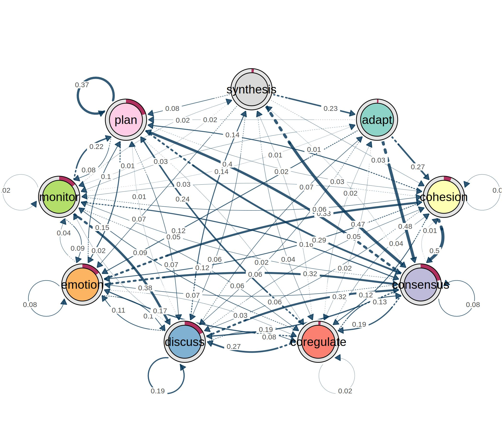
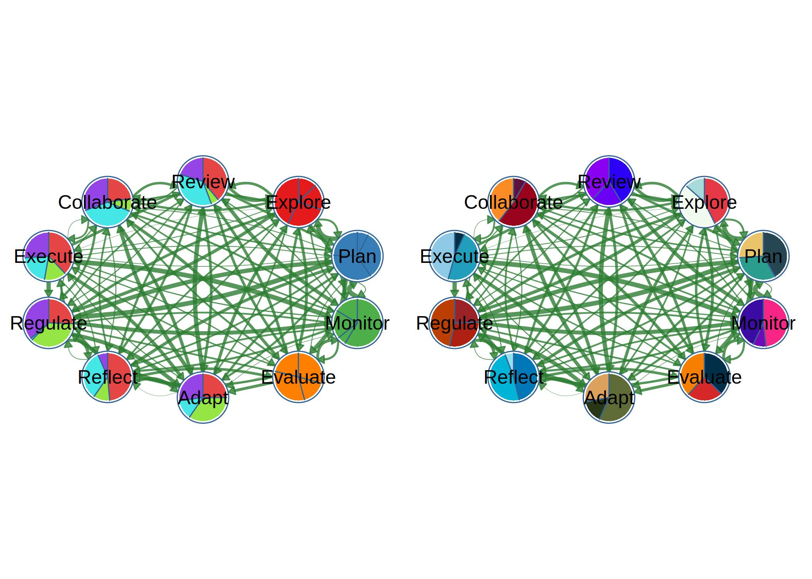
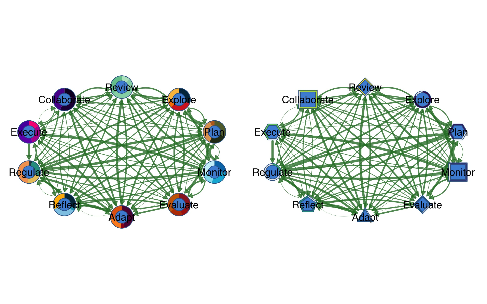
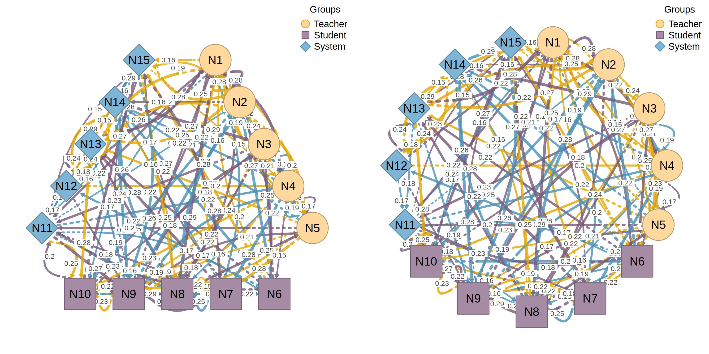
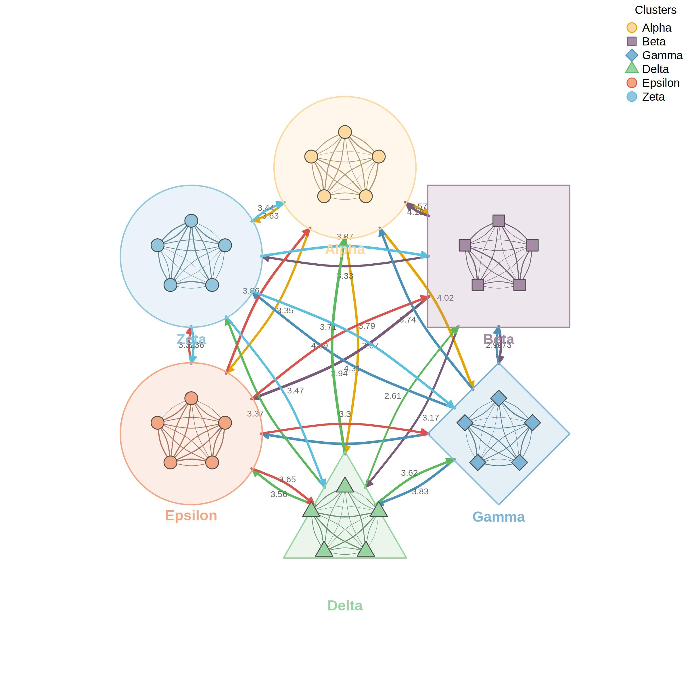
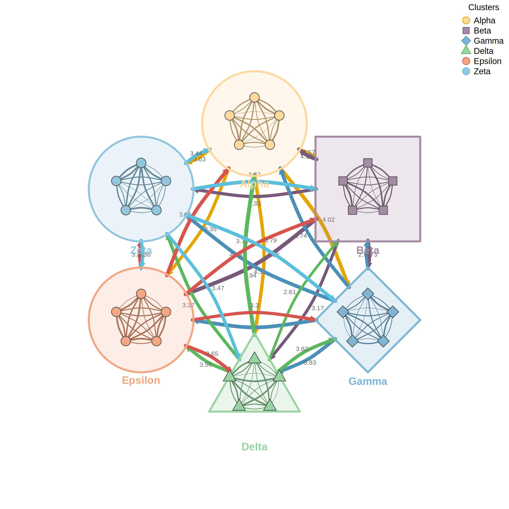

# cograph 

**cograph** is a modern R package that provides tools for the analysis,
visualization, and manipulation of dynamical, social and complex
networks. The package supports multiple network formats and offers
flexible tools for heterogeneous, multi-layer, and hierarchical network
analysis with simple syntax and extensive tool-set.

Key features:

- Tools for analysis, visualization, and manipulation of dynamical,
  social, and complex networks
- Provides network metrics including centrality measures, motif
  analysis, and community detection
- Supports multiple input formats: adjacency matrices, edge lists, and
  igraph objects
- Tools for heterogeneous, multi-layer, and hierarchical network
  analysis
- Publication-ready plotting with customizable layouts, node shapes,
  edge styles, and themes
- Intuitive, pipe-friendly API
- Fully compatible with the `tna` package

## Installation

``` r
# Install from CRAN (when available)
#install.packages("cograph")

# Or install the development version from GitHub
# install.packages("devtools")
#devtools::install_github("sonsoleslp/cograph")
```

``` r
library(cograph)
```

## Plotting Transition Network Analysis

``` r
library(tna)
tna_obj <- tna(group_regulation)
splot(tna_obj)
```



## Simple network plotting

``` r
# 10-node directed transition matrix (TNA-style)
set.seed(42)
states <- c("Explore", "Plan", "Monitor", "Evaluate", "Adapt",
            "Reflect", "Regulate", "Execute", "Collaborate", "Review")
mat <- matrix(runif(100, 0, 0.3), nrow = 10, dimnames = list(states, states))
diag(mat) <- 0
mat <- mat / rowSums(mat)  # row-normalize
```

`cograph` supports statistical edge visualization with CI underlays and
significance notation.

``` r
# Publication-ready with CI underlays and labels
splot(mat,
  edge_ci = runif(sum(mat > 0), 0.05, 0.2), layout = "oval",
  edge_label_template = "{est}{stars}",
  edge_label_p = runif(sum(mat > 0), 0, 0.1),
  edge_label_stars = TRUE, edge_label_bg = "transparent", edge_label_color = "maroon", 
  edge_label_size = 0.5, edge_label_position = 0.6
)
```


Template placeholders: `{est}`, `{low}`, `{up}`, `{range}`, `{p}`,
[stars](https://r-spatial.github.io/stars/)

### Pie Chart Nodes and shapes

``` r
set.seed(1)
# Each node gets a vector of pie segment values
pie_vals <- lapply(1:10, function(i) runif(4))
pie_cols <- c("#E41A1C", "#377EB8", "#4DAF4A", "#FF7F00")

splot(mat,
  node_shape = "pie",
  pie_values = pie_vals,
  pie_colors = pie_cols,  node_size = 10,
  layout = "oval"
)

# Per-node color palettes
pie_cols_multi <- list(
  c("#E63946", "#F1FAEE", "#A8DADC"),
  c("#264653", "#2A9D8F", "#E9C46A"),
  c("#F72585", "#7209B7", "#3A0CA3"),
  c("#003049", "#D62828", "#F77F00"),
  c("#606C38", "#283618", "#DDA15E"),
  c("#0077B6", "#00B4D8", "#90E0EF"),
  c("#9B2226", "#AE2012", "#BB3E03"),
  c("#023047", "#219EBC", "#8ECAE6"),
  c("#5F0F40", "#9A031E", "#FB8B24"),
  c("#2D00F7", "#6A00F4", "#8900F2")
)
splot(mat,
  node_shape = "pie",
  pie_values = lapply(1:10, function(i) runif(3)),
  pie_colors = pie_cols_multi,
  node_size = 10,
  layout = "oval"
)
```



### Donut Nodes

``` r
fills <- runif(10, 0.3, 0.95)

# Per-node donut color palettes
donut_cols_multi <- list(
  c("#003049", "#D62828", "#F77F00", "#FCBF49"),
  c("#606C38", "#283618", "#DDA15E", "#BC6C25"),
  c("#0077B6", "#00B4D8", "#90E0EF", "#CAF0F8"),
  c("#9B2226", "#AE2012", "#BB3E03", "#CA6702"),
  c("#5F0F40", "#9A031E", "#FB8B24", "#E36414"),
  c("#023047", "#219EBC", "#8ECAE6", "#FFB703"),
  c("#264653", "#2A9D8F", "#E9C46A", "#F4A261"),
  c("#F72585", "#B5179E", "#7209B7", "#560BAD"),
  c("#10002B", "#240046", "#3C096C", "#5A189A"),
  c("#D8F3DC", "#B7E4C7", "#95D5B2", "#74C69D")
)
splot(mat,
  donut_values = lapply(1:10, function(i) runif(4)),
  donut_colors = donut_cols_multi,
  donut_inner_ratio = 0.55,
  node_size = 8
)

# Donut + Pie combo: outer donut ring with inner pie segments
  splot(mat,
  node_shape = "donut",
  donut_fill = fills,
  donut_shape = c("circle", "hexagon", "square", "diamond", "triangle",
                  "pentagon", "circle", "hexagon", "square", "diamond"),
  donut_color = palette_viridis(10)
)
```



### plot_htna() - Heterogeneous Multi-Group Networks

[`plot_htna()`](http://sonsoles.me/cograph/reference/plot_htna.md)
creates multi-group network layouts where node groups are arranged in
geometric patterns (bipartite, triangle, rectangle, polygon, or
circular).

``` r
layout(t(1:2)); par(mar=c(0,0,0,0))
# Create network with 3 groups
set.seed(42)
nodes <- paste0("N", 1:15)
m <- matrix(runif(225, 0, 0.3), 15, 15)
diag(m) <- 0
colnames(m) <- rownames(m) <- nodes

node_types <- list(
  Teacher = paste0("N", 1:5),
  Student = paste0("N", 6:10),
  System = paste0("N", 11:15)
)

# Polygon layout (triangle for 3 groups)
plot_htna(m, node_types, layout = "polygon", minimum = 0.15)

# Circular layout (groups as arcs)
plot_htna(m, node_types, layout = "circular", minimum = 0.15)
```



### plot_mtna() - Multi-Cluster Networks

[`plot_mtna()`](http://sonsoles.me/cograph/reference/plot_mtna.md)
visualizes multiple network clusters with summary edges between clusters
and individual edges within clusters. Each cluster is displayed as a
shape (circle, square, diamond, triangle) containing its nodes.

``` r
par(mar=c(0,0,0,0))
# Create network with 6 clusters
set.seed(42)
nodes <- paste0("N", 1:30)
m <- matrix(runif(900, 0, 0.3), 30, 30)
diag(m) <- 0
colnames(m) <- rownames(m) <- nodes

clusters <- list(
  Alpha = paste0("N", 1:5),
  Beta = paste0("N", 6:10),
  Gamma = paste0("N", 11:15),
  Delta = paste0("N", 16:20),
  Epsilon = paste0("N", 21:25),
  Zeta = paste0("N", 26:30)
)

# Summary edges between clusters + individual edges within
plot_mtna(m, clusters)
```



Key parameters: \* `spacing`: Distance between cluster centers \*
`shape_size`: Size of cluster shells \* `node_spacing`: Node placement
within shapes (0-1) \* `shapes`: Vector of shapes per cluster (“circle”,
“square”, “diamond”, “triangle”) \* `summary_edges`: Show aggregated
between-cluster edges (default TRUE) \* `within_edges`: Show individual
within-cluster edges (default TRUE)

> **Alias**:
> [`mtna()`](http://sonsoles.me/cograph/reference/plot_mtna.md) is
> available as a shorthand for
> [`plot_mtna()`](http://sonsoles.me/cograph/reference/plot_mtna.md).

### plot_mlna() - Multilevel 3D Networks

[`plot_mlna()`](http://sonsoles.me/cograph/reference/plot_mlna.md)
visualizes multilevel/multiplex networks where multiple layers are
stacked in a 3D perspective view. Each layer contains nodes connected by
solid edges (within-layer), while dashed lines connect nodes between
adjacent layers (inter-layer edges).

``` r
par(mar=c(0,0,0,0))
# Create multilevel network
set.seed(42)
nodes <- paste0("N", 1:21)
m <- matrix(runif(441, 0, 0.3), 21, 21)
diag(m) <- 0
colnames(m) <- rownames(m) <- nodes

# Define 3 layers
layers <- list(
  Macro = paste0("N", 1:7),
  Meso = paste0("N", 8:14),
  Micro = paste0("N", 15:21)
)

# Basic usage with spring layout
plot_mlna(m, layers, layout = "spring", minimum = 0.18, legend = FALSE)
```



## License

MIT License. See [LICENSE](http://sonsoles.me/cograph/LICENSE) for
details.
