# cograph 

**cograph** is a modern R package for the analysis, visualization, and
manipulation of complex networks. It provides publication-ready plotting
with customizable layouts, node shapes, edge styles, and themes through
an intuitive, pipe-friendly API. First-class support for Transition
Network Analysis (TNA), multilayer networks, and community detection.

## Installation

``` r
# Install from CRAN
install.packages("cograph")

# Development version from GitHub
devtools::install_github("sonsoleslp/cograph")
```

## How to use it?

- [Introduction to
  cograph](http://sonsoles.me/cograph/articles/introduction.md)
- [Network Visualization with cograph: A Complete Plotting
  Guide](http://sonsoles.me/cograph/articles/1_cograph-tutorial-plotting.md)
- [Why cograph?](http://sonsoles.me/cograph/articles/2_why-cograph.md)
- [Plotting TNA Models with
  splot](http://sonsoles.me/cograph/articles/plotting-tna-models.md)
- [Visualization of communities and hyper order
  networks](http://sonsoles.me/cograph/articles/cograph-tutorial-communities.md)
- [Network Estimation and Visualization with Nestimate +
  cograph](http://sonsoles.me/cograph/articles/cograph-tutorial-nestimate.md)
- [Network Comparison and
  Visualization](http://sonsoles.me/cograph/articles/comparison-plots-demo.md)
- [Advanced
  examples](http://sonsoles.me/cograph/articles/mcml-examples.md)
- [Bootstrap Forest
  Plots](http://sonsoles.me/cograph/articles/bootstrap-forest.md)
- [Migrating from qgraph to
  splot](http://sonsoles.me/cograph/articles/qgraph-to-splot.md)

## Features

### Network Plotting

| Function                                                                             | Description                             |
|--------------------------------------------------------------------------------------|-----------------------------------------|
| [`splot()`](http://sonsoles.me/cograph/reference/splot.md)                           | Base R network plot (core engine)       |
| [`soplot()`](http://sonsoles.me/cograph/reference/soplot.md)                         | Grid/ggplot2 network rendering          |
| [`tplot()`](http://sonsoles.me/cograph/reference/plot_tna.md)                        | qgraph drop-in replacement for TNA      |
| [`plot_htna()`](http://sonsoles.me/cograph/reference/plot_htna.md)                   | Hierarchical multi-group TNA layouts    |
| [`plot_mtna()`](http://sonsoles.me/cograph/reference/plot_mtna.md)                   | Multi-cluster TNA with shape containers |
| [`plot_mcml()`](http://sonsoles.me/cograph/reference/plot_mcml.md)                   | Markov Chain Multi-Level visualization  |
| [`plot_mlna()`](http://sonsoles.me/cograph/reference/plot_mlna.md)                   | Multilayer 3D perspective networks      |
| [`plot_mixed_network()`](http://sonsoles.me/cograph/reference/plot_mixed_network.md) | Combined symmetric/asymmetric edges     |

### Flow and Comparison Plots

| Function                                                                           | Description                            |
|------------------------------------------------------------------------------------|----------------------------------------|
| [`plot_transitions()`](http://sonsoles.me/cograph/reference/plot_transitions.md)   | Alluvial/Sankey flow diagrams          |
| [`plot_alluvial()`](http://sonsoles.me/cograph/reference/plot_alluvial.md)         | Alluvial wrapper with flow coloring    |
| [`plot_trajectories()`](http://sonsoles.me/cograph/reference/plot_trajectories.md) | Individual tracking with line bundling |
| [`plot_chord()`](http://sonsoles.me/cograph/reference/plot_chord.md)               | Chord diagrams with ticks              |
| [`plot_heatmap()`](http://sonsoles.me/cograph/reference/plot_heatmap.md)           | Adjacency heatmaps with clustering     |
| [`plot_compare()`](http://sonsoles.me/cograph/reference/plot_compare.md)           | Difference network visualization       |
| `plot_bootstrap()`                                                                 | Bootstrap CI result plots              |
| [`plot_permutation()`](http://sonsoles.me/cograph/reference/plot_permutation.md)   | Permutation test result plots          |

### Community and Higher-Order Structure

| Function                                                                               | Description                                             |
|----------------------------------------------------------------------------------------|---------------------------------------------------------|
| [`overlay_communities()`](http://sonsoles.me/cograph/reference/overlay_communities.md) | Community blob overlays on network plots                |
| [`plot_simplicial()`](http://sonsoles.me/cograph/reference/plot_simplicial.md)         | Higher-order pathway (simplicial complex) visualization |
| [`detect_communities()`](http://sonsoles.me/cograph/reference/detect_communities.md)   | 11 igraph algorithms with shorthand wrappers            |
| [`communities()`](http://sonsoles.me/cograph/reference/communities.md)                 | Unified community detection interface                   |

### Network Analysis

| Function                                                                                                                          | Description                                      |
|-----------------------------------------------------------------------------------------------------------------------------------|--------------------------------------------------|
| [`centrality()`](http://sonsoles.me/cograph/reference/centrality.md)                                                              | 23+ centrality measures with individual wrappers |
| [`motifs()`](http://sonsoles.me/cograph/reference/motifs.md) / [`subgraphs()`](http://sonsoles.me/cograph/reference/subgraphs.md) | Motif/triad census with per-actor windowing      |
| [`robustness()`](http://sonsoles.me/cograph/reference/robustness.md)                                                              | Network robustness analysis                      |
| [`disparity_filter()`](http://sonsoles.me/cograph/reference/disparity_filter.md)                                                  | Backbone extraction (Serrano et al. 2009)        |
| [`cluster_summary()`](http://sonsoles.me/cograph/reference/cluster_summary.md)                                                    | Between/within cluster weight aggregation        |
| [`build_mcml()`](http://sonsoles.me/cograph/reference/build_mcml.md)                                                              | Markov Chain Multi-Level model construction      |
| [`summarize_network()`](http://sonsoles.me/cograph/reference/summarize_network.md)                                                | Comprehensive network-level statistics           |
| [`verify_with_igraph()`](http://sonsoles.me/cograph/reference/verify_with_igraph.md)                                              | Cross-validation against igraph                  |
| [`simplify()`](http://sonsoles.me/cograph/reference/simplify.md)                                                                  | Prune weak edges                                 |

### Multilayer Networks

| Function                                                                         | Description                             |
|----------------------------------------------------------------------------------|-----------------------------------------|
| [`supra_adjacency()`](http://sonsoles.me/cograph/reference/supra_adjacency.md)   | Supra-adjacency matrix construction     |
| [`layer_similarity()`](http://sonsoles.me/cograph/reference/layer_similarity.md) | Layer comparison measures               |
| [`aggregate_layers()`](http://sonsoles.me/cograph/reference/aggregate_layers.md) | Weight aggregation across layers        |
| [`plot_ml_heatmap()`](http://sonsoles.me/cograph/reference/plot_ml_heatmap.md)   | Multilayer heatmaps with 3D perspective |

## Examples

### TNA Plot

The primary use case: visualize transition networks from the `tna`
package.

``` r
library(tna)
library(cograph)

# Build a TNA model from sequence data
fit <- tna(engagement)

# One-liner visualization
splot(fit)
```

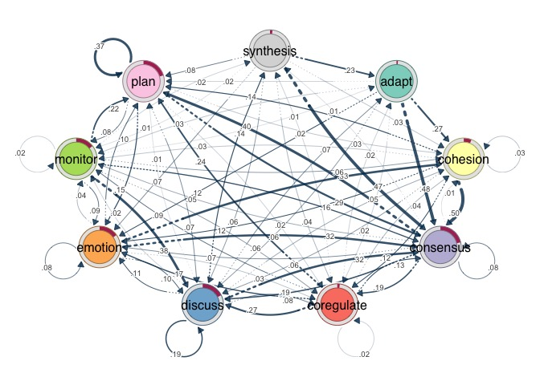

### Simple Network

``` r
library(cograph)

# Create a transition matrix
states <- c("Explore", "Plan", "Monitor", "Adapt", "Reflect")
mat <- matrix(
  c(0.0, 0.4, 0.2, 0.1, 0.3,
    0.3, 0.0, 0.3, 0.2, 0.2,
    0.2, 0.3, 0.0, 0.3, 0.2,
    0.1, 0.2, 0.4, 0.0, 0.3,
    0.2, 0.2, 0.2, 0.4, 0.0),
  nrow = 5, byrow = TRUE,
  dimnames = list(states, states)
)

splot(mat)
```

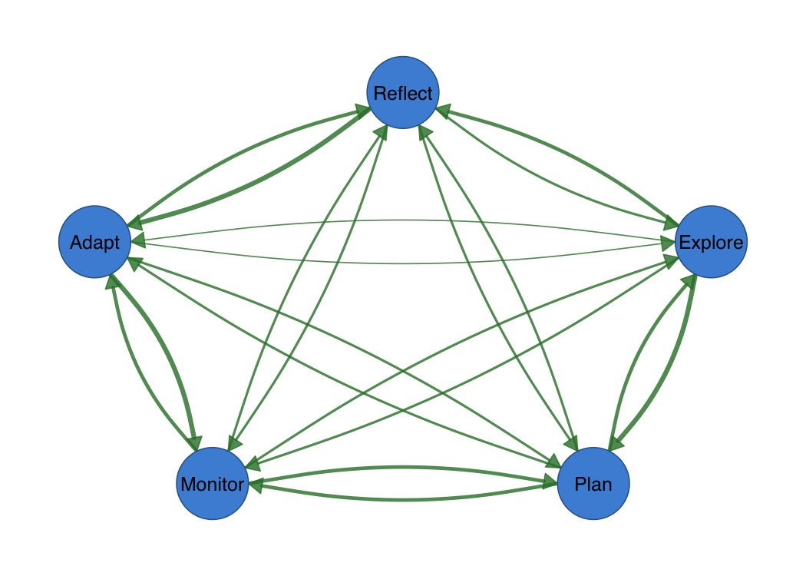

### Layouts

``` r
par(mfrow = c(2, 2), mar = c(1, 1, 2, 1))
splot(mat, layout = "oval",   title = "oval")
splot(mat, layout = "circle", title = "circle")
splot(mat, layout = "kk",     title = "kk")
splot(mat, layout = "fr",     title = "fr")
```

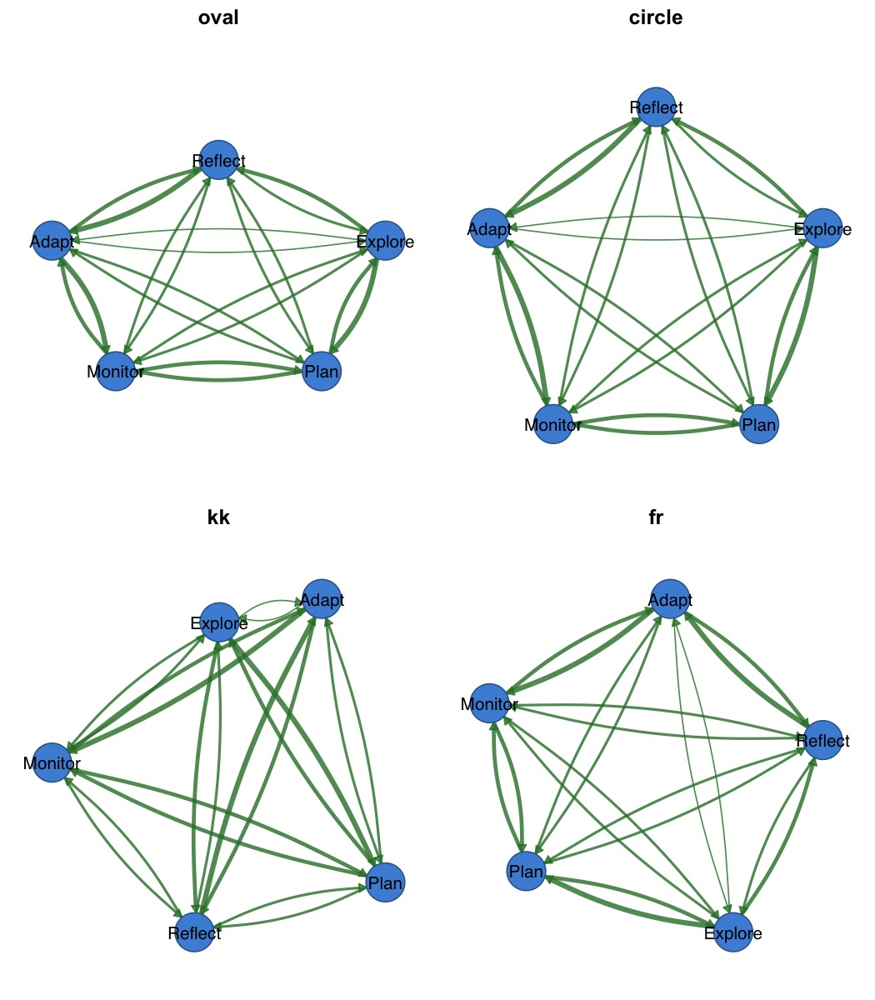

### Edge Styling

``` r
splot(mat,
  curvature = 0.3,
  arrow_size = 0.02,
  edge_width = 3
)
```

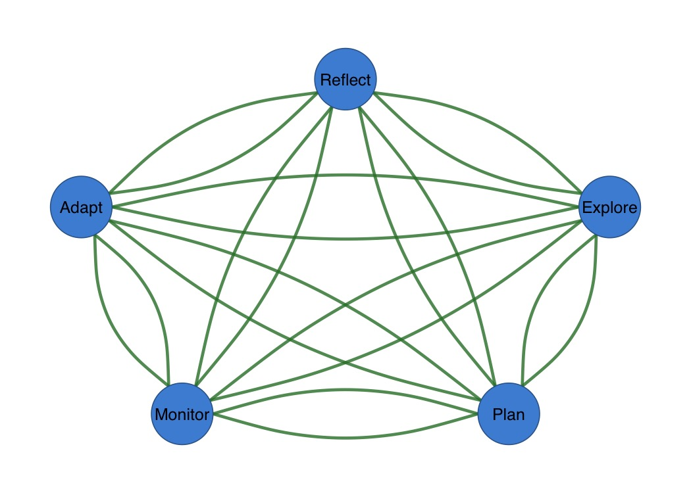

### Node Shapes

``` r
shapes <- c("circle", "square", "hexagon", "diamond", "triangle")

splot(mat,
  node_shape = shapes,
  node_fill = c("#E63946", "#457B9D", "#2A9D8F", "#E9C46A", "#F4A261"),
  layout = "circle"
)
```

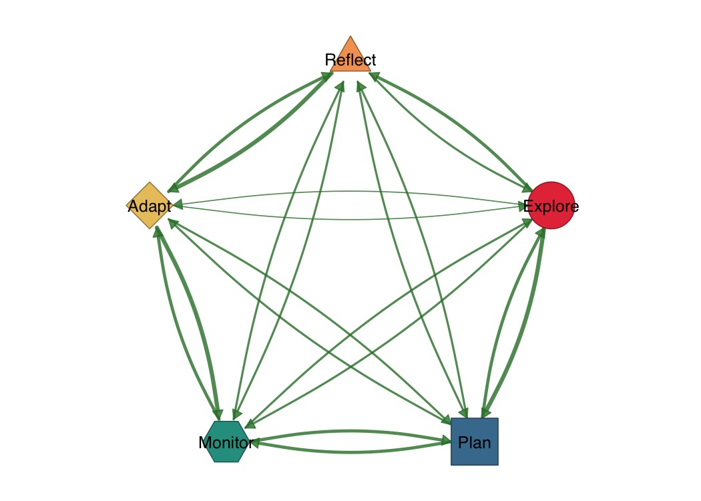

### Donuts

Donut nodes show proportional fill with optional polygon shapes.

``` r
fills <- c(0.9, 0.7, 0.5, 0.3, 0.8)

splot(mat,
  donut_fill = fills,
  donut_color = "steelblue",
  donut_shape = c("circle", "hexagon", "square", "diamond", "triangle")
)
```

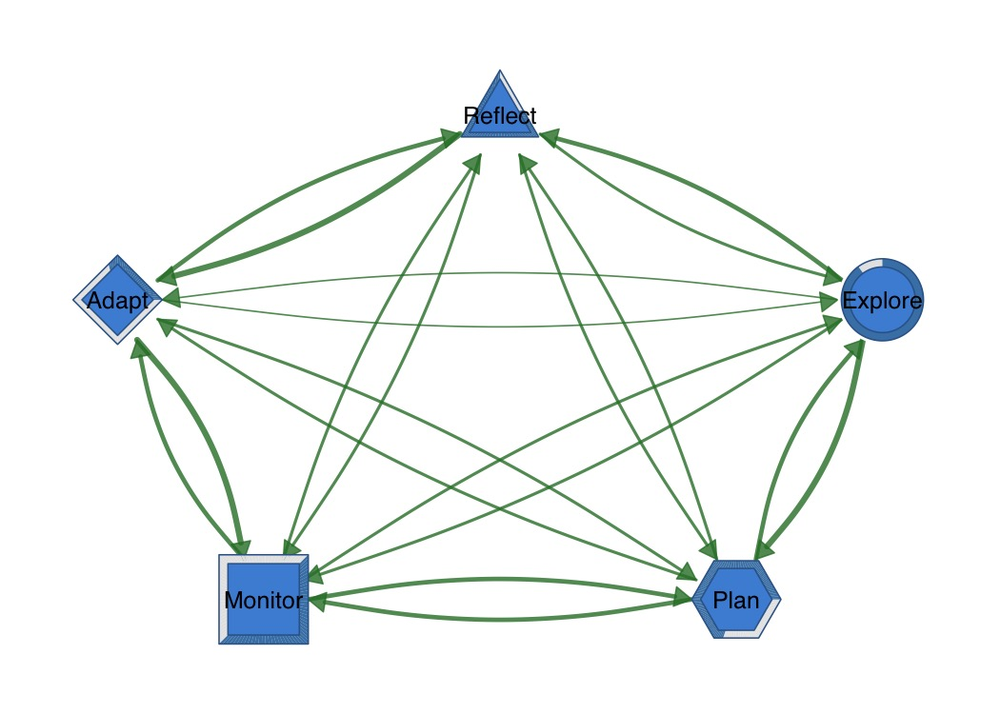

### Pies

Pie chart nodes with per-node color palettes.

``` r
pie_vals <- list(
  c(0.5, 0.3, 0.2),
  c(0.4, 0.4, 0.2),
  c(0.3, 0.3, 0.4),
  c(0.6, 0.2, 0.2),
  c(0.2, 0.5, 0.3)
)

pie_cols <- list(
  c("#E63946", "#457B9D", "#2A9D8F"),
  c("#264653", "#E9C46A", "#F4A261"),
  c("#F72585", "#7209B7", "#3A0CA3"),
  c("#003049", "#D62828", "#F77F00"),
  c("#606C38", "#283618", "#DDA15E")
)

splot(mat,
  node_shape = "pie",
  pie_values = pie_vals,
  pie_colors = pie_cols,
  layout = "circle"
)
```

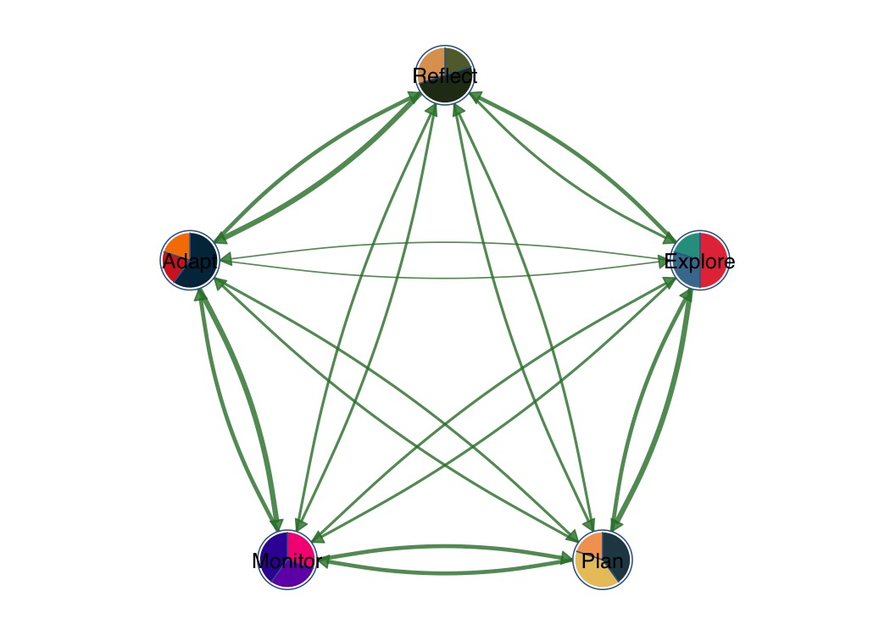

### Donut + Pie Combo

Combine outer donut ring with inner pie segments.

``` r
splot(mat,
  donut_fill = fills,
  donut_color = "steelblue",
  pie_values = pie_vals,
  pie_colors = c("#E41A1C", "#377EB8", "#4DAF4A")
)
```

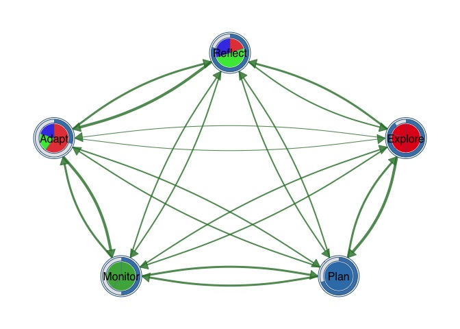

### Chord Diagram

``` r
plot_chord(mat, title = "Transition Chord Diagram")
```

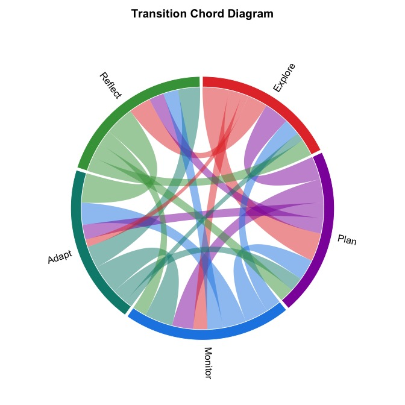

### Heatmap

``` r
plot_heatmap(mat, show_values = TRUE, colors = "viridis",
             value_fontface = "bold", title = "Transition Heatmap")
```

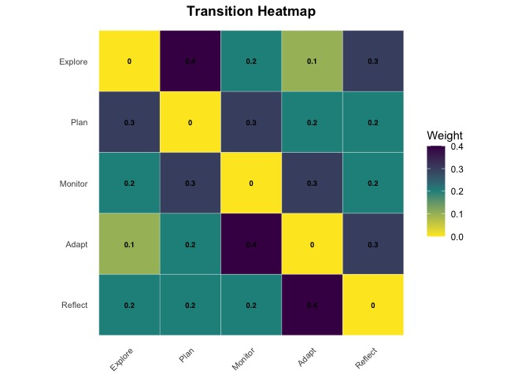

### Alluvial Flow

``` r
plot_transitions(mat, flow_color_by = "from", flow_alpha = 0.5,
                 from_title = "Source", to_title = "Target")
```

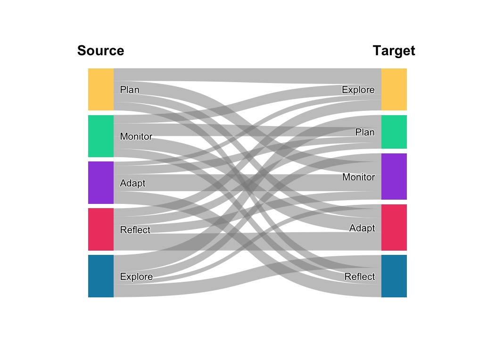

## License

MIT License.
