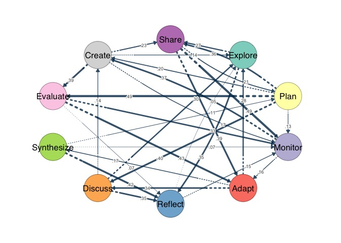
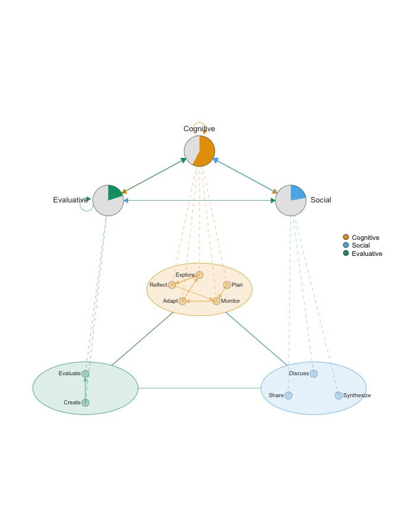
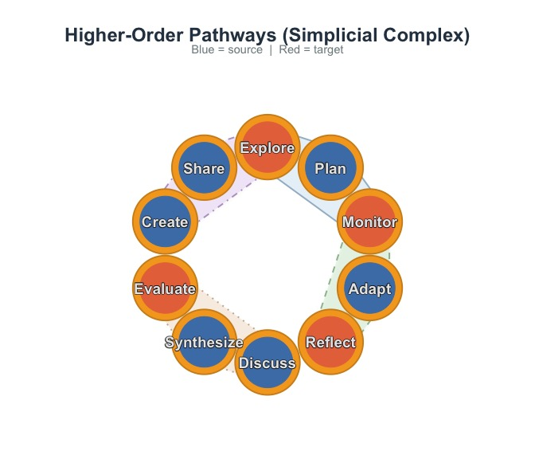

# cograph

cograph is a modern R package for the analysis and visualization of
complex networks, designed for simplicity, tidy outputs, comprehensive
statistics and up-to-date network science. cograph accepts matrices,
edge lists, and igraph, statnet, qgraph and tna objects without
conversion, and offers a wide array of tools for plotting, wrangling,
centrality, community detection, motif, robustness, multilayer and
higher-order analysis.

## Installation

``` r

# Release version from CRAN
install.packages("cograph")

# Development version from GitHub
# install.packages("remotes")
remotes::install_github("sonsoleslp/cograph")
```

## Quick start

The examples use `regulation_net`, a synthetic weighted transition
network among ten learning states included in the package.
[`splot()`](https://sonsoles.me/cograph/reference/splot.md) plots it in
one call, and `tna_styling = TRUE` applies the visual conventions of
transition networks.

``` r

library(cograph)
splot(regulation_net, tna_styling = TRUE)
```



[`centrality()`](https://sonsoles.me/cograph/reference/centrality.md)
returns any combination of measures as a tidy data frame, from the
classical measures to recent ones such as randomized shortest-path
betweenness and Trust-PageRank.

``` r

centrality(regulation_net,
           measures = c("strength", "betweenness", "pagerank",
                        "rsp_betweenness", "trust_pagerank"),
           sort_by = "pagerank", digits = 3)
#>          node strength_all betweenness pagerank rsp_betweenness trust_pagerank
#> 1     Monitor         1.87        18.0    0.184         132.027          0.147
#> 2      Create         1.64        13.0    0.138         102.913          0.117
#> 3     Reflect         1.39        10.0    0.125          79.405          0.084
#> 4       Adapt         1.77        15.0    0.124          91.887          0.112
#> 5     Explore         1.39         5.0    0.118          79.715          0.086
#> 6       Share         1.95         9.0    0.095          69.907          0.092
#> 7    Evaluate         1.71         3.0    0.074          51.387          0.092
#> 8     Discuss         1.53         0.5    0.068          43.823          0.088
#> 9  Synthesize         0.77         6.5    0.038          23.304          0.067
#> 10       Plan         1.90        15.5    0.036          22.235          0.114
```

[`plot_mcml()`](https://sonsoles.me/cograph/reference/plot_mcml.md)
shows a network whose nodes belong to clusters as a two-layer hierarchy,
with the node-level network below and the cluster-level network above.

``` r

clusters <- list(Cognitive  = c("Explore", "Plan", "Monitor", "Adapt", "Reflect"),
                 Social     = c("Discuss", "Synthesize", "Share"),
                 Evaluative = c("Evaluate", "Create"))
plot_mcml(regulation_net, clusters)
```



[`plot_simplicial()`](https://sonsoles.me/cograph/reference/plot_simplicial.md)
visualizes higher-order pathways over the network, with each pathway
joining the states that lead to a target state.

``` r

plot_simplicial(regulation_net,
                c("Explore Plan -> Monitor", "Monitor Adapt -> Reflect",
                  "Discuss Synthesize -> Evaluate", "Create Share -> Explore"))
```



## What cograph covers

- **[Visualization](https://sonsoles.me/cograph/articles/cograph-tutorial-plotting.html).**
  [`splot()`](https://sonsoles.me/cograph/reference/splot.md) plots any
  supported input with specialized styling for transition and
  psychological networks, alongside a wide array of specialized plots
  from alluvial flows and chord diagrams to bootstrap forest plots and
  temporal prisms.
- **[Wrangling](https://sonsoles.me/cograph/articles/introduction.html#wrangling).**
  cograph offers a family of wrangling verbs for selecting, filtering,
  thresholding, transforming and editing networks, each returning a
  network so that the verbs chain with the native pipe.
- **[Centrality](https://sonsoles.me/cograph/articles/centrality-catalogue.html).**
  [`centrality()`](https://sonsoles.me/cograph/reference/centrality.md)
  returns a large collection of node centrality measures across all
  major families as a tidy data frame, tested against igraph, sna,
  centiserve, NetworkX and other implementations where they exist.
- **[Network
  statistics](https://sonsoles.me/cograph/articles/introduction.html#network-properties).**
  [`network_summary()`](https://sonsoles.me/cograph/reference/network_summary.md)
  returns density, diameter, centralization, reciprocity, transitivity
  and many further statistics in one data frame.
- **[Communities](https://sonsoles.me/cograph/articles/cograph-tutorial-communities.html).**
  [`communities()`](https://sonsoles.me/cograph/reference/communities.md)
  runs a range of detection algorithms through one call, with consensus,
  comparison and significance testing of partitions.
- **[Motifs](https://sonsoles.me/cograph/articles/introduction.html#motifs).**
  [`motifs()`](https://sonsoles.me/cograph/reference/motifs.md) and
  [`subgraphs()`](https://sonsoles.me/cograph/reference/subgraphs.md)
  count the triads of the MAN classification, test their frequencies and
  identify the nodes that form each pattern.
- **[Robustness](https://sonsoles.me/cograph/articles/introduction.html#robustness).**
  [`robustness()`](https://sonsoles.me/cograph/reference/robustness.md)
  and
  [`vulnerability()`](https://sonsoles.me/cograph/reference/vulnerability.md)
  simulate targeted and random attacks and measure each node’s
  contribution to the efficiency of the network.
- **[Clusters, layers and higher-order
  structure](https://sonsoles.me/cograph/articles/cograph-tutorial-mcml.html).**
  cograph offers hierarchical plots for multi-cluster networks,
  supra-adjacency tools for multilayer networks, and visualization of
  higher-order pathways estimated with Nestimate.

## Documentation

**Tutorials**

- [Network visualization with
  cograph](https://sonsoles.me/cograph/articles/cograph-tutorial-plotting.html):
  a complete guide to plotting with
  [`splot()`](https://sonsoles.me/cograph/reference/splot.md).
- [Communities and higher-order
  networks](https://sonsoles.me/cograph/articles/cograph-tutorial-communities.html):
  detecting communities and visualizing them over the network.
- [Network estimation with Nestimate and
  cograph](https://sonsoles.me/cograph/articles/cograph-tutorial-nestimate.html):
  from sequence data to bootstrapped, compared and clustered networks.
- [Multi-cluster multi-level
  visualization](https://sonsoles.me/cograph/articles/cograph-tutorial-mcml.html):
  hierarchical plots of clustered networks with
  [`plot_mcml()`](https://sonsoles.me/cograph/reference/plot_mcml.md).
- [Higher-order network analysis with simplicial
  complexes](https://sonsoles.me/cograph/articles/cograph-tutorial-simplicial.html):
  from transition networks to topological analysis.

**Articles**

- [Introduction to
  cograph](https://sonsoles.me/cograph/articles/introduction.html): an
  overview of the package.
- [Why cograph?](https://sonsoles.me/cograph/articles/why-cograph.html):
  the design of the package.
- [Centrality
  catalogue](https://sonsoles.me/cograph/articles/centrality-catalogue.html):
  every centrality measure with its definition and interpretation.
- [cograph and the Centrality
  Zoo](https://sonsoles.me/cograph/articles/centrality-zoo-lookup.html):
  cograph’s measures compared with the Zoo and with other packages.
- [Plotting TNA
  models](https://sonsoles.me/cograph/articles/plotting-tna-models.html):
  a gallery of TNA plots.
- [Advanced MCML
  examples](https://sonsoles.me/cograph/articles/mcml-examples.html):
  further multi-cluster figures.
- [Bootstrap forest
  plots](https://sonsoles.me/cograph/articles/bootstrap-forest.html):
  confidence intervals of bootstrapped edges.
- [Migrating from qgraph to
  splot](https://sonsoles.me/cograph/articles/qgraph-to-splot.html):
  qgraph arguments and their cograph equivalents.

## Citation and license

Please cite cograph with `citation("cograph")`. cograph is released
under the MIT license.
