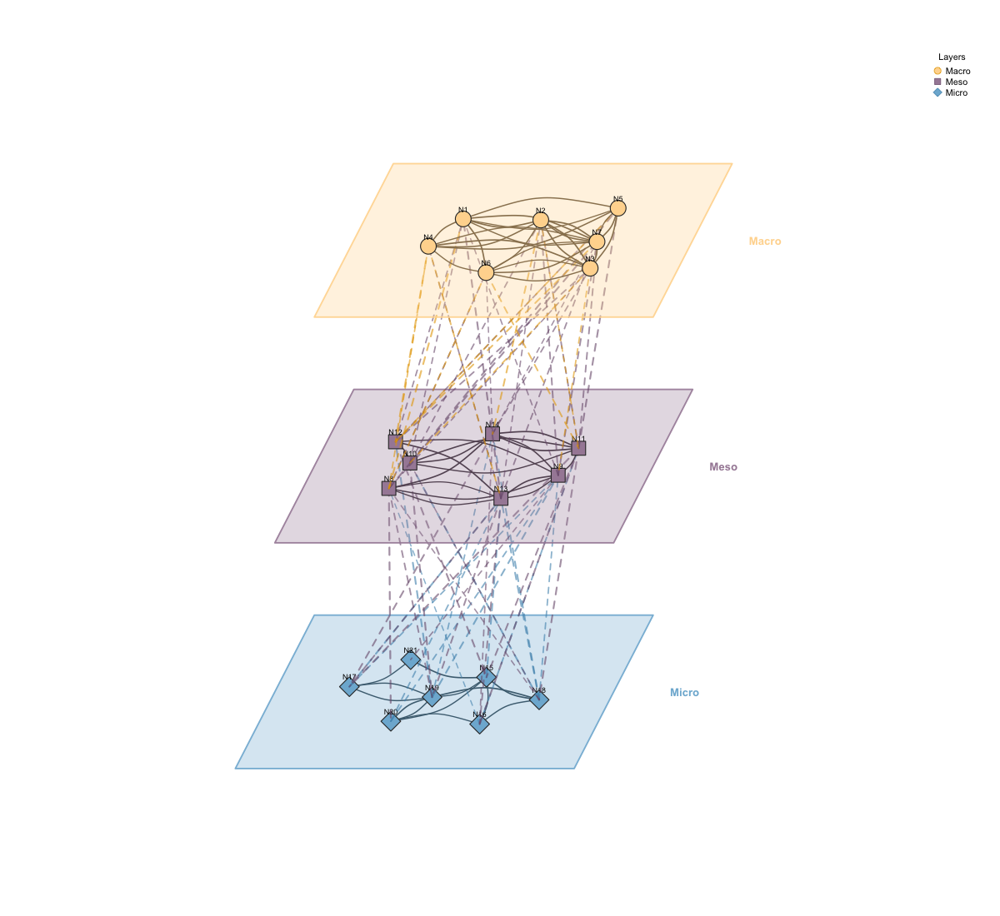

# Multilevel Network Visualization

Visualizes multilevel/multiplex networks where multiple layers are
stacked in a 3D perspective view. Each layer contains nodes connected by
solid edges (within-layer), while dashed lines connect nodes between
adjacent layers (inter-layer edges). Each layer is enclosed in a
parallelogram shell giving a pseudo-3D appearance.

## Usage

``` r
plot_mlna(
  model,
  layer_list,
  layout = "horizontal",
  layer_spacing = 2.2,
  layer_width = 4.5,
  layer_depth = 2.2,
  skew_angle = 25,
  node_spacing = 0.7,
  colors = NULL,
  shapes = NULL,
  edge_colors = NULL,
  within_edges = TRUE,
  between_edges = TRUE,
  between_style = 2,
  show_border = TRUE,
  legend = TRUE,
  legend_position = "topright",
  curvature = 0.15,
  node_size = 3,
  minimum = 0,
  scale = 1,
  ...
)

mlna(
  model,
  layer_list,
  layout = "horizontal",
  layer_spacing = 2.2,
  layer_width = 4.5,
  layer_depth = 2.2,
  skew_angle = 25,
  node_spacing = 0.7,
  colors = NULL,
  shapes = NULL,
  edge_colors = NULL,
  within_edges = TRUE,
  between_edges = TRUE,
  between_style = 2,
  show_border = TRUE,
  legend = TRUE,
  legend_position = "topright",
  curvature = 0.15,
  node_size = 3,
  minimum = 0,
  scale = 1,
  ...
)
```

## Arguments

- model:

  A tna object or weight matrix.

- layer_list:

  List of character vectors defining layers. Each element contains node
  names belonging to that layer. Layers are displayed from top to bottom
  in list order.

- layout:

  Node layout within layers: "horizontal" (default) spreads nodes
  horizontally, "circle" arranges nodes in an ellipse, "spring" uses
  force-directed placement based on within-layer connections.

- layer_spacing:

  Vertical distance between layer centers. Default 2.2.

- layer_width:

  Horizontal width of each layer shell. Default 4.5.

- layer_depth:

  Depth of each layer (for 3D effect). Default 2.2.

- skew_angle:

  Angle of perspective skew in degrees. Default 25.

- node_spacing:

  Node placement ratio within layer (0-1). Default 0.7. Higher values
  spread nodes closer to the layer edges.

- colors:

  Vector of colors for each layer. Default auto-generated.

- shapes:

  Vector of shapes for each layer. Default cycles through "circle",
  "square", "diamond", "triangle".

- edge_colors:

  Vector of edge colors by source layer. If NULL (default), uses darker
  versions of layer colors.

- within_edges:

  Logical. Show edges within layers (solid lines). Default TRUE.

- between_edges:

  Logical. Show edges between adjacent layers (dashed lines). Default
  TRUE.

- between_style:

  Line style for between-layer edges. Default 2 (dashed). Use 1 for
  solid, 3 for dotted.

- show_border:

  Logical. Draw parallelogram shells around layers. Default TRUE.

- legend:

  Logical. Whether to show legend. Default TRUE.

- legend_position:

  Position for legend. Default "topright".

- curvature:

  Edge curvature for within-layer edges. Default 0.15.

- node_size:

  Size of nodes. Default 2.5.

- minimum:

  Minimum edge weight threshold. Edges below this are hidden. Default 0.

- scale:

  Scaling factor for high resolution plotting.

- ...:

  Additional parameters (currently unused).

## Value

Invisibly returns NULL.

## Details



## Examples

``` r
# Create multilevel network
set.seed(42)
nodes <- paste0("N", 1:15)
m <- matrix(runif(225, 0, 0.3), 15, 15)
diag(m) <- 0
colnames(m) <- rownames(m) <- nodes

# Define 3 layers
layers <- list(
  Macro = paste0("N", 1:5),
  Meso = paste0("N", 6:10),
  Micro = paste0("N", 11:15)
)

# Basic usage
plot_mlna(m, layers)


# Customized
plot_mlna(m, layers,
     layer_spacing = 2.5,
     layer_width = 5,
     between_style = 2,  # dashed
     minimum = 0.1)


# Circle layout within layers
plot_mlna(m, layers, layout = "circle")
```
